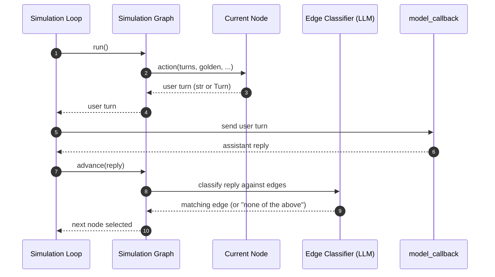

默认情况下，`ConversationSimulator` 使用内置的模拟模板生成每条模拟的用户轮次。

```python title="main.py"
from deepeval.simulator import ConversationSimulator, SimulationNode

def ask_for_refund(turns, golden):
    return "Hi, I'd like a refund for order #1234. It arrived broken."

def push_back(turns, golden):
    return "That's not acceptable. I paid full price for a broken product."

def accept_compromise(turns, golden):
    return "Okay, that works. Thank you."

def escalate(turns, golden):
    return "I want to speak to a manager."

root = SimulationNode(action=ask_for_refund, name="ask_for_refund")
push = SimulationNode(action=push_back, name="push_back", max_visits=3)
ok   = SimulationNode(action=accept_compromise, name="accept", terminal=True)
esc  = SimulationNode(action=escalate, name="escalate", terminal=True)

root.add_node(ok,   when="The assistant approved the refund")
root.add_node(push, when="The assistant refused or cited a return policy")

push.add_node(ok,   when="The assistant offered a partial refund, credit, or voucher")
push.add_node(push, when="The assistant still refused")  # self-loop allowed

simulator = ConversationSimulator(
    model_callback=model_callback,
    simulator_model="gpt-4o-mini",
    simulation_graph=root,
)
```

传入 `simulation_graph`（一个 `SimulationNode`）将该轨迹编码为一个图。

## How Routing Works

每段对话从 `simulation_graph` 根节点开始。

1. 调用当前节点的 `action(...)` 生成下一条用户 `Turn`（若 `max_visits` 已耗尽则跳过并结束——见下文）。
2. 调用 `model_callback` 获取助手的回复。
3. 让 `simulator_model` 依据当前节点的出边对助手回复进行分类（无论边数多少，只做一次 LLM 调用）。会自动附加一个 "以上都不是" 选项。
4. 前进到匹配的子节点；没有边匹配则停留在当前节点。



线性示意图为了简洁省略了几条分支路径：

- **`max_visits` 在进入时已耗尽** —— `Graph` 跳过调用 `action(...)` 并返回 `end=True`。模拟停止，没有新的用户轮次，也没有新的助手回复。
- **`terminal=True`** —— `Graph` 仍会调用 `action(...)`，用户轮次 + 助手回复照常记录；随后循环终止，不再开始新一轮迭代。
- **没有出边** —— `Graph` 跳过分类器，停留在当前节点。（`default_simulation_node` 就是靠这个无限循环的。）

**没有出边**的节点会无限停留在自身——连 LLM 路由都不会被调用。当你不传 `simulation_graph` 时使用的 `default_simulation_node` 就是这样循环的，直到 `stopping_controller` 结束对话。

<Tip>
**`stopping_controller` 在每条用户轮次_之前_运行——包括第一条。**它可以让模拟早于图本身的终止。其 API 见 [Stopping Logic](/docs/conversation-simulator-stopping-logic)，四个终止器如何交错见[停止顺序](/docs/conversation-simulator-stopping-logic#stopping-order)图。
</Tip>

## Node Actions

节点的 `action(...)` 返回 `str`（包装为 `Turn(role="user", content=str)`）或 `role="user"` 的 `Turn`。参数名由 `inspect.signature` 过滤——只声明你需要的。支持的 kwargs：

| Kwarg                 | 说明                                                                                                                           |
| --------------------- | ------------------------------------------------------------------------------------------------------------------------------------- |
| `turns`               | 模拟到目前为止完整的 `Turn` 历史。                                                                                     |
| `golden`              | 正在被模拟的 `ConversationalGolden`。                                                                                           |
| `last_assistant_turn` | 最新一条助手 `Turn`（如果存在）。                                                                                                      |
| `last_user_turn`      | 最新一条用户 `Turn`（如果存在）。                                                                                                      |
| `thread_id`           | 该模拟对话的唯一线程 ID。                                                                                      |
| `language`            | 模拟器配置的语言。                                                                                                  |
| `simulator`           | 存活的 `ConversationSimulator` 实例（用它可以在节点内调用 `simulator.a_generate_first_user_input(golden)` 等）。 |

action 可以是同步或异步——`deepeval` 会自动检测。

## Terminal Nodes and `max_visits`

有两种从图内部结束模拟的方式：

- `terminal=True` —— 发出一条用户轮次，拿到助手回复后立即结束。
- `max_visits=N` —— 该节点最多被发出 `N` 次。在**第 (N+1) 次进入尝试**时，运行器不发出任何内容并结束模拟。

把 `max_visits` 与自环结合，可以表达"最多抱怨 N 次，然后放弃"：

```python
push = SimulationNode(action=push_back, max_visits=3)
push.add_node(push, when="The assistant still refused")  # self-loop
# Emits push 3 times. The 4th attempt skips and ends.
```

### Stopping Controller vs Terminal

`terminal=True` 和 [`stopping_controller`](/docs/conversation-simulator-stopping-logic) 都是终止器，但它们回答的问题不同、触发的时机也不同：

|                         | `stopping_controller`                                                                                     | `SimulationNode(terminal=True)`                                                               |
| ----------------------- | --------------------------------------------------------------------------------------------------------- | --------------------------------------------------------------------------------------------- |
| **作用范围**             | `ConversationSimulator` 上的一个全局回调                                                            | `simulation_graph` 内每个节点的标志                                   |
| **依据**          | 完整对话状态（`turns`、`last_assistant_turn`、`golden` 等）                                   | 到达某个特定的图状态                                                               |
| **触发时机**               | 在生成下一条用户轮次_之前_                                                                  | 本节点发出的用户轮次 + 对应助手回复都被记录_之后_   |
| **最后的轮次** | 结束时_没有_新的用户轮次                                                                             | 结束时_带_最后一对用户/助手轮次                                                        |
| **适用场景**          | 横切判断（"助手调用了 `issue_refund`"、"满足 expected_outcome"、"反复失败"） | 轨迹中设计好的成功/失败路径叶子（"accepted_refund"、"escalated_to_manager"） |

二者互补——同一次运行中可以同时启用，先触发者生效。`max_user_simulations` 是凌驾于二者之上的硬性安全上限。

<Info>
**四个终止器的完整顺序** —— `max_user_simulations`、`stopping_controller`、`max_visits`、`terminal` —— 见 [Stopping Logic → Stopping Order](/docs/conversation-simulator-stopping-logic#stopping-order) 中的时序图。
</Info>

## `default_simulation_node`

`default_simulation_node()` 返回一个 `SimulationNode`，其 action 委托给 `ConversationSimulator` 内置的 `simulator_model` + `SimulationTemplate` 路径——也就是如今的 LLM 驱动探索行为。使用场景：

- 隐式使用：不传 `simulation_graph` 时，`deepeval` 会为你构造 `default_simulation_node()`。
- 显式使用：把它放进自定义图的某个分支，把该分支委托回 LLM，可选择搭配自定义提示模板。

```python
from deepeval.simulator import default_simulation_node

default_simulation_node(
    template=None,        # Optional[Type[SimulationTemplate]]
    terminal=False,       # bool
    max_visits=None,      # Optional[int]
    name="default",       # str
)
```

所有参数均可选且仅限关键字：

| 参数     | 说明                                                                                                                                                                                                                                                                                                 |
| ------------ | ----------------------------------------------------------------------------------------------------------------------------------------------------------------------------------------------------------------------------------------------------------------------------------------------------------- |
| `template`   | 用于渲染用户轮次提示的 `SimulationTemplate` 子类。省略时使用内置模板。可覆盖面见 [Custom Templates](/docs/conversation-simulator-custom-templates)。会立即校验——错误的子类或签名会在构造时抛出 `TypeError`。 |
| `terminal`   | 若为 `True`，该节点发出用户轮次且助手回复后，模拟立即结束。语义与 `SimulationNode(terminal=True)` 相同。                                                                                                                                                  |
| `max_visits` | 可选的发出上限。该节点最多被发出 `max_visits` 次；下一次进入尝试时运行器跳过发出并结束模拟。语义与 `SimulationNode(max_visits=N)` 相同。                                                                                                  |
| `name`       | 图轨迹中显示的调试名称。                                                                                                                                                                                                                                                                           |

```python
from deepeval.simulator import SimulationNode, default_simulation_node

scripted_root = SimulationNode(
    action=lambda: "I have a quick question.",
    name="opener",
)
scripted_root.add_node(
    default_simulation_node(),
    when="The assistant asked a clarifying question",
)
```

## When To Use a Graph vs a Custom Template

当你希望模拟用户始终保持特定的_语气_，而整体轨迹仍由 LLM 驱动、自然涌现时，使用[**自定义模板**](/docs/conversation-simulator-custom-templates)（`default_simulation_node(template=...)`）。

当_轨迹_本身很重要时使用**模拟图**——例如你需要确定性的顺序、重试预算、基于助手行为的分支，或成功/失败终态。在节点的 `action` 内你仍然可以调用任意 LLM（包括 `simulator.simulator_model`）来组织用户消息的措辞，所以二者并不互斥。

## 常见问题

<AccordionGroup>
<Accordion title="When should I pass a simulation_graph instead of using the default LLM-driven user?">
当*轨迹*很重要时——确定性顺序、重试预算、基于助手行为的分支、成功/失败终态。默认的单提示用户适合模糊探索，但 `simulation_graph` 让你能把 "先问，再反驳，被反驳三次后升级，接受任何妥协" 这样的具体路径编码进去。
</Accordion>
<Accordion title="How do I make the simulation stop from inside the graph?">
用 `SimulationNode(terminal=True)` 发出最后一条用户轮次、记录助手回复后结束——或设置 `max_visits=N` 限制节点触发次数（第 (N+1) 次进入即结束运行，且没有新轮次）。把 `max_visits` 与自环搭配可实现"最多抱怨 N 次，然后放弃"。
</Accordion>
<Accordion title="How does the graph decide which node runs next?">
每条助手回复之后，`simulator_model` 会依据当前节点的出边 `when=` 描述对回复分类（一次 LLM 调用，自动附加"以上都不是"选项），然后前进到匹配的子节点；没有匹配则原地不动。没有边的节点在自身上循环。
</Accordion>
<Accordion title="Can the stopping_controller end a graph-driven simulation early?">
可以——[stopping_controller](/docs/conversation-simulator-stopping-logic) 在每条用户轮次_之前_运行（包括第一条），可以在到达 `terminal` 节点之前就结束运行。两个终止器可以在同一次运行中同时启用，先触发者生效。
</Accordion>
</AccordionGroup>
