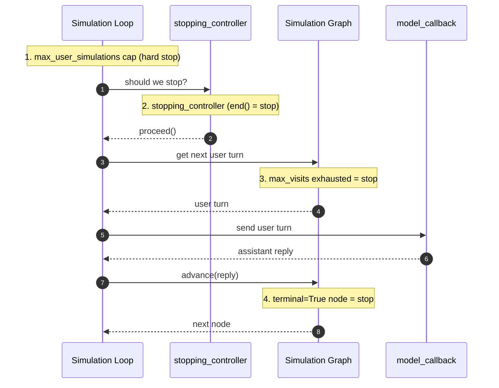

默认情况下，`ConversationSimulator` 在 `expected_outcome` 满足时结束模拟。你可以通过传入自定义停止逻辑回调来覆盖此行为。

```python title="main.py"
from deepeval.simulator import ConversationSimulator
from deepeval.simulator.controller import end, proceed

async def stopping_controller(last_assistant_turn, simulated_user_turns):
    if last_assistant_turn and "confirmation number" in last_assistant_turn.content.lower():
        return end(reason="User received a confirmation number")

    return proceed()

simulator = ConversationSimulator(
    model_callback=model_callback,
    stopping_controller=stopping_controller,
)
```

<Note>
该参数之前叫 `controller`。它仍作为弃用别名被接受，但将在未来版本中移除。
</Note>

代码中的函数名可以任意——示例使用 `stopping_condition` 但你可以使用任何名称。

## Stopping Order

A `ConversationSimulator` run can end for **four** different reasons. They are checked in a fixed order on every iteration of the simulation loop:

1. **`max_user_simulations`** — hard outer cap. Checked first.
2. **`stopping_controller`** — your custom (or the default `expected_outcome`) gate. Runs *before* the next user turn is generated.
3. **`SimulationNode.max_visits` exhausted** — fires from inside the [simulation graph](/docs/conversation-simulator-simulation-graph) runner when a node would emit its `(N+1)`-th turn; the runner skips emission and ends.
4. **`SimulationNode(terminal=True)`** — fires *after* the user turn from a terminal node and the matching assistant reply have both been recorded.

The sequence diagram below traces one iteration and highlights where each terminator can fire:

The sequence diagram below traces one happy-path iteration and marks where each terminator can fire:



The four terminators are complementary, not redundant — see the comparison in the [Simulation Graph](/docs/conversation-simulator-simulation-graph#stopping-controller-vs-terminal) docs for when to reach for which.

<Info>
**`terminal` and `max_visits` live on `SimulationNode`, not here.** This page only covers `stopping_controller`. For node-level termination — `terminal=True` leaves and `max_visits` caps — see the [Simulation Graph](/docs/conversation-simulator-simulation-graph#terminal-nodes-and-max_visits) docs.
</Info>

## Supported Arguments

Only define the arguments your callback needs. `deepeval` will pass supported arguments by name:

- [Optional] `turns`: the current list of `Turn`s in the simulation.
- [Optional] `golden`: the `ConversationalGolden` being simulated.
- [Optional] `index`: the index of the turn being simulated.
- [Optional] `thread_id`: the unique thread ID for the simulated conversation.
- [Optional] `simulated_user_turns`: the number of new simulated user turns generated so far.
- [Optional] `max_user_simulations`: the maximum number of user-assistant message cycles allowed.
- [Optional] `last_user_turn`: the latest user `Turn`, if one exists.
- [Optional] `last_assistant_turn`: the latest assistant `Turn`, if one exists.

## Return Values

If your callback returns anything other than `proceed()` or `end()`, `deepeval` treats it the same as `proceed()`. This is useful when you only want to explicitly handle terminal states:

```python
import random
from deepeval.simulator.controller import end, proceed

def stopping_controller():
    if random.random() > 0.5:
        return end(reason="Random early stop")

    return proceed()
```

Your callback can return:

- `proceed()`: continue the simulation.
- `end(reason=...)`: end the simulation and optionally record why.
- Anything else, including `None`: continue the simulation.

## Common Use Cases

### Confirmation States

Many task flows should stop as soon as your chatbot confirms the user completed the task.

```python
from deepeval.simulator.controller import end, proceed

def stopping_controller(last_assistant_turn):
    if last_assistant_turn and "confirmation number" in last_assistant_turn.content.lower():
        return end(reason="User received confirmation")

    return proceed()
```

### Tool Completion

When your chatbot returns tool call metadata, a specific successful tool call can be the clearest completion signal.

```python
from deepeval.simulator.controller import end, proceed

def stopping_controller(last_assistant_turn):
    if last_assistant_turn and any(
        tool.name == "issue_refund"
        for tool in last_assistant_turn.tools_called or []
    ):
        return end(reason="Refund tool was called")

    return proceed()
```

### Repeated Failures

For unhelpful simulations where the assistant repeatedly fails, end early instead of letting them run to the max-turn cap.

```python
from deepeval.simulator.controller import end, proceed

def stopping_controller(turns):
    assistant_turns = [turn for turn in turns if turn.role == "assistant"]
    recent = assistant_turns[-2:]

    if len(recent) == 2 and all("I don't know" in turn.content for turn in recent):
        return end(reason="Assistant failed twice in a row")

    return proceed()
```

<Note>
`max_user_simulations` is always checked before your callback runs. This means the max-turn limit remains the hard safety cap, even if your callback keeps returning `proceed()`.
</Note>

## 常见问题

<AccordionGroup>
<Accordion title="What stops a simulation if I don't write a stopping_controller?">
The default `stopping_controller` ends the run once the `expected_outcome` in your `ConversationalGolden` has been met. Write a custom one only when you need a different signal, like a specific tool call or confirmation message.
</Accordion>
<Accordion title="How do I stop as soon as my chatbot confirms or calls a specific tool?">
Return `end(reason=...)` from your controller when you see the signal — e.g. a "confirmation number" in `last_assistant_turn.content` , or a matching `tool.name` in `last_assistant_turn.tools_called` — and `proceed()` otherwise.
</Accordion>
<Accordion title="What's the difference between proceed() and end()?">
`proceed()` continues the simulation; `end(reason=...)` stops it and optionally records why. Anything else your callback returns (including `None` ) is treated as `proceed()` , so you only need to handle the terminal cases.
</Accordion>
<Accordion title="Can my controller run forever if it never returns end()?">
No. `max_user_simulations` is checked *before* your controller on every iteration, so it stays the hard safety cap even if you keep returning `proceed()` .
</Accordion>
</AccordionGroup>
