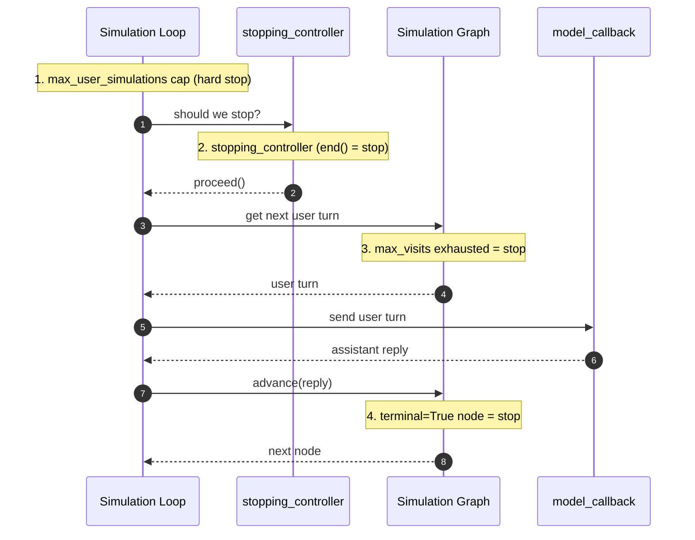

默认情况下，当 `ConversationalGolden` 中的 `expected_outcome` 已达成时，`ConversationSimulator` 会结束模拟。你可以用一个返回 `proceed()` 或 `end()` 的自定义 `stopping_controller` 替换这一行为。

```python title="main.py"
from deepeval.simulator import ConversationSimulator
from deepeval.simulator.controller import end, proceed

async def stopping_controller(last_assistant_turn, simulated_user_turns):
    if last_assistant_turn and "confirmation number" in last_assistant_turn.content.lower():
        return end(reason="User received a confirmation number")

    return proceed()

simulator = ConversationSimulator(
    model_callback=model_callback,
    stopping_controller=stopping_controller,
)
```

<Note>
该 kwarg 旧名 `controller`。它仍作为弃用别名被接受，并会发出 `DeprecationWarning`。请尽快把现有调用点改为 `stopping_controller`。
</Note>

代码中的函数名可以随意——示例用 `stopping_controller` 只是为了对应，`def my_stop(...)` 同样可行。

## Stopping Order

一次 `ConversationSimulator` 运行可能因为**四种**不同原因结束。模拟循环的每次迭代都会按固定顺序检查它们：

1. **`max_user_simulations`** —— 硬性外层上限。最先检查。
2. **`stopping_controller`** —— 你的自定义门槛（或默认的 `expected_outcome`）。在下一条用户轮次生成_之前_运行。
3. **`SimulationNode.max_visits` 耗尽** —— 当某节点将要发出第 `(N+1)` 条轮次时，由[模拟图](/docs/conversation-simulator-simulation-graph)运行器内部触发；运行器跳过发出并结束。
4. **`SimulationNode(terminal=True)`** —— 在终态节点的用户轮次和对应助手回复都被记录_之后_触发。

下面的时序图追踪一次迭代，并标注每个终止器可能触发的位置：

下面的时序图追踪一次 happy-path 迭代，并标注每个终止器可能触发的位置：



四个终止器是互补而非冗余的——何时用哪个，参见 [Simulation Graph](/docs/conversation-simulator-simulation-graph#stopping-controller-vs-terminal) 文档中的对比。

<Info>
**`terminal` 和 `max_visits` 属于 `SimulationNode`，不在本页。**本页只讲 `stopping_controller`。节点级终止——`terminal=True` 叶子和 `max_visits` 上限——见 [Simulation Graph](/docs/conversation-simulator-simulation-graph#terminal-nodes-and-max_visits) 文档。
</Info>

## 支持的参数

只定义你的回调需要的参数。`deepeval` 会按名称传入受支持的参数：

- [可选] `turns`：模拟中当前的 `Turn` 列表。
- [可选] `golden`：正在被模拟的 `ConversationalGolden`。
- [可选] `index`：正在模拟的轮次索引。
- [可选] `thread_id`：该模拟对话的唯一线程 ID。
- [可选] `simulated_user_turns`：到目前为止已生成的新模拟用户轮次数。
- [可选] `max_user_simulations`：允许的"用户-助手消息"循环数上限。
- [可选] `last_user_turn`：最新一条用户 `Turn`（如果存在）。
- [可选] `last_assistant_turn`：最新一条助手 `Turn`（如果存在）。

## Return Values

如果你的回调返回了 `proceed()` 或 `end()` 之外的任何值，`deepeval` 会将其等同于 `proceed()`。这在你只想显式处理终态时很有用：

```python
import random
from deepeval.simulator.controller import end, proceed

def stopping_controller():
    if random.random() > 0.5:
        return end(reason="Random early stop")

    return proceed()
```

你的回调可以返回：

- `proceed()`：继续模拟。
- `end(reason=...)`：结束模拟，可选记录原因。
- 其他任何值（包括 `None`）：继续模拟。

## 常见用例

### Confirmation States

许多任务流程应该在聊天机器人确认用户完成任务后立即停止。

```python
from deepeval.simulator.controller import end, proceed

def stopping_controller(last_assistant_turn):
    if last_assistant_turn and "confirmation number" in last_assistant_turn.content.lower():
        return end(reason="User received confirmation")

    return proceed()
```

### Tool Completion

当你的聊天机器人返回工具调用元数据时，某个特定的成功工具调用可以是最明确的完成信号。

```python
from deepeval.simulator.controller import end, proceed

def stopping_controller(last_assistant_turn):
    if last_assistant_turn and any(
        tool.name == "issue_refund"
        for tool in last_assistant_turn.tools_called or []
    ):
        return end(reason="Refund tool was called")

    return proceed()
```

### Repeated Failures

对于助手反复失败、没有帮助的模拟，应当提前结束，而不是放任它们跑满最大轮数上限。

```python
from deepeval.simulator.controller import end, proceed

def stopping_controller(turns):
    assistant_turns = [turn for turn in turns if turn.role == "assistant"]
    recent = assistant_turns[-2:]

    if len(recent) == 2 and all("I don't know" in turn.content for turn in recent):
        return end(reason="Assistant failed twice in a row")

    return proceed()
```

<Note>
`max_user_simulations` 总是在你的回调运行之前检查。这意味着最大轮数限制始终是硬性安全上限，即使你的回调一直返回 `proceed()`。
</Note>

## 常见问题

<AccordionGroup>
<Accordion title="What stops a simulation if I don't write a stopping_controller?">
默认的 `stopping_controller` 在 `ConversationalGolden` 中的 `expected_outcome` 达成后结束运行。只有当你需要不同信号（例如特定工具调用或确认消息）时才编写自定义控制器。
</Accordion>
<Accordion title="How do I stop as soon as my chatbot confirms or calls a specific tool?">
看到信号时从控制器返回 `end(reason=...)` —— 例如 `last_assistant_turn.content` 中的"确认号"，或 `last_assistant_turn.tools_called` 中匹配的 `tool.name` —— 否则返回 `proceed()`。
</Accordion>
<Accordion title="What's the difference between proceed() and end()?">
`proceed()` 继续模拟；`end(reason=...)` 停止模拟并可选记录原因。回调返回的其他任何值（包括 `None` ）都被视为 `proceed()` ，因此你只需要处理终态情形。
</Accordion>
<Accordion title="Can my controller run forever if it never returns end()?">
不会。每一轮迭代中 `max_user_simulations` 都在你的控制器_之前_检查，因此即使你一直返回 `proceed()` ，它仍是硬性安全上限。
</Accordion>
</AccordionGroup>
