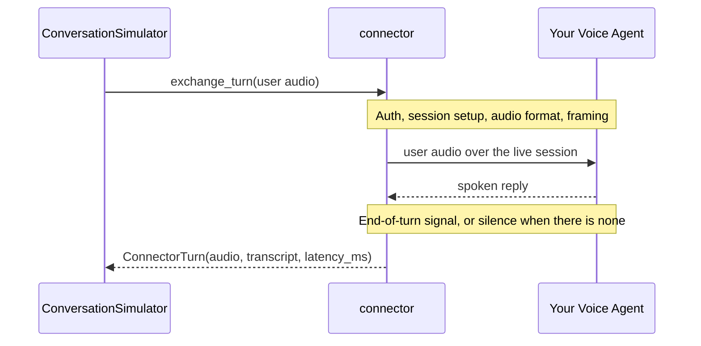

连接器（connector）是 `deepeval` 与你的语音智能体交互的方式。在[语音模式](/docs/conversation-simulator-voice-mode)下，它会打开实时会话、播放模拟用户的音频、捕获语音回复，并测量回复开始所需的时间。

## 为什么需要智能体连接器？

每个语音平台的接入方式都不同——Vapi 通过 REST 发起通话，ElevenLabs 通过 JSON 接收 base64 音频，Pipecat 使用 protobuf 帧，LiveKit 是房间中的 WebRTC 轨道。连接器封装了所有这些细节，使模拟器对每个智能体的操作完全一致：



因此切换平台只是换一个连接器而已——你的金标、指标和模拟配置都不需要改变。

## 设置智能体连接器

每个连接器只需要足够找到你的智能体的信息——一个 ID、一个 URL 或凭据——其余配置都是共享的：

<Tabs>
<Tab title="ElevenLabs">

你的代理（agent）托管在 ElevenLabs 控制台，因此连接器只需要它的 `agent_id`。它直接使用 ElevenLabs 的 WebSocket API，所以不需要 `elevenlabs` 包。私有代理还需要一个 API key。

```python
from deepeval.voice import ElevenLabsConnector

connector = ElevenLabsConnector(agent_id="your-agent-id")
```

客户端工具、按对话覆盖以及所有参数见 [ElevenLabs 集成页](/integrations/voice-agent-connectors/elevenlabs)。

</Tab>
<Tab title="Vapi">

你的助手托管在 Vapi，因此连接器需要它的 `assistant_id` 和一个用于创建呼叫的 API key。电话参数在 Vapi 的 WebSocket 传输上会被拒绝，因此模拟器是唯一的呼叫方，也不需要 Vapi SDK。

```python
from deepeval.voice import VapiConnector

connector = VapiConnector(assistant_id="your-assistant-id")
```

按呼叫覆盖与所有参数见 [Vapi 集成页](/integrations/voice-agent-connectors/vapi)。

</Tab>
<Tab title="LiveKit">

LiveKit 代理没有可拨打的 id——它是被派发进房间（room）的 worker。因此你给连接器凭证，由它铸造 token、创建房间，并作为另一个参与者加入。这个连接器需要 LiveKit 的 SDK：

```bash
pip install livekit livekit-api
```

```python
from deepeval.voice import LiveKitConnector

connector = LiveKitConnector(
    url="wss://your-project.livekit.cloud",
    api_key="your-api-key",
    api_secret="your-api-secret",
    agent_name="restaurant-agent",
)
```

自带房间、转写以及所有参数见 [LiveKit 集成页](/integrations/voice-agent-connectors/livekit)。

</Tab>
<Tab title="Pipecat">

你的流水线是自托管的，因此连接器只需要其 WebSocket 传输服务的 URL，其他一概不需要。它使用 Pipecat 默认序列化的 protobuf 帧，运行模拟不需要 `pipecat-ai`。

```python
from deepeval.voice import PipecatConnector

connector = PipecatConnector(url="ws://localhost:8765/ws")
```

托管流水线、RTTI 轮次信号以及所有参数见 [Pipecat 集成页](/integrations/voice-agent-connectors/pipecat)。

</Tab>
<Tab title="Custom WebSocket">

对于通过 WebSocket 收发原始音频的自定义代理，需要描述它的消息结构——哪些 JSON 键承载进出音频、帧是否为二进制，以及什么标记一轮结束。

```python
from deepeval.voice import WebSocketConnector

connector = WebSocketConnector(
    url="wss://your-agent.example.com/audio",
    send_key="audio",
    receive_audio_key="audio",
    turn_complete_type="turn_end",
)
```

所有参数见下文 [Generic WebSocket](#generic-websocket)。

</Tab>
<Tab title="Callback">

包装一个进程内的 Python 可调用对象，让你无需任何网络传输就能测试完整的 TTS → 智能体 → STT 流水线。

```python
from deepeval.voice import CallbackVoiceConnector

connector = CallbackVoiceConnector(my_agent)
```

你的可调用对象可以返回什么，见下文 [Callback](#callback)。

</Tab>
</Tabs>

连接器不是追踪回调：它从外部加入通话并管理实时会话——认证、传输、拆除——而 `deepeval` 在此之上叠加轮次切换逻辑。

以下是 `deepeval` 目前提供的连接器：

| 连接器                   | 传输方式   | 适用场景                                                           |
| ------------------------ | ---------- | -------------------------------------------------------------------- |
| `VapiConnector`          | WebSocket  | Vapi 助手，通过 `assistant_id` 寻址。                        |
| `ElevenLabsConnector`    | WebSocket  | ElevenLabs 代理，通过 `agent_id` 寻址。                          |
| `LiveKitConnector`       | WebRTC     | 被派发进 LiveKit 房间的代理。                                |
| `PipecatConnector`       | WebSocket  | 自托管 Pipecat 流水线，通过 URL 寻址。                     |
| `WebSocketConnector`     | WebSocket  | 通过 WebSocket 传输原始音频的自定义代理。                 |
| `CallbackVoiceConnector` | 进程内     | 一个 Python 可调用对象，无网络——便于测试你自己的流水线。 |

<Note>
找不到你的提供商？如果你的智能体暴露了原始音频 WebSocket，`WebSocketConnector` 只需要 URL 和消息格式。如果它可以在同一个 Python 进程中调用，使用 `CallbackVoiceConnector`。只有当其他连接器无法表达你的传输方式时，才需要继承 `BaseVoiceConnector`。
</Note>

## 通用 WebSocket

对于通过 WebSocket 接收和发送原始音频的自定义智能体，`WebSocketConnector` 允许你描述智能体的消息格式——哪些 JSON 键承载输入/输出音频、帧是否为二进制、以及什么标记轮次结束。

```python
from deepeval.voice import VoiceConfig, WebSocketConnector

connector = WebSocketConnector(
    url="wss://your-agent.example.com/audio",
    send_key="audio",
    receive_audio_key="audio",
    turn_complete_type="turn_end",
)
voice_config = VoiceConfig(
    connector=connector,
    ...,
)
```

创建 `WebSocketConnector` 时有**一个**必填参数和**十二个**可选参数：

- `url`：字符串，你的智能体的 WebSocket URL（例如 `"wss://your-agent.example.com/audio"`）。
- [可选] `headers`：WebSocket 握手的 HTTP 头字典。默认为 `None`。
- [可选] `sample_rate`：整数，出站音频的采样率（Hz）。默认为 `24000`。
- [可选] `send_key`：字符串，出站音频载荷的 JSON 键。默认为 `"audio"`。
- [可选] `binary_outbound`：布尔值，设为 `True` 时以二进制而非 JSON 发送出站帧。默认为 `False`。
- [可选] `receive_audio_key`：字符串，入站音频载荷的 JSON 键。默认为 `"audio"`。
- [可选] `binary_inbound`：布尔值，设为 `True` 时把入站帧视为二进制音频。默认为 `False`。
- [可选] `receive_transcript_key`：字符串，当平台提供入站转写时使用的 JSON 键。默认为 `None`。
- [可选] `turn_complete_type`：字符串，标记轮次结束的消息类型。默认为 `None`。
- [可选] `type_key`：字符串，用于读取消息类型的 JSON 键。默认为 `"type"`。
- [可选] `init_messages`：连接建立后发送的字符串或字典列表。默认为 `[]`。
- [可选] `ready_on`:会话何时被视为就绪——默认 `"connect"`。默认为 `"connect"`。
- [可选] `turn_detection`：决定你的代理已说完所需等待的时长——`"eager"`、`"balanced"` 或 `"patient"`。见 [Turn Detection](#turn-detection)。默认为 `"balanced"`。

## Callback

包装一个进程内 Python 可调用对象，让你可以在没有任何网络传输的情况下跑通完整的 TTS → 代理 → STT 流水线——在把模拟指向已部署代理之前先测试模拟设置很有用。

```python
from deepeval.voice import CallbackVoiceConnector, VoiceConfig

connector = CallbackVoiceConnector(my_agent)
voice_config = VoiceConfig(
    connector=connector,
    ...,
)
```

创建 `CallbackVoiceConnector` 时有**一个**必填参数和**三个**可选参数：

- `agent`：同步或异步可调用对象，接受用户 `Audio` 并返回 `ConnectorTurn` 或普通 `Audio`。
- [可选] `sample_rate`：整数，采样率（Hz）。默认为 `24000`。
- [可选] `encoding`：字符串，音频元数据的容器/编解码标签。默认为 `"wav"`。
- [可选] `turn_detection`：决定你的代理已说完所需等待的时长——`"eager"`、`"balanced"` 或 `"patient"`。见 [Turn Detection](#turn-detection)。默认为 `"balanced"`。

### Returning a `ConnectorTurn`

<Warning>
不要把 `ConnectorTurn` 与 [`Turn`](/docs/evaluation-multiturn-test-cases#turns) 混淆。`ConnectorTurn` 是模拟器在底层把音频（以及可选的转写/延迟）从连接器搬进对话所用的中间传输类型。它**不是**指标评估的对象——模拟器会把它映射为 `ConversationalTestCase` 上的普通 `Turn`，评估只看到那个映射结果。
</Warning>

你的回调就是代理。返回以下之一：

- 一个 [`Audio`](/docs/evaluation-voice#audio-data-model) 回复——连接器会包装它并根据墙上时间填入 `latency_ms`，或者
- 一个 `ConnectorTurn`——当你还想提供转写和/或自己的延迟时。

```python
class ConnectorTurn:
    audio: Audio
    transcript: Optional[str] = None
    latency_ms: Optional[float] = None
    interrupted: bool = False
```

`ConnectorTurn` 上有**一个**必填字段和**三个**可选字段：

- `audio`：包含代理口头回复的 `Audio` 对象。
- [可选] `transcript`：字符串，代理自己的转写。设置后，`deepeval` 将其用作助手 `Turn.content` 并跳过该轮的 STT。默认为 `None`。
- [可选] `latency_ms`：数值，度量从收到用户音频到回复开始的时间。省略时，连接器围绕你的回调测量墙上时间。默认为 `None`。
- [可选] `interrupted`：布尔值，当此回复被抢话（barge-in）打断时设为 `True`。默认为 `False`——除非你自己在模拟打断行为，否则不要动它。

```python
from deepeval.voice import CallbackVoiceConnector
from deepeval.voice.connectors import ConnectorTurn

# Minimal — return Audio or ConnectorTurn(audio=...)
async def my_agent(user_audio) -> ConnectorTurn:
    reply_audio = await your_voice_agent(user_audio)
    return ConnectorTurn(audio=reply_audio)

# With a known transcript (skips STT) and measured latency
async def my_agent(user_audio) -> ConnectorTurn:
    reply_audio, text, latency_ms = await your_voice_agent(user_audio)
    return ConnectorTurn(
        audio=reply_audio,
        transcript=text,
        latency_ms=latency_ms,
    )

```

## Full-Duplex Custom Connectors

`WebSocketConnector` 和 `CallbackVoiceConnector` 默认轮流发言。如果你的传输可以同时承载双方语音，覆盖 `supports_duplex`，模拟器就会在通话者说话时持续聆听，即使没有 `interruption_behavior`：

```python
from deepeval.voice import WebSocketConnector

class MyDuplexConnector(WebSocketConnector):
    @property
    def supports_duplex(self) -> bool:
        return True
```

返回 `True` 要求你的连接器实现 `stream_uplink`、`iter_agent_events` 和 `stop_uplink`，因为双工路径使用它们而非 `exchange_turn`。

音频流中没有任何内容宣告你的代理已说完，因此轮次结束是从静音推断的。每个连接器都有一个 `turn_detection` 预设，控制该静音必须持续多久，以及防止永不安静的代理挂起模拟的硬性上限：

| `turn_detection` | 可容忍的停顿 | 放弃等待 | 适用场景                                                                |
| ---------------- | ----------------------- | -------------- | -------------------------------------------------------------------------- |
| `"eager"`        | 500ms                   | 20s            | 你的代理一口气作答，且你想尽快拿回话轮。      |
| `"balanced"`     | 800ms                   | 30s            | 默认值。适合大多数代理。                                                |
| `"patient"`      | 2.5s                    | 120s           | 你的代理会在回复中途停顿——思考、调用工具或查询资料。 |

```python
connector = CallbackVoiceConnector(my_agent, turn_detection="patient")
```

通过听你代理最长的自然停顿来选择。太急（eager），轮次会在那个停顿处结束，回复被截断、剩余部分被丢弃；太耐心（patient），模拟器会先听完一段死寂再回应，拉长录音间隙并拖慢运行。

在双工路径上，预设是上限而非等待时长：当运行中的转写读起来像完整的句子、并覆盖了迄今听到的全部语音时，静音 500ms 即结束轮次；而一句说到一半的回复仍会等待完整窗口。

当你的传输显式关闭每轮时，静音只是兜底：`ElevenLabsConnector`、`VapiConnector`、`CallbackVoiceConnector` 以及设置了 `turn_complete_type` 的 `WebSocketConnector` 的轮次完成信号都优先于停顿判断，因此无论你的代理停多久，回复都会被完整听完。只有上限仍然生效。

在其他情况下预设就更重要了，因为静音是唯一的判断依据。`LiveKitConnector` 只拿到一条裸音频轨道，轮次结束时没有任何东西可参考；代理不发送轮次结束消息的 `WebSocketConnector` 也是如此。`PipecatConnector` 则取决于你的流水线：一旦发现流水线宣告过轮次结束就优先相信它，在此之前读取静音。

<Note>
底层的毫秒值是作为协同预设来选择的，而非单独暴露，原因与[打断时机](/docs/conversation-simulator-voice-interruptions#when-does-it-interrupt)相同：它们相互依赖，在不了解话轮转换循环如何使用它们的情况下单独调整只能是瞎猜。
</Note>
