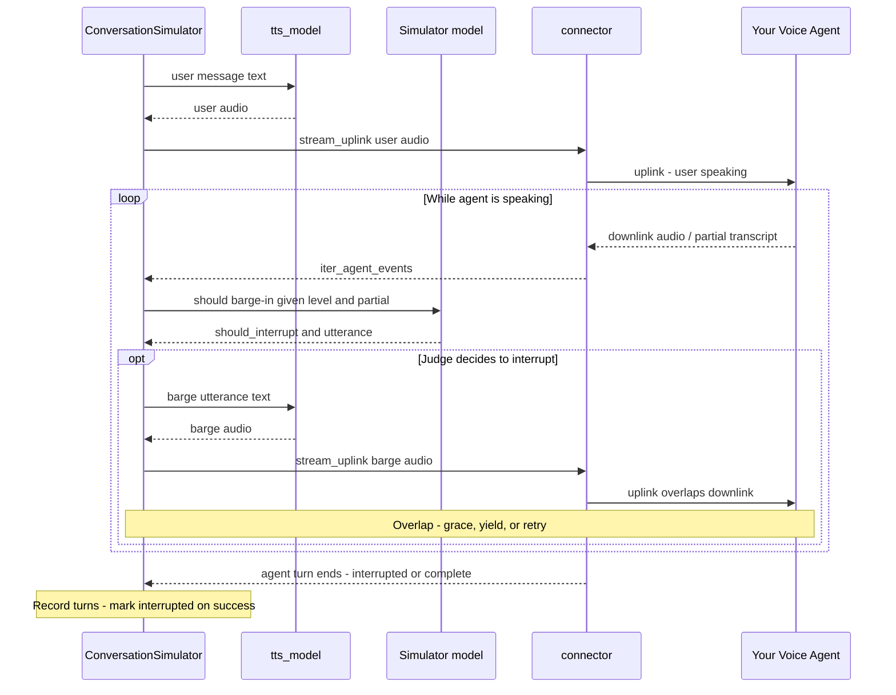

默认情况下，模拟的通话者从不打断：它说完自己的话，然后等代理说完再回应。给通话者的 [persona](/docs/conversation-simulator-voice-personas) 设置 `interruption_behavior` 即可演练抢话（barge-in）——同一条连接器会话，以并发上行/下行驱动，再加上一个决定何时插话的评审器。

<Tip>
关于概念模型（上行/下行、半双工与双工），参见 [语音概念 — 打断](/docs/evaluation-voice#interruptions)。
</Tip>

## 工作原理

启用打断后，模拟器不再使用 `exchange_turn()`。它通过**双工交换**以并发上行和下行驱动同一条连接器：

1. **说出用户轮次。** TTS 把模拟用户的消息合成为语音；连接器用 `stream_uplink`（可取消）推送，不等待代理说完。
2. **在下行上聆听。** `iter_agent_events()` 在代理音频和部分转写到达时进行流式接收。
3. **说话途中评审。** 随着部分转写增长，模拟器模型判断此刻该 `frequency` 下的真实通话者是否会插话——以及用什么话语。
4. **抢话（可选）。** 如果评审说会，TTS 说出该话语，`stream_uplink` 开始与代理重叠。
5. **从双方同时说话中恢复。** 如果双方重叠，代理会得到一个宽限窗口来停止；如果它没有停下，用户让步、等待一段尴尬的停顿，并可能重试。成功抢话会给助手 `Turn` 打上 `interrupted=True`。
6. **继续。** 话轮稳定后，模拟器照常记录各轮次并生成下一条用户消息。



在[全双工连接器](/docs/conversation-simulator-voice-connectors#full-duplex-custom-connectors)上，每次对话都会执行这种交换；第 3 步的评审只在 persona 具有 `interruption_behavior` 时运行。

## Setup Interruptions

打断是通话者的特质，而非某次运行的设置——不耐烦的顾客无论打来咨询什么场景都会抢你的代理的话。因此只要给 [`Persona`](/docs/conversation-simulator-voice-personas) 提供了非 `None` 的 `InterruptionBehavior`，打断即被启用：

```python
from deepeval.dataset import InterruptionBehavior, Persona

persona = Persona(
    characteristics="You are impatient and finish other people's sentences.",
    interruption_behavior=InterruptionBehavior(
        frequency="normal",
        overlap="adaptive",
    ),
)
```

创建 `InterruptionBehavior` 时有**两个**可选参数：

- [可选] `frequency`：模拟通话者考虑插话的频率——`"rare"`、`"normal"` 或 `"frequent"`。默认为 `"normal"`。
- [可选] `overlap`：当代理在被打断后继续说下去时通话者的行为——`"yield"`、`"adaptive"` 或 `"insist"`。默认为 `"adaptive"`。

只有该 persona 驱动对话时才会发生抢话，因此把它附加到你要模拟的 `ConversationalGolden` 上：

```python
from deepeval.dataset import ConversationalGolden

golden = ConversationalGolden(
    scenario="Andy Byron wants to purchase a VIP ticket to a Coldplay concert.",
    persona=persona,
)
```

<Tip>
persona 携带的内容远不止抢话——通话者的语音、背景噪声、是否先开口、是否开口，以及何时挂断。完整集合见 [Personas](/docs/conversation-simulator-voice-personas)。
</Tip>

<Warning>
`VoiceConfig.interruption_settings` 已弃用。对于 persona 自身没有 `interruption_behavior` 的 golden，它仍可作为整次运行的兜底，但会发出 `DeprecationWarning`，并将在未来版本中移除。
</Warning>

## When Does It Interrupt?

打断**不是随机的**。代理说话时，模拟器模型充当评审：它读取迄今为止的部分转写（加上场景、通话者 persona 和先前的轮次），判断此刻该 `frequency` 下的真实通话者是否会插话，以及用什么话语。

这个决策基于内容——例如代理自相矛盾、问了已经回答过的问题、或开始跑题——而不是掷硬币。`frequency` 只改变评审的积极程度和被询问的频率：

- `"rare"` —— 只在明显的错误/矛盾时打断；倾向于等完整条回复说完。每次对话最多 **1** 次抢话，每条代理话语最多 **1** 次。评审被询问的频率更低（需要再多约 80 个转写字符，且两次询问间隔至少 2 秒）。
- `"normal"` —— 当真实通话者会澄清、纠正方向、提前回答或截断明显跑题时打断——正常的助听性发言不会触发。每次对话最多 **4** 次抢话，每条代理话语最多 **2** 次（约 40 字符 / 1 秒询问间隔）。
- `"frequent"` —— 对啰嗦、节奏拖沓、跑题或可抢先发言的机会积极打断——仍会跳过句子中间无意义的截断。每次对话最多 **8** 次，每条代理话语最多 **3** 次（约 20 字符 / 0.5 秒询问间隔）。

让 `Persona.interruption_behavior` 保持未设置（或设为 `None`），通话者就从不插话——`Turn.interrupted` 保持未设置。

循环中唯一的随机性是双方同时说话后重试前的一小段延迟。它只会改变重试_何时_可能发生，不会改变评审_是否_选择打断。

## When Both Sides Talk at Once

抢话并不意味着立刻成功。有那么一瞬间，**双方可能在互相压制**——代理还在说完一句话，而模拟用户已经插进来。真实电话也是如此：一个人开始说话，另一个人又继续说了一拍，然后某一方让步（或者双方尴尬地同时停下再重来）。

`deepeval` 显式地建模了这条恢复路径。模拟用户开始与代理重叠后：

1. **允许短暂重叠。** 用户在代理仍在下行说话时继续说一小段窗口。这个重叠正是打断本身——没有它，用户永远无法压过代理。
2. **代理有机会停下。** 如果代理安静下来，抢话成功：助手回复被截断（`interrupted=True`），对话从用户的插话继续。
3. **如果代理继续说下去，`overlap` 决定后续。**
   - `"yield"` 快速退让，不再重试该次打断。
   - `"adaptive"` 允许短暂重叠，然后让步，并可能在一次自然停顿后重试。
   - `"insist"` 更久地占据话轮，如果代理无视打断会更早重试。
4. **对话恢复。** 通话者让步时，模拟器会留下一段短暂的"好，你说"停顿再聆听或重试。时机由 overlap 行为自动选择。

一个重要细节：只有当代理在抢话_开始之后_说话时，连接器才会切断用户的上行。如果这条规则总是生效，用户根本无法开始一次打断。

用 `frequency` 控制通话者打断的意愿，用 `overlap` 控制他们从双方同时说话中如何恢复。模拟器把底层时机值作为协同预设来选择，用户无需调整相互依赖的毫秒值。

## What Gets Recorded

- 被成功抢话截断的助手轮次会带上 `interrupted=True`。
- 沮丧型抢话（宽限期未停）通过用户轮次上的 `metadata` 呈现：`barge_in`、`frustrated` 和 `grace_missed_ms`。
- 每次抢话都是一条用户 `Turn`，并计入 `max_user_simulations`。
- 当代理在通话者说完之前就已经在说话时，`Turn.latency_ms` 会被钳制为零。

对话的其余部分仍是普通的 `ConversationalTestCase`——参见[语音模拟产出什么](/docs/conversation-simulator-voice-mode#what-a-voice-simulation-produces)。
