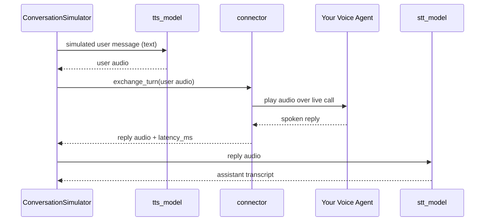

语音模式让 `ConversationSimulator` 与**语音代理**对话，而不是文本聊天机器人。你无需把应用包装进 `model_callback`，而是传入一个 `VoiceConfig`：每条模拟的用户轮次被朗读出来（文本转语音），通过实时连接流式发送给你的代理，代理的口头回复被录音并转写（语音转文本）回对话。

产出与文本模拟相同的 `ConversationalTestCase` 列表——可直接配合 `deepeval` 的多轮指标——区别是每个 `Turn` 还携带实际说出的音频，且每条助手 `Turn` 记录你的代理花了多久回应。

<Tip>
初次接触语音评估？概念章节的 [Voice](/docs/evaluation-voice) 解释了本页赖以建立的种种概念——语音模型、传输、连接器、`ConversationalTestCase` 上的语音字段，以及打断。
</Tip>

## 工作原理

在语音模式下，模拟器模型仍扮演用户并以文本生成每条用户消息。区别在于模拟用户与你的代理之间发生的事：

- 用户消息由 `tts_model` 合成为语音。
- 音频通过 `connector` 发送给你的语音代理，连接器为每段对话持有一条实时呼叫（首条轮次前连接，对话结束后断开）。
- 连接器捕获你代理的口头回复并测量其响应延迟。
- 如果连接器自身不提供转写，回复音频会由 `stt_model` 转写。
- 交换的双方都记录在对话的 `Turn` 上。



在 **full-duplex** 连接器（如 `LiveKitConnector`）上，通话者在说话时保持聆听，因此代理在轮次中途说的任何话都不会丢失；在无法同时承载双方语音的连接器（如 `CallbackVoiceConnector`）上，双方轮流发言。两者都不会让通话者打断——抢话见 [Interruptions](/docs/conversation-simulator-voice-interruptions)。

模拟一侧由谁说话——他们的嗓音、性情、周围噪声——来自 golden 的 [`Persona`](/docs/conversation-simulator-voice-personas)。

模拟的其他一切——场景驱动的用户轮次、[停止逻辑](/docs/conversation-simulator-stopping-logic)、[模拟图](/docs/conversation-simulator-simulation-graph)和[生命周期钩子](/docs/conversation-simulator-lifecycle-hooks)——与文本模式完全一致。

## Setup Voice Mode

在 `deepeval` 的 `ConversationSimulator` 中，`voice_config` 与 `model_callback` 互斥：二者只提供一个。

先选择与你已部署语音代理匹配的连接器。`deepeval` 为 ElevenLabs 会话代理、LiveKit 代理、兼容的原始音频 WebSocket 以及进程内 Python 可调用对象提供连接器。只有当这些都无法触达你的代理时才需要实现自定义连接器；参见 [Voice Connectors](/docs/conversation-simulator-voice-connectors)。

下面的示例连接到一个已有的 **ElevenLabs 会话代理**。`ElevenLabsConnector` 是通往该代理的桥梁——它不是模拟器使用的 TTS 或 STT 模型。

```python
from deepeval.voice import VoiceConfig, ElevenLabsConnector
from deepeval.simulator import ConversationSimulator

voice_config = VoiceConfig(
    connector=ElevenLabsConnector(agent_id="your-agent-id"),
    combine_audio_files=True,
)
simulator = ConversationSimulator(voice_config=voice_config)
```

创建 `VoiceConfig` 时有**一个**必填参数和**五个**可选参数：

- `connector`：一个 [`BaseVoiceConnector`](/docs/conversation-simulator-voice-connectors)，负责与你的语音代理之间搬运音频。
- [可选] `tts_model`：一个 [`DeepEvalBaseTTS`](#tts-and-stt-models)，负责说出模拟用户的消息。默认为 `OpenAITTSModel`。
- [可选] `stt_model`：一个 [`DeepEvalBaseSTT`](#tts-and-stt-models)，负责转写你代理的口头回复。默认为 `OpenAISTTModel`。
- [可选] `output_dir`：字符串目录，用于保存对话音频文件；`None` 表示不把音频写入磁盘。未设置时回退到 `DEEPEVAL_VOICE_FOLDER` [环境变量](/docs/environment-variables)，再回退到 `".deepeval-voice-simulations"`。
- [可选] `combine_audio_files`：布尔值，设为 `True`（且设置了 `output_dir`）时，还会在逐轮文件之外写出一个拼接完整对话的单一 WAV。`output_dir` 为 `None` 时无效。默认为 `True`。
- [可选] `record_call`：布尔值，设为 `True` 时按通话实际发生完整录音——双方、实时——并在每个 `ConversationalTestCase` 上以 [`call_recording_path`](#what-a-voice-simulation-produces) 暴露。默认为 `False`。

<Info>
`combine_audio_files` 拼接的是附加在每个 `Turn` 上的片段，所以它包含的正是指标看到的内容。`record_call` 则录下线上传输的每一帧——包括从未成为轮次的代理语音、以及抢话中通话者实际发出的部分——通话者在左声道，你的代理在右声道。
</Info>

<Tip>
`VoiceConfig` 中的连接器决定 `deepeval` 如何触达你的代理。每个 `ConversationalGolden` 上的 [`Persona`](/docs/conversation-simulator-voice-personas) 决定谁来打电话——他们的嗓音、背景噪声、是否打断、是否先开口，以及何时挂断。
</Tip>

<Note>
语音模式要求 `async_mode=True`（默认值），且无论 `max_concurrent` 如何，对话都逐个运行——连接器只持有一条实时呼叫，并发对话会在同一会话上交错音频。
</Note>

## TTS and STT Models

语音模式引入了位于连接器两侧的两种语音模型（为什么它们是与 LLM 不同、拥有各自基类的模型家族，参见[语音概念](/docs/evaluation-voice#speech-models)）：

| 配置字段        | 基类             | 角色                                                            | 默认值                                       | 其质量影响                                                                                                             |
| ------------ | ----------------- | --------------------------------------------------------------- | --------------------------------------------- | ------------------------------------------------------------------------------------------------------------------------------- |
| `tts_model`  | `DeepEvalBaseTTS` | 向你的代理说出**模拟用户的**消息          | `OpenAITTSModel`（`gpt-4o-mini-tts`，`alloy`） | 你的代理听到的内容。不清晰或不自然的语音会降低代理自身的语音识别并扭曲整个模拟。 |
| `stt_model`  | `DeepEvalBaseSTT` | 把**你代理的**口头回复转写为 `Turn.content` | `OpenAISTTModel`（`gpt-4o-transcribe`）        | 转写保真度。每个多轮指标评判的都是这份转写，因此 STT 准确度直接决定了评估质量的上限。        |

当连接器已携带转写时跳过 STT。包括 ElevenLabs 在内的一些平台会把代理的转写连同音频一起发送。存在时它直接成为 `Turn.content`，该轮不再调用 `stt_model`。

语音成本与模拟器模型的 LLM 成本分开跟踪。运行结束后，`simulator.tts_cost` 和 `simulator.stt_cost` 包含累计的 TTS 与 STT 开销。

### Using Custom Speech Models

OpenAI 默认值很方便，但专用语音提供商（Deepgram、AssemblyAI、ElevenLabs、Cartesia 等）在这里往往比 LLM 评估中更重要——尤其是 STT，因为转写准确度决定了你的指标能多忠实地看到对话。要使用它们，请继承相应的基类：

```python
from deepeval.models.base_model import DeepEvalBaseTTS, DeepEvalBaseSTT
from deepeval.test_case import Audio

class MyTTSModel(DeepEvalBaseTTS):
    def synthesize(self, text: str, **kwargs) -> tuple[Audio, float | None]:
        audio_bytes = my_tts_provider.speak(text)
        return Audio.from_bytes(audio_bytes, mimeType="audio/wav"), None

    async def a_synthesize(self, text: str, **kwargs) -> tuple[Audio, float | None]:
        return self.synthesize(text, **kwargs)

    def load_model(self):
        return self

    def get_model_name(self) -> str:
        return "my-tts-model"


class MySTTModel(DeepEvalBaseSTT):
    def transcribe(self, audio: Audio, **kwargs) -> tuple[str, float | None]:
        return my_stt_provider.transcribe(audio.get_bytes()), None

    async def a_transcribe(self, audio: Audio, **kwargs) -> tuple[str, float | None]:
        return self.transcribe(audio, **kwargs)

    def load_model(self):
        return self

    def get_model_name(self) -> str:
        return "my-stt-model"
```

`synthesize` 和 `transcribe` 都返回（结果, 可选成本）元组，成本计入 `tts_cost` / `stt_cost`。把实例传入 `VoiceConfig(tts_model=MyTTSModel(), stt_model=MySTTModel(), ...)`。

STT 模型还带一个语音专属的旋钮 `truncated_audio_pad_seconds`。当[打断](/docs/conversation-simulator-voice-interruptions)在代理说到一半时切断它，自回归转写器倾向于补完被截断的词并给句子补标点——把通话者从未听到的语音写进 `Turn.content`。附加一点静音可以把这段音频作为完整话语呈现，抑制猜测：

```python
class MySTTModel(DeepEvalBaseSTT):
    truncated_audio_pad_seconds = 0.3  # 0.0 (the default) transcribes as-is
```

该填充只用于转写，绝不用于保存在轮次上的音频，因此时长和时间戳保持与实际语音一致。`OpenAISTTModel` 设为 `0.3`；不会补完单词的转写器请保持 `0.0`。

## What A Voice Simulation Produces

每段模拟对话都作为普通 `ConversationalTestCase` 返回，并附加语音数据：

- `voice` 被设为 `True`。
- 每条用户 `Turn` 携带播放给你的代理的合成 `audio`。
- 每条助手 `Turn` 携带代理的回复 `audio`、作为 `content` 的转写，以及 `latency_ms` 中测得的响应时间。
- 启用[打断](/docs/conversation-simulator-voice-interruptions)时，被抢话截断的助手轮次带上 `interrupted=True`。沮丧型抢话也可能通过用户轮次上的 `metadata` 呈现。
- `record_call=True` 时，`call_recording_path` 指向整通电话的立体声 WAV——通话者在左声道，你的代理在右声道。

除非 `output_dir` 为 `None`，音频还会写入磁盘——每轮一个文件，`combine_audio_files=True` 时外加整段对话的合并录音，`record_call=True` 时外加名为 `deepeval-call-recording.wav` 的整通录音：

```text
.deepeval-voice-simulations/
└── simulation-2026-08-10_12-30-00/
    ├── deepeval-turn-1-user.wav
    ├── deepeval-turn-1-assistant.wav
    ├── deepeval-turn-2-user.wav
    ├── deepeval-turn-2-assistant.wav
    ├── deepeval-conversation.wav
    └── deepeval-call-recording.wav
```

一次运行中模拟多个 golden 时，每段对话有自己的子文件夹，以 golden 的 `name` 命名（未命名时为 `conversation-<index>`）。

每段对话还会从 `deepeval.simulator` 记录一行 `INFO`，包含代理与通话者的平均和最差响应时间，无需逐个打开 `Turn` 即可读取延迟。

设置 `DEEPEVAL_VOICE_FOLDER` 可把录音存到别处——临时盘或仓库外的路径——而无需改代码。显式的 `VoiceConfig(output_dir=...)` 优先于它，`DEEPEVAL_FILE_SYSTEM=READ_ONLY` 又优先于两者，什么都不写。

<Tip>
由于输出是标准的 `ConversationalTestCase`，你可以用已有的文本多轮指标评估模拟的语音对话——转写就存在每条 `Turn` 的 `content` 里。
</Tip>

## FAQs

<AccordionGroup>
<Accordion title="Do I still need a model callback in voice mode?">
不——`voice_config` 会取代 `model_callback` ，两者同时提供会报错。语音模式下，模拟器通过 `connector` 与你的代理对话，而不是 Python 回调。
</Accordion>
<Accordion title="Which TTS and STT models are used by default?">
OpenAI 的——`OpenAITTSModel` 说出模拟用户，`OpenAISTTModel` 转写你代理的回复，两者都使用你的 `OPENAI_API_KEY` 。继承 `DeepEvalBaseTTS` 或 `DeepEvalBaseSTT` 并传入 `VoiceConfig` 即可换成任意自定义模型。
</Accordion>
<Accordion title="How is latency measured?">
连接器测量从发出用户音频到代理第一段非静音音频的时间，并作为 `latency_ms` 记录在助手 `Turn` 上。轮次结束如何检测（静音阈值、轮次完成事件）由各 `VoiceProtocol` 定义，因此共享同一协议的连接器之间延迟可比——不同协议之间则不可比。
</Accordion>
<Accordion title="Why do voice simulations run one conversation at a time?">
连接器只持有一条实时呼叫，并发运行对话会在同一会话上交错音频。无论 `max_concurrent` 如何，模拟器在语音模式下强制串行执行。
</Accordion>
<Accordion title="Do interruptions count toward the turn limit?">
计入。每条用户轮次都计入 `max_user_simulations` ，包括抢话轮次，因此会打断的 persona 用更少的交换次数就到达上限。
</Accordion>
<Accordion title="My agent isn't on ElevenLabs or LiveKit — can I still simulate it?">
可以。在 Voice Connectors 页面上，对原始音频代理使用通用的 `WebSocketConnector` ，用 `CallbackVoiceConnector` 包装进程内可调用对象，或为其他传输继承 `BaseVoiceConnector`。
</Accordion>
</AccordionGroup>
