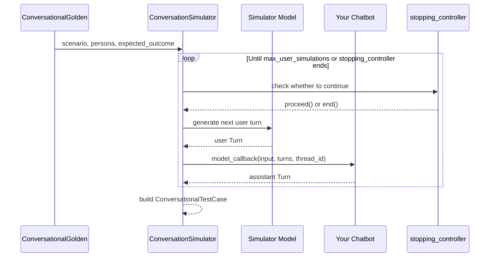

`deepeval` 的 `ConversationSimulator` 让你可以模拟假用户与聊天机器人之间的完整对话，这与生成代表单次、原子化 LLM 交互的普通 golden 的 [synthesizer](/docs/golden-synthesizer) 不同。

```python title="main.py" showLineNumbers
from deepeval.dataset import ConversationalGolden, Persona
from deepeval.simulator import ConversationSimulator
from deepeval.test_case import Turn

# Create ConversationalGolden
conversation_golden = ConversationalGolden(
    scenario="Andy Byron wants to purchase a VIP ticket to a cold play concert.",
    expected_outcome="Successful purchase of a ticket.",
    persona=Persona(characteristics="Andy Byron is the CEO of Astronomer."),
)

# Define chatbot callback
async def chatbot_callback(input):
    return Turn(role="assistant", content=f"Chatbot response to: {input}")

# Run Simulation
simulator = ConversationSimulator(model_callback=chatbot_callback)
conversational_test_cases = simulator.simulate(conversational_goldens=[conversation_golden])
print(conversational_test_cases)
```

`ConversationSimulator` 使用 `ConversationalGolden` 中的场景和 [persona](/docs/conversation-simulator-voice-personas) 来模拟与你的聊天机器人的多轮交互。产生的对话用于创建 `ConversationalTestCase`，以便使用 `deepeval` 的多轮指标进行评估。

## 工作原理

`ConversationSimulator` 反复生成模拟的用户轮次，发送给你的聊天机器人，并记录助手回复，直到模拟结束。

- 每个 `ConversationalGolden` 定义一段对话的场景、persona 和期望结果。
- 模拟器模型扮演用户角色，生成每一条用户消息。
- 你的 `model_callback` 把该消息发送给你的聊天机器人，并返回一个助手 `Turn`。
- 当达到 `max_user_simulations` 或 `stopping_controller` 判定对话应当结束时，模拟器停止。
- 最终对话被打包为 `ConversationalTestCase`，用于多轮评估。



## Create Your First Simulator

要创建 `ConversationSimulator`，你需要定义一个包装你的 LLM 聊天机器人的回调。支持的回调参数见 [模型回调](/docs/conversation-simulator-model-callback)。

```python
from deepeval.test_case import Turn
from deepeval.simulator import ConversationSimulator

async def model_callback(input: str) -> Turn:
    return Turn(role="assistant", content=f"I don't know how to answer this: {input}")

simulator = ConversationSimulator(model_callback=model_callback)
```

创建 `ConversationSimulator` 时有**一个**必填参数和**六个**可选参数：

- `model_callback`：包装你的会话代理（agent）的回调。除非你通过 `voice_config` 模拟语音代理，否则必填。
- [可选] `voice_config`：一个 `VoiceConfig`，让模拟器进入[语音模式](/docs/conversation-simulator-voice-mode)——模拟的用户轮次通过实时连接说给你的语音代理听，回复被转写回来，每一轮都会记录音频与延迟。与 `model_callback` 互斥：二者只提供一个。
- [可选] `simulator_model`：字符串，指定用于生成的 OpenAI GPT 模型，**或者** `DeepEvalBaseLLM` 类型的[任意自定义 LLM 模型](/docs/metrics-introduction#using-a-custom-llm)。默认为 `gpt-5.4`。
- [可选] `async_mode`：布尔值，设为 `True` 时启用**并发对话模拟**。默认为 `True`。
- [可选] `max_concurrent`：整数，决定任一时刻可并行生成的最大对话数。如果遇到限流错误，可以调低该值。默认为 `5`。
- [可选] `simulation_graph`：模拟用户所用模拟图的根 `SimulationNode`。省略时，`deepeval` 回退到 LLM 驱动的默认节点。在此传入 `default_simulation_node(template=MyTemplate)` 可使用[自定义提示模板](/docs/conversation-simulator-custom-templates)。参见 [Simulation Graph](/docs/conversation-simulator-simulation-graph)。
- [可选] `stopping_controller`：控制模拟继续或结束的回调。默认情况下，`deepeval` 使用 `ConversationalGolden` 中的 `expected_outcome` 判断对话何时完成。（旧名 `controller` 仍作为弃用别名被接受。）

## Simulate A Conversation

要模拟你的第一段对话，只需把一组 `ConversationalGolden` 传给 `simulate` 方法：

```python
from deepeval.dataset import ConversationalGolden, Persona
...

conversation_golden = ConversationalGolden(
    scenario="Andy Byron wants to purchase a VIP ticket to a cold play concert.",
    expected_outcome="Successful purchase of a ticket.",
    persona=Persona(characteristics="Andy Byron is the CEO of Astronomer."),
)
conversational_test_cases = simulator.simulate(conversational_goldens=[conversation_golden])
```

`persona` 描述说话的人是谁；`scenario` 描述他们想要什么。如何编写 persona 请见 [Personas](/docs/conversation-simulator-voice-personas)，其中还包含 persona 携带的语音专属设置——语音、背景噪声、打断。

调用 `simulate` 方法时有**一个**必填参数和**一个**可选参数：

- `conversational_goldens`：指定场景和 persona 的 `ConversationalGolden` 列表。
- [可选] `max_user_simulations`：整数，指定每段对话模拟的最大"用户-助手消息"循环数。默认为 `10`。

模拟在达到 `max_user_simulations`、`stopping_controller` 判定对话应当结束、或 `simulation_graph` 到达 `terminal=True` 节点时结束。默认情况下，模拟器会检查对话是否已达成 `ConversationalGolden` 中给出的期望结果。

要定义你自己的停止逻辑，参见 [Stopping Logic](/docs/conversation-simulator-stopping-logic)。

<Tip>
你也可以从既有轮次继续生成对话。只需在 `ConversationalGolden` 中填入一组初始 `Turn`，模拟器就会接着往下模拟。
</Tip>

## Incorporate Existing Turns

如果你的多轮聊天机器人包含一条或多条预定义轮次（例如对话开头的硬编码助手消息），只需向 `ConversationalGolden` 提供一组既有的 `turns`，即可把它们纳入模拟：

```python
from deepeval.test_case import ConversationalTestCase, Turn

golden = ConversationalGolden(turns=[Turn(role="assistant", content="Hi! How can I help you today?")])
```

提供非空的 `turns` 列表后，`deepeval` 会基于你提供的额外上下文运行模拟。

## Evaluate Simulated Turns

`simulate` 函数返回一组 `ConversationalTestCase`，可用于使用 `deepeval` 的会话指标评估你的 LLM 聊天机器人。用模拟出的对话运行[端到端](/docs/evaluation-end-to-end-llm-evals)评估：

```python
from deepeval import evaluate
from deepeval.metrics import TurnRelevancyMetric
...

evaluate(test_cases=conversational_test_cases, metrics=[TurnRelevancyMetric()])
```

## Advanced Usage

围绕你的应用的会话状态、停止条件和后处理需求定制模拟器。

- [模型回调](/docs/conversation-simulator-model-callback)：把对话历史或 `thread_id` 传入你的聊天机器人，让模拟走与生产环境相同的有状态路径。
- [语音模式](/docs/conversation-simulator-voice-mode)：针对语音代理模拟口头对话——用户轮次被合成为语音，通过实时连接发送，回复被转写，并且每一轮都记录音频与延迟。另请参阅[语音连接器](/docs/conversation-simulator-voice-connectors)与[打断](/docs/conversation-simulator-voice-interruptions)。
- [模拟图](/docs/conversation-simulator-simulation-graph)：用程序化状态机驱动模拟用户，而不是扁平的 LLM 提示——把轨迹、重试预算和成功/失败终态编码进图里。
- [停止逻辑](/docs/conversation-simulator-stopping-logic)：用业务专属逻辑（如工具调用、确认消息或失败状态）替换基于期望结果的停止。
- [自定义模板](/docs/conversation-simulator-custom-templates)：通过覆盖用户轮次提示，改变模拟用户的风格、领域措辞或施压程度。
- [生命周期钩子](/docs/conversation-simulator-lifecycle-hooks)：每段对话完成即刻处理，而不必等整个模拟批次结束。

## FAQs

<AccordionGroup>
<Accordion title="When should I use the ConversationSimulator instead of the Synthesizer?">
当你需要假用户与聊天机器人之间完整的多轮对话时，使用 `ConversationSimulator`。[synthesizer](/docs/golden-synthesizer) 生成的是代表单次、原子化 LLM 交互的普通 golden，而非多轮往复对话。
</Accordion>
<Accordion title="What does a ConversationalGolden actually drive in a simulation?">
它的 `scenario` 、`persona` 和 `expected_outcome` 告诉模拟器模型扮演谁、尝试做什么，以及（默认情况下）对话何时算完成。模拟器根据这些字段生成每条用户轮次，并发送给你的 [model_callback](/docs/conversation-simulator-model-callback) 。
</Accordion>
<Accordion title="What does simulate() return, and how do I seed an existing conversation?">
它返回一组 `ConversationalTestCase` ，可以直接配合多轮指标传入 `evaluate` 。要给对话播种，在 `ConversationalGolden` 中填入初始 `turns`（例如硬编码的开场助手消息），模拟器会从这里继续。
</Accordion>
<Accordion title="When does a simulation stop?">
当达到 `max_user_simulations`、[stopping_controller](/docs/conversation-simulator-stopping-logic) 返回 `end()`（默认在满足 `expected_outcome` 时）、或 `simulation_graph` 到达 `terminal=True` 节点时——以先触发者为准。
</Accordion>
<Accordion title="Can I use any model to power the simulated user?">
可以。`simulator_model` 按名称接受 OpenAI 的任意 GPT 模型，或 `DeepEvalBaseLLM` 类型的[任意自定义 LLM](/docs/metrics-introduction#using-a-custom-llm) 。注意它只驱动扮演的用户——你的真实聊天机器人仍通过你的 [model_callback](/docs/conversation-simulator-model-callback) 运行。
</Accordion>
<Accordion title="Can my team run conversation simulations without code?">
可以。在 [Confident AI](https://www.confident-ai.com) 上你可以无代码地模拟多轮对话——定义场景和用户 persona，针对你的聊天机器人运行模拟，试验不同变体，并与团队协作处理产生的测试用例。
</Accordion>
</AccordionGroup>
