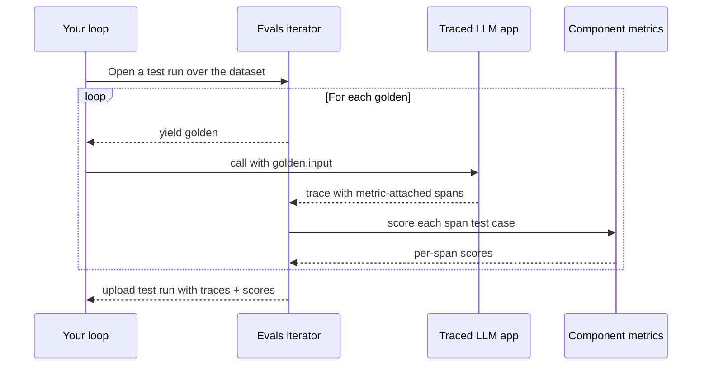

Component-level evaluation (sometimes also known as **step-wise evals**) grades **internal components** of your LLM app — retrievers, tool calls, LLM generations, sub-agents — instead of treating the whole system as a black box. The unit of evaluation is still an [`LLMTestCase`](/docs/evaluation-test-cases#llm-test-cases), but it's attached to a span (an `@observe`（TypeScript 中为 `observe()`）'d function or a framework-emitted span) rather than the whole trace.


如果还没有读过，请先阅读[端到端概览](/docs/evaluation-end-to-end-llm-evals)了解黑盒评估，以及[基于轨迹的评估](/docs/evaluation-trajectory-based-llm-evals)了解如何为智能体的完整步骤链打分。

<Warning>

**仅支持单轮**

组件级评估目前仅支持单轮。多轮组件级评估已在路线图上。
</Warning>

<Info>

**已经在以循环方式做端到端评估？**

如果你已经接好了[带追踪的评估迭代器](/docs/evaluation-end-to-end-single-turn#approach-1-evals_iterator-with-tracing-recommended)，走向组件级的唯一变化就是**把指标挂到你关心的 span 上**——下方[埋点并评估](#instrument-and-evaluate)中的集成标签页会内联展示这一点。
</Info>

## 组件级评估如何运作

组件级运行使用与[单轮端到端](/docs/evaluation-end-to-end-single-turn#approach-1-evals_iterator-with-tracing-recommended)完全相同的迭代器 + 追踪设置——唯一区别是**指标放在哪里**：放在单个 span 上，而不是（或除了）整条追踪上。

1. 你做了追踪的 LLM 应用每次运行都会产生一条包含多个 span 的追踪。
2. 你把指标挂到想打分的特定 span 上（例如检索器、一次工具调用、一次内部 LLM 调用）。
3. `dataset.evals_iterator()` 打开一次测试运行并逐个产出金标。
4. 在循环内，你调用做了追踪的应用。每条挂了指标、被发出的 span 都会作为一个测试用例被打分——你的应用每次运行会产生许多测试用例。
5. 追踪 + 逐 span 测试用例 + 指标分数作为一次测试运行一起上传。



You can mix scopes in the same loop: pass [trajectory metrics](/docs/evaluation-trajectory-based-llm-evals) to `metrics=[...]`（TypeScript 中为 `metrics: [...]`） to score the complete agent path, and attach metrics to individual spans to score components. Both flow into the same test run.

## 分步指南

<Steps>
<Step>

### 构建数据集

`deepeval` 中的[数据集](/docs/evaluation-datasets)存储 [`Golden`](/docs/evaluation-datasets#what-are-goldens)——测试用例的前身。评估时你遍历金标，对每个金标运行你的 LLM 应用，框架会从每条被发出的 span 构建测试用例。

<Tabs>
<Tab title="在代码中">

<Tabs>

<Tab title="Python">

```python
from deepeval.dataset import Golden, EvaluationDataset

goldens = [
    Golden(input="What is your name?"),
    Golden(input="Choose a number between 1 and 100"),
    # ...
]

dataset = EvaluationDataset(goldens=goldens)
```

</Tab>

<Tab title="TypeScript">

```typescript
import { EvaluationDataset, Golden } from "deepeval/dataset";

const goldens = [
  new Golden({ input: "What is your name?" }),
  new Golden({ input: "Choose a number between 1 and 100" }),
  // ...
];

const dataset = new EvaluationDataset({ goldens });
```

</Tab>

</Tabs>

数据集只在本次运行中存在——不推送、不保存。适合快速上手与一次性评估。

</Tab>
<Tab title="从 Confident AI 拉取">

你可以用一行代码把整个数据集从 Confident AI 的云端加载。

<Tabs>

<Tab title="Python">

```python
from deepeval.dataset import EvaluationDataset

dataset = EvaluationDataset()
dataset.pull(alias="My Evals Dataset")
```

</Tab>

<Tab title="TypeScript">

```typescript
import { EvaluationDataset } from "deepeval/dataset";

const dataset = new EvaluationDataset();
await dataset.pull({ alias: "My Evals Dataset" });
```

</Tab>

</Tabs>

非技术的领域专家可以在 Confident AI 上**创建、标注与评论**数据集。你还可以用 CSV 格式上传数据集，或用一行代码把在 `deepeval` 中创建的合成数据集推送到 Confident AI。

更多信息请访问 [Confident AI 数据集板块](https://www.confident-ai.com/docs/llm-evaluation/dataset-management/create-goldens)。

</Tab>
<Tab title="从 CSV 加载">

<Tabs>

<Tab title="Python">

```python
from deepeval.dataset import EvaluationDataset

dataset = EvaluationDataset()
dataset.add_goldens_from_csv_file(
    file_path="example.csv",
    input_col_name="query",
)
```

</Tab>

<Tab title="TypeScript">

```typescript
import { EvaluationDataset } from "deepeval/dataset";

const dataset = new EvaluationDataset();
await dataset.addGoldensFromCSV({
  filePath: "example.csv",
  keys: { input: "query" },
});
```

列名默认采用 `deepeval` 自己的命名，因此 `keys` 只需列出不同的那些。

</Tab>

</Tabs>

更多高级选项（例如加载 `context` 与 `tools_called` 列或重命名所有列）见[加载数据集](/docs/evaluation-datasets#load-dataset)。

</Tab>
<Tab title="从 JSON 加载">

<Tabs>

<Tab title="Python">

```python
from deepeval.dataset import EvaluationDataset

dataset = EvaluationDataset()
dataset.add_goldens_from_json_file(
    file_path="example.json",
    input_key_name="query",
)
```

</Tab>

<Tab title="TypeScript">

```typescript
import { EvaluationDataset } from "deepeval/dataset";

const dataset = new EvaluationDataset();
await dataset.addGoldensFromJSON({
  filePath: "example.json",
  keys: { input: "query" },
});
```

</Tab>

</Tabs>

更多高级选项（例如加载 `context` 与 `tools_called` 键，或从 `.jsonl` 文件逐行读取金标）见[加载数据集](/docs/evaluation-datasets#load-dataset)。

</Tab>
</Tabs>

<Note>
一个 `EvaluationDataset` 只容纳单轮或多轮金标中的一种，不能混用。混有两种的文件会抛出错误。
</Note>

<Tip>
本页只介绍为评估运行**获取**金标。要**持久化**数据集（推送到 Confident AI、保存为 CSV/JSON、跨运行做版本管理），见[数据集页面](/docs/evaluation-datasets)。
</Tip>

</Step>

<Step>

### 埋点/追踪并评估

根据你的技术栈为 AI 智能体做埋点。循环会为每个金标捕获一条追踪，你挂的组件指标会在其中的 span 上被打分。

每个集成都提供 **Async**（默认——最快）与 **Sync** 变体：

- **Async** 让 `evals_iterator()` 保持默认的异步派发，并把每次调用包在 `asyncio.create_task(...)` + `dataset.evaluate(task)` 中，让金标并发运行。
- **Sync** 传入 `AsyncConfig(run_async=False)`，一次运行一个金标。适合调试、受速率限制的提供商，或任何 asyncio 妨碍你的场景（例如某些 Jupyter 设置）。

<Tabs>

<Tab title="Python">

<Tabs>
<Tab title="手动埋点">

用 `@observe` 包装顶层函数，用 `update_current_trace(...)` 设置追踪级字段，并同样用 `@observe` 包装你想打分的内部函数。通过给 `@observe` 传 `metrics=[...]` 挂载组件指标，并用 `update_current_span(test_case=...)` 注册其测试用例：

<Tabs>
<Tab title="Async">

```python title="main.py" showLineNumbers
import asyncio
from deepeval.tracing import observe, update_current_span, update_current_trace
from deepeval.test_case import LLMTestCase
from deepeval.metrics import AnswerRelevancyMetric
...

@observe()
async def my_ai_agent(query: str) -> str:
    chunks = await retrieve(query)
    answer = await generate(query, chunks)
    update_current_trace(input=query, output=answer)
    return answer

@observe()
async def retrieve(query: str) -> list[str]:
    return ["..."]

@observe(metrics=[AnswerRelevancyMetric()])
async def generate(query: str, chunks: list[str]) -> str:
    response = "..."  # await your LLM call here with `query` and `chunks`
    update_current_span(
        test_case=LLMTestCase(input=query, actual_output=response, retrieval_context=chunks),
    )
    return response

for golden in dataset.evals_iterator():
    task = asyncio.create_task(my_ai_agent(golden.input))
    dataset.evaluate(task)
```

</Tab>
<Tab title="Sync">

```python title="main.py" showLineNumbers
from deepeval.evaluate import AsyncConfig
from deepeval.tracing import observe, update_current_span, update_current_trace
from deepeval.test_case import LLMTestCase
from deepeval.metrics import AnswerRelevancyMetric
...

@observe()
def my_ai_agent(query: str) -> str:
    chunks = retrieve(query)
    answer = generate(query, chunks)
    update_current_trace(input=query, output=answer)
    return answer

@observe()
def retrieve(query: str) -> list[str]:
    return ["..."]

@observe(metrics=[AnswerRelevancyMetric()])
def generate(query: str, chunks: list[str]) -> str:
    response = "..."  # call your LLM here with `query` and `chunks`
    update_current_span(
        test_case=LLMTestCase(input=query, actual_output=response, retrieval_context=chunks),
    )
    return response

for golden in dataset.evals_iterator(async_config=AsyncConfig(run_async=False)):
    my_ai_agent(golden.input)
```

</Tab>
</Tabs>

同样的模式适用于任何被 `@observe` 包装的函数——检索器、工具包装器、子智能体。完整用法见[追踪](/docs/evaluation-llm-tracing)。

</Tab>
<Tab title="LangChain">

用 `create_agent` 构建你的智能体，然后在循环中把 `deepeval` 的 `CallbackHandler` 传给它的 `invoke` / `ainvoke` 方法。用 `next_llm_span(...)` 为下一次 LLM 调用预置组件指标——`CallbackHandler` 会把它交给 LangChain 在智能体运行期间打开的第一个 LLM span：

<Tabs>
<Tab title="Async">

```python title="langchain_app.py" showLineNumbers
import asyncio
from langchain.agents import create_agent
from deepeval.tracing import next_llm_span
from deepeval.integrations.langchain import CallbackHandler
from deepeval.metrics import AnswerRelevancyMetric
...

def multiply(a: int, b: int) -> int:
    """Multiply two numbers."""
    return a * b

agent = create_agent(
    model="openai:gpt-4o-mini",
    tools=[multiply],
    system_prompt="Be concise.",
)

async def run_agent(prompt: str):
    with next_llm_span(metrics=[AnswerRelevancyMetric()]):
        return await agent.ainvoke(
            {"messages": [{"role": "user", "content": prompt}]},
            config={"callbacks": [CallbackHandler()]},
        )

for golden in dataset.evals_iterator():
    task = asyncio.create_task(run_agent(golden.input))
    dataset.evaluate(task)
```

</Tab>
<Tab title="Sync">

```python title="langchain_app.py" showLineNumbers
from langchain.agents import create_agent
from deepeval.tracing import next_llm_span
from deepeval.evaluate import AsyncConfig
from deepeval.integrations.langchain import CallbackHandler
from deepeval.metrics import AnswerRelevancyMetric
...

def multiply(a: int, b: int) -> int:
    """Multiply two numbers."""
    return a * b

agent = create_agent(
    model="openai:gpt-4o-mini",
    tools=[multiply],
    system_prompt="Be concise.",
)

for golden in dataset.evals_iterator(async_config=AsyncConfig(run_async=False)):
    with next_llm_span(metrics=[AnswerRelevancyMetric()]):
        agent.invoke(
            {"messages": [{"role": "user", "content": golden.input}]},
            config={"callbacks": [CallbackHandler()]},
        )
```

</Tab>
</Tabs>

`next_llm_span` 是一次性的——只有智能体运行中的第一个 LLM span 会拾取该指标，因此 `create_agent` 循环内后续轮次不会被评分。要为每次 LLM 调用打分，自己驱动循环（每次 `agent.invoke(...)` 配一个 `next_llm_span`），或在 `CallbackHandler(metrics=[...])` 上用追踪级指标做端到端打分。检索器用 `next_retriever_span(...)` 同理；确定性工具调用更适合 `next_tool_span(...)` + `update_current_span(...)`。完整用法见 [LangChain 集成](/integrations/frameworks/langchain)。

</Tab>
<Tab title="LangGraph">

接好你的 `StateGraph`，然后在循环中把 `deepeval` 的 `CallbackHandler` 传给它的 `invoke` / `ainvoke` 方法。用 `next_llm_span(...)` 为下一次 LLM 调用预置组件指标——`CallbackHandler` 会把它交给 LangGraph 在图运行期间打开的第一个 LLM span：

<Tabs>
<Tab title="Async">

```python title="langgraph_app.py" showLineNumbers
import asyncio
from langchain.chat_models import init_chat_model
from langgraph.graph import StateGraph, MessagesState, START, END
from deepeval.tracing import next_llm_span
from deepeval.integrations.langchain import CallbackHandler
from deepeval.metrics import AnswerRelevancyMetric
...

llm = init_chat_model("openai:gpt-4o-mini")

async def chatbot(state: MessagesState):
    return {"messages": [await llm.ainvoke(state["messages"])]}

graph = (
    StateGraph(MessagesState)
    .add_node(chatbot)
    .add_edge(START, "chatbot")
    .add_edge("chatbot", END)
    .compile()
)

async def run_graph(prompt: str):
    with next_llm_span(metrics=[AnswerRelevancyMetric()]):
        return await graph.ainvoke(
            {"messages": [{"role": "user", "content": prompt}]},
            config={"callbacks": [CallbackHandler()]},
        )

for golden in dataset.evals_iterator():
    task = asyncio.create_task(run_graph(golden.input))
    dataset.evaluate(task)
```

</Tab>
<Tab title="Sync">

```python title="langgraph_app.py" showLineNumbers
from langchain.chat_models import init_chat_model
from langgraph.graph import StateGraph, MessagesState, START, END
from deepeval.tracing import next_llm_span
from deepeval.evaluate import AsyncConfig
from deepeval.integrations.langchain import CallbackHandler
from deepeval.metrics import AnswerRelevancyMetric
...

llm = init_chat_model("openai:gpt-4o-mini")

def chatbot(state: MessagesState):
    return {"messages": [llm.invoke(state["messages"])]}

graph = (
    StateGraph(MessagesState)
    .add_node(chatbot)
    .add_edge(START, "chatbot")
    .add_edge("chatbot", END)
    .compile()
)

for golden in dataset.evals_iterator(async_config=AsyncConfig(run_async=False)):
    with next_llm_span(metrics=[AnswerRelevancyMetric()]):
        graph.invoke(
            {"messages": [{"role": "user", "content": golden.input}]},
            config={"callbacks": [CallbackHandler()]},
        )
```

</Tab>
</Tabs>

`next_llm_span` 是一次性的——只有图产生的第一个 LLM span 会拾取该指标，因此经过 `chatbot` 节点的后续循环轮次不会被评分。要为每次 LLM 调用打分，自己驱动循环（每次 `graph.invoke(...)` 配一个 `next_llm_span`），或在 `CallbackHandler(metrics=[...])` 上用追踪级指标做端到端打分。完整用法见 [LangGraph 集成](/integrations/frameworks/langgraph)。

</Tab>
<Tab title="OpenAI">

把 `from openai import OpenAI` 直接替换为 `from deepeval.openai import OpenAI`（或 `AsyncOpenAI`）。每次 `chat.completions.create(...)`、`chat.completions.parse(...)` 与 `responses.create(...)` 调用都会成为 LLM span。把调用包在 `with trace(llm_span_context=LlmSpanContext(metrics=[...])):` 中为它预置组件指标：

<Tabs>
<Tab title="Async">

```python title="openai_app.py" showLineNumbers
import asyncio
from deepeval.openai import AsyncOpenAI
from deepeval.tracing import trace, LlmSpanContext
from deepeval.metrics import AnswerRelevancyMetric
...

client = AsyncOpenAI()

async def call_openai(prompt: str):
    with trace(llm_span_context=LlmSpanContext(metrics=[AnswerRelevancyMetric()])):
        return await client.chat.completions.create(
            model="gpt-4o",
            messages=[{"role": "user", "content": prompt}],
        )

for golden in dataset.evals_iterator():
    task = asyncio.create_task(call_openai(golden.input))
    dataset.evaluate(task)
```

</Tab>
<Tab title="Sync">

```python title="openai_app.py" showLineNumbers
from deepeval.openai import OpenAI
from deepeval.tracing import trace, LlmSpanContext
from deepeval.evaluate import AsyncConfig
from deepeval.metrics import AnswerRelevancyMetric
...

client = OpenAI()

for golden in dataset.evals_iterator(async_config=AsyncConfig(run_async=False)):
    with trace(llm_span_context=LlmSpanContext(metrics=[AnswerRelevancyMetric()])):
        client.chat.completions.create(
            model="gpt-4o",
            messages=[{"role": "user", "content": golden.input}],
        )
```

</Tab>
</Tabs>

流式与工具调用相关内容见 [OpenAI 集成](/integrations/frameworks/openai)。

</Tab>
<Tab title="Pydantic AI">

把 `DeepEvalInstrumentationSettings()` 传给你 `Agent` 的 `instrument` 关键字参数。用 `next_llm_span(...)`（LLM 调用）或 `next_agent_span(...)`（智能体 span）为下一个 Pydantic 产生的 span 预置组件指标：

<Tabs>
<Tab title="Async">

```python title="pydanticai_agent.py" showLineNumbers
import asyncio
from pydantic_ai import Agent
from deepeval.tracing import next_llm_span
from deepeval.integrations.pydantic_ai import DeepEvalInstrumentationSettings
from deepeval.metrics import AnswerRelevancyMetric
...

agent = Agent(
    "openai:gpt-4.1",
    system_prompt="Be concise.",
    instrument=DeepEvalInstrumentationSettings(),
)

async def run_agent(prompt: str):
    with next_llm_span(metrics=[AnswerRelevancyMetric()]):
        return await agent.run(prompt)

for golden in dataset.evals_iterator():
    task = asyncio.create_task(run_agent(golden.input))
    dataset.evaluate(task)
```

</Tab>
<Tab title="Sync">

```python title="pydanticai_agent.py" showLineNumbers
from pydantic_ai import Agent
from deepeval.tracing import next_llm_span
from deepeval.evaluate import AsyncConfig
from deepeval.integrations.pydantic_ai import DeepEvalInstrumentationSettings
from deepeval.metrics import AnswerRelevancyMetric
...

agent = Agent(
    "openai:gpt-4.1",
    system_prompt="Be concise.",
    instrument=DeepEvalInstrumentationSettings(),
)

for golden in dataset.evals_iterator(async_config=AsyncConfig(run_async=False)):
    with next_llm_span(metrics=[AnswerRelevancyMetric()]):
        agent.run_sync(golden.input)
```

</Tab>
</Tabs>

完整用法见 [Pydantic AI 集成](/integrations/frameworks/pydanticai)。

</Tab>
<Tab title="AgentCore">

在创建智能体之前调用 `instrument_agentcore()`。同一次调用也会对运行在 AgentCore 内的 [Strands](https://strandsagents.com/) 智能体做埋点。用 `next_agent_span(...)` 或 `next_llm_span(...)` 为下一个 AgentCore 产生的 span 预置组件指标：

<Tabs>
<Tab title="Async">

```python title="agentcore_agent.py" showLineNumbers
import asyncio
from strands import Agent
from deepeval.tracing import next_agent_span
from deepeval.integrations.agentcore import instrument_agentcore
from deepeval.metrics import TaskCompletionMetric
...

instrument_agentcore()

agent = Agent(model="amazon.nova-lite-v1:0")

async def run_agent(prompt: str):
    with next_agent_span(metrics=[TaskCompletionMetric()]):
        return await agent.invoke_async(prompt)

for golden in dataset.evals_iterator():
    task = asyncio.create_task(run_agent(golden.input))
    dataset.evaluate(task)
```

</Tab>
<Tab title="Sync">

```python title="agentcore_agent.py" showLineNumbers
from strands import Agent
from deepeval.tracing import next_agent_span
from deepeval.evaluate import AsyncConfig
from deepeval.integrations.agentcore import instrument_agentcore
from deepeval.metrics import TaskCompletionMetric
...

instrument_agentcore()

agent = Agent(model="amazon.nova-lite-v1:0")

for golden in dataset.evals_iterator(async_config=AsyncConfig(run_async=False)):
    with next_agent_span(metrics=[TaskCompletionMetric()]):
        agent(golden.input)
```

</Tab>
</Tabs>

完整用法（包括 `BedrockAgentCoreApp` 入口模式）见 [AgentCore 集成](/integrations/frameworks/agentcore)。

</Tab>
<Tab title="Strands">

在调用你的 Strands 智能体之前调用 `instrument_strands()`（对托管在 AgentCore 上的 Strands，请改用 AgentCore 标签页）。用 `next_agent_span(...)` 或 `next_llm_span(...)` 为下一个 Strands 产生的 span 预置组件指标：

<Tabs>
<Tab title="Async">

```python title="strands_agent.py" showLineNumbers
import asyncio
from strands import Agent
from strands.models.openai import OpenAIModel
from deepeval.tracing import next_agent_span
from deepeval.integrations.strands import instrument_strands
from deepeval.metrics import TaskCompletionMetric
...

instrument_strands()

agent = Agent(
    model=OpenAIModel(model_id="gpt-4o-mini"),
    system_prompt="You are a helpful assistant.",
)

async def run_agent(prompt: str):
    with next_agent_span(metrics=[TaskCompletionMetric()]):
        return await agent.invoke_async(prompt)

for golden in dataset.evals_iterator():
    task = asyncio.create_task(run_agent(golden.input))
    dataset.evaluate(task)
```

</Tab>
<Tab title="Sync">

```python title="strands_agent.py" showLineNumbers
from strands import Agent
from strands.models.openai import OpenAIModel
from deepeval.tracing import next_agent_span
from deepeval.evaluate import AsyncConfig
from deepeval.integrations.strands import instrument_strands
from deepeval.metrics import TaskCompletionMetric
...

instrument_strands()

agent = Agent(
    model=OpenAIModel(model_id="gpt-4o-mini"),
    system_prompt="You are a helpful assistant.",
)

for golden in dataset.evals_iterator(async_config=AsyncConfig(run_async=False)):
    with next_agent_span(metrics=[TaskCompletionMetric()]):
        agent(golden.input)
```

</Tab>
</Tabs>

完整用法见 [Strands 集成](/integrations/frameworks/strands)。

</Tab>
<Tab title="Anthropic">

把 `from anthropic import Anthropic` 直接替换为 `from deepeval.anthropic import Anthropic`（或 `AsyncAnthropic`）。把调用包在 `with trace(llm_span_context=LlmSpanContext(metrics=[...])):` 中为其 LLM span 预置组件指标：

<Tabs>
<Tab title="Async">

```python title="anthropic_app.py" showLineNumbers
import asyncio
from deepeval.anthropic import AsyncAnthropic
from deepeval.tracing import trace, LlmSpanContext
from deepeval.metrics import AnswerRelevancyMetric
...

client = AsyncAnthropic()

async def call_claude(prompt: str):
    with trace(llm_span_context=LlmSpanContext(metrics=[AnswerRelevancyMetric()])):
        return await client.messages.create(
            model="claude-sonnet-4-5",
            max_tokens=1024,
            messages=[{"role": "user", "content": prompt}],
        )

for golden in dataset.evals_iterator():
    task = asyncio.create_task(call_claude(golden.input))
    dataset.evaluate(task)
```

</Tab>
<Tab title="Sync">

```python title="anthropic_app.py" showLineNumbers
from deepeval.anthropic import Anthropic
from deepeval.tracing import trace, LlmSpanContext
from deepeval.evaluate import AsyncConfig
from deepeval.metrics import AnswerRelevancyMetric
...

client = Anthropic()

for golden in dataset.evals_iterator(async_config=AsyncConfig(run_async=False)):
    with trace(llm_span_context=LlmSpanContext(metrics=[AnswerRelevancyMetric()])):
        client.messages.create(
            model="claude-sonnet-4-5",
            max_tokens=1024,
            messages=[{"role": "user", "content": golden.input}],
        )
```

</Tab>
</Tabs>

流式与工具使用相关内容见 [Anthropic 集成](/integrations/frameworks/anthropic)。

</Tab>
<Tab title="LlamaIndex">

把 `deepeval` 的事件处理器注册到 LlamaIndex 的 instrumentation 调度器上。在 `with trace(...)` 内用 `AgentSpanContext`（或用 `LlmSpanContext` 指定下一个 LLM span）为智能体 span 预置指标。`agent.run(...)` 仅支持异步，同步变体使用 `asyncio.run(...)`：

<Tabs>
<Tab title="Async">

```python title="llamaindex_agent.py" showLineNumbers
import asyncio
from llama_index.llms.openai import OpenAI
from llama_index.core.agent import FunctionAgent
import llama_index.core.instrumentation as instrument
from deepeval.tracing import trace, AgentSpanContext
from deepeval.integrations.llama_index import instrument_llama_index
from deepeval.metrics import TaskCompletionMetric
...

instrument_llama_index(instrument.get_dispatcher())

def multiply(a: float, b: float) -> float:
    return a * b

agent = FunctionAgent(
    tools=[multiply],
    llm=OpenAI(model="gpt-4o-mini"),
    system_prompt="You are a helpful calculator.",
)

async def run_agent(prompt: str):
    with trace(agent_span_context=AgentSpanContext(metrics=[TaskCompletionMetric()])):
        return await agent.run(prompt)

for golden in dataset.evals_iterator():
    task = asyncio.create_task(run_agent(golden.input))
    dataset.evaluate(task)
```

</Tab>
<Tab title="Sync">

```python title="llamaindex_agent.py" showLineNumbers
import asyncio
from llama_index.llms.openai import OpenAI
from llama_index.core.agent import FunctionAgent
import llama_index.core.instrumentation as instrument
from deepeval.tracing import trace, AgentSpanContext
from deepeval.evaluate import AsyncConfig
from deepeval.integrations.llama_index import instrument_llama_index
from deepeval.metrics import TaskCompletionMetric
...

instrument_llama_index(instrument.get_dispatcher())

def multiply(a: float, b: float) -> float:
    return a * b

agent = FunctionAgent(
    tools=[multiply],
    llm=OpenAI(model="gpt-4o-mini"),
    system_prompt="You are a helpful calculator.",
)

async def run_agent(prompt: str):
    with trace(agent_span_context=AgentSpanContext(metrics=[TaskCompletionMetric()])):
        return await agent.run(prompt)

for golden in dataset.evals_iterator(async_config=AsyncConfig(run_async=False)):
    asyncio.run(run_agent(golden.input))
```

</Tab>
</Tabs>

完整用法见 [LlamaIndex 集成](/integrations/frameworks/llamaindex)。

</Tab>
<Tab title="OpenAI Agents">

注册一次 `DeepEvalTracingProcessor`，然后用 `deepeval` 的 `Agent` 与 `function_tool` 垫片构建你的智能体。把组件指标直接挂在 `Agent` 上（智能体 span 用 `agent_metrics`，LLM span 用 `llm_metrics`）以及 `@function_tool` 上（工具 span）：

<Tabs>
<Tab title="Async">

```python title="openai_agents_app.py" showLineNumbers
import asyncio
from agents import Runner, add_trace_processor
from deepeval.openai_agents import Agent, DeepEvalTracingProcessor, function_tool
from deepeval.metrics import TaskCompletionMetric, AnswerRelevancyMetric, GEval
from deepeval.test_case import LLMTestCaseParams
...

add_trace_processor(DeepEvalTracingProcessor())

@function_tool(metrics=[GEval(
    name="Helpful Weather Lookup",
    criteria="Output must be a clear weather summary for the requested city.",
    evaluation_params=[LLMTestCaseParams.INPUT, LLMTestCaseParams.ACTUAL_OUTPUT],
)])
def get_weather(city: str) -> str:
    return f"It's always sunny in {city}!"

agent = Agent(
    name="weather_agent",
    instructions="Answer weather questions concisely.",
    tools=[get_weather],
    agent_metrics=[TaskCompletionMetric()],
    llm_metrics=[AnswerRelevancyMetric()],
)

for golden in dataset.evals_iterator():
    task = asyncio.create_task(Runner.run(agent, golden.input))
    dataset.evaluate(task)
```

</Tab>
<Tab title="Sync">

```python title="openai_agents_app.py" showLineNumbers
from agents import Runner, add_trace_processor
from deepeval.evaluate import AsyncConfig
from deepeval.openai_agents import Agent, DeepEvalTracingProcessor, function_tool
from deepeval.metrics import TaskCompletionMetric, AnswerRelevancyMetric, GEval
from deepeval.test_case import LLMTestCaseParams
...

add_trace_processor(DeepEvalTracingProcessor())

@function_tool(metrics=[GEval(
    name="Helpful Weather Lookup",
    criteria="Output must be a clear weather summary for the requested city.",
    evaluation_params=[LLMTestCaseParams.INPUT, LLMTestCaseParams.ACTUAL_OUTPUT],
)])
def get_weather(city: str) -> str:
    return f"It's always sunny in {city}!"

agent = Agent(
    name="weather_agent",
    instructions="Answer weather questions concisely.",
    tools=[get_weather],
    agent_metrics=[TaskCompletionMetric()],
    llm_metrics=[AnswerRelevancyMetric()],
)

for golden in dataset.evals_iterator(async_config=AsyncConfig(run_async=False)):
    Runner.run_sync(agent, golden.input)
```

</Tab>
</Tabs>

`agent_metrics` 在每次运行时都会生效（包括向子智能体的移交）。完整用法见 [OpenAI Agents 集成](/integrations/frameworks/openai-agents)。

</Tab>
<Tab title="Google ADK">

在构建 `LlmAgent` 之前调用一次 `instrument_google_adk()`。用 `next_agent_span(...)` 或 `next_llm_span(...)` 为下一个 Google ADK 产生的 span 预置组件指标。ADK 的 `runner.run_async(...)` 仅支持异步，同步变体使用 `asyncio.run(...)`：

<Tabs>
<Tab title="Async">

```python title="google_adk_agent.py" showLineNumbers
import asyncio
from google.adk.agents import LlmAgent
from google.adk.runners import InMemoryRunner
from google.genai import types
from deepeval.tracing import next_agent_span
from deepeval.integrations.google_adk import instrument_google_adk
from deepeval.metrics import TaskCompletionMetric
...

instrument_google_adk()

agent = LlmAgent(model="gemini-2.0-flash", name="assistant", instruction="Be concise.")
runner = InMemoryRunner(agent=agent, app_name="deepeval-quickstart")

async def run_agent(prompt: str) -> str:
    session = await runner.session_service.create_session(
        app_name="deepeval-quickstart", user_id="demo-user",
    )
    message = types.Content(role="user", parts=[types.Part(text=prompt)])
    async for event in runner.run_async(
        user_id="demo-user", session_id=session.id, new_message=message,
    ):
        if event.is_final_response() and event.content:
            return "".join(part.text for part in event.content.parts if getattr(part, "text", None))
    return ""

async def run_with_metric(prompt: str) -> str:
    with next_agent_span(metrics=[TaskCompletionMetric()]):
        return await run_agent(prompt)

for golden in dataset.evals_iterator():
    task = asyncio.create_task(run_with_metric(golden.input))
    dataset.evaluate(task)
```

</Tab>
<Tab title="Sync">

```python title="google_adk_agent.py" showLineNumbers
import asyncio
from google.adk.agents import LlmAgent
from google.adk.runners import InMemoryRunner
from google.genai import types
from deepeval.tracing import next_agent_span
from deepeval.evaluate import AsyncConfig
from deepeval.integrations.google_adk import instrument_google_adk
from deepeval.metrics import TaskCompletionMetric
...

instrument_google_adk()

agent = LlmAgent(model="gemini-2.0-flash", name="assistant", instruction="Be concise.")
runner = InMemoryRunner(agent=agent, app_name="deepeval-quickstart")

async def run_agent(prompt: str) -> str:
    session = await runner.session_service.create_session(
        app_name="deepeval-quickstart", user_id="demo-user",
    )
    message = types.Content(role="user", parts=[types.Part(text=prompt)])
    async for event in runner.run_async(
        user_id="demo-user", session_id=session.id, new_message=message,
    ):
        if event.is_final_response() and event.content:
            return "".join(part.text for part in event.content.parts if getattr(part, "text", None))
    return ""

for golden in dataset.evals_iterator(async_config=AsyncConfig(run_async=False)):
    with next_agent_span(metrics=[TaskCompletionMetric()]):
        asyncio.run(run_agent(golden.input))
```

</Tab>
</Tabs>

完整用法见 [Google ADK 集成](/integrations/frameworks/google-adk)。

</Tab>
<Tab title="CrewAI">

调用一次 `instrument_crewai()`，然后用 `deepeval` 的 `Crew`、`Agent`、`LLM` 与 `@tool` 垫片构建你的 crew。把组件指标直接挂在 `Agent`（智能体 span）、`LLM`（LLM span）或 `@tool`（工具 span）上：

<Tabs>
<Tab title="Async">

```python title="crewai_app.py" showLineNumbers
import asyncio
from crewai import Task
from deepeval.integrations.crewai import instrument_crewai, Crew, Agent
from deepeval.metrics import TaskCompletionMetric
...

instrument_crewai()

tutor = Agent(
    role="Math Tutor",
    goal="Answer math questions accurately and concisely.",
    backstory="An experienced tutor who explains simple math clearly.",
    metrics=[TaskCompletionMetric()],
)
answer_task = Task(
    description="{question}",
    expected_output="An accurate, concise answer.",
    agent=tutor,
)
crew = Crew(agents=[tutor], tasks=[answer_task])

for golden in dataset.evals_iterator():
    task = asyncio.create_task(crew.kickoff_async({"question": golden.input}))
    dataset.evaluate(task)
```

</Tab>
<Tab title="Sync">

```python title="crewai_app.py" showLineNumbers
from crewai import Task
from deepeval.evaluate import AsyncConfig
from deepeval.integrations.crewai import instrument_crewai, Crew, Agent
from deepeval.metrics import TaskCompletionMetric
...

instrument_crewai()

tutor = Agent(
    role="Math Tutor",
    goal="Answer math questions accurately and concisely.",
    backstory="An experienced tutor who explains simple math clearly.",
    metrics=[TaskCompletionMetric()],
)
task = Task(
    description="{question}",
    expected_output="An accurate, concise answer.",
    agent=tutor,
)
crew = Crew(agents=[tutor], tasks=[task])

for golden in dataset.evals_iterator(async_config=AsyncConfig(run_async=False)):
    crew.kickoff({"question": golden.input})
```

</Tab>
</Tabs>

完整用法（包括 `LLM` 与 `@tool` 的指标挂载）见 [CrewAI 集成](/integrations/frameworks/crewai)。

</Tab>
</Tabs>

</Tab>

<Tab title="TypeScript">

<Tabs>
<Tab title="手动埋点">

用 `observe` 包装顶层函数，用 `updateCurrentTrace(...)` 设置追踪级字段，并同样用 `observe` 包装你想打分的内部函数。通过给 `observe` 传 `metrics` 挂载组件指标，并用 `updateCurrentSpan({ testCase })` 注册其测试用例：

```typescript title="main.ts" showLineNumbers
import {
  observe,
  updateCurrentSpan,
  updateCurrentTrace,
} from "deepeval/tracing";
import { AnswerRelevancyMetric } from "deepeval/metrics";
import { LLMTestCase } from "deepeval/test-case";
...

const retrieve = observe({
  type: "retriever",
  fn: async (query: string): Promise<string[]> => ["..."],
});

const generate = observe({
  type: "llm",
  metrics: [new AnswerRelevancyMetric()],
  fn: async (query: string, chunks: string[]): Promise<string> => {
    const response = "..."; // await your LLM call here with `query` and `chunks`
    updateCurrentSpan({
      testCase: new LLMTestCase({
        input: query,
        actualOutput: response,
        retrievalContext: chunks,
      }),
    });
    return response;
  },
});

const myAiAgent = observe({
  type: "agent",
  fn: async (query: string): Promise<string> => {
    const chunks = await retrieve(query);
    const answer = await generate(query, chunks);
    updateCurrentTrace({ input: query, output: answer });
    return answer;
  },
});

for await (const golden of dataset.evalsIterator()) {
  await myAiAgent((golden as Golden).input);
}
```

同样的模式适用于任何被观察的函数——检索器、工具包装器、子智能体。完整用法见[追踪](/docs/evaluation-llm-tracing)。

</Tab>
<Tab title="LangChain">

用 `createAgent` 构建你的智能体，然后在循环中把 `deepeval` 的 `DeepEvalCallbackHandler` 传给它的 `invoke` 方法。用 `nextLlmSpan(...)` 为下一次 LLM 调用预置组件指标——处理器会把它交给 LangChain 在智能体运行期间打开的第一个 LLM span：

```typescript title="langchain-agent.ts" showLineNumbers
import { createAgent } from "langchain";
import { DeepEvalCallbackHandler } from "deepeval/integrations/langchain";
import { AnswerRelevancyMetric } from "deepeval/metrics";
import { nextLlmSpan } from "deepeval/tracing";
...

const agent = createAgent({
  model: "openai:gpt-4o-mini",
  tools: [multiply],
  systemPrompt: "Be concise.",
});

const handler = new DeepEvalCallbackHandler({});

const ask = (prompt: string) =>
  agent.invoke(
    { messages: [{ role: "user", content: prompt }] },
    { callbacks: [handler] },
  );

for await (const golden of dataset.evalsIterator()) {
  await nextLlmSpan({ metrics: [new AnswerRelevancyMetric()] }, () =>
    ask((golden as Golden).input),
  );
}
```

`nextLlmSpan` 是一次性的——只有智能体运行中的第一个 LLM span 会拾取该指标，因此 `createAgent` 循环内后续轮次不会被评分。要为每次 LLM 调用打分，使用 `setTracingContext({ llmSpanContext: { metrics: [...] } }, ...)`，或在 `evalsIterator` 上用追踪级指标做端到端打分。检索器同理使用 `nextRetrieverSpan(...)`；确定性工具调用更适合在工具函数体内使用 `updateCurrentSpan(...)`。完整用法见 [LangChain 集成](/integrations/frameworks/langchain)。

</Tab>
<Tab title="Mastra">

在你的 `Mastra` 实例的 `Observability` 配置上注册一个 `DeepEvalExporter`，然后用 `nextLlmSpan(...)` 为下一次 LLM 调用预置组件指标：

```typescript title="mastra-agent.ts" showLineNumbers
import { Observability } from "@mastra/observability";
import { Mastra } from "@mastra/core/mastra";
import { DeepEvalExporter } from "deepeval/integrations/mastra";
import { AnswerRelevancyMetric } from "deepeval/metrics";
import { nextLlmSpan } from "deepeval/tracing";
...

const mastra = new Mastra({
  agents: { weatherAgent },
  observability: new Observability({
    configs: {
      deepeval: {
        serviceName: "weather-app",
        exporters: [new DeepEvalExporter()],
      },
    },
  }),
});

for await (const golden of dataset.evalsIterator()) {
  await nextLlmSpan({ metrics: [new AnswerRelevancyMetric()] }, () =>
    mastra.getAgent("weatherAgent").generate((golden as Golden).input),
  );
}
```

Mastra 的 `MODEL_GENERATION` span 会作为 LLM span 到达，其工具调用作为工具 span，因此 `nextToolSpan(...)` 的用法相同。完整用法见 [Mastra 集成](/integrations/frameworks/mastra)。

</Tab>
<Tab title="LangGraph">

接好你的 `StateGraph`，然后在循环中把 `deepeval` 的 `DeepEvalCallbackHandler` 传给它的 `invoke` 方法。用 `nextLlmSpan(...)` 为下一次 LLM 调用预置组件指标——处理器会把它交给图产生的第一个 LLM span：

```typescript title="langgraph-agent.ts" showLineNumbers
import { StateGraph, MessagesAnnotation, START, END } from "@langchain/langgraph";
import { DeepEvalCallbackHandler } from "deepeval/integrations/langchain";
import { AnswerRelevancyMetric } from "deepeval/metrics";
import { nextLlmSpan } from "deepeval/tracing";
...

const graph = new StateGraph(MessagesAnnotation)
  .addNode("chatbot", chatbot)
  .addEdge(START, "chatbot")
  .addEdge("chatbot", END)
  .compile();

const handler = new DeepEvalCallbackHandler({});

const ask = (prompt: string) =>
  graph.invoke(
    { messages: [{ role: "user", content: prompt }] },
    { callbacks: [handler] },
  );

for await (const golden of dataset.evalsIterator()) {
  await nextLlmSpan({ metrics: [new AnswerRelevancyMetric()] }, () =>
    ask((golden as Golden).input),
  );
}
```

`nextLlmSpan` 是一次性的——只有图产生的第一个 LLM span 会拾取该指标，因此经过 `chatbot` 节点的后续循环轮次不会被评分。完整用法见 [LangGraph 集成](/integrations/frameworks/langgraph)。

</Tab>
<Tab title="OpenAI">

对你已有的 client 调用一次 `instrumentOpenAI(client)`。每次 `chat.completions.create(...)`、`chat.completions.parse(...)` 与 `responses.create(...)` 调用都会成为 LLM span。用 `nextLlmSpan(...)` 为某一次调用预置组件指标：

```typescript title="openai-app.ts" showLineNumbers
import { OpenAI } from "openai";
import { AnswerRelevancyMetric } from "deepeval/metrics";
import { instrumentOpenAI } from "deepeval/openai";
import { nextLlmSpan } from "deepeval/tracing";
...

const client = new OpenAI();
instrumentOpenAI(client);

const respond = (prompt: string) =>
  client.chat.completions.create({
    model: "gpt-4o",
    messages: [{ role: "user", content: prompt }],
  });

for await (const golden of dataset.evalsIterator()) {
  await nextLlmSpan({ metrics: [new AnswerRelevancyMetric()] }, () =>
    respond((golden as Golden).input),
  );
}
```

工具调用与全范围的 `LlmSpanContext` 见 [OpenAI 集成](/integrations/frameworks/openai)。

</Tab>
<Tab title="OpenAI Agents">

向 agents SDK 注册一次 `DeepEvalTracingProcessor`，然后用 `nextLlmSpan(...)`（或用 `nextAgentSpan(...)` 指定智能体 span）为下一次 LLM 调用预置组件指标：

```typescript title="openai-agents-app.ts" showLineNumbers
import { Agent, run, addTraceProcessor } from "@openai/agents";
import { DeepEvalTracingProcessor } from "deepeval/integrations/openai-agents";
import { AnswerRelevancyMetric } from "deepeval/metrics";
import { nextLlmSpan } from "deepeval/tracing";
...

addTraceProcessor(new DeepEvalTracingProcessor());

const agent = new Agent({
  name: "weatherAgent",
  instructions: "Answer weather questions concisely.",
  model: "gpt-4o-mini",
  tools: [getWeather],
});

for await (const golden of dataset.evalsIterator()) {
  await nextLlmSpan({ metrics: [new AnswerRelevancyMetric()] }, () =>
    run(agent, (golden as Golden).input),
  );
}
```

完整用法见 [OpenAI Agents 集成](/integrations/frameworks/openai-agents)。

</Tab>
<Tab title="Vercel AI SDK">

启动时调用一次 `configureAiSdkTracing(...)`，把返回的 tracer 传入每次想追踪的调用的 `experimental_telemetry`，然后用 `nextLlmSpan(...)` 预置组件指标：

```typescript title="ai-sdk-agent.ts" showLineNumbers
import { generateText } from "ai";
import { openai } from "@ai-sdk/openai";
import { configureAiSdkTracing } from "deepeval/integrations/ai-sdk";
import { AnswerRelevancyMetric } from "deepeval/metrics";
import { nextLlmSpan } from "deepeval/tracing";
...

const tracer = configureAiSdkTracing({ name: "weather-app" });

const ask = (prompt: string) =>
  generateText({
    model: openai("gpt-4o-mini"),
    prompt,
    experimental_telemetry: { isEnabled: true, tracer },
  });

for await (const golden of dataset.evalsIterator()) {
  await nextLlmSpan({ metrics: [new AnswerRelevancyMetric()] }, () =>
    ask((golden as Golden).input),
  );
}
```

AI SDK 不产生智能体 span——它的根就是生成调用本身——因此请用 `nextLlmSpan` / `nextToolSpan` / `nextRetrieverSpan` 预置指标，或对整次运行做端到端打分。完整用法见 [Vercel AI SDK 集成](/integrations/frameworks/ai-sdk)。

</Tab>
</Tabs>

</Tab>

</Tabs>

<Tabs>

<Tab title="Python">

`evals_iterator()` 上有**六个**可选参数：

- [可选] `metrics`：应用在**追踪**级的 `BaseMetric` 列表。纯组件级运行请留空——你的组件指标已经在 span 上了。把[轨迹指标](/docs/evaluation-trajectory-based-llm-evals)传到这里可以同时为完整的智能体路径打分。
- [可选] `identifier`：字符串标签，用于在 Confident AI 上标识本次测试运行。
- [可选] `async_config`：控制并发度的 `AsyncConfig`。见[异步配置](/docs/evaluation-flags-and-configs#async-configs)。
- [可选] `display_config`：控制控制台输出的 `DisplayConfig`。见[显示配置](/docs/evaluation-flags-and-configs#display-configs)。
- [可选] `error_config`：控制错误处理的 `ErrorConfig`。见[错误配置](/docs/evaluation-flags-and-configs#error-configs)。
- [可选] `cache_config`：控制缓存的 `CacheConfig`。见[缓存配置](/docs/evaluation-flags-and-configs#cache-configs)。

</Tab>

<Tab title="TypeScript">

`evalsIterator()` 上有**五个**可选参数，全部通过单个选项对象传入：

- [可选] `metrics`：应用在**追踪**级的 `BaseMetric` 数组。纯组件级运行请留空——你的组件指标已经在 span 上了。把[轨迹指标](/docs/evaluation-trajectory-based-llm-evals)传到这里可以同时为完整的智能体路径打分。
- [可选] `identifier`：字符串标签，用于在 Confident AI 上标识本次测试运行。
- [可选] `hyperparameters`：产出这些输出的模型、提示词与设置。见[超参数](#hyperparameters)。
- [可选] `displayConfig`：控制控制台输出的 `DisplayConfig`。见[显示配置](/docs/evaluation-flags-and-configs#display-configs)。
- [可选] `errorConfig`：控制错误处理的 `ErrorConfig`。见[错误配置](/docs/evaluation-flags-and-configs#error-configs)。

`evalsIterator()` 是异步生成器，因此总是并发运行——没有同步变体，也没有需要配置的 `asyncConfig`。

</Tab>

</Tabs>

迭代器的每次运行都会快照到磁盘，因此运行 `deepeval inspect` 即可在追踪树 TUI 中查看——包含每个 span 的分数与指标原因。完整细节见 [inspect 参考](/docs/command-line-interface#inspect)。

</Step>
</Steps>

通过 CLI 登录 Confident AI 还能让你在平台上获得带追踪的测试报告，供标注、分享与持久化：

<Tabs>

<Tab title="Python">

```bash
deepeval login
```

</Tab>

<Tab title="TypeScript">

```bash
npx deepeval login
```

</Tab>

</Tabs>

<figure>
  <video controls src="https://confident-docs.s3.us-east-1.amazonaws.com/llm-tracing:spans.mp4"></video>
  <figcaption>检查追踪中每个 span 的组件级分数。</figcaption>
</figure>

<Tip>

**更进一步**

- **Score the complete trajectory too?** Component metrics live on **spans**. Pass [trajectory metrics](/docs/evaluation-trajectory-based-llm-evals) to `metrics=[...]`（TypeScript 中为 `metrics: [...]`） to also grade the full chain — both scopes coexist in the same test run.
- **更深入的集成 API。**每个集成还暴露更多能力（子智能体移交、检索器打分、span 上下文自定义）。阅读你的技术栈对应的[集成文档](/integrations/frameworks/openai)了解还有哪些可用能力。
</Tip>

## 评估子智能体

在多智能体系统中，每次子智能体调用——委托、移交或嵌套调用——都会在追踪中产生自己的**智能体 span**。要单独评估某个子智能体，把指标挂到它的智能体 span 上而不是追踪上。

<Note>
下面只展示会产生智能体 span 的集成。OpenAI 与 Anthropic 客户端不会——它们只产生 LLM span，你可以改用 `LlmSpanContext` 来定位。
</Note>

<Tabs>

<Tab title="Python">

<Tabs>
<Tab title="手动埋点">

用 `@observe(type="agent")` 标记你的子智能体，并传入 `metrics=[...]`：

```python title="main.py" showLineNumbers
from deepeval.tracing import observe, update_current_trace
from deepeval.metrics import TaskCompletionMetric
...

@observe()
def supervisor_agent(query: str) -> str:
    research = research_agent(query)
    answer = "..."  # synthesize final answer here
    update_current_trace(input=query, output=answer)
    return answer

@observe(type="agent", metrics=[TaskCompletionMetric()])
def research_agent(query: str) -> str:
    return "..."  # your sub-agent implementation
```

</Tab>
<Tab title="LangChain">

用 `next_agent_span(...)` 为下一个智能体 span 预置一个指标——`CallbackHandler` 会把它交给运行期间打开的下一个智能体 span：

```python title="langchain_app.py" showLineNumbers
from deepeval.tracing import next_agent_span
from deepeval.integrations.langchain import CallbackHandler
from deepeval.metrics import TaskCompletionMetric
...

def run_agent(prompt: str):
    with next_agent_span(metrics=[TaskCompletionMetric()]):
        return agent.invoke(
            {"messages": [{"role": "user", "content": prompt}]},
            config={"callbacks": [CallbackHandler()]},
        )
```

与 `next_llm_span` 一样，这是一次性的——只有运行中的第一个智能体 span 会拾取该指标。

</Tab>
<Tab title="LangGraph">

用 `next_agent_span(...)` 为下一个智能体 span 预置一个指标——`CallbackHandler` 会把它交给图运行期间打开的下一个智能体 span（例如子智能体节点或子图）：

```python title="langgraph_app.py" showLineNumbers
from deepeval.tracing import next_agent_span
from deepeval.integrations.langchain import CallbackHandler
from deepeval.metrics import TaskCompletionMetric
...

def run_graph(prompt: str):
    with next_agent_span(metrics=[TaskCompletionMetric()]):
        return graph.invoke(
            {"messages": [{"role": "user", "content": prompt}]},
            config={"callbacks": [CallbackHandler()]},
        )
```

与 `next_llm_span` 一样，这是一次性的——只有图运行中的第一个智能体 span 会拾取该指标。

</Tab>
<Tab title="Pydantic AI">

用 `next_agent_span(...)` 为下一个智能体 span 预置一个指标——委托与移交会作为各自的智能体 span 嵌套：

```python title="pydanticai_agent.py" showLineNumbers
from deepeval.tracing import next_agent_span
from deepeval.metrics import TaskCompletionMetric
...

async def run_agent(prompt: str):
    with next_agent_span(metrics=[TaskCompletionMetric()]):
        return await agent.run(prompt)
```

</Tab>
<Tab title="AgentCore">

用 `next_agent_span(...)` 为下一个智能体 span 预置一个指标：

```python title="agentcore_agent.py" showLineNumbers
from deepeval.tracing import next_agent_span
from deepeval.metrics import TaskCompletionMetric
...

def run_agent(prompt: str):
    with next_agent_span(metrics=[TaskCompletionMetric()]):
        return invoke({"prompt": prompt})
```

</Tab>
<Tab title="Strands">

用 `next_agent_span(...)` 为下一个智能体 span 预置一个指标：

```python title="strands_agent.py" showLineNumbers
from deepeval.metrics import TaskCompletionMetric
from deepeval.tracing import next_agent_span
...

def run_agent(prompt: str):
    with next_agent_span(metrics=[TaskCompletionMetric()]):
        return agent(prompt)
```

</Tab>
<Tab title="LlamaIndex">

在 `with trace(...)` 内用 `AgentSpanContext(metrics=[...])` 为智能体 span 指定指标：

```python title="llamaindex_agent.py" showLineNumbers
from deepeval.tracing import trace, AgentSpanContext
from deepeval.metrics import TaskCompletionMetric
...

async def run_agent(prompt: str):
    with trace(agent_span_context=AgentSpanContext(metrics=[TaskCompletionMetric()])):
        return await agent.run(prompt)
```

</Tab>
<Tab title="OpenAI Agents">

把 `agent_metrics=[...]` 挂到子智能体的 `Agent` 垫片上——每次运行都会对该智能体的 span 打分，包括通过移交到达该智能体的情况：

```python title="openai_agents_app.py" showLineNumbers
from deepeval.openai_agents import Agent
from deepeval.metrics import TaskCompletionMetric, AnswerRelevancyMetric
...

triage_agent = Agent(
    name="triage",
    instructions="Route the question to the right specialist.",
    handoffs=[
        Agent(
            name="weather_specialist",
            instructions="Answer weather questions.",
            tools=[get_weather],
            agent_metrics=[TaskCompletionMetric()],
        ),
    ],
    agent_metrics=[AnswerRelevancyMetric()],
)
```

</Tab>
<Tab title="Google ADK">

用 `next_agent_span(...)` 为下一个智能体 span 预置一个指标：

```python title="google_adk_agent.py" showLineNumbers
from deepeval.tracing import next_agent_span
from deepeval.metrics import TaskCompletionMetric
...

async def run_agent_with_metric(prompt: str):
    with next_agent_span(metrics=[TaskCompletionMetric()]):
        return await run_agent(prompt)
```

</Tab>
<Tab title="CrewAI">

把 `metrics=[...]` 挂到指定的 `Agent` 垫片上——每次执行都会对该智能体的 span 打分，与 crew 的其余部分无关：

```python title="crewai_app.py" showLineNumbers
from deepeval.integrations.crewai import Agent
from deepeval.metrics import TaskCompletionMetric
...

reporter = Agent(
    role="Weather Reporter",
    goal="Provide accurate weather information.",
    backstory="An experienced meteorologist.",
    tools=[get_weather],
    metrics=[TaskCompletionMetric()],
)
```

</Tab>
</Tabs>

</Tab>

<Tab title="TypeScript">

<Tabs>
<Tab title="手动埋点">

用 `observe({ type: "agent" })` 标记你的子智能体，并传入 `metrics`：

```typescript title="main.ts" showLineNumbers
import { TaskCompletionMetric } from "deepeval/metrics";
import { observe, updateCurrentTrace } from "deepeval/tracing";
...

const researchAgent = observe({
  type: "agent",
  metrics: [new TaskCompletionMetric()],
  fn: async (query: string): Promise<string> => {
    return "..."; // your sub-agent implementation
  },
});

const supervisorAgent = observe({
  fn: async (query: string): Promise<string> => {
    await researchAgent(query);
    const answer = "..."; // synthesize final answer here
    updateCurrentTrace({ input: query, output: answer });
    return answer;
  },
});
```

每个嵌套的 `observe` 调用都成为自己的 span，因此你挂在子智能体上的指标只对该子智能体打分。

</Tab>
<Tab title="LangChain">

用 `nextAgentSpan(...)` 为下一个智能体 span 预置一个指标——`DeepEvalCallbackHandler` 会把它交给运行期间打开的下一个智能体 span：

```typescript title="langchain-agent.ts" showLineNumbers
import { TaskCompletionMetric } from "deepeval/metrics";
import { nextAgentSpan } from "deepeval/tracing";
...

const runAgent = (prompt: string) =>
  nextAgentSpan({ metrics: [new TaskCompletionMetric()] }, () => ask(prompt));
```

与 `nextLlmSpan` 一样，这是一次性的——只有运行中的第一个智能体 span 会拾取该指标，即 `invoke(...)` 打开的根 span。

</Tab>
<Tab title="Mastra">

用 `nextAgentSpan(...)` 为下一个智能体 span 预置一个指标——Mastra 的 `AGENT_RUN` 与 `WORKFLOW_RUN` span 都会作为智能体 span 到达，因此可以单独对子智能体或工作流步骤打分：

```typescript title="mastra-agent.ts" showLineNumbers
import { TaskCompletionMetric } from "deepeval/metrics";
import { nextAgentSpan } from "deepeval/tracing";
...

const runAgent = (prompt: string) =>
  nextAgentSpan({ metrics: [new TaskCompletionMetric()] }, () =>
    mastra.getAgent("weatherAgent").generate(prompt),
  );
```

</Tab>
<Tab title="LangGraph">

用 `nextAgentSpan(...)` 为下一个智能体 span 预置一个指标——`DeepEvalCallbackHandler` 会把它交给图运行期间打开的下一个智能体 span：

```typescript title="langgraph-agent.ts" showLineNumbers
import { TaskCompletionMetric } from "deepeval/metrics";
import { nextAgentSpan } from "deepeval/tracing";
...

const runGraph = (prompt: string) =>
  nextAgentSpan({ metrics: [new TaskCompletionMetric()] }, () => ask(prompt));
```

与 `nextLlmSpan` 一样，这是一次性的——只有图运行中的第一个智能体 span 会拾取该指标。嵌套的图节点会记录层级但不会打开自己的智能体 span，因此要对某个节点打分，需要直接调用那个子图。

</Tab>
<Tab title="OpenAI Agents">

用 `nextAgentSpan(...)` 为下一个智能体 span 预置一个指标——`DeepEvalTracingProcessor` 会为每次 `Agent` 调用打开一个智能体 span，包括移交：

```typescript title="openai-agents-app.ts" showLineNumbers
import { TaskCompletionMetric } from "deepeval/metrics";
import { nextAgentSpan } from "deepeval/tracing";
...

const runAgent = (prompt: string) =>
  nextAgentSpan({ metrics: [new TaskCompletionMetric()] }, () =>
    run(agent, prompt),
  );
```

同样是一次性的：指标落在你调用的那个智能体上，而不是它随后移交的对象。要单独对移交目标打分，请把该智能体作为独立评估直接运行。

</Tab>
</Tabs>

Vercel AI SDK 没有出现在这里的标签页中，因为它的根就是生成调用本身——没有可供预置的智能体 span。对这类运行请做端到端打分，或使用 `nextLlmSpan` / `nextToolSpan`。

</Tab>

</Tabs>

Then run your evals exactly as before — `evals_iterator()` in scripts, or `assert_test(golden=golden)`（TypeScript 中为 `expect(golden).toPass()`） [in CI/CD](#in-cicd). Trace-level metrics are optional here since the metrics already live on the sub-agent spans.

## 超参数

把模型、提示词与其他配置值随每次测试运行一起记录，这样你可以在 Confident AI 上并排比较运行，找出最佳组合。值必须是 `str | int | float` 或 [`Prompt`](/docs/evaluation-prompts)。

<Tabs>

<Tab title="Python">

```python
import deepeval

@deepeval.log_hyperparameters
def hyperparameters():
    return {"model": "gpt-4.1", "system_prompt": "Be concise."}

for golden in dataset.evals_iterator():
    my_ai_agent(golden.input)
```

</Tab>

<Tab title="TypeScript">

```typescript
const hyperparameters = { model: "gpt-4.1", systemPrompt: "Be concise." };

for await (const golden of dataset.evalsIterator({ hyperparameters })) {
  await myAiAgent(golden.input);
}
```

</Tab>

</Tabs>

在 Confident AI 上，记录的值会成为可过滤的维度，用于比较测试运行并找出表现最好的配置。

## 在 CI/CD 中

To run component-level evaluations on every PR, swap `evals_iterator()` for an assertion inside a `pytest`（TypeScript 中为 `vitest`） test. Metrics stay attached to the spans, so the assertion only needs the active golden:

<Tabs>

<Tab title="Python">

```python title="test_my_ai_agent.py"
import pytest
from deepeval import assert_test
from deepeval.dataset import Golden
from your_app import my_ai_agent  # traced; spans carry metrics

@pytest.mark.parametrize("golden", dataset.goldens)
def test_my_ai_agent(golden: Golden):
    my_ai_agent(golden.input)
    assert_test(golden=golden)
```

```bash
deepeval test run test_my_ai_agent.py
```

</Tab>

<Tab title="TypeScript">

```typescript title="my_ai_agent.test.ts"
import { it, expect } from "vitest";
import { Golden } from "deepeval/dataset";
import { myAiAgent } from "./your-app"; // traced; spans carry metrics
import "deepeval/vitest";

it.each(dataset.goldens as Golden[])(
  "completes the task #%$",
  async (golden) => {
    await expect(golden).toPass([], {
      task: (g) => myAiAgent(g.input),
    });
  },
);
```

```bash
npx deepeval test run my_ai_agent.test.ts
```

</Tab>

</Tabs>

断言参数、YAML 流水线示例与 `deepeval test run` 开关见 [CI/CD 中的单元测试](/docs/evaluation-unit-testing-in-ci-cd)。

## FAQs

<AccordionGroup>
<Accordion title="What is component-level evaluation?">
它不为最终输出打分，而是为你应用的各个组件打分——检索器、工具、智能体与 LLM 调用——方式是把指标挂到你被追踪的应用产生的 span 上。
</Accordion>
<Accordion title="When should I use component-level over end-to-end evaluation?">
当单一的端到端分数不足以告诉你*哪里*出了问题时使用它——例如分别检查检索器与生成器，或一次性对不同组件运行不同指标。
</Accordion>
<Accordion title="Do I have to manually instrument my app, or does deepeval integrate with my framework?">
你可以手工为应用做埋点，但 `deepeval` 也为 LangChain、LangGraph、LlamaIndex、Pydantic AI、CrewAI 等提供原生[集成](/integrations)。它们把组件指标挂到你的框架已经产生的 span 上——无需手工追踪。
</Accordion>
<Accordion title="Do I have to rewrite my app to run component-level evals?">
不需要。你把关心的组件包装进观察器（或使用[原生框架集成](/integrations)），并从组件内部在当前 span 上报告输入与输出。你不需要为了冒泡中间值而重构代码。
</Accordion>
<Accordion title="How does unit testing work with traced components in CI/CD?">
由于指标保持在 span 上，断言只需要当前生效的金标——在金标的输入上运行你被追踪的应用，然后在你的测试运行器的测试中对该金标做断言。
</Accordion>
<Accordion title="Can my team see a visual breakdown of component scores on the cloud?">
组件级评估在本地运行，但逐 span 的分数在视觉上更容易阅读。登录 [Confident AI](https://www.confident-ai.com)（`deepeval` 的官方平台）会把同样的追踪与组件分数渲染到共享的云端界面中，团队可以深入查看哪个 span 失败并追踪其随时间的变化——可选，且零额外代码。
</Accordion>
</AccordionGroup>
