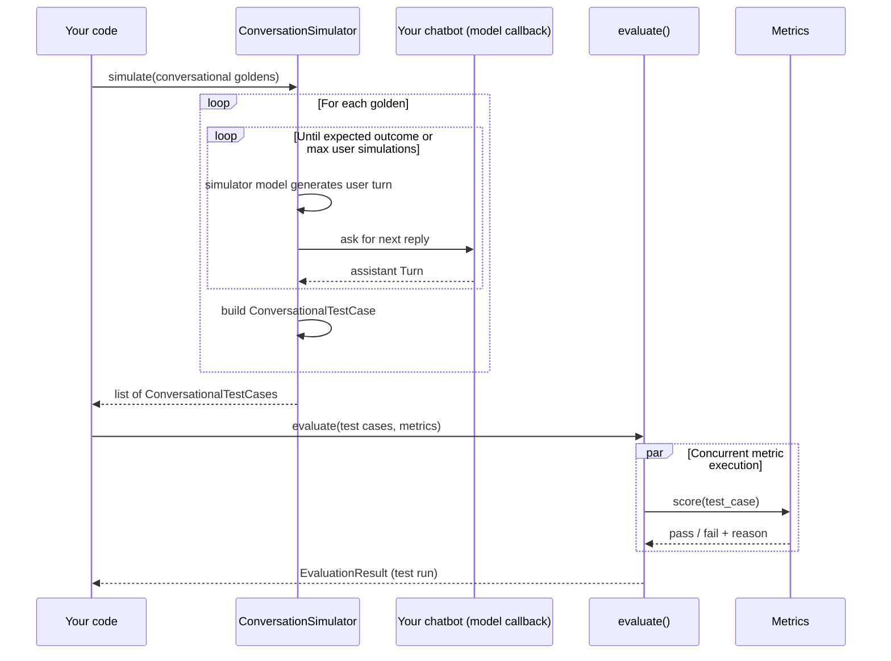

多轮端到端评估为**整段对话**打分，而不是单次交换。每个测试用例是一个 [`ConversationalTestCase`](/docs/evaluation-multiturn-test-cases)，每个金标是一个描述_场景_、_预期结果_与_用户是谁_的 [`ConversationalGolden`](/docs/evaluation-datasets#what-are-goldens)。

如果还没读过，请先阅读[端到端概览](/docs/evaluation-end-to-end-llm-evals)了解概念，以及多轮与单轮的对比。

<Note>
与[单轮端到端评估](/docs/evaluation-end-to-end-single-turn)不同，多轮目前还不支持追踪。
</Note>

## 多轮端到端评估如何运作

一次多轮测试运行分两个阶段构建：**模拟**（合成用户 vs 你的聊天机器人）与**评估**（把指标应用于产生的对话）。

1. 你把聊天机器人包装进一个返回下一条助手 `Turn` 的 `model_callback`。
2. 你构建一个 `ConversationalGolden` 数据集——每个金标描述模拟用户的场景、预期结果与人设。
3. 你把金标 + 回调交给 [`ConversationSimulator`](/docs/conversation-simulator)。它让合成用户与你的聊天机器人对话，直到场景演绎完毕，每个金标产出一个 `ConversationalTestCase`。
4. 你把测试用例 + 多轮指标传给 `evaluate()`，它会为它们打分并把结果汇总为一次测试运行。



## 分步指南

<Steps>
<Step>

### 把聊天机器人包装进回调

`ConversationSimulator` 需要一种方式，在给定目前对话的情况下向你的聊天机器人询问下一条回复。你通过 `model_callback` 提供它。

它可以是普通函数或 `async` 函数；模拟器会检测并相应地派发。下面的示例使用 `async def`，因为大多数现代聊天客户端都是异步的，但普通 `def` 同样可行：

<Tabs>

<Tab title="Python">

<Tabs>
<Tab title="Python">

```python title="main.py" showLineNumbers={true}
from typing import List
from deepeval.test_case import Turn

async def model_callback(input: str, turns: List[Turn], thread_id: str) -> Turn:
    response = await your_chatbot(input, turns, thread_id)
    return Turn(role="assistant", content=response)
```

</Tab>
<Tab title="OpenAI">

```python title="main.py" showLineNumbers={true} {6}
from typing import List
from deepeval.test_case import Turn
from openai import OpenAI

client = OpenAI()

async def model_callback(input: str, turns: List[Turn]) -> Turn:
    messages = [
        {"role": "system", "content": "You are a ticket purchasing assistant"},
        *[{"role": t.role, "content": t.content} for t in turns],
        {"role": "user", "content": input},
    ]
    response = await client.chat.completions.create(model="gpt-4.1", messages=messages)
    return Turn(role="assistant", content=response.choices[0].message.content)
```

</Tab>
<Tab title="LangChain">

```python title="main.py" showLineNumbers={true} {10,13}
from langchain.agents import create_agent
from langgraph.checkpoint.memory import InMemorySaver
from deepeval.test_case import Turn

agent = create_agent(
    model="openai:gpt-4o-mini",
    system_prompt="You are a ticket purchasing assistant.",
    checkpointer=InMemorySaver(),
)

async def model_callback(input: str, thread_id: str) -> Turn:
    result = agent.invoke(
        {"messages": [{"role": "user", "content": input}]},
        config={"configurable": {"thread_id": thread_id}},
    )
    return Turn(role="assistant", content=result["messages"][-1].content)
```

</Tab>
<Tab title="LlamaIndex">

```python title="main.py" showLineNumbers={true} {9}
from llama_index.core.storage.chat_store import SimpleChatStore
from llama_index.llms.openai import OpenAI
from llama_index.core.chat_engine import SimpleChatEngine
from llama_index.core.memory import ChatMemoryBuffer
from deepeval.test_case import Turn

chat_store = SimpleChatStore()
llm = OpenAI(model="gpt-4")

async def model_callback(input: str, thread_id: str) -> Turn:
    memory = ChatMemoryBuffer.from_defaults(chat_store=chat_store, chat_store_key=thread_id)
    chat_engine = SimpleChatEngine.from_defaults(llm=llm, memory=memory)
    response = chat_engine.chat(input)
    return Turn(role="assistant", content=response.response)
```

</Tab>
<Tab title="OpenAI Agents">

```python title="main.py" showLineNumbers={true} {6}
from agents import Agent, Runner, SQLiteSession
from deepeval.test_case import Turn

sessions = {}
agent = Agent(name="Test Assistant", instructions="You are a helpful assistant that answers questions concisely.")

async def model_callback(input: str, thread_id: str) -> Turn:
    if thread_id not in sessions:
        sessions[thread_id] = SQLiteSession(thread_id)
    session = sessions[thread_id]
    result = await Runner.run(agent, input, session=session)
    return Turn(role="assistant", content=result.final_output)
```

</Tab>
<Tab title="Pydantic">

```python title="main.py" showLineNumbers={true} {9}
from typing import List
from datetime import datetime
from pydantic_ai import Agent
from pydantic_ai.messages import ModelRequest, ModelResponse, UserPromptPart, TextPart
from deepeval.test_case import Turn

agent = Agent('openai:gpt-4', system_prompt="You are a helpful assistant that answers questions concisely.")

async def model_callback(input: str, turns: List[Turn]) -> Turn:
    message_history = []
    for turn in turns:
        if turn.role == "user":
            message_history.append(ModelRequest(parts=[UserPromptPart(content=turn.content, timestamp=datetime.now())], kind='request'))
        elif turn.role == "assistant":
            message_history.append(ModelResponse(parts=[TextPart(content=turn.content)], model_name='gpt-4', timestamp=datetime.now(), kind='response'))
    result = await agent.run(input, message_history=message_history)
    return Turn(role="assistant", content=result.output)
```

</Tab>
</Tabs>

</Tab>

<Tab title="TypeScript">

<Tabs>
<Tab title="TypeScript">

```typescript title="main.ts" showLineNumbers={true}
import { Turn } from "deepeval/test-case";

export const modelCallback = async ({
  input,
  turns,
  threadId,
}: {
  input: string;
  turns: Turn[];
  threadId: string;
}): Promise<Turn> => {
  const response = await yourChatbot(input, turns, threadId);
  return new Turn({ role: "assistant", content: response });
};
```

</Tab>
<Tab title="OpenAI">

```typescript title="main.ts" showLineNumbers={true} {16}
import OpenAI from "openai";
import { Turn } from "deepeval/test-case";

const client = new OpenAI();

export const modelCallback = async ({
  input,
  turns,
}: {
  input: string;
  turns: Turn[];
}): Promise<Turn> => {
  const messages = [
    { role: "system" as const, content: "You are a ticket purchasing assistant" },
    ...turns.map((t) => ({ role: t.role as "user" | "assistant", content: t.content })),
    { role: "user" as const, content: input },
  ];
  const response = await client.chat.completions.create({ model: "gpt-4.1", messages });
  return new Turn({
    role: "assistant",
    content: response.choices[0].message.content ?? "",
  });
};
```

</Tab>
<Tab title="LangChain">

```typescript title="main.ts" showLineNumbers={true} {18-21}
import { createAgent } from "langchain";
import { MemorySaver } from "@langchain/langgraph";
import { Turn } from "deepeval/test-case";

const agent = createAgent({
  model: "openai:gpt-4o-mini",
  systemPrompt: "You are a ticket purchasing assistant.",
  checkpointer: new MemorySaver(),
});

export const modelCallback = async ({
  input,
  threadId,
}: {
  input: string;
  threadId: string;
}): Promise<Turn> => {
  const result = await agent.invoke(
    { messages: [{ role: "user", content: input }] },
    { configurable: { thread_id: threadId } },
  );
  const last = result.messages[result.messages.length - 1];
  return new Turn({ role: "assistant", content: String(last.content) });
};
```

</Tab>
</Tabs>

</Tab>

</Tabs>

<Tabs>

<Tab title="Python">

<Info>
你的 `model_callback` 应接受一个 `input`（模拟用户的下一条消息），并可选接受 `turns`（目前的对话历史）与 `thread_id`（稳定的会话 ID）。它必须返回一个 `Turn(role="assistant", content=...)`。
</Info>

</Tab>

<Tab title="TypeScript">

<Info>
你的 `modelCallback` 接收一个对象，包含 `input`（模拟用户的下一条消息）、`turns`（目前的对话历史）与 `threadId`（稳定的会话 ID）。只解构你需要的即可。它必须最终返回一个 `role: "assistant"` 的 `Turn`。
</Info>

</Tab>

</Tabs>

完整的回调契约（包括自定义参数注入）见 [Conversation Simulator → Model Callback](/docs/conversation-simulator-model-callback)。

</Step>

<Step>

### 构建数据集

`ConversationalGolden` 描述模拟用户所处的情境、成功是什么样子、以及他们是谁。把一组金标包进 `EvaluationDataset`，模拟器就可以遍历。金标在哪里，就选哪个来源：

<Tabs>
<Tab title="在代码中">

<Tabs>

<Tab title="Python">

```python
from deepeval.dataset import ConversationalGolden, EvaluationDataset, Persona

goldens = [
    ConversationalGolden(
        scenario="Andy Byron wants to purchase a VIP ticket to a Coldplay concert.",
        expected_outcome="Successful purchase of a ticket.",
        persona=Persona(characteristics="Andy Byron is the CEO of Astronomer."),
    ),
    # ...
]

dataset = EvaluationDataset(goldens=goldens)
```

</Tab>

<Tab title="TypeScript">

```typescript
import {
  ConversationalGolden,
  EvaluationDataset,
  Persona,
} from "deepeval/dataset";

const goldens = [
  new ConversationalGolden({
    scenario:
      "Andy Byron wants to purchase a VIP ticket to a Coldplay concert.",
    expectedOutcome: "Successful purchase of a ticket.",
    persona: new Persona({
      characteristics: "Andy Byron is the CEO of Astronomer.",
    }),
  }),
  // ...
];

const dataset = new EvaluationDataset({ goldens });
```

</Tab>

</Tabs>

多轮金标描述的是待模拟的场景，而不是预先写好的轮次。

</Tab>
<Tab title="从 Confident AI 拉取">

你可以用一行代码把整个数据集从 Confident AI 的云端加载。

<Tabs>

<Tab title="Python">

```python
from deepeval.dataset import EvaluationDataset

dataset = EvaluationDataset()
dataset.pull(alias="My Multi-Turn Dataset")
```

</Tab>

<Tab title="TypeScript">

```typescript
import { EvaluationDataset } from "deepeval/dataset";

const dataset = new EvaluationDataset();
await dataset.pull({ alias: "My Multi-Turn Dataset" });
```

</Tab>

</Tabs>

非技术的领域专家可以在 Confident AI 上**创建、标注与评论**数据集。你还可以用 CSV 格式上传数据集，或用一行代码把在 `deepeval` 中创建的合成数据集推送到 Confident AI。

更多信息请访问 [Confident AI 数据集板块](https://www.confident-ai.com/docs/llm-evaluation/dataset-management/create-goldens)。

</Tab>
<Tab title="从 CSV 加载">

<Tabs>

<Tab title="Python">

```python
from deepeval.dataset import EvaluationDataset

dataset = EvaluationDataset()
dataset.add_goldens_from_csv_file(
    file_path="conversations.csv",
    scenario_col_name="scenario",
    expected_outcome_col_name="expected_outcome",
    user_description_col_name="user_description",
)
```

</Tab>

<Tab title="TypeScript">

```typescript
import { EvaluationDataset } from "deepeval/dataset";

const dataset = new EvaluationDataset();
await dataset.addGoldensFromCSV({ filePath: "conversations.csv" });
```

带 `scenario` 列的行会成为 `ConversationalGolden`，因此当你的列已使用 `deepeval` 的命名时，无需 `keys` 覆盖。

</Tab>

</Tabs>

更多高级选项（例如加载 `turns` 与 `context` 列或重命名所有列）见[加载数据集](/docs/evaluation-datasets#load-dataset)。

</Tab>
<Tab title="从 JSON 加载">

<Tabs>

<Tab title="Python">

```python
from deepeval.dataset import EvaluationDataset

dataset = EvaluationDataset()
dataset.add_goldens_from_json_file(
    file_path="conversations.json",
    scenario_key_name="scenario",
    expected_outcome_key_name="expected_outcome",
    persona_key_name="persona",
)
```

</Tab>

<Tab title="TypeScript">

```typescript
import { EvaluationDataset } from "deepeval/dataset";

const dataset = new EvaluationDataset();
await dataset.addGoldensFromJSON({ filePath: "conversations.json" });
```

</Tab>

</Tabs>

更多高级选项（例如加载 `turns` 与 `context` 键，或从 `.jsonl` 文件逐行读取金标）见[加载数据集](/docs/evaluation-datasets#load-dataset)。

</Tab>
</Tabs>

<Note>
一个 `EvaluationDataset` 只容纳单轮或多轮金标中的一种，不能混用。混有两种的文件会抛出错误。
</Note>

<Tip>
本页只介绍为评估运行**获取**金标。要**持久化**数据集（推送到 Confident AI、保存为 CSV/JSON、跨运行做版本管理），完整的存储与生命周期说明见[数据集页面](/docs/evaluation-datasets)。
</Tip>

</Step>

<Step>

### 模拟轮次

把金标与回调交给 `ConversationSimulator`，产出一组 `ConversationalTestCase`：

<Tabs>

<Tab title="Python">

```python title="main.py"
from deepeval.simulator import ConversationSimulator

simulator = ConversationSimulator(model_callback=model_callback)
conversational_test_cases = simulator.simulate(
    conversational_goldens=dataset.goldens,
    max_user_simulations=10,
)
```

</Tab>

<Tab title="TypeScript">

```typescript title="main.ts"
import { ConversationSimulator } from "deepeval";
import { ConversationalGolden } from "deepeval/dataset";

const simulator = new ConversationSimulator({ modelCallback });
const conversationalTestCases = await simulator.simulate({
  conversationalGoldens: dataset.goldens as ConversationalGolden[],
  maxUserSimulations: 10,
});
```

</Tab>

</Tabs>

模拟器还暴露了此处未能尽述的配置——完整能力见[停止逻辑](/docs/conversation-simulator-stopping-logic)、[自定义模板](/docs/conversation-simulator-custom-templates)与[生命周期钩子](/docs/conversation-simulator-lifecycle-hooks)。

<details>
<summary>点击查看一个模拟出的测试用例示例</summary>

模拟器会把金标中的 `scenario` 与 `expected_outcome` 带过来，并填充 `turns`：

<Tabs>

<Tab title="Python">

```python
ConversationalTestCase(
    scenario="Andy Byron wants to purchase a VIP ticket to a Coldplay concert.",
    expected_outcome="Successful purchase of a ticket.",
    turns=[
        Turn(role="user", content="Hi, I'd like to buy a VIP ticket for the Coldplay show."),
        Turn(role="assistant", content="Sure — which date and city are you looking for?"),
        Turn(role="user", content="The November 12 show in NYC."),
        Turn(role="assistant", content="Got it. That'll be $850. Shall I proceed?"),
        # ...
    ],
)
```

</Tab>

<Tab title="TypeScript">

```typescript
new ConversationalTestCase({
  scenario: "Andy Byron wants to purchase a VIP ticket to a Coldplay concert.",
  expectedOutcome: "Successful purchase of a ticket.",
  turns: [
    new Turn({ role: "user", content: "Hi, I'd like to buy a VIP ticket for the Coldplay show." }),
    new Turn({ role: "assistant", content: "Sure — which date and city are you looking for?" }),
    new Turn({ role: "user", content: "The November 12 show in NYC." }),
    new Turn({ role: "assistant", content: "Got it. That'll be $850. Shall I proceed?" }),
  ],
});
```

</Tab>

</Tabs>

</details>

</Step>

<Step>
### 运行 `evaluate()`

把模拟出的测试用例与你的多轮指标传给 `evaluate()`：

<Tabs>

<Tab title="Python">

<Tabs>
<Tab title="Async">

默认。指标跨对话并发派发，跑得最快。

```python title="main.py"
from deepeval import evaluate
from deepeval.metrics import TurnRelevancyMetric

evaluate(
    test_cases=conversational_test_cases,
    metrics=[TurnRelevancyMetric()],
)
```

</Tab>
<Tab title="Sync">

传入 `AsyncConfig(run_async=False)` 逐个对话打分。适合调试、受速率限制的提供商，或任何 asyncio 妨碍你的场景（例如某些 Jupyter 设置）。

```python title="main.py"
from deepeval import evaluate
from deepeval.evaluate import AsyncConfig
from deepeval.metrics import TurnRelevancyMetric

evaluate(
    test_cases=conversational_test_cases,
    metrics=[TurnRelevancyMetric()],
    async_config=AsyncConfig(run_async=False),
)
```

</Tab>
</Tabs>

为多轮端到端评估调用 `evaluate()` 时，有**两个**必填参数和**五个**可选参数：

- `test_cases`：`ConversationalTestCase` 列表（或一个 `EvaluationDataset`）。同一次测试运行中不能混用 `LLMTestCase` 与 `ConversationalTestCase`。
- `metrics`：类型为 `BaseConversationalMetric` 的指标列表。完整列表见[多轮指标](/docs/metrics-introduction#multi-turn-metrics)（例如 `TurnRelevancyMetric`、`KnowledgeRetentionMetric`、`RoleAdherenceMetric`、`ConversationCompletenessMetric`）。
- [可选] `identifier`：本次测试运行的字符串标签。
- [可选] `async_config`：控制并发度的 `AsyncConfig`。见[异步配置](/docs/evaluation-flags-and-configs#async-configs)。
- [可选] `display_config`：控制控制台输出的 `DisplayConfig`。见[显示配置](/docs/evaluation-flags-and-configs#display-configs)。
- [可选] `error_config`：控制错误处理的 `ErrorConfig`。见[错误配置](/docs/evaluation-flags-and-configs#error-configs)。
- [可选] `cache_config`：控制缓存的 `CacheConfig`。见[缓存配置](/docs/evaluation-flags-and-configs#cache-configs)。

</Tab>

<Tab title="TypeScript">

指标跨对话并发派发，因此 `evaluate()` 总是需要 await。

```typescript title="main.ts"
import { evaluate } from "deepeval";
import { TurnRelevancyMetric } from "deepeval/metrics";

await evaluate(conversationalTestCases, [new TurnRelevancyMetric()]);
```

为多轮端到端评估调用 `evaluate()` 时，有**两个**必填参数和**五个**可选参数。两个必填参数按位置传入；可选参数放在第三个选项对象中：

- `testCases`：`ConversationalTestCase` 数组。同一次测试运行中不能混用 `LLMTestCase` 与 `ConversationalTestCase`。
- `metrics`：类型为 `BaseConversationalMetric` 的指标数组。完整列表见[多轮指标](/docs/metrics-introduction#multi-turn-metrics)（例如 `TurnRelevancyMetric`、`KnowledgeRetentionMetric`、`RoleAdherenceMetric`、`ConversationCompletenessMetric`）。
- [可选] `identifier`：本次测试运行的字符串标签。
- [可选] `hyperparameters`：产出这些输出的模型、提示词与设置。见[超参数](#hyperparameters)。
- [可选] `displayConfig`：控制控制台输出的 `DisplayConfig`。见[显示配置](/docs/evaluation-flags-and-configs#display-configs)。
- [可选] `errorConfig`：控制错误处理的 `ErrorConfig`。见[错误配置](/docs/evaluation-flags-and-configs#error-configs)。
- [可选] `cacheConfig`：控制缓存的 `CacheConfig`。见[缓存配置](/docs/evaluation-flags-and-configs#cache-configs)。

</Tab>

</Tabs>

</Step>
</Steps>

<Tabs>

<Tab title="Python">

注意**模拟**与**评估**有各自独立的并发控制——`ConversationSimulator(max_concurrent=...)` 决定并行模拟多少段对话；`AsyncConfig` 只影响这些完成的对话如何被打分。

</Tab>

<Tab title="TypeScript">

注意**模拟**与**评估**是独立的两个阶段：模拟器并发运行每个金标并在所有对话完成后返回，然后才对完成的对话打分。

</Tab>

</Tabs>

我们强烈建议为你的 `deepeval` 评估配置 [Confident AI](https://app.confident-ai.com)，以获得专业的测试报告并观察应用表现随时间的变化：

<figure>
  <video controls src="https://confident-docs.s3.us-east-1.amazonaws.com/evaluation:multi-turn-e2e-report.mp4"></video>
  <figcaption>查看完整对话及其指标分数与原因。</figcaption>
</figure>

## 超参数

把模型、提示词与其他配置值随每次测试运行一起记录，这样你可以在 Confident AI 上并排比较运行，找出最佳组合。值必须是 `str | int | float` 或 [`Prompt`](/docs/evaluation-prompts)。直接传给 `evaluate()`：

<Tabs>

<Tab title="Python">

```python
evaluate(
    test_cases=conversational_test_cases,
    metrics=[TurnRelevancyMetric()],
    hyperparameters={"model": "gpt-4.1", "system_prompt": "Be concise."},
)
```

</Tab>

<Tab title="TypeScript">

```typescript
await evaluate(conversationalTestCases, [new TurnRelevancyMetric()], {
  hyperparameters: { model: "gpt-4.1", systemPrompt: "Be concise." },
});
```

</Tab>

</Tabs>

在 Confident AI 上，记录的值会成为可过滤的维度，用于比较测试运行并找出表现最好的配置。

## 在 CI/CD 中

To run multi-turn end-to-end evaluations on every PR, simulate conversations once at module load, then assert on each one inside a `pytest`（TypeScript 中为 `vitest`） test:

<Tabs>

<Tab title="Python">

```python title="test_chatbot.py"
import pytest
from deepeval import assert_test
from deepeval.test_case import ConversationalTestCase
from deepeval.metrics import TurnRelevancyMetric
from deepeval.simulator import ConversationSimulator
from your_app import model_callback

simulator = ConversationSimulator(model_callback=model_callback)
test_cases = simulator.simulate(
    conversational_goldens=dataset.goldens,
    max_user_simulations=10,
)

@pytest.mark.parametrize("test_case", test_cases)
def test_chatbot(test_case: ConversationalTestCase):
    assert_test(test_case=test_case, metrics=[TurnRelevancyMetric()])
```

```bash
deepeval test run test_chatbot.py
```

</Tab>

<Tab title="TypeScript">

```typescript title="chatbot.test.ts"
import { it, expect } from "vitest";
import { ConversationalGolden } from "deepeval/dataset";
import { TurnRelevancyMetric } from "deepeval/metrics";
import { ConversationSimulator } from "deepeval";
import { modelCallback } from "./your-app";
import "deepeval/vitest";

const simulator = new ConversationSimulator({ modelCallback });
const testCases = await simulator.simulate({
  conversationalGoldens: dataset.goldens as ConversationalGolden[],
  maxUserSimulations: 10,
});

it.each(testCases)(
  "stays relevant across the conversation #%$",
  async (testCase) => {
    await expect(testCase).toPass([new TurnRelevancyMetric()]);
  },
);
```

```bash
npx deepeval test run chatbot.test.ts
```

</Tab>

</Tabs>

断言参数、YAML 流水线示例与 `deepeval test run` 开关见 [CI/CD 中的单元测试](/docs/evaluation-unit-testing-in-ci-cd)。

## FAQs

<AccordionGroup>
<Accordion title="What is multi-turn end-to-end evaluation?">
它评估用户与你的聊天机器人/助手之间的整段对话，把一来一回作为整体打分，而不是为单条回复打分。对任何上下文跨越多个轮次的应用，这都是正确的方式。
</Accordion>
<Accordion title="Why do I need to wrap my chatbot in a callback?">
模型回调告诉 `deepeval` 在给定目前对话的情况下如何调用你的聊天机器人获取下一轮。这让[对话模拟器](/docs/conversation-simulator)能够自动驱动真实的多轮对话。
</Accordion>
<Accordion title="Do I have to script every conversation by hand?">
不需要。你定义带场景与用户人设的 `ConversationalGolden`，然后让 `ConversationSimulator.simulate()` 生成轮次，上限是你设定的模拟用户轮次数。
</Accordion>
<Accordion title="Is there component-level evaluation for multi-turn apps?">
不支持。组件级评估只适用于单轮场景。多轮应用是在完整对话上做端到端评估的。
</Accordion>
<Accordion title="How do I run multi-turn evals in CI/CD?">
在模块加载时模拟一次对话，然后在你的测试运行器的测试内对每个 `ConversationalTestCase` 做断言，并用 `deepeval test run` 运行。
</Accordion>
<Accordion title="Can my team review long conversations on the cloud in a shared UI?">
多轮运行在本地可用，但在终端里阅读冗长的转写非常痛苦。登录 [Confident AI](https://www.confident-ai.com)（`deepeval` 团队的平台）后，同一次运行会产生云端测试报告，你的团队可以在其中阅读每段对话、查看逐轮分数并追踪趋势——可选，且无需改代码。
</Accordion>
</AccordionGroup>
