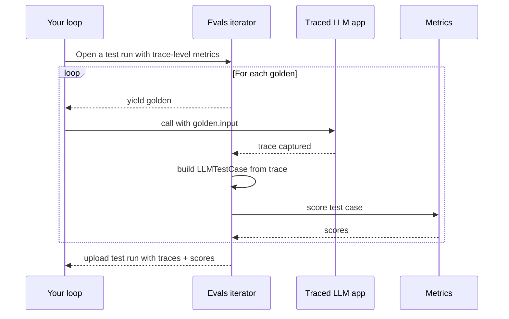
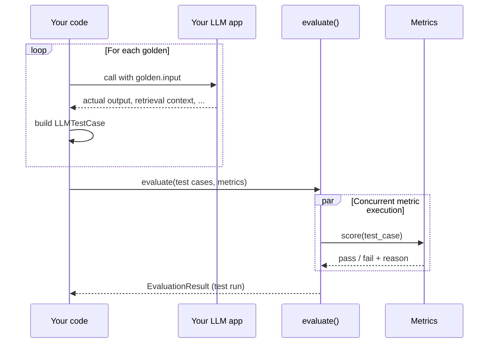

单轮端到端测试为每次 LLM 交互评**分一个输入 → 一个输出**，捕获为 [`LLMTestCase`](/docs/evaluation-test-cases#llm-test-cases)。对任何「扁平」形态的 LLM 应用——当作黑盒的智能体、RAG / 问答、摘要、分类器、写作助手等——这都是合适的分支。

如果还没读过，请先阅读[端到端概览](/docs/evaluation-end-to-end-llm-evals)了解概念，以及单轮与多轮的对比。

运行单轮端到端测试有两种方式：

| Approach                                                                                                                    | When to choose it                                                                                                                                                                             |
| ----------------------------------------------------------------------------------------------------------------------------- | --------------------------------------------------------------------------------------------------------------------------------------------------------------------------------------------- |
| **`dataset.evals_iterator()` 带追踪** **—— 推荐**                        | 你的应用已经（或可以）用[追踪](/docs/evaluation-llm-tracing)埋点。测试用例从追踪自动构建，你在 Confident AI 上免费获得每个测试用例的追踪。 |
| **`evaluate()`**                                                                                                            | 你无法（或不想）为应用埋点——例如评估已部署系统的 QA 工程师。你预先构建 `LLMTestCase` 并交给 `evaluate()`。                          |

对你自己的项目，优先用迭代器——代码量相同，还附带追踪，以及通往[组件级评估](/docs/evaluation-component-level-llm-evals)的清晰升级路径。

## 方式一：`evals_iterator()` 带追踪（推荐）

`evals_iterator()` 打开一次测试运行，逐个产出金标，从捕获的追踪构建 `LLMTestCase`，为你的指标打分，并把追踪与分数一起上传——全部在一个循环内完成。

<Warning>

**拿不到应用的代码？**

这种方式需要用 `@observe`（TypeScript 中为 `observe()`）或框架集成为应用做埋点。如果你改不了应用——例如你在测试别人的 API——直接跳到**[方式二：`evaluate()`](#approach-2-evaluate)**。
</Warning>



<Steps>
<Step>

### 构建数据集

`deepeval` 中的[数据集](/docs/evaluation-datasets)存储 [`Golden`](/docs/evaluation-datasets#what-are-goldens)——测试用例的前身。评估时你遍历金标，在每个金标上运行你做了追踪的 LLM 应用，`deepeval` 会从产生的追踪构建 `LLMTestCase`。

<Tabs>
<Tab title="在代码中">

<Tabs>

<Tab title="Python">

```python
from deepeval.dataset import Golden, EvaluationDataset

goldens = [
    Golden(input="What is your name?"),
    Golden(input="Choose a number between 1 and 100"),
    # ...
]

dataset = EvaluationDataset(goldens=goldens)
```

</Tab>

<Tab title="TypeScript">

```typescript
import { EvaluationDataset, Golden } from "deepeval/dataset";

const goldens = [
  new Golden({ input: "What is your name?" }),
  new Golden({ input: "Choose a number between 1 and 100" }),
  // ...
];

const dataset = new EvaluationDataset({ goldens });
```

</Tab>

</Tabs>

数据集只在本次运行中存在——不推送、不保存。适合快速上手与一次性评估。

</Tab>
<Tab title="从 Confident AI 拉取">

你可以用一行代码把整个数据集从 Confident AI 的云端加载。

<Tabs>

<Tab title="Python">

```python
from deepeval.dataset import EvaluationDataset

dataset = EvaluationDataset()
dataset.pull(alias="My Evals Dataset")
```

</Tab>

<Tab title="TypeScript">

```typescript
import { EvaluationDataset } from "deepeval/dataset";

const dataset = new EvaluationDataset();
await dataset.pull({ alias: "My Evals Dataset" });
```

</Tab>

</Tabs>

非技术的领域专家可以在 Confident AI 上**创建、标注与评论**数据集。你还可以用 CSV 格式上传数据集，或用一行代码把在 `deepeval` 中创建的合成数据集推送到 Confident AI。

更多信息请访问 [Confident AI 数据集板块](https://www.confident-ai.com/docs/llm-evaluation/dataset-management/create-goldens)。

</Tab>
<Tab title="从 CSV 加载">

<Tabs>

<Tab title="Python">

```python
from deepeval.dataset import EvaluationDataset

dataset = EvaluationDataset()
dataset.add_goldens_from_csv_file(
    file_path="example.csv",
    input_col_name="query",
)
```

</Tab>

<Tab title="TypeScript">

```typescript
import { EvaluationDataset } from "deepeval/dataset";

const dataset = new EvaluationDataset();
await dataset.addGoldensFromCSV({
  filePath: "example.csv",
  keys: { input: "query" },
});
```

列名默认采用 `deepeval` 自己的命名，因此 `keys` 只需列出不同的那些。

</Tab>

</Tabs>

更多高级选项（例如加载 `context` 与 `tools_called` 列或重命名所有列）见[加载数据集](/docs/evaluation-datasets#load-dataset)。

</Tab>
<Tab title="从 JSON 加载">

<Tabs>

<Tab title="Python">

```python
from deepeval.dataset import EvaluationDataset

dataset = EvaluationDataset()
dataset.add_goldens_from_json_file(
    file_path="example.json",
    input_key_name="query",
)
```

</Tab>

<Tab title="TypeScript">

```typescript
import { EvaluationDataset } from "deepeval/dataset";

const dataset = new EvaluationDataset();
await dataset.addGoldensFromJSON({
  filePath: "example.json",
  keys: { input: "query" },
});
```

</Tab>

</Tabs>

更多高级选项（例如加载 `context` 与 `tools_called` 键，或从 `.jsonl` 文件逐行读取金标）见[加载数据集](/docs/evaluation-datasets#load-dataset)。

</Tab>
</Tabs>

<Note>
一个 `EvaluationDataset` 只容纳单轮或多轮金标中的一种，不能混用。混有两种的文件会抛出错误。
</Note>

<Tip>
本页只介绍为评估运行**获取**金标。要**持久化**数据集（推送到 Confident AI、保存为 CSV/JSON、跨运行做版本管理），见[数据集页面](/docs/evaluation-datasets)。
</Tip>

</Step>

<Step>

### 埋点/追踪并评估

Instrument your AI agent based on your tech stack, then loop with the iterator, passing `metrics=[...]`（TypeScript 中为 `metrics: [...]`）, to score each captured trace as one end-to-end test case.

每个集成都提供 **Async**（默认——最快）与 **Sync** 变体：

- **Async** 让 `evals_iterator()` 保持默认的异步派发，并把每次调用包在 `asyncio.create_task(...)` + `dataset.evaluate(task)` 中，让金标并发运行。
- **Sync** 传入 `AsyncConfig(run_async=False)`，一次运行一个金标。适合调试、受速率限制的提供商，或任何 asyncio 妨碍你的场景（例如某些 Jupyter 设置）。

<Tabs>

<Tab title="Python">

<Tabs>
<Tab title="手动埋点">

用 `@observe` 包装顶层函数，并调用 `update_current_trace(...)` 设置追踪级测试用例字段：

<Tabs>
<Tab title="Async">

```python title="main.py" showLineNumbers
import asyncio
from deepeval.tracing import observe, update_current_trace
from deepeval.metrics import TaskCompletionMetric
...

@observe()
async def my_ai_agent(query: str) -> str:
    answer = "..."  # await your LLM call here
    update_current_trace(input=query, output=answer)
    return answer

for golden in dataset.evals_iterator(metrics=[TaskCompletionMetric()]):
    task = asyncio.create_task(my_ai_agent(golden.input))
    dataset.evaluate(task)
```

</Tab>
<Tab title="Sync">

```python title="main.py" showLineNumbers
from deepeval.evaluate import AsyncConfig
from deepeval.tracing import observe, update_current_trace
from deepeval.metrics import TaskCompletionMetric
...

@observe()
def my_ai_agent(query: str) -> str:
    answer = "..."  # call your LLM here
    update_current_trace(input=query, output=answer)
    return answer

for golden in dataset.evals_iterator(
    metrics=[TaskCompletionMetric()],
    async_config=AsyncConfig(run_async=False),
):
    my_ai_agent(golden.input)
```

</Tab>
</Tabs>

完整的 `@observe` 与 `update_current_trace` 用法见[追踪](/docs/evaluation-llm-tracing)。

</Tab>
<Tab title="LangChain">

用 `create_agent` 构建你的智能体，然后在循环中把 `deepeval` 的 `CallbackHandler` 传给它的 `invoke` / `ainvoke` 方法：

<Tabs>
<Tab title="Async">

```python title="langchain_app.py" showLineNumbers
import asyncio
from langchain.agents import create_agent
from deepeval.integrations.langchain import CallbackHandler
from deepeval.metrics import TaskCompletionMetric
...

def multiply(a: int, b: int) -> int:
    """Multiply two numbers."""
    return a * b

agent = create_agent(
    model="openai:gpt-4o-mini",
    tools=[multiply],
    system_prompt="Be concise.",
)

async def run_agent(prompt: str):
    return await agent.ainvoke(
        {"messages": [{"role": "user", "content": prompt}]},
        config={"callbacks": [CallbackHandler()]},
    )

for golden in dataset.evals_iterator(metrics=[TaskCompletionMetric()]):
    task = asyncio.create_task(run_agent(golden.input))
    dataset.evaluate(task)
```

</Tab>
<Tab title="Sync">

```python title="langchain_app.py" showLineNumbers
from langchain.agents import create_agent
from deepeval.evaluate import AsyncConfig
from deepeval.integrations.langchain import CallbackHandler
from deepeval.metrics import TaskCompletionMetric
...

def multiply(a: int, b: int) -> int:
    """Multiply two numbers."""
    return a * b

agent = create_agent(
    model="openai:gpt-4o-mini",
    tools=[multiply],
    system_prompt="Be concise.",
)

for golden in dataset.evals_iterator(
    metrics=[TaskCompletionMetric()],
    async_config=AsyncConfig(run_async=False),
):
    agent.invoke(
        {"messages": [{"role": "user", "content": golden.input}]},
        config={"callbacks": [CallbackHandler()]},
    )
```

</Tab>
</Tabs>

完整用法见 [LangChain 集成](/integrations/frameworks/langchain)。

</Tab>
<Tab title="LangGraph">

接好你的 `StateGraph`，然后在循环中把 `deepeval` 的 `CallbackHandler` 传给它的 `invoke` / `ainvoke` 方法：

<Tabs>
<Tab title="Async">

```python title="langgraph_app.py" showLineNumbers
import asyncio
from langchain.chat_models import init_chat_model
from langgraph.graph import StateGraph, MessagesState, START, END
from deepeval.integrations.langchain import CallbackHandler
from deepeval.metrics import TaskCompletionMetric
...

llm = init_chat_model("openai:gpt-4o-mini")

async def chatbot(state: MessagesState):
    return {"messages": [await llm.ainvoke(state["messages"])]}

graph = (
    StateGraph(MessagesState)
    .add_node(chatbot)
    .add_edge(START, "chatbot")
    .add_edge("chatbot", END)
    .compile()
)

async def run_graph(prompt: str):
    return await graph.ainvoke(
        {"messages": [{"role": "user", "content": prompt}]},
        config={"callbacks": [CallbackHandler()]},
    )

for golden in dataset.evals_iterator(metrics=[TaskCompletionMetric()]):
    task = asyncio.create_task(run_graph(golden.input))
    dataset.evaluate(task)
```

</Tab>
<Tab title="Sync">

```python title="langgraph_app.py" showLineNumbers
from langchain.chat_models import init_chat_model
from langgraph.graph import StateGraph, MessagesState, START, END
from deepeval.evaluate import AsyncConfig
from deepeval.integrations.langchain import CallbackHandler
from deepeval.metrics import TaskCompletionMetric
...

llm = init_chat_model("openai:gpt-4o-mini")

def chatbot(state: MessagesState):
    return {"messages": [llm.invoke(state["messages"])]}

graph = (
    StateGraph(MessagesState)
    .add_node(chatbot)
    .add_edge(START, "chatbot")
    .add_edge("chatbot", END)
    .compile()
)

for golden in dataset.evals_iterator(
    metrics=[TaskCompletionMetric()],
    async_config=AsyncConfig(run_async=False),
):
    graph.invoke(
        {"messages": [{"role": "user", "content": golden.input}]},
        config={"callbacks": [CallbackHandler()]},
    )
```

</Tab>
</Tabs>

完整用法见 [LangGraph 集成](/integrations/frameworks/langgraph)。

</Tab>
<Tab title="OpenAI">

把 `from openai import OpenAI` 直接替换为 `from deepeval.openai import OpenAI`（或 `AsyncOpenAI`）。把调用包在 `with trace():` 中，LLM 调用就会成为追踪：

<Tabs>
<Tab title="Async">

```python title="openai_app.py" showLineNumbers
import asyncio
from deepeval.openai import AsyncOpenAI
from deepeval.tracing import trace
from deepeval.metrics import TaskCompletionMetric
...

client = AsyncOpenAI()

async def call_openai(prompt: str):
    with trace():
        return await client.chat.completions.create(
            model="gpt-4o-mini",
            messages=[{"role": "user", "content": prompt}],
        )

for golden in dataset.evals_iterator(metrics=[TaskCompletionMetric()]):
    task = asyncio.create_task(call_openai(golden.input))
    dataset.evaluate(task)
```

</Tab>
<Tab title="Sync">

```python title="openai_app.py" showLineNumbers
from deepeval.openai import OpenAI
from deepeval.tracing import trace
from deepeval.evaluate import AsyncConfig
from deepeval.metrics import TaskCompletionMetric
...

client = OpenAI()

for golden in dataset.evals_iterator(
    metrics=[TaskCompletionMetric()],
    async_config=AsyncConfig(run_async=False),
):
    with trace():
        client.chat.completions.create(
            model="gpt-4o-mini",
            messages=[{"role": "user", "content": golden.input}],
        )
```

</Tab>
</Tabs>

流式与工具调用相关内容见 [OpenAI 集成](/integrations/frameworks/openai)。

</Tab>
<Tab title="Pydantic AI">

把 `DeepEvalInstrumentationSettings()` 传给你 `Agent` 的 `instrument` 关键字参数：

<Tabs>
<Tab title="Async">

```python title="pydanticai_agent.py" showLineNumbers
import asyncio
from pydantic_ai import Agent
from deepeval.integrations.pydantic_ai import DeepEvalInstrumentationSettings
from deepeval.metrics import TaskCompletionMetric
...

agent = Agent(
    "openai:gpt-4.1",
    system_prompt="Be concise.",
    instrument=DeepEvalInstrumentationSettings(),
)

for golden in dataset.evals_iterator(metrics=[TaskCompletionMetric()]):
    task = asyncio.create_task(agent.run(golden.input))
    dataset.evaluate(task)
```

</Tab>
<Tab title="Sync">

```python title="pydanticai_agent.py" showLineNumbers
from pydantic_ai import Agent
from deepeval.evaluate import AsyncConfig
from deepeval.integrations.pydantic_ai import DeepEvalInstrumentationSettings
from deepeval.metrics import TaskCompletionMetric
...

agent = Agent(
    "openai:gpt-4.1",
    system_prompt="Be concise.",
    instrument=DeepEvalInstrumentationSettings(),
)

for golden in dataset.evals_iterator(
    metrics=[TaskCompletionMetric()],
    async_config=AsyncConfig(run_async=False),
):
    agent.run_sync(golden.input)
```

</Tab>
</Tabs>

完整用法见 [Pydantic AI 集成](/integrations/frameworks/pydanticai)。

</Tab>
<Tab title="AgentCore">

在创建智能体之前调用 `instrument_agentcore()`。同一次调用也会对运行在 AgentCore 内的 [Strands](https://strandsagents.com/) 智能体做埋点：

<Tabs>
<Tab title="Async">

```python title="agentcore_agent.py" showLineNumbers
import asyncio
from strands import Agent
from deepeval.integrations.agentcore import instrument_agentcore
from deepeval.metrics import TaskCompletionMetric
...

instrument_agentcore()

agent = Agent(model="amazon.nova-lite-v1:0")

for golden in dataset.evals_iterator(metrics=[TaskCompletionMetric()]):
    task = asyncio.create_task(agent.invoke_async(golden.input))
    dataset.evaluate(task)
```

</Tab>
<Tab title="Sync">

```python title="agentcore_agent.py" showLineNumbers
from strands import Agent
from deepeval.evaluate import AsyncConfig
from deepeval.integrations.agentcore import instrument_agentcore
from deepeval.metrics import TaskCompletionMetric
...

instrument_agentcore()

agent = Agent(model="amazon.nova-lite-v1:0")

for golden in dataset.evals_iterator(
    metrics=[TaskCompletionMetric()],
    async_config=AsyncConfig(run_async=False),
):
    agent(golden.input)
```

</Tab>
</Tabs>

完整用法（包括 `BedrockAgentCoreApp` 入口模式）见 [AgentCore 集成](/integrations/frameworks/agentcore)。

</Tab>
<Tab title="Strands">

在调用你的 Strands 智能体之前调用 `instrument_strands()`（对托管在 AgentCore 上的 Strands，请改用 AgentCore 标签页）：

<Tabs>
<Tab title="Async">

```python title="strands_agent.py" showLineNumbers
import asyncio
from strands import Agent
from strands.models.openai import OpenAIModel
from deepeval.integrations.strands import instrument_strands
from deepeval.metrics import TaskCompletionMetric
...

instrument_strands()

agent = Agent(
    model=OpenAIModel(model_id="gpt-4o-mini"),
    system_prompt="You are a helpful assistant.",
)

for golden in dataset.evals_iterator(metrics=[TaskCompletionMetric()]):
    task = asyncio.create_task(agent.invoke_async(golden.input))
    dataset.evaluate(task)
```

</Tab>
<Tab title="Sync">

```python title="strands_agent.py" showLineNumbers
from strands import Agent
from strands.models.openai import OpenAIModel
from deepeval.evaluate import AsyncConfig
from deepeval.integrations.strands import instrument_strands
from deepeval.metrics import TaskCompletionMetric
...

instrument_strands()

agent = Agent(
    model=OpenAIModel(model_id="gpt-4o-mini"),
    system_prompt="You are a helpful assistant.",
)

for golden in dataset.evals_iterator(
    metrics=[TaskCompletionMetric()],
    async_config=AsyncConfig(run_async=False),
):
    agent(golden.input)
```

</Tab>
</Tabs>

完整用法见 [Strands 集成](/integrations/frameworks/strands)。

</Tab>
<Tab title="Anthropic">

把 `from anthropic import Anthropic` 直接替换为 `from deepeval.anthropic import Anthropic`（或 `AsyncAnthropic`）。把调用包在 `with trace():` 中，LLM 调用就会成为追踪：

<Tabs>
<Tab title="Async">

```python title="anthropic_app.py" showLineNumbers
import asyncio
from deepeval.anthropic import AsyncAnthropic
from deepeval.tracing import trace
from deepeval.metrics import TaskCompletionMetric
...

client = AsyncAnthropic()

async def call_claude(prompt: str):
    with trace():
        return await client.messages.create(
            model="claude-sonnet-4-5",
            max_tokens=1024,
            messages=[{"role": "user", "content": prompt}],
        )

for golden in dataset.evals_iterator(metrics=[TaskCompletionMetric()]):
    task = asyncio.create_task(call_claude(golden.input))
    dataset.evaluate(task)
```

</Tab>
<Tab title="Sync">

```python title="anthropic_app.py" showLineNumbers
from deepeval.anthropic import Anthropic
from deepeval.tracing import trace
from deepeval.evaluate import AsyncConfig
from deepeval.metrics import TaskCompletionMetric
...

client = Anthropic()

for golden in dataset.evals_iterator(
    metrics=[TaskCompletionMetric()],
    async_config=AsyncConfig(run_async=False),
):
    with trace():
        client.messages.create(
            model="claude-sonnet-4-5",
            max_tokens=1024,
            messages=[{"role": "user", "content": golden.input}],
        )
```

</Tab>
</Tabs>

流式与工具使用相关内容见 [Anthropic 集成](/integrations/frameworks/anthropic)。

</Tab>
<Tab title="LlamaIndex">

把 `deepeval` 的事件处理器注册到 LlamaIndex 的 instrumentation 调度器上。`agent.run(...)` 仅支持异步，同步变体使用 `asyncio.run(...)`：

<Tabs>
<Tab title="Async">

```python title="llamaindex_agent.py" showLineNumbers
import asyncio
from llama_index.llms.openai import OpenAI
from llama_index.core.agent import FunctionAgent
import llama_index.core.instrumentation as instrument
from deepeval.integrations.llama_index import instrument_llama_index
from deepeval.metrics import TaskCompletionMetric
...

instrument_llama_index(instrument.get_dispatcher())

def multiply(a: float, b: float) -> float:
    return a * b

agent = FunctionAgent(
    tools=[multiply],
    llm=OpenAI(model="gpt-4o-mini"),
    system_prompt="You are a helpful calculator.",
)

for golden in dataset.evals_iterator(metrics=[TaskCompletionMetric()]):
    task = asyncio.create_task(agent.run(golden.input))
    dataset.evaluate(task)
```

</Tab>
<Tab title="Sync">

```python title="llamaindex_agent.py" showLineNumbers
import asyncio
from llama_index.llms.openai import OpenAI
from llama_index.core.agent import FunctionAgent
import llama_index.core.instrumentation as instrument
from deepeval.evaluate import AsyncConfig
from deepeval.integrations.llama_index import instrument_llama_index
from deepeval.metrics import TaskCompletionMetric
...

instrument_llama_index(instrument.get_dispatcher())

def multiply(a: float, b: float) -> float:
    return a * b

agent = FunctionAgent(
    tools=[multiply],
    llm=OpenAI(model="gpt-4o-mini"),
    system_prompt="You are a helpful calculator.",
)

for golden in dataset.evals_iterator(
    metrics=[TaskCompletionMetric()],
    async_config=AsyncConfig(run_async=False),
):
    asyncio.run(agent.run(golden.input))
```

</Tab>
</Tabs>

完整用法见 [LlamaIndex 集成](/integrations/frameworks/llamaindex)。

</Tab>
<Tab title="OpenAI Agents">

注册一次 `DeepEvalTracingProcessor`，然后用 `deepeval` 的 `Agent` 与 `function_tool` 垫片构建你的智能体：

<Tabs>
<Tab title="Async">

```python title="openai_agents_app.py" showLineNumbers
import asyncio
from agents import Runner, add_trace_processor
from deepeval.openai_agents import Agent, DeepEvalTracingProcessor, function_tool
from deepeval.metrics import TaskCompletionMetric
...

add_trace_processor(DeepEvalTracingProcessor())

@function_tool
def get_weather(city: str) -> str:
    return f"It's always sunny in {city}!"

agent = Agent(
    name="weather_agent",
    instructions="Answer weather questions concisely.",
    tools=[get_weather],
)

for golden in dataset.evals_iterator(metrics=[TaskCompletionMetric()]):
    task = asyncio.create_task(Runner.run(agent, golden.input))
    dataset.evaluate(task)
```

</Tab>
<Tab title="Sync">

```python title="openai_agents_app.py" showLineNumbers
from agents import Runner, add_trace_processor
from deepeval.evaluate import AsyncConfig
from deepeval.openai_agents import Agent, DeepEvalTracingProcessor, function_tool
from deepeval.metrics import TaskCompletionMetric
...

add_trace_processor(DeepEvalTracingProcessor())

@function_tool
def get_weather(city: str) -> str:
    return f"It's always sunny in {city}!"

agent = Agent(
    name="weather_agent",
    instructions="Answer weather questions concisely.",
    tools=[get_weather],
)

for golden in dataset.evals_iterator(
    metrics=[TaskCompletionMetric()],
    async_config=AsyncConfig(run_async=False),
):
    Runner.run_sync(agent, golden.input)
```

</Tab>
</Tabs>

完整用法见 [OpenAI Agents 集成](/integrations/frameworks/openai-agents)。

</Tab>
<Tab title="Google ADK">

在构建 `LlmAgent` 之前调用一次 `instrument_google_adk()`。ADK 的 `runner.run_async(...)` 仅支持异步，同步变体使用 `asyncio.run(...)`：

<Tabs>
<Tab title="Async">

```python title="google_adk_agent.py" showLineNumbers
import asyncio
from google.adk.agents import LlmAgent
from google.adk.runners import InMemoryRunner
from google.genai import types
from deepeval.integrations.google_adk import instrument_google_adk
from deepeval.metrics import TaskCompletionMetric
...

instrument_google_adk()

agent = LlmAgent(model="gemini-2.0-flash", name="assistant", instruction="Be concise.")
runner = InMemoryRunner(agent=agent, app_name="deepeval-quickstart")

async def run_agent(prompt: str) -> str:
    session = await runner.session_service.create_session(
        app_name="deepeval-quickstart", user_id="demo-user",
    )
    message = types.Content(role="user", parts=[types.Part(text=prompt)])
    async for event in runner.run_async(
        user_id="demo-user", session_id=session.id, new_message=message,
    ):
        if event.is_final_response() and event.content:
            return "".join(part.text for part in event.content.parts if getattr(part, "text", None))
    return ""

for golden in dataset.evals_iterator(metrics=[TaskCompletionMetric()]):
    task = asyncio.create_task(run_agent(golden.input))
    dataset.evaluate(task)
```

</Tab>
<Tab title="Sync">

```python title="google_adk_agent.py" showLineNumbers
import asyncio
from google.adk.agents import LlmAgent
from google.adk.runners import InMemoryRunner
from google.genai import types
from deepeval.evaluate import AsyncConfig
from deepeval.integrations.google_adk import instrument_google_adk
from deepeval.metrics import TaskCompletionMetric
...

instrument_google_adk()

agent = LlmAgent(model="gemini-2.0-flash", name="assistant", instruction="Be concise.")
runner = InMemoryRunner(agent=agent, app_name="deepeval-quickstart")

async def run_agent(prompt: str) -> str:
    session = await runner.session_service.create_session(
        app_name="deepeval-quickstart", user_id="demo-user",
    )
    message = types.Content(role="user", parts=[types.Part(text=prompt)])
    async for event in runner.run_async(
        user_id="demo-user", session_id=session.id, new_message=message,
    ):
        if event.is_final_response() and event.content:
            return "".join(part.text for part in event.content.parts if getattr(part, "text", None))
    return ""

for golden in dataset.evals_iterator(
    metrics=[TaskCompletionMetric()],
    async_config=AsyncConfig(run_async=False),
):
    asyncio.run(run_agent(golden.input))
```

</Tab>
</Tabs>

完整用法见 [Google ADK 集成](/integrations/frameworks/google-adk)。

</Tab>
<Tab title="CrewAI">

调用一次 `instrument_crewai()`，然后用 `deepeval` 的 `Crew`、`Agent` 与 `@tool` 垫片构建你的 crew：

<Tabs>
<Tab title="Async">

```python title="crewai_app.py" showLineNumbers
import asyncio
from crewai import Task
from deepeval.integrations.crewai import instrument_crewai, Crew, Agent
from deepeval.metrics import TaskCompletionMetric
...

instrument_crewai()

tutor = Agent(
    role="Math Tutor",
    goal="Answer math questions accurately and concisely.",
    backstory="An experienced tutor who explains simple math clearly.",
)
answer_task = Task(
    description="{question}",
    expected_output="An accurate, concise answer.",
    agent=tutor,
)
crew = Crew(agents=[tutor], tasks=[answer_task])

for golden in dataset.evals_iterator(metrics=[TaskCompletionMetric()]):
    task = asyncio.create_task(crew.kickoff_async({"question": golden.input}))
    dataset.evaluate(task)
```

</Tab>
<Tab title="Sync">

```python title="crewai_app.py" showLineNumbers
from crewai import Task
from deepeval.evaluate import AsyncConfig
from deepeval.integrations.crewai import instrument_crewai, Crew, Agent
from deepeval.metrics import TaskCompletionMetric
...

instrument_crewai()

tutor = Agent(
    role="Math Tutor",
    goal="Answer math questions accurately and concisely.",
    backstory="An experienced tutor who explains simple math clearly.",
)
task = Task(
    description="{question}",
    expected_output="An accurate, concise answer.",
    agent=tutor,
)
crew = Crew(agents=[tutor], tasks=[task])

for golden in dataset.evals_iterator(
    metrics=[TaskCompletionMetric()],
    async_config=AsyncConfig(run_async=False),
):
    crew.kickoff({"question": golden.input})
```

</Tab>
</Tabs>

完整用法见 [CrewAI 集成](/integrations/frameworks/crewai)。

</Tab>
</Tabs>

</Tab>

<Tab title="TypeScript">

`evalsIterator()` 仅支持异步，因此没有同步变体可选——金标被并发评估，由循环等待完成。

<Tabs>
<Tab title="手动埋点">

用 `observe` 包装顶层函数，并调用 `updateCurrentTrace(...)` 设置追踪级测试用例字段：

```typescript title="main.ts" showLineNumbers
import { TaskCompletionMetric } from "deepeval/metrics";
import { observe, updateCurrentTrace } from "deepeval/tracing";
...

const myAiAgent = observe({
  type: "agent",
  fn: async (query: string): Promise<string> => {
    const answer = "..."; // await your LLM call here
    updateCurrentTrace({ input: query, output: answer });
    return answer;
  },
});

for await (const golden of dataset.evalsIterator({
  metrics: [new TaskCompletionMetric()],
})) {
  await myAiAgent((golden as Golden).input);
}
```

完整的 `observe` 与 `updateCurrentTrace` 用法见[追踪](/docs/evaluation-llm-tracing)。

</Tab>
<Tab title="LangChain">

用 `createAgent` 构建你的智能体，然后在循环中把 `deepeval` 的 `DeepEvalCallbackHandler` 传给它的 `invoke` 方法：

```typescript title="langchain-agent.ts" showLineNumbers
import { createAgent } from "langchain";
import { DeepEvalCallbackHandler } from "deepeval/integrations/langchain";
import { TaskCompletionMetric } from "deepeval/metrics";
...

const agent = createAgent({
  model: "openai:gpt-4o-mini",
  tools: [multiply],
  systemPrompt: "Be concise.",
});

const handler = new DeepEvalCallbackHandler({});

for await (const golden of dataset.evalsIterator({
  metrics: [new TaskCompletionMetric()],
})) {
  await agent.invoke(
    { messages: [{ role: "user", content: (golden as Golden).input }] },
    { callbacks: [handler] },
  );
}
```

完整用法见 [LangChain 集成](/integrations/frameworks/langchain)。

</Tab>
<Tab title="Mastra">

在你的 `Mastra` 实例的 `Observability` 配置上注册一个 `DeepEvalExporter`，然后让金标流经该智能体：

```typescript title="mastra-agent.ts" showLineNumbers
import { Observability } from "@mastra/observability";
import { Mastra } from "@mastra/core/mastra";
import { DeepEvalExporter } from "deepeval/integrations/mastra";
import { TaskCompletionMetric } from "deepeval/metrics";
...

const mastra = new Mastra({
  agents: { weatherAgent },
  observability: new Observability({
    configs: {
      deepeval: {
        serviceName: "weather-app",
        exporters: [new DeepEvalExporter()],
      },
    },
  }),
});

for await (const golden of dataset.evalsIterator({
  metrics: [new TaskCompletionMetric()],
})) {
  await mastra.getAgent("weatherAgent").generate((golden as Golden).input);
}
```

`evalsIterator()` 在打分前会等待 exporter 落定，因此无需在评估内手动 flush。完整用法见 [Mastra 集成](/integrations/frameworks/mastra)。

</Tab>
<Tab title="LangGraph">

接好你的 `StateGraph`，然后在循环中把同一个 `DeepEvalCallbackHandler` 传给它的 `invoke` 方法：

```typescript title="langgraph-agent.ts" showLineNumbers
import { StateGraph, MessagesAnnotation, START, END } from "@langchain/langgraph";
import { DeepEvalCallbackHandler } from "deepeval/integrations/langchain";
import { TaskCompletionMetric } from "deepeval/metrics";
...

const graph = new StateGraph(MessagesAnnotation)
  .addNode("chatbot", chatbot)
  .addEdge(START, "chatbot")
  .addEdge("chatbot", END)
  .compile();

const handler = new DeepEvalCallbackHandler({});

for await (const golden of dataset.evalsIterator({
  metrics: [new TaskCompletionMetric()],
})) {
  await graph.invoke(
    { messages: [{ role: "user", content: (golden as Golden).input }] },
    { callbacks: [handler] },
  );
}
```

完整用法见 [LangGraph 集成](/integrations/frameworks/langgraph)。

</Tab>
<Tab title="OpenAI">

对你已有的 client 调用一次 `instrumentOpenAI(client)`——它发出的每次补全或响应调用都会成为追踪下的一个 LLM span：

```typescript title="openai-app.ts" showLineNumbers
import { OpenAI } from "openai";
import { TaskCompletionMetric } from "deepeval/metrics";
import { instrumentOpenAI } from "deepeval/openai";
...

const client = new OpenAI();
instrumentOpenAI(client);

for await (const golden of dataset.evalsIterator({
  metrics: [new TaskCompletionMetric()],
})) {
  await client.chat.completions.create({
    model: "gpt-4o-mini",
    messages: [{ role: "user", content: (golden as Golden).input }],
  });
}
```

完整用法见 [OpenAI 集成](/integrations/frameworks/openai)。

</Tab>
<Tab title="OpenAI Agents">

向 agents SDK 注册一次 `DeepEvalTracingProcessor`，然后让金标流经该智能体：

```typescript title="openai-agents-app.ts" showLineNumbers
import { Agent, run, addTraceProcessor } from "@openai/agents";
import { DeepEvalTracingProcessor } from "deepeval/integrations/openai-agents";
import { TaskCompletionMetric } from "deepeval/metrics";
...

addTraceProcessor(new DeepEvalTracingProcessor());

const agent = new Agent({
  name: "weatherAgent",
  instructions: "Answer weather questions concisely.",
  model: "gpt-4o-mini",
  tools: [getWeather],
});

for await (const golden of dataset.evalsIterator({
  metrics: [new TaskCompletionMetric()],
})) {
  await run(agent, (golden as Golden).input);
}
```

完整用法见 [OpenAI Agents 集成](/integrations/frameworks/openai-agents)。

</Tab>
<Tab title="Vercel AI SDK">

启动时调用一次 `configureAiSdkTracing(...)`，然后把返回的 tracer 传入每次想追踪的调用的 `experimental_telemetry`：

```typescript title="ai-sdk-agent.ts" showLineNumbers
import { generateText } from "ai";
import { openai } from "@ai-sdk/openai";
import { configureAiSdkTracing } from "deepeval/integrations/ai-sdk";
import { TaskCompletionMetric } from "deepeval/metrics";
...

const tracer = configureAiSdkTracing({ name: "weather-app" });

for await (const golden of dataset.evalsIterator({
  metrics: [new TaskCompletionMetric()],
})) {
  await generateText({
    model: openai("gpt-4o-mini"),
    prompt: (golden as Golden).input,
    experimental_telemetry: { isEnabled: true, tracer },
  });
}
```

没有 `isEnabled` 和 `tracer` 的调用不会产生任何 span。完整用法见 [Vercel AI SDK 集成](/integrations/frameworks/ai-sdk)。

</Tab>
</Tabs>

</Tab>

</Tabs>

<Tabs>

<Tab title="Python">

`evals_iterator()` 上有**六个**可选参数：

- [可选] `metrics`：应用在**追踪**级的 `BaseMetric` 列表——这些就是为整条追踪打分的端到端指标。
- [可选] `identifier`：字符串标签，用于在 Confident AI 上标识本次测试运行。
- [可选] `async_config`：控制并发度的 `AsyncConfig`。见[异步配置](/docs/evaluation-flags-and-configs#async-configs)。
- [可选] `display_config`：控制控制台输出的 `DisplayConfig`。见[显示配置](/docs/evaluation-flags-and-configs#display-configs)。
- [可选] `error_config`：控制错误处理的 `ErrorConfig`。见[错误配置](/docs/evaluation-flags-and-configs#error-configs)。
- [可选] `cache_config`：控制缓存的 `CacheConfig`。见[缓存配置](/docs/evaluation-flags-and-configs#cache-configs)。

</Tab>

<Tab title="TypeScript">

`evalsIterator()` 上有**五个**可选参数，全部通过单个选项对象传入：

- [可选] `metrics`：应用在**追踪**级的 `BaseMetric` 数组——这些就是为整条追踪打分的端到端指标。
- [可选] `identifier`：字符串标签，用于在 Confident AI 上标识本次测试运行。
- [可选] `hyperparameters`：产出这些输出的模型、提示词与设置。见[超参数](#hyperparameters)。
- [可选] `displayConfig`：控制控制台输出的 `DisplayConfig`。见[显示配置](/docs/evaluation-flags-and-configs#display-configs)。
- [可选] `errorConfig`：控制错误处理的 `ErrorConfig`。见[错误配置](/docs/evaluation-flags-and-configs#error-configs)。

`evalsIterator()` 是异步生成器，因此总是并发运行——没有同步变体，也没有需要配置的 `asyncConfig`。

</Tab>

</Tabs>

迭代器的每次运行都会快照到磁盘，因此运行 `deepeval inspect` 即可在追踪树 TUI 中查看。完整细节见 [inspect 参考](/docs/command-line-interface#inspect)。

要为**单个组件**（检索器、一次工具调用、一次内部 LLM 调用）打分——而不是（或除了）整条追踪——见[组件级评估](/docs/evaluation-component-level-llm-evals)。

</Step>
</Steps>

如果你通过 `deepeval login` 登录了 Confident AI，还可以在平台的测试报告中存储、分享、查看并标注完整追踪：

<figure>
  <video controls src="https://confident-docs.s3.us-east-1.amazonaws.com/evaluation:single-turn-e2e-report-tracing.mp4"></video>
  <figcaption>深入查看每个测试用例的分数、原因，以及其背后的追踪。</figcaption>
</figure>

## 方式二：`evaluate()`

当你无法（或不想）为应用埋点时使用——例如 QA 工程师测试已部署的系统，或一次性的快速评估，加追踪太隆重了。你用已收集的输入与输出预先构建 `LLMTestCase` 列表，挑选指标，调用 `evaluate()`。

**工作方式：**

1. 你自己遍历金标并调用你的 LLM 应用，构建 `LLMTestCase` 列表。
2. 你把测试用例与指标在单次调用中交给 `evaluate()`。
3. `deepeval` 对每个测试用例运行每个指标（默认并发），并把结果汇总为一次测试运行。



你的 LLM 应用与 `deepeval` 完全解耦——`evaluate()` 只看到你传给它的数据。这也是这种方式不依赖追踪的原因。

<Warning>

**不要在金标上预填实际输出**

由于 `evaluate()` 只读取你传入的内容，没有什么能阻止你完全跳过应用调用，使用 `actual_output` 已经填好的数据集（例如上周收集的输出）。**我们不推荐这样做**——测试运行应反映你 LLM 应用_当前_的版本，因此你应当在循环内对每个金标重新运行应用。把金标当作纯输入；让实际输出在每次运行时新鲜产生。
</Warning>

<Steps>
<Step>
### 构建数据集

与[方式一](#approach-1-evals_iterator-with-tracing-recommended)相同——把你的金标包进 `EvaluationDataset`。金标在哪里，就选哪个来源：

<Tabs>
<Tab title="在代码中">

<Tabs>

<Tab title="Python">

```python
from deepeval.dataset import Golden, EvaluationDataset

goldens = [
    Golden(input="What is your name?"),
    Golden(input="Choose a number between 1 and 100"),
    # ...
]

dataset = EvaluationDataset(goldens=goldens)
```

</Tab>

<Tab title="TypeScript">

```typescript
import { EvaluationDataset, Golden } from "deepeval/dataset";

const goldens = [
  new Golden({ input: "What is your name?" }),
  new Golden({ input: "Choose a number between 1 and 100" }),
  // ...
];

const dataset = new EvaluationDataset({ goldens });
```

</Tab>

</Tabs>

数据集只在本次运行中存在——不推送、不保存。适合快速上手与一次性评估。

</Tab>
<Tab title="从 Confident AI 拉取">

你可以用一行代码把整个数据集从 Confident AI 的云端加载。

<Tabs>

<Tab title="Python">

```python
from deepeval.dataset import EvaluationDataset

dataset = EvaluationDataset()
dataset.pull(alias="My Evals Dataset")
```

</Tab>

<Tab title="TypeScript">

```typescript
import { EvaluationDataset } from "deepeval/dataset";

const dataset = new EvaluationDataset();
await dataset.pull({ alias: "My Evals Dataset" });
```

</Tab>

</Tabs>

非技术的领域专家可以在 Confident AI 上**创建、标注与评论**数据集。你还可以用 CSV 格式上传数据集，或用一行代码把在 `deepeval` 中创建的合成数据集推送到 Confident AI。

更多信息请访问 [Confident AI 数据集板块](https://www.confident-ai.com/docs/llm-evaluation/dataset-management/create-goldens)。

</Tab>
<Tab title="从 CSV 加载">

<Tabs>

<Tab title="Python">

```python
from deepeval.dataset import EvaluationDataset

dataset = EvaluationDataset()
dataset.add_goldens_from_csv_file(
    file_path="example.csv",
    input_col_name="query",
)
```

</Tab>

<Tab title="TypeScript">

```typescript
import { EvaluationDataset } from "deepeval/dataset";

const dataset = new EvaluationDataset();
await dataset.addGoldensFromCSV({
  filePath: "example.csv",
  keys: { input: "query" },
});
```

列名默认采用 `deepeval` 自己的命名，因此 `keys` 只需列出不同的那些。

</Tab>

</Tabs>

更多高级选项（例如加载 `context` 与 `tools_called` 列或重命名所有列）见[加载数据集](/docs/evaluation-datasets#load-dataset)。

</Tab>
<Tab title="从 JSON 加载">

<Tabs>

<Tab title="Python">

```python
from deepeval.dataset import EvaluationDataset

dataset = EvaluationDataset()
dataset.add_goldens_from_json_file(
    file_path="example.json",
    input_key_name="query",
)
```

</Tab>

<Tab title="TypeScript">

```typescript
import { EvaluationDataset } from "deepeval/dataset";

const dataset = new EvaluationDataset();
await dataset.addGoldensFromJSON({
  filePath: "example.json",
  keys: { input: "query" },
});
```

</Tab>

</Tabs>

更多高级选项（例如加载 `context` 与 `tools_called` 键，或从 `.jsonl` 文件逐行读取金标）见[加载数据集](/docs/evaluation-datasets#load-dataset)。

</Tab>
</Tabs>

<Note>
一个 `EvaluationDataset` 只容纳单轮或多轮金标中的一种，不能混用。混有两种的文件会抛出错误。
</Note>

要持久化数据集（推送到 Confident AI、保存为 CSV/JSON、跨运行做版本管理），见[数据集页面](/docs/evaluation-datasets)。

</Step>

<Step>
### 构建测试用例

遍历你的金标，调用你的 LLM 应用，并把每个结果包装进 `LLMTestCase`：

<Tabs>

<Tab title="Python">

```python title="main.py"
from your_app import your_llm_app  # replace with your LLM app
from deepeval.test_case import LLMTestCase
...

for golden in dataset.goldens:
    answer, retrieved_chunks = your_llm_app(golden.input)
    dataset.add_test_case(
        LLMTestCase(
            input=golden.input,
            actual_output=answer,
            retrieval_context=retrieved_chunks,
        )
    )
```

</Tab>

<Tab title="TypeScript">

```typescript title="main.ts"
import { LLMTestCase } from "deepeval/test-case";
import { Golden } from "deepeval/dataset";
import { yourLlmApp } from "./your-app";

for (const golden of dataset.goldens as Golden[]) {
  const { answer, retrievedChunks } = await yourLlmApp(golden.input);
  dataset.addTestCase(
    new LLMTestCase({
      input: golden.input,
      actualOutput: answer,
      retrievalContext: retrievedChunks,
    }),
  );
}
```

</Tab>

</Tabs>

<Info>
你在 `LLMTestCase` 上填充的字段必须与指标所需匹配。例如 `FaithfulnessMetric` 需要 `retrieval_context`。完整参数列表见[测试用例](/docs/evaluation-test-cases#llm-test-cases)。
</Info>

</Step>

<Step>
### 运行 `evaluate()`

现在挑选你想用来为应用打分的指标，把测试用例与指标一起传给 `evaluate()`。

<Tip>

**推荐的指标组合**

保持指标精炼——**每次运行不超过 5 个**，构成为：

- **2–3 个通用指标**，匹配你的应用类型（智能体、RAG、聊天机器人等）
- **1–2 个自定义指标**，针对你关心的具体方面（[`GEval`](/docs/metrics-llm-evals) 或[自定义指标](/docs/metrics-custom)）

50+ 内置指标见[指标板块](/docs/metrics-introduction)，或在 [Discord](https://discord.com/invite/a3K9c8GRGt) 上寻求定制建议。
</Tip>

<Tabs>

<Tab title="Python">

```python title="main.py"
from deepeval import evaluate
from deepeval.metrics import AnswerRelevancyMetric, FaithfulnessMetric
...

evaluate(
    test_cases=test_cases,
    metrics=[AnswerRelevancyMetric(), FaithfulnessMetric()],
)
```

为端到端评估调用 `evaluate()` 时，有**两个**必填参数和**五个**可选参数：

- `test_cases`：`LLMTestCase` **或** `ConversationalTestCase` 的列表，或一个 `EvaluationDataset`。同一次测试运行中不能混用 `LLMTestCase` 与 `ConversationalTestCase`。
- `metrics`：类型为 `BaseMetric` 的指标列表。
- [可选] `identifier`：字符串标签，用于在 Confident AI 上标识本次测试运行。
- [可选] `async_config`：控制并发度的 `AsyncConfig`。见[异步配置](/docs/evaluation-flags-and-configs#async-configs)。
- [可选] `display_config`：控制控制台输出的 `DisplayConfig`。见[显示配置](/docs/evaluation-flags-and-configs#display-configs)。
- [可选] `error_config`：控制错误处理方式的 `ErrorConfig`。见[错误配置](/docs/evaluation-flags-and-configs#error-configs)。
- [可选] `cache_config`：控制缓存行为的 `CacheConfig`。见[缓存配置](/docs/evaluation-flags-and-configs#cache-configs)。

</Tab>

<Tab title="TypeScript">

```typescript title="main.ts"
import { evaluate } from "deepeval";
import { AnswerRelevancyMetric, FaithfulnessMetric } from "deepeval/metrics";

await evaluate(dataset.testCases, [
  new AnswerRelevancyMetric(),
  new FaithfulnessMetric(),
]);
```

为端到端评估调用 `evaluate()` 时，有**两个**必填参数和**五个**可选参数。两个必填参数按位置传入；可选参数放在第三个选项对象中：

- `testCases`：`LLMTestCase` **或** `ConversationalTestCase` 的数组。同一次测试运行中不能混用 `LLMTestCase` 与 `ConversationalTestCase`。
- `metrics`：类型为 `BaseMetric` 的指标数组。
- [可选] `identifier`：字符串标签，用于在 Confident AI 上标识本次测试运行。
- [可选] `hyperparameters`：产出这些输出的模型、提示词与设置。见[超参数](#hyperparameters)。
- [可选] `displayConfig`：控制控制台输出的 `DisplayConfig`。见[显示配置](/docs/evaluation-flags-and-configs#display-configs)。
- [可选] `errorConfig`：控制错误处理方式的 `ErrorConfig`。见[错误配置](/docs/evaluation-flags-and-configs#error-configs)。
- [可选] `cacheConfig`：控制缓存行为的 `CacheConfig`。见[缓存配置](/docs/evaluation-flags-and-configs#cache-configs)。

</Tab>

</Tabs>

这与 `deepeval test run` 使用的断言相同，只是以函数调用的形式暴露。

<Tabs>

<Tab title="Python">

<Info>

**同步 vs 异步指标执行**

默认情况下，`evaluate()` 在底层使用 `asyncio` **并发**运行指标——每个测试用例的每个指标都并行派发，并发上限由 `AsyncConfig.max_concurrent` 控制。改为顺序执行请设置 `run_async=False`：

```python
from deepeval.evaluate import AsyncConfig

evaluate(
    test_cases=test_cases,
    metrics=[AnswerRelevancyMetric()],
    async_config=AsyncConfig(
        run_async=False,     # run metrics one at a time
        max_concurrent=20,   # only used when run_async=True
        throttle_value=0,    # delay (in seconds) between dispatches
    ),
)
```

[TODO: 什么时候该选同步还是异步？权衡、常见坑（如 Jupyter 事件循环、提供商限速）、推荐的默认值]
</Info>

</Tab>

<Tab title="TypeScript">

<Info>

**指标执行始终是并发的**

`evaluate()` 会为每个测试用例并发派发所有指标，并在全部完成后返回，因此必须 await。没有可选的同步模式。
</Info>

</Tab>

</Tabs>

</Step>
</Steps>

## 超参数

把模型、提示词与其他配置值随每次测试运行一起记录，这样你可以在 Confident AI 上并排比较运行，找出最佳组合。值必须是 `str | int | float` 或 [`Prompt`](/docs/evaluation-prompts)：

<Tabs>

<Tab title="Python">

```python
import deepeval
from deepeval.metrics import TaskCompletionMetric

@deepeval.log_hyperparameters
def hyperparameters():
    return {"model": "gpt-4.1", "system_prompt": "Be concise."}

for golden in dataset.evals_iterator(metrics=[TaskCompletionMetric()]):
    my_ai_agent(golden.input)
```

</Tab>

<Tab title="TypeScript">

```typescript
import { TaskCompletionMetric } from "deepeval/metrics";

const iterator = dataset.evalsIterator({
  metrics: [new TaskCompletionMetric()],
  hyperparameters: { model: "gpt-4.1", systemPrompt: "Be concise." },
});

for await (const golden of iterator) {
  await myAiAgent(golden.input);
}
```

</Tab>

</Tabs>

在 Confident AI 上，记录的值会成为可过滤的维度，用于比较测试运行并找出表现最好的模型/提示词配置：

<figure>
  <video controls src="https://confident-docs.s3.us-east-1.amazonaws.com/evaluation:parameter-insights.mp4"></video>
  <figcaption>跨模型与提示词比较指标分数，挑出赢家。</figcaption>
</figure>

## 在 CI/CD 中

To run single-turn end-to-end evaluations on every PR, swap `evaluate()` / the iterator for an assertion inside a `pytest`（TypeScript 中为 `vitest`） test, then run it with `deepeval test run`.

<Tabs>

<Tab title="Python">

<Tabs>
<Tab title="With tracing">

```python title="test_llm_app.py"
import pytest
from deepeval import assert_test
from deepeval.dataset import Golden
from deepeval.metrics import TaskCompletionMetric
from your_app import my_ai_agent  # @observe-instrumented

@pytest.mark.parametrize("golden", dataset.goldens)
def test_llm_app(golden: Golden):
    my_ai_agent(golden.input)
    assert_test(golden=golden, metrics=[TaskCompletionMetric()])
```

</Tab>
<Tab title="Without tracing">

```python title="test_llm_app.py"
import pytest
from deepeval import assert_test
from deepeval.dataset import Golden
from deepeval.test_case import LLMTestCase
from deepeval.metrics import AnswerRelevancyMetric
from your_app import my_ai_agent

@pytest.mark.parametrize("golden", dataset.goldens)
def test_llm_app(golden: Golden):
    output = my_ai_agent(golden.input)
    test_case = LLMTestCase(input=golden.input, actual_output=output)
    assert_test(test_case=test_case, metrics=[AnswerRelevancyMetric()])
```

</Tab>
</Tabs>

```bash
deepeval test run test_llm_app.py
```

</Tab>

<Tab title="TypeScript">

<Tabs>
<Tab title="With tracing">

```typescript title="llm_app.test.ts"
import { it, expect } from "vitest";
import { Golden } from "deepeval/dataset";
import { TaskCompletionMetric } from "deepeval/metrics";
import { myAiAgent } from "./your-app"; // observe()-instrumented
import "deepeval/vitest";

it.each(dataset.goldens as Golden[])(
  "completes the task #%$",
  async (golden) => {
    await myAiAgent(golden.input);
    await expect(golden).toPass([new TaskCompletionMetric()]);
  },
);
```

</Tab>
<Tab title="Without tracing">

```typescript title="llm_app.test.ts"
import { it, expect } from "vitest";
import { Golden } from "deepeval/dataset";
import { AnswerRelevancyMetric } from "deepeval/metrics";
import { LLMTestCase } from "deepeval/test-case";
import { myAiAgent } from "./your-app";
import "deepeval/vitest";

it.each(dataset.goldens as Golden[])(
  "answers the user's question #%$",
  async (golden) => {
    const output = await myAiAgent(golden.input);
    const testCase = new LLMTestCase({
      input: golden.input,
      actualOutput: output,
    });
    await expect(testCase).toPass([new AnswerRelevancyMetric()]);
  },
);
```

</Tab>
</Tabs>

```bash
npx deepeval test run llm_app.test.ts
```

</Tab>

</Tabs>

断言参数、YAML 流水线示例与 `deepeval test run` 开关见 [CI/CD 中的单元测试](/docs/evaluation-unit-testing-in-ci-cd)。

## FAQs

<AccordionGroup>
<Accordion title="What is single-turn end-to-end evaluation?">
它把你的 LLM 应用当黑盒，为一次原子化交互的整体输入与输出打分，而不是为单个内部组件打分。这是入门评估最简单的方式。
</Accordion>
<Accordion title="Should I use the evals iterator with tracing or plain evaluate()?">
推荐使用带追踪的评估迭代器，因为它能捕获丰富的执行数据，之后还能扩展到嵌套组件。如果你只想为一批测试用例打分、不为应用埋点，就用普通 `evaluate()`。
</Accordion>
<Accordion title="Do I need to instrument my app with tracing to run end-to-end evals?">
不需要。你可以直接构建 `LLMTestCase` 并传给 `evaluate()`。追踪是可选的，主要在你以后想升级到组件级评估时才有帮助。
</Accordion>
<Accordion title="Does deepeval integrate with my agent framework?">
可以。被追踪的方式可以配合 LangChain、LangGraph、LlamaIndex、Pydantic AI、CrewAI 等的原生[集成](/integrations)，让你针对已在用的框架运行评估，而不必一切手工埋点。
</Accordion>
<Accordion title="How do I run these same evals in CI/CD?">
把 `evaluate()` 或评估迭代器换成人所使用测试运行器测试内的断言，然后用 `deepeval test run` 运行，失败的指标就会让构建失败。
</Accordion>
<Accordion title="What are hyperparameters used for?">
它们让你随测试运行记录任意设置（如模型名称、提示词模板、temperature），方便你比较哪种配置产出了最好的分数。
</Accordion>
<Accordion title="Can my team keep these test runs on the cloud and review results in a UI?">
End-to-end runs are local-first. When you're logged into [Confident AI](https://www.confident-ai.com) (the platform built by the `deepeval` team), the same run produces a sharable cloud [testing report](https://www.confident-ai.com/docs/llm-evaluation/dashboards/testing-reports) your team can review together, with hyperparameter comparisons and regression tracking over time — no code changes required, and fully optional.
</Accordion>
</AccordionGroup>
