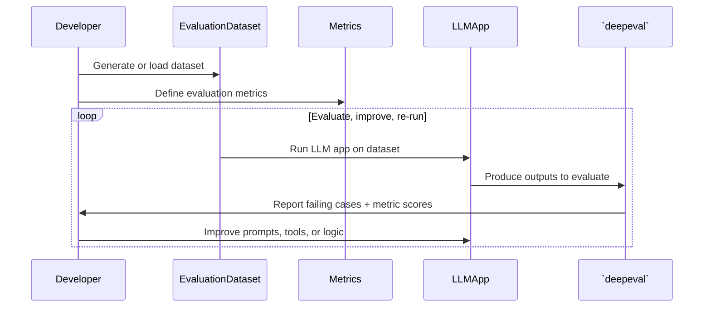

## Quick Summary

评估指的是测试你的 LLM 应用输出的过程，它需要以下组件：

- 测试用例
- 指标
- 评估数据集

下面是使用 `deepeval` 的理想评估工作流示意图：



`deepeval` 中有**两种** LLM 评估：

- [端到端评估](/docs/evaluation-end-to-end-llm-evals)：你的 LLM 系统的整体输入与输出。

- [组件级评估](/docs/evaluation-component-level-llm-evals)：你的 LLM 系统的内部运行细节。

两者都可以在 CI/CD 流水线中用 `deepeval test run` 完成，也可以在脚本中通过 `evaluate()` 函数完成。

<Note>
Your test cases will typically be in a single `test_example.py`（TypeScript 中为 `example.test.ts`） file, and executing them will be as easy as running one command:

<Tabs>

<Tab title="Python">

```bash
deepeval test run test_example.py
```

</Tab>

<Tab title="TypeScript">

```bash
npx deepeval test run example.test.ts
```

</Tab>

</Tabs>

</Note>

## Test Run

运行一次 LLM 评估会创建一个**测试运行（test run）**——一组在特定时间点为你的 LLM 应用做基准测试的测试用例。如果你登录了 Confident AI，还会在云端得到一份完全可分享的 [LLM 测试报告](https://www.confident-ai.com/docs/llm-evaluation/dashboards/testing-reports)。

## Metrics

`deepeval` 提供 30+ 个评估指标，其中大多数通过 LLM 来评估（访问[指标板块](/docs/metrics-introduction#types-of-metrics)了解原因）。

<Tabs>

<Tab title="Python">

```python
from deepeval.metrics import AnswerRelevancyMetric

answer_relevancy_metric = AnswerRelevancyMetric()
```

</Tab>

<Tab title="TypeScript">

```typescript
import { AnswerRelevancyMetric } from "deepeval/metrics";

const answerRelevancyMetric = new AnswerRelevancyMetric();
```

</Tab>

</Tabs>

你需要创建一个测试用例来运行 `deepeval` 的指标。

## Test Cases

在 `deepeval` 中，测试用例表示一次 [LLM 交互](/docs/evaluation-test-cases#what-is-an-llm-interaction)，让你可以用已定义的评估指标对 LLM 应用做单元测试。

<Tabs>

<Tab title="Python">

```python
from deepeval.test_case import LLMTestCase

test_case = LLMTestCase(
  input="Who is the current president of the United States of America?",
  actual_output="Joe Biden",
  retrieval_context=["Joe Biden serves as the current president of America."]
)
```

</Tab>

<Tab title="TypeScript">

```typescript
import { LLMTestCase } from "deepeval/test-case";

const testCase = new LLMTestCase({
  input: "Who is the current president of the United States of America?",
  actualOutput: "Joe Biden",
  retrievalContext: ["Joe Biden serves as the current president of America."],
});
```

</Tab>

</Tabs>

在本例中，`input` 模拟用户与基于 RAG 的 LLM 应用的交互，`actual_output` 是你的 LLM 应用的输出，`retrieval_context` 是 RAG 流水线中检索到的节点。创建测试用例后即可使用 `deepeval` 的默认指标进行评估：

<Tabs>

<Tab title="Python">

```python
from deepeval.test_case import LLMTestCase
from deepeval.metrics import AnswerRelevancyMetric

answer_relevancy_metric = AnswerRelevancyMetric()
test_case = LLMTestCase(
  input="Who is the current president of the United States of America?",
  actual_output="Joe Biden",
  retrieval_context=["Joe Biden serves as the current president of America."]
)

answer_relevancy_metric.measure(test_case)
print(answer_relevancy_metric.score)
```

</Tab>

<Tab title="TypeScript">

```typescript
import { AnswerRelevancyMetric } from "deepeval/metrics";
import { LLMTestCase } from "deepeval/test-case";

const answerRelevancyMetric = new AnswerRelevancyMetric();
const testCase = new LLMTestCase({
  input: "Who is the current president of the United States of America?",
  actualOutput: "Joe Biden",
  retrievalContext: ["Joe Biden serves as the current president of America."],
});

await answerRelevancyMetric.measure(testCase);
console.log(answerRelevancyMetric.score);
```

</Tab>

</Tabs>

只有当每个携带判定结果的指标都成功时，测试用例才**通过**。有两个开关可以控制哪些判定生效：

- **Metrics with `threshold=None`（TypeScript 中为 `threshold: null`）** still compute scores and reasons, but have no pass/fail opinion and never decide a test case's status. Because every test case must end up passing or failing, each evaluation requires at least one non-flaky metric with a `threshold`.
- **Flaky test cases and metrics** (`flaky=True`（TypeScript 中为 `flaky: true`）) have their results recorded and reported as normal, but their failures don't block anything: a flaky metric's failure never fails its test case, and a failing flaky test case makes `assert_test()`（TypeScript 中为 `expect(testCase).toPass()`） print a warning instead of raising.

## Datasets

`deepeval` 中的数据集是金标（golden）的集合。它提供一个集中式接口，让你用一条或多条指标对一组测试用例进行评估。

<Tabs>

<Tab title="Python">

```python
from deepeval.test_case import LLMTestCase
from deepeval.dataset import EvaluationDataset, Golden
from deepeval.metrics import AnswerRelevancyMetric
from deepeval import evaluate

answer_relevancy_metric = AnswerRelevancyMetric()
dataset = EvaluationDataset(goldens=[Golden(input="Who is the current president of the United States of America?")])

for golden in dataset.goldens:
  dataset.add_test_case(
    LLMTestCase(
      input=golden.input,
      actual_output=you_llm_app(golden.input)
    )
  )

evaluate(test_cases=dataset.test_cases, metrics=[answer_relevancy_metric])
```

</Tab>

<Tab title="TypeScript">

```typescript
import { EvaluationDataset, Golden } from "deepeval/dataset";
import { AnswerRelevancyMetric } from "deepeval/metrics";
import { LLMTestCase } from "deepeval/test-case";
import { evaluate } from "deepeval";

const answerRelevancyMetric = new AnswerRelevancyMetric();
const dataset = new EvaluationDataset({
  goldens: [
    new Golden({
      input: "Who is the current president of the United States of America?",
    }),
  ],
});

for (const golden of dataset.goldens as Golden[]) {
  dataset.addTestCase(
    new LLMTestCase({
      input: golden.input,
      actualOutput: await yourLlmApp(golden.input),
    }),
  );
}

await evaluate(dataset.testCases, [answerRelevancyMetric]);
```

</Tab>

</Tabs>

<Note>
你不需要创建评估数据集也能评估单个测试用例。访问[测试用例板块](/docs/evaluation-test-cases#assert-a-test-case)了解如何断言单个测试用例。
</Note>

## Synthesizer

<Tabs>

<Tab title="Python">

在 `deepeval` 中，`Synthesizer` 允许你生成合成数据集。当你没有生产数据、也没有金标数据集可用于评估时，这尤其有用。

```python
from deepeval.synthesizer import Synthesizer
from deepeval.dataset import EvaluationDataset

synthesizer = Synthesizer()
goldens = synthesizer.generate_goldens_from_docs(
  document_paths=['example.txt', 'example.docx', 'example.pdf']
)

dataset = EvaluationDataset(goldens=goldens)
```

<Info>
`deepeval` 的 `Synthesizer` 高度可定制，你可以在[这里](/docs/golden-synthesizer)进一步了解。
</Info>

</Tab>

<Tab title="TypeScript">

<Note>
**501 · TypeScript 暂未实现**

`Synthesizer` 尚未在 TypeScript SDK 中提供，目前可在 Python 中使用，本节内容以 Python 为准。

当你既没有生产数据也没有金标数据集时，它会为你生成合成金标。在该功能落地之前，请用你手工编写的金标构建 `EvaluationDataset`，或[从 Confident AI 拉取一个](/docs/evaluation-datasets)——本页其余内容完全一致。
</Note>

</Tab>

</Tabs>

## Unit Testing in CI/CD

<Tabs>

<Tab title="Python">

<Warning>
虽然 `deepeval` 与 Pytest 集成，但我们强烈建议你**避免**直接通过 `pytest` 命令执行 `LLMTestCase`，以避免意外错误。
</Warning>

`deepeval` 通过我们的 Pytest 集成让你像使用 Pytest 一样运行评估。只需创建一个测试文件：

```python title="test_example.py"
from deepeval import assert_test
from deepeval.dataset import EvaluationDataset, Golden
from deepeval.test_case import LLMTestCase
from deepeval.metrics import AnswerRelevancyMetric

dataset = EvaluationDataset(goldens=[...])

for golden in dataset.goldens:
  dataset.add_test_case(...) # convert golden to test case

@pytest.mark.parametrize(
    "test_case",
    dataset.test_cases,
)
def test_customer_chatbot(test_case: LLMTestCase):
    assert_test(test_case, [AnswerRelevancyMetric()])
```

然后在 CLI 中用 `deepeval test run` 运行该测试文件：

```bash
deepeval test run test_example.py
```

调用 `assert_test()` 函数时有**两个**必填参数和**一个**可选参数：

- `test_case`：一个 `LLMTestCase`
- `metrics`：类型为 `BaseMetric` 的指标列表
- [可选] `run_async`：一个布尔值，设为 `True` 时启用所有指标的并发评估。默认为 `True`。

<Info>
`@pytest.mark.parametrize` 是 Pytest 提供的装饰器。它会遍历你的 `EvaluationDataset`，逐个评估每个测试用例。
</Info>

</Tab>

<Tab title="TypeScript">

`deepeval` 通过 `toPass()` 匹配器以 Vitest 测试的形式运行评估。只需创建一个测试文件：

```typescript title="example.test.ts"
import { it, expect } from "vitest";
import { EvaluationDataset, Golden } from "deepeval/dataset";
import { AnswerRelevancyMetric } from "deepeval/metrics";
import { LLMTestCase } from "deepeval/test-case";
import "deepeval/vitest";

const dataset = new EvaluationDataset({
  goldens: [new Golden({ input: "..." })],
});

for (const golden of dataset.goldens as Golden[]) {
  // convert golden to test case
  dataset.addTestCase(
    new LLMTestCase({ input: golden.input, actualOutput: "..." }),
  );
}

it.each(dataset.testCases)("AI app stays relevant #%$", async (testCase) => {
  await expect(testCase).toPass([new AnswerRelevancyMetric()]);
});
```

然后在 CLI 中用 `npx deepeval test run` 运行该测试文件：

```bash
npx deepeval test run example.test.ts
```

测试用例传入 `expect()`，`toPass()` 接受一个参数：

- `metrics`：类型为 `BaseMetric` 的指标数组，并发地对该测试用例运行

<Info>
`it.each` 由 Vitest 提供。它会遍历你的 `EvaluationDataset`，为每个测试用例注册一个测试，标题中的 `%$` 会插入该用例在数据集中的位置，让每个测试都有唯一的名称。
</Info>

<Info>
导入 `deepeval/vitest` 会注册 `toPass()` 匹配器。`npx deepeval test run` 会自动注入它，因此只有当你直接用 `vitest` 运行同一文件时这个导入才有意义。
</Info>

</Tab>

</Tabs>

你可以在各自的链接中找到在 CI/CD 中运行评估的完整文档，涵盖[端到端](/docs/evaluation-end-to-end-llm-evals#use-deepeval-test-run-in-cicd-pipelines)与[组件级](/docs/evaluation-component-level-llm-evals#use-deepeval-test-run-in-cicd-pipelines)评估。

你可以把该命令作为步骤加入 CI/CD 工作流的 `.yaml` 文件中，对 LLM 应用做部署前检查。

## Evaluating In Scripts

<Tabs>

<Tab title="Python">

或者，你也可以使用 `deepeval` 的 `evaluate` 函数。这种方式可以避开 CLI（如果你在笔记本环境中），并且支持并行测试执行。

```python
from deepeval import evaluate
from deepeval.metrics import AnswerRelevancyMetric
from deepeval.dataset import EvaluationDataset

dataset = EvaluationDataset(goldens=[...])
for golden in dataset.goldens:
  dataset.add_test_case(...) # convert golden to test case

evaluate(dataset, [AnswerRelevancyMetric()])
```

调用 `evaluate()` 函数时有**两个**必填参数和**六个**可选参数：

- `test_cases`：`LLMTestCase` **或** `ConversationalTestCase` 的列表，或一个 `EvaluationDataset`。你不能在同一次测试运行中同时评估 `LLMTestCase` 和 `ConversationalTestCase`。
- `metrics`：类型为 `BaseMetric` 的指标列表。
- [可选] `hyperparameters`：类型为 `dict[str, Union[str, int, float]]` 的字典。你可以记录与本次测试运行相关的任意超参数，以便在 Confident AI 上为你的 LLM 应用挑选最佳超参数。
- [可选] `identifier`：一个字符串，帮助你在 Confident AI 上更好地识别本次测试运行。
- [可选] `async_config`：一个 `AsyncConfig` 类型的实例，允许你[自定义评估期间的并发程度](/docs/evaluation-flags-and-configs#async-configs)。默认为默认的 `AsyncConfig` 值。
- [可选] `display_config`：一个 `DisplayConfig` 类型的实例，允许你[自定义评估期间在控制台显示的内容](/docs/evaluation-flags-and-configs#display-configs)。默认为默认的 `DisplayConfig` 值。
- [可选] `error_config`：一个 `ErrorConfig` 类型的实例，允许你[自定义评估期间的错误处理方式](/docs/evaluation-flags-and-configs#error-configs)。默认为默认的 `ErrorConfig` 值。
- [可选] `cache_config`：一个 `CacheConfig` 类型的实例，允许你[自定义评估期间的缓存行为](/docs/evaluation-flags-and-configs#cache-configs)。默认为默认的 `CacheConfig` 值。

</Tab>

<Tab title="TypeScript">

或者，你也可以使用 `deepeval` 的 `evaluate` 函数。这种方式可以避开 CLI，且依然并发运行你的指标。

```typescript
import { EvaluationDataset, Golden } from "deepeval/dataset";
import { AnswerRelevancyMetric } from "deepeval/metrics";
import { LLMTestCase } from "deepeval/test-case";
import { evaluate } from "deepeval";

const dataset = new EvaluationDataset({
  goldens: [new Golden({ input: "..." })],
});

for (const golden of dataset.goldens as Golden[]) {
  // convert golden to test case
  dataset.addTestCase(
    new LLMTestCase({ input: golden.input, actualOutput: "..." }),
  );
}

await evaluate(dataset.testCases, [new AnswerRelevancyMetric()]);
```

调用 `evaluate()` 函数时有**两个**必填参数和**五个**可选项：

- `testCases`：`LLMTestCase` **或** `ConversationalTestCase` 的数组。你不能在同一次测试运行中同时评估 `LLMTestCase` 和 `ConversationalTestCase`。
- `metrics`：类型为 `BaseMetric` 的指标数组。
- [可选] `asyncConfig`：一个对象，通过 `maxConcurrent` 限制并发上限。默认为 `20`。
- [可选] `displayConfig`：一个对象，控制评估期间在控制台显示的内容，以及是否将报告写入文件。
- [可选] `errorConfig`：一个对象，通过 `ignoreErrors` 与 `skipOnMissingParams` 控制错误的处理方式。
- [可选] `cacheConfig`：一个对象，通过 `writeCache` 与 `useCache` 控制缓存。
- [可选] `official`：一个布尔值，设为 `true` 时，会在 Confident AI 上把这次标记为该数据集的正式测试运行。

</Tab>

</Tabs>

你可以在各自的链接中找到 `evaluate()` 的完整文档，涵盖[端到端](/docs/evaluation-end-to-end-llm-evals#use-evaluate-in-python-scripts)与[组件级](/docs/evaluation-component-level-llm-evals#use-evaluate-in-python-scripts)评估。

<Tip>
你也可以把 `dataset` 替换为测试用例列表，如[测试用例板块](/docs/evaluation-test-cases#evaluate-test-cases-in-bulk)所示。
</Tip>

## Evaluating Nested Components

你也可以通过在 `deepeval` 中设置追踪来对嵌套组件运行指标，只需不到 10 行代码：

<Tabs>

<Tab title="Python">

```python showLineNumbers {8}
from deepeval.test_case import LLMTestCase
from deepeval.metrics import AnswerRelevancyMetric
from deepeval.tracing import observe, update_current_span
from openai import OpenAI

client = OpenAI()

@observe(metrics=[AnswerRelevancyMetric()])
def complete(query: str):
  response = client.chat.completions.create(model="gpt-4o", messages=[{"role": "user", "content": query}]).choices[0].message.content

  update_current_span(
    test_case=LLMTestCase(input=query, actual_output=response)
  )
  return response
```

</Tab>

<Tab title="TypeScript">

```typescript showLineNumbers {8}
import { observe, updateCurrentSpan } from "deepeval/tracing";
import { AnswerRelevancyMetric } from "deepeval/metrics";
import { LLMTestCase } from "deepeval/test-case";
import OpenAI from "openai";

const client = new OpenAI();

const complete = observe({
  metrics: [new AnswerRelevancyMetric()],
  fn: async (query: string) => {
    const completion = await client.chat.completions.create({
      model: "gpt-4o",
      messages: [{ role: "user", content: query }],
    });
    const response = completion.choices[0].message.content ?? "";

    updateCurrentSpan({
      testCase: new LLMTestCase({ input: query, actualOutput: response }),
    });
    return response;
  },
});
```

</Tab>

</Tabs>

这在以下情况尤其有用：

- 想在不同的组件上运行不同的指标集合
- 希望一次评估多个组件
- 不想为了把返回变量冒泡上来构建 `LLMTestCase` 而重写你的代码库

By default, `deepeval` will not run any metrics when you're running your LLM application outside of `evaluate()` or `assert_test()`（TypeScript 中为 `expect(testCase).toPass()`）. For the full guide on evaluating with tracing, visit [this page.](/docs/evaluation-component-level-llm-evals)

## 框架集成

框架集成会捕获你应用的追踪与 Span，让 `deepeval` 指标可以评估完整的智能体轨迹或单个组件，而无需你手动重建执行结构。

以下是你所选 SDK 可用的一些示例：

<Tabs>
  <Tab title="Python">
    <CardGroup cols={2}>
      <Card
        title="LangChain"
        description="评估完整的智能体运行、模型调用、工具与检索器。"
        href="/integrations/frameworks/langchain"
      />
      <Card
        title="Pydantic AI"
        description="评估 Pydantic AI 智能体及其被埋点的 span。"
        href="/integrations/frameworks/pydanticai"
      />
      <Card
        title="AWS AgentCore"
        description="评估托管在 AgentCore 上的智能体及其嵌套 span。"
        href="/integrations/frameworks/agentcore"
      />
      <Card
        title="Google ADK"
        description="评估 ADK 智能体运行、工具与模型调用。"
        href="/integrations/frameworks/google-adk"
      />
    </CardGroup>
  </Tab>
  <Tab title="TypeScript">
    <CardGroup cols={2}>
      <Card
        title="LangChain"
        description="评估完整的智能体运行、模型调用、工具与检索器。"
        href="/integrations/frameworks/langchain"
      />
      <Card
        title="Mastra"
        description="评估 Mastra 智能体及其 OpenTelemetry span。"
        href="/integrations/frameworks/mastra"
      />
      <Card
        title="Vercel AI SDK"
        description="评估 AI SDK 的生成、工具与遥测 span。"
        href="/integrations/frameworks/ai-sdk"
      />
      <Card
        title="LangGraph"
        description="评估图轨迹以及每次运行内的节点。"
        href="/integrations/frameworks/langgraph"
      />
    </CardGroup>
  </Tab>
</Tabs>

[浏览全部框架集成 →](/integrations)

## FAQs

<AccordionGroup>
<Accordion title="What are the three components an LLM evaluation needs?">
一个[测试用例](/docs/evaluation-test-cases)（要打分的 `input` 与 `actual_output`）、一条或多条[指标](/docs/metrics-introduction)，以及可选的一个[评估数据集](/docs/evaluation-datasets)，用于一次性对大量测试用例运行这些指标。
</Accordion>
<Accordion title="When should I run end-to-end vs component-level evals in deepeval?">
当你只关心系统的最终输入与输出时，用[端到端评估](/docs/evaluation-end-to-end-llm-evals)。当你需要对单个检索器、工具或智能体打分、看清问题出在哪里时，用[组件级评估](/docs/evaluation-component-level-llm-evals)（通过 `observe`）。
</Accordion>
<Accordion title="Do I need a deepeval account or API key to run evals?">
不需要。`deepeval` 完全在本地运行。你通常唯一需要的密钥是 LLM 提供商的密钥（例如使用 LLM 裁判的指标所需的 `OPENAI_API_KEY`）。Confident AI 账号是可选的，只有想把结果推送到云端时才需要。
</Accordion>
<Accordion title="Should I run evals in CI/CD or with the evaluate() function?">
想在 CI/CD 中把关评估时用 `deepeval test run`；在想要并行执行又不想用 CLI 的脚本中用 `evaluate()`。两者对同样的测试用例运行同样的指标。
</Accordion>
<Accordion title="How does deepeval score outputs without an exact match to the expected output?">
`deepeval` 的 30+ 指标大多使用 LLM 裁判，采用 G-Eval、DAG、QAG 等技术而非字符串匹配，因此表述不同但正确的答案依然可以通过，即使它与 `expected_output` 不完全一致。
</Accordion>
<Accordion title="Can my team keep deepeval results on the cloud and review them in a shared UI?">
每次测试运行都是本地优先的；但当你登录 [Confident AI](https://www.confident-ai.com)（由 `deepeval` 团队打造的平台）后，同一次运行会在云端生成一份可分享的[测试报告](https://www.confident-ai.com/docs/llm-evaluation/dashboards/testing-reports)。这让团队可以用共享界面比较运行、追踪回归、检查失败用例——而无需改动任何评估代码。它是可选的；无论是否使用，本地运行的行为完全一致。
</Accordion>
</AccordionGroup>
