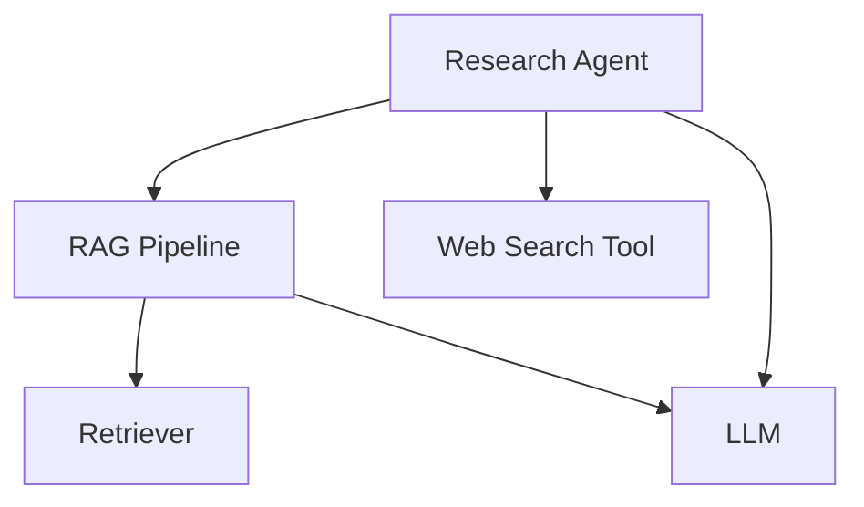
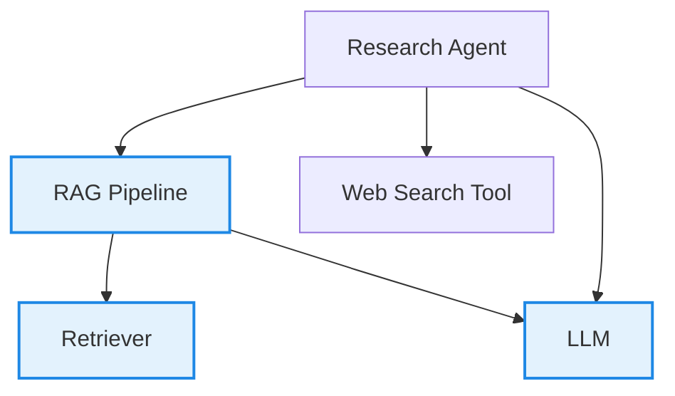
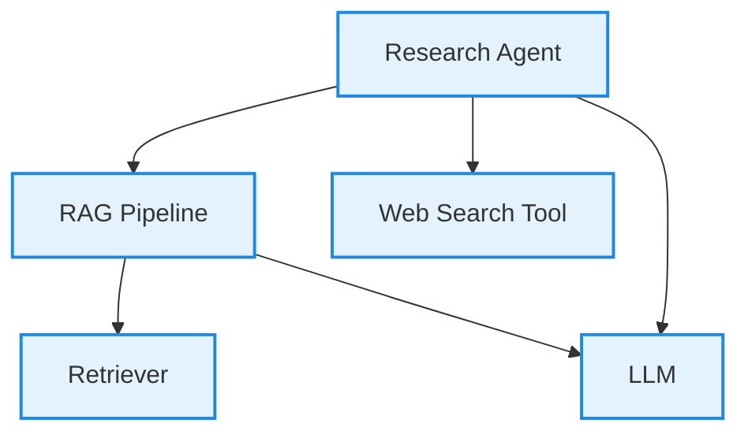

## Quick Summary

**单轮测试用例**是 `deepeval` 提供的、用于对 LLM 输出做单元测试的蓝图，**表示与你的 LLM 应用的一次单一、原子化的交互单元**。

<Warning>
在本文档中，你应当默认「测试用例」一词指的是 `LLMTestCase`，而不是 `MLLMImage` 或 `ConversationalTestCase`。
</Warning>

`LLMTestCase` 是 `deepeval` 中最主要的测试用例类型。它有**九个**参数：

- `input`
- [Optional] `actual_output`
- [Optional] `expected_output`
- [Optional] `context`
- [Optional] `retrieval_context`
- [Optional] `tools_called`
- [Optional] `expected_tools`
- [Optional] `token_cost`
- [Optional] `completion_time`

下面是一个 `LLMTestCase` 的示例实现：

<Tabs>

<Tab title="Python">

```python title="main.py"
from deepeval.test_case import LLMTestCase, ToolCall

test_case = LLMTestCase(
    input="What if these shoes don't fit?",
    expected_output="You're eligible for a 30 day refund at no extra cost.",
    actual_output="We offer a 30-day full refund at no extra cost.",
    context=["All customers are eligible for a 30 day full refund at no extra cost."],
    retrieval_context=["Only shoes can be refunded."],
    tools_called=[ToolCall(name="WebSearch")]
)
```

</Tab>

<Tab title="TypeScript">

```typescript title="main.ts"
import { LLMTestCase, ToolCall } from "deepeval/test-case";

const testCase = new LLMTestCase({
  input: "What if these shoes don't fit?",
  expectedOutput: "You're eligible for a 30 day refund at no extra cost.",
  actualOutput: "We offer a 30-day full refund at no extra cost.",
  context: ["All customers are eligible for a 30 day full refund at no extra cost."],
  retrievalContext: ["Only shoes can be refunded."],
  toolsCalled: [new ToolCall({ name: "WebSearch" })],
});
```

</Tab>

</Tabs>

<Info>
由于 `deepeval` 是一个 LLM 评估框架，**`input` 和 `actual_output` 永远是必填的。**不过这并不意味着它们一定会用于评估，你也可以为每个 `LLMTestCase` 添加 `tools_called` 等额外参数。

<video width="100%" autoPlay loop muted playsInline>
  <source
    src="https://deepeval-docs.s3.us-east-1.amazonaws.com/test-case-tools-called.mp4"
    type="video/mp4"
  />
</video>

要通过 `deepeval` 获得属于你自己的可分享测试报告，请[注册 Confident AI](https://app.confident-ai.com)，或在 CLI 中运行 `deepeval login`：

```bash
deepeval login
```

</Info>

## What Is An LLM "Interaction"?

**LLM 交互**是 **LLM 系统的组件之间**任何**离散的信息交换**——可以是一个完整的用户请求，也可以是单个内部步骤。交互的范围是任意的，完全由你决定。

<Note>
由于 `LLMTestCase` 表示你的 LLM 应用中一次单一、原子化的交互单元，理解这一点很重要。
</Note>

以这个 LLM 系统为例：

<div style={{textAlign: 'center', margin: "2rem 0"}}>



</div>

你可以用不同方式划定交互的范围：

- **智能体级：**智能体发起的整个过程，包括 RAG 流水线与网络搜索工具的使用

- **RAG 流水线：**仅 RAG 流程 —— 检索器 + LLM
  - **检索器：**只测试是否检索到了相关文档
  - **LLM：**只关注 LLM 从输入/上下文生成文本的表现

交互就是你想要定义 `LLMTestCase` 的位置。例如，当使用 `AnswerRelevancyMetric`、`FaithfulnessMetric` 或 `ContextualRelevancyMetric` 等 RAG 专用指标时，交互最好划定在 RAG 流水线层级。

在这种情况下：

- `input` 应该是用户问题或待嵌入的文本

- `retrieval_context` 应该是检索器检索到的文档

- `actual_output` 应该是 LLM 生成的最终回复

<div style={{textAlign: 'center', margin: "2rem 0"}}>



</div>

不过，如果你想使用 `ToolCorrectnessMetric` 来评估，就需要在**智能体级**创建 `LLMTestCase`，并改为提供 `tools_called` 参数：

<div style={{textAlign: 'center', margin: "2rem 0"}}>



</div>

在展示如何为一次交互创建 `LLMTestCase` 之前，我们先过一遍 `LLMTestCase` 的各项要求。

<Tip>
对刚上手的用户来说，把交互划定为整个 LLM 应用是运行评估最简单的方式。
</Tip>

## LLM Test Case

`deepeval` 中的 `LLMTestCase` 可用于对 LLM 应用内部（也可以只是单个 LLM 本身）的交互做单元测试，涵盖 RAG、LLM 智能体（单个组件、智能体中的智能体，或整个智能体）等使用场景。它包含评估你的 LLM 应用在给定 `input` 下表现所需的信息（智能体的 `tools_called`、RAG 的 `retrieval_context` 等）。


`LLMTestCase` 既用于端到端评估，也用于组件级评估：

- [端到端：](/docs/evaluation-end-to-end-llm-evals)`LLMTestCase` 表示你的「黑盒」LLM 应用的输入与输出

- [组件级：](/docs/evaluation-component-level-llm-evals)多个 `LLMTestCase` 表示不同组件中的多次交互

**不同的指标需要 `LLMTestCase` 参数的不同组合，但它们都要求 `input` 和 `actual_output`** ——无论它们是否真正参与评估。例如，如果你只是测量答案相关性，就不需要 `expected_output`、`context`、`tools_called` 和 `expected_tools`；但如果你要评估幻觉，就必须提供 `context`，让 `deepeval` 知道**基准真值**是什么。

对话式指标是用于评估对话而非单个 LLM 回复的指标；除对话式指标外，`deepeval` 提供的任何 LLM 评估指标都可以用来评估一个 `LLMTestCase`。

<Note>
你不能用对话式指标评估 `LLMTestCase`。好消息是，`deepeval` 中的大多数指标都是非对话式的。
</Note>

请继续阅读，了解评估 LLM 应用（从纯 LLM、RAG 流水线到 LLM 智能体）的不同侧面分别需要 `LLMTestCase` 的哪些参数。

### Input

`input` 模拟用户与你的 LLM 应用交互。`input` 可以只包含文本，也可以包含文本与图片；它是提示词模板的直接输入，因此**不应包含**你的提示词模板本身。

<Tabs>

<Tab title="Python">

```python
from deepeval.test_case import LLMTestCase

test_case = LLMTestCase(
    input="Why did the chicken cross the road?",
    # Replace this with your actual LLM application
    actual_output="Quite frankly, I don't want to know..."
)
```

</Tab>

<Tab title="TypeScript">

```typescript
import { LLMTestCase } from "deepeval/test-case";

const testCase = new LLMTestCase({
  input: "Why did the chicken cross the road?",
  // Replace this with your actual LLM application
  actualOutput: "Quite frankly, I don't want to know...",
});
```

</Tab>

</Tabs>

<Tip>

并非所有 `input` 都要包含提示词模板，这取决于你使用的指标。此外，`input` **绝不能**是你传入 LLM 的消息列表的 JSON 版本。

如果你登录了 Confident AI，可以把提示词模板等超参数关联到每次测试运行，方便找出对给定 `input` 哪个提示词模板能给出最好的 `actual_output`：

```bash
deepeval login
```

```python title="test_file.py"
import deepeval

from deepeval.metrics import AnswerRelevancyMetric
from deepeval.test_case import LLMTestCase
from deepeval import assert_test

def test_llm():
    test_case = LLMTestCase(input="...", actual_output="...")
    answer_relevancy_metric = AnswerRelevancyMetric()
    assert_test(test_case, [answer_relevancy_metric])

# You should aim to make these values dynamic
@deepeval.log_hyperparameters(model="gpt-4.1", prompt_template="...")
def hyperparameters():
    # You can also return an empty dict {} if there's no additional parameters to log
    return {
        "temperature": 1,
        "chunk size": 500
    }
```

```bash
deepeval test run test_file.py
```

</Tip>

### Actual Output

`actual_output` 是一个**可选**参数，表示你的 LLM 应用对给定输入的输出。通常，你会把 LLM 应用（或其一部分）导入测试文件，并在运行时调用它来获得实际输出。`actual_output` 可以是文本、图片或两者兼有，取决于你的 LLM 应用输出什么。

<Tabs>

<Tab title="Python">

```python
# A hypothetical LLM application example
import chatbot

input = "Why did the chicken cross the road?"

test_case = LLMTestCase(
    input=input,
    actual_output=chatbot.run(input)
)
```

</Tab>

<Tab title="TypeScript">

```typescript
// A hypothetical LLM application example
import chatbot from "./chatbot";

const input = "Why did the chicken cross the road?";

const testCase = new LLMTestCase({
  input,
  actualOutput: await chatbot.run(input),
});
```

</Tab>

</Tabs>

`actual_output` 是可选参数，因为某些系统（例如 RAG 检索器）不需要 LLM 输出即可评估。

<Note>
你也可以选择用预先计算好的 `actual_output` 来评估，而不是在评估时生成 `actual_output`。
</Note>

### Expected Output

`expected_output` 是一个**可选**参数，表示你希望的理想输出。注意该参数是否**可选**取决于你要评估的指标。

要让测试用例通过，期望输出不必与实际输出完全一致，因为 `deepeval` 使用多种方法评估非确定性的 LLM 输出。我们会在[指标板块](/docs/metrics-introduction)详细展开。

<Tabs>

<Tab title="Python">

```python
# A hypothetical LLM application example
import chatbot

input = "Why did the chicken cross the road?"

test_case = LLMTestCase(
    input=input,
    actual_output=chatbot.run(input),
    expected_output="To get to the other side!"
)
```

</Tab>

<Tab title="TypeScript">

```typescript
// A hypothetical LLM application example
import chatbot from "./chatbot";

const input = "Why did the chicken cross the road?";

const testCase = new LLMTestCase({
  input,
  actualOutput: await chatbot.run(input),
  expectedOutput: "To get to the other side!",
});
```

</Tab>

</Tabs>

### Context

`context` 是一个**可选**参数，表示你的 LLM 应用收到的、作为金标准真值补充来源的额外数据。你可以把它看作知识库中与特定输入相关的、作为支撑信息的理想片段。上下文是**静态的**，不应动态生成。

与其他参数不同，context 接受一个字符串列表。

<Tabs>

<Tab title="Python">

```python
# A hypothetical LLM application example
import chatbot

input = "Why did the chicken cross the road?"

test_case = LLMTestCase(
    input=input,
    actual_output=chatbot.run(input),
    expected_output="To get to the other side!",
    context=["The chicken wanted to cross the road."]
)
```

</Tab>

<Tab title="TypeScript">

```typescript
// A hypothetical LLM application example
import chatbot from "./chatbot";

const input = "Why did the chicken cross the road?";

const testCase = new LLMTestCase({
  input,
  actualOutput: await chatbot.run(input),
  expectedOutput: "To get to the other side!",
  context: ["The chicken wanted to cross the road."],
});
```

</Tab>

</Tabs>

<Note>
人们常常把 `expected_output` 与 `context` 混淆，因为二者的事实准确度相近。然而，虽然两者都（或应当）事实正确，`expected_output` 还会考虑语气、语言风格等因素，而 context 是严格的事实。
</Note>

### Retrieval Context

`retrieval_context` 是一个**可选**参数，表示你的 RAG 流水线在运行时的检索结果。提供 `retrieval_context` 后，你可以以 `context` 为基准来衡量检索器的表现。

<Note>
`retrieval_context` 参数接受字符串列表或 `RetrievedContextData` 对象列表。
</Note>

```python
class RetrievedContextData(BaseModel):
    context: str
    source: str
```

<Tabs>

<Tab title="Python">

```python
# A hypothetical LLM application example
import chatbot

input = "Why did the chicken cross the road?"

test_case = LLMTestCase(
    input=input,
    actual_output=chatbot.run(input),
    expected_output="To get to the other side!",
    context=["The chicken wanted to cross the road."],
    retrieval_context=["The chicken liked the other side of the road better"]
)
```

</Tab>

<Tab title="TypeScript">

```typescript
// A hypothetical LLM application example
import chatbot from "./chatbot";

const input = "Why did the chicken cross the road?";

const testCase = new LLMTestCase({
  input,
  actualOutput: await chatbot.run(input),
  expectedOutput: "To get to the other side!",
  context: ["The chicken wanted to cross the road."],
  retrievalContext: ["The chicken liked the other side of the road better"],
});
```

</Tab>

</Tabs>

<Note>
请记住，`context` 是给定输入的理想检索结果，通常来自你的评估数据集；而 `retrieval_context` 是你的 LLM 应用实际的检索结果。因此，尽管它们有时看起来相似，但并不相同。
</Note>

### Tools Called

`tools_called` 参数是一个**可选**参数，表示你的 LLM 智能体在执行期间实际调用的工具。提供 `tools_called` 后，你可以评估你的 LLM 智能体利用可用工具的效果如何。

<Note>
`tools_called` 参数接受 `ToolCall` 对象列表。
</Note>

```python
class ToolCall(BaseModel):
    name: str
    description: Optional[str] = None
    reasoning: Optional[str] = None
    output: Optional[Any] = None
    type: ToolCallType = ToolCallType.FUNCTION
    input_parameters: Optional[Dict[str, Any]] = None
```

`ToolCall` 对象接受 1 个必填参数和 5 个可选参数：

- `name`：表示工具**名称**的字符串。
- [可选] `description`：描述**工具用途**的字符串。
- [可选] `reasoning`：解释智能体**为何使用该工具**的字符串。
- [可选] `output`：工具的**输出**，可以是任意数据类型。
- [可选] `type`：表示**工具的调用方式**的 `ToolCallType`，为 `ToolCallType.FUNCTION` 或 `ToolCallType.MCP`。通过 [MCP](/docs/evaluation-mcp) 服务器调用的工具使用 `ToolCallType.MCP`。默认为 `ToolCallType.FUNCTION`。
- [可选] `input_parameters`：以字符串为键的字典，表示传入工具函数的**输入参数**（及对应值）。

<Tabs>

<Tab title="Python">

```python
# A hypothetical LLM application example
import chatbot

test_case = LLMTestCase(
    input="Why did the chicken cross the road?",
    actual_output=chatbot.run(input),
    # Replace this with the tools that were actually used
    tools_called=[
        ToolCall(
            name="Calculator Tool",
            description="A tool that calculates mathematical equations or expressions.",
            input={"user_input": "2+3"},
            output=5
        ),
        ToolCall(
            name="WebSearch Tool",
            reasoning="Knowledge base does not detail why the chicken crossed the road.",
            input={"search_query": "Why did the chicken crossed the road?"},
            output="Because it wanted to, duh."
        )
    ]
)
```

</Tab>

<Tab title="TypeScript">

```typescript
// A hypothetical LLM application example
import chatbot from "./chatbot";

const input = "Why did the chicken cross the road?";

const testCase = new LLMTestCase({
  input,
  actualOutput: await chatbot.run(input),
  // Replace this with the tools that were actually used
  toolsCalled: [
    new ToolCall({
      name: "Calculator Tool",
      description: "A tool that calculates mathematical equations or expressions.",
      inputParameters: { user_input: "2+3" },
      output: 5,
    }),
    new ToolCall({
      name: "WebSearch Tool",
      reasoning: "Knowledge base does not detail why the chicken crossed the road.",
      inputParameters: { search_query: "Why did the chicken crossed the road?" },
      output: "Because it wanted to, duh.",
    }),
  ],
});
```

</Tab>

</Tabs>

<Info>
`tools_called` 与 `expected_tools` 是只在**智能体评估指标**中使用的 LLM 测试用例参数。这些参数让你评估 LLM 应用的[工具使用正确性](/docs/metrics-tool-correctness)，并确保它达到预期的工具使用标准。
</Info>

### Expected Tools

`expected_tools` 参数是一个**可选**参数，表示理想情况下应当使用哪些工具来生成输出。提供 `expected_tools` 后，你可以评估你的 LLM 应用是否使用了你预期的工具以达到最佳效果。

<Tabs>

<Tab title="Python">

```python
# A hypothetical LLM application example
import chatbot

input = "Why did the chicken cross the road?"

test_case = LLMTestCase(
    input=input,
    actual_output=chatbot.run(input),
    # Replace this with the tools that were actually used
    tools_called=[
        ToolCall(
            name="Calculator Tool",
            description="A tool that calculates mathematical equations or expressions.",
            input={"user_input": "2+3"},
            output=5
        ),
        ToolCall(
            name="WebSearch Tool",
            reasoning="Knowledge base does not detail why the chicken crossed the road.",
            input={"search_query": "Why did the chicken crossed the road?"},
            output="Because it wanted to, duh."
        )
    ]
    expected_tools=[
        ToolCall(
            name="WebSearch Tool",
            reasoning="Knowledge base does not detail why the chicken crossed the road.",
            input={"search_query": "Why did the chicken crossed the road?"},
            output="Because it needed to escape from the hungry humans."
        )
    ]
)
```

</Tab>

<Tab title="TypeScript">

```typescript
// A hypothetical LLM application example
import chatbot from "./chatbot";

const input = "Why did the chicken cross the road?";

const testCase = new LLMTestCase({
  input,
  actualOutput: await chatbot.run(input),
  // Replace this with the tools that were actually used
  toolsCalled: [
    new ToolCall({
      name: "Calculator Tool",
      description: "A tool that calculates mathematical equations or expressions.",
      inputParameters: { user_input: "2+3" },
      output: 5,
    }),
    new ToolCall({
      name: "WebSearch Tool",
      reasoning: "Knowledge base does not detail why the chicken crossed the road.",
      inputParameters: { search_query: "Why did the chicken crossed the road?" },
      output: "Because it wanted to, duh.",
    }),
  ],
  expectedTools: [
    new ToolCall({
      name: "WebSearch Tool",
      reasoning: "Knowledge base does not detail why the chicken crossed the road.",
      inputParameters: { search_query: "Why did the chicken crossed the road?" },
      output: "Because it needed to escape from the hungry humans.",
    }),
  ],
});
```

</Tab>

</Tabs>

### Token cost

`token_cost` 是一个**可选**参数，类型为浮点数，允许你记录特定 `LLMTestCase` 中某次 LLM 交互的成本。默认没有指标使用该参数，它最有用的场景是：

1. 构建依赖 `token_cost` 的自定义指标
2. 在 Confident AI 上记录 `token_cost`

<Tabs>

<Tab title="Python">

```python
from deepeval.test_case import LLMTestCase

test_case = LLMTestCase(token_cost=1.32, ...)
```

</Tab>

<Tab title="TypeScript">

```typescript
import { LLMTestCase } from "deepeval/test-case";

const testCase = new LLMTestCase({ input: "...", actualOutput: "...", tokenCost: 1.32 });
```

</Tab>

</Tabs>

### Completion Time

`completion_time` 是一个**可选**参数，与 `token_cost` 类似，类型为浮点数，允许你记录特定 `LLMTestCase` 中某次 LLM 交互完成所用的**秒数**。默认没有指标使用该参数，它最有用的场景是：

1. 构建依赖 `completion_time` 的自定义指标
2. 在 Confident AI 上记录 `completion_time`

<Tabs>

<Tab title="Python">

```python
from deepeval.test_case import LLMTestCase

test_case = LLMTestCase(completion_time=7.53, ...)
```

</Tab>

<Tab title="TypeScript">

```typescript
import { LLMTestCase } from "deepeval/test-case";

const testCase = new LLMTestCase({ input: "...", actualOutput: "...", completionTime: 7.53 });
```

</Tab>

</Tabs>

## Including Images

默认情况下，`deepeval` 支持通过 `MLLMImage` 对象在测试用例中同时传入文本与图片。`deepeval` 中的 `MLLMImage` 类用于在测试用例中引用多模态图片。它让你可以使用本地图片、远程 URL 和 `base64` 数据创建测试用例。

<Tabs>

<Tab title="Python">

```python
from deepeval.test_case import LLMTestCase, MLLMImage

shoes = MLLMImage(url='./shoes.png', local=True)
blue_shoes = MLLMImage(url='https://shoe-images.com/edited-shoes', local=False)

test_case = LLMTestCase(
    input=f"Change the color of these shoes to blue: {shoes}",
    expected_output=f"Here's the blue shoes you asked for: {expected_shoes}"
    retrieval_context=[f"Some reference shoes: {MLLMImage(...)}"]
)
```

</Tab>

<Tab title="TypeScript">

```typescript
import { LLMTestCase, MLLMImage } from "deepeval/test-case";

const shoes = new MLLMImage({ url: "./shoes.png", local: true });
const blueShoes = new MLLMImage({ url: "https://shoe-images.com/edited-shoes", local: false });

const testCase = new LLMTestCase({
  input: `Change the color of these shoes to blue: ${shoes}`,
  actualOutput: `Here's the blue shoes you asked for: ${blueShoes}`,
  expectedOutput: `Here's the blue shoes you asked for: ${blueShoes}`,
  retrievalContext: [`Some reference shoes: ${new MLLMImage({ url: "./reference-shoes.png", local: true })}`],
});
```

</Tab>

</Tabs>

<Info>
当你在输入或输出中包含 `MLLMImage` 对象时，多模态测试用例会被自动识别。你可以将它们与各种支持多模态的指标一起使用，例如 [RAG 指标](/docs/metrics-answer-relevancy)与[多模态专用指标](/docs/multimodal-metrics-image-coherence)。
</Info>

### `MLLMImage` Data Model

以下是 `deepeval` 中 `MLLMImage` 的数据模型：

```python
class MLLMImage:
    dataBase64: Optional[str] = None
    mimeType: Optional[str] = None
    url: Optional[str] = None
    local: Optional[bool] = None
    filename: Optional[str] = None
```

You **MUST** either provide `url` or `dataBase64` and `mimeType` parameters when initializing an `MLLMImage`. The `local` attribute should be set to `True`（TypeScript 中为 `true`） for locally stored images and `False`（TypeScript 中为 `false`） for images hosted online (default is `False`（TypeScript 中为 `false`）).

<Note>

所有 `MLLMImage` 实例都会被转换成一个特殊的 `deepeval` 占位符（例如 `[DEEPEVAL:IMAGE:uuid]`）。这就是把 `MLLMImage` 嵌入 f 字符串后它在测试用例中的样子：

<Tabs>

<Tab title="Python">

```python
from deepeval.test_case import LLMTestCase, MLLMImage

shoes = MLLMImage(url='./shoes.png', local=True)

test_case = LLMTestCase(
    input=f"Change the color of these shoes to blue: {shoes}",
    expected_output=f"..."
)

print(test_case.input)
```

</Tab>

<Tab title="TypeScript">

```typescript
import { LLMTestCase, MLLMImage } from "deepeval/test-case";

const shoes = new MLLMImage({ url: "./shoes.png", local: true });

const testCase = new LLMTestCase({
  input: `Change the color of these shoes to blue: ${shoes}`,
  actualOutput: `...`,
  expectedOutput: `...`,
});

console.log(testCase.input);
```

</Tab>

</Tabs>

它输出如下内容：

```
Change the color of these shoes to blue: [DEEPEVAL:IMAGE:awefv234fvbnhg456]
```

想自行访问图片做任何 ETL 处理的用户，可以使用 `convert_to_multi_modal_array` 方法把你的测试用例按顺序转换为字符串与 `MLLMImage` 的列表。用法如下：

```python
from deepeval.utils import convert_to_multi_modal_array
from deepeval.test_case import LLMTestCase, MLLMImage

shoes = MLLMImage(url='./shoes.png', local=True)

test_case = LLMTestCase(
    input=f"Change the color of these shoes to blue: {shoes}",
    expected_output=f"..."
)

print(convert_to_multi_modal_array(test_case.input))
```

输出如下：

```
["Change the color of these shoes to blue:",  [DEEPEVAL:IMAGE:awefv234fvbnhg456]]
```

这里的 `[DEEPEVAL:IMAGE:awefv234fvbnhg456]` 实际上就是你传入测试用例的那个 `MLLMImage` 实例。

</Note>

## Mark Test Cases As Flaky

The `flaky` is an **optional** parameter of type boolean (defaulted to `False`（TypeScript 中为 `false`）) that marks an `LLMTestCase` as flaky. A flaky test case's results are still computed, recorded, and reported as normal, but its failures won't block your CI/CD pipeline — when a flaky test case fails, <Tabs><Tab title="Python">`assert_test()` prints a warning instead of raising an `AssertionError`.</Tab><Tab title="TypeScript">`expect(testCase).toPass()` prints a warning instead of failing the test.</Tab></Tabs>

<Tabs>

<Tab title="Python">

```python
from deepeval.test_case import LLMTestCase

test_case = LLMTestCase(flaky=True, ...)
```

</Tab>

<Tab title="TypeScript">

```typescript
import { LLMTestCase } from "deepeval/test-case";

const testCase = new LLMTestCase({ input: "...", actualOutput: "...", flaky: true });
```

</Tab>

</Tabs>

这最适合那些你明知有噪声的测试用例——例如分数处于临界、多次运行在通过与失败之间来回摆动，但你仍想继续评估与追踪、又不想让它们阻塞部署的用例。`flaky` 状态也会记录在 Confident AI 上，方便你监控 flaky 测试用例实际的失败频率。

<Info>
指标也可以被标记为 flaky。flaky **指标**的失败永远不会决定其测试用例的通过/失败状态，因此每次评估至少需要一个带 `threshold` 的非 flaky 指标。
</Info>

## Label Test Cases For Confident AI

If you're using Confident AI, these are some additional parameters to help manage your test cases.

### Name

可选的 `name` 参数允许你提供一个字符串标识来标记 `LLMTestCase` 与 `ConversationalTestCase`，方便你在 Confident AI 上搜索与过滤。当你从外部数据源导入测试用例时尤其有用。

<Tabs>

<Tab title="Python">

```python
from deepeval.test_case import LLMTestCase

test_case = LLMTestCase(name="my-external-unique-id", ...)
```

</Tab>

<Tab title="TypeScript">

```typescript
import { LLMTestCase } from "deepeval/test-case";

const testCase = new LLMTestCase({ input: "...", actualOutput: "...", name: "my-external-unique-id" });
```

</Tab>

</Tabs>

### Tags

你也可以为测试用例打标签，以便在 Confident AI 上过滤与搜索：

```python
from deepeval.test_case import LLMTestCase

test_case = LLMTestCase(tags=["Topic 1", "Topic 3"], ...)
```

## Using Test Cases For Evals

你可以为三种类型的评估创建测试用例：

- [端到端](/docs/evaluation-end-to-end-llm-evals) - 把你的 LLM 应用当作黑盒，评估整个系统的输入与输出。你的测试用例位于**系统级**，覆盖整个应用
- [组件级](/docs/evaluation-component-level-llm-evals) - 使用 `@observe` 装饰器评估 LLM 系统内的单个组件。你的测试用例位于**组件级**，聚焦系统的特定部分
- 一次性独立评估 - 在单个测试用例上执行单个指标，用于调试或自定义评估流水线

点击各个链接了解如何在评估中使用测试用例。

## FAQs

<AccordionGroup>
<Accordion title="Which LLMTestCase parameters are required?">
只有 `input` 和 `actual_output` 永远是必填的。其他所有参数——`expected_output`、`context`、`retrieval_context`、`tools_called` 等——都是可选的，只有你运行的特定指标需要它们时才提供。
</Accordion>
<Accordion title="What's the difference between context and retrieval context?">
`context` 是一个输入的理想、静态基准真值（通常来自你的数据集），而 `retrieval_context` 是你的 RAG 流水线在运行时实际检索到的内容。比较两者正是衡量检索器质量的方法。
</Accordion>
<Accordion title="When should I use a single-turn test case vs a multi-turn one?">
单次、原子化的交互（一问一答）用 `LLMTestCase`。需要评估跨越多个轮次的往返对话时，用 [ConversationalTestCase](/docs/evaluation-multiturn-test-cases)。
</Accordion>
<Accordion title="Can I evaluate precomputed outputs instead of generating them live?">
可以。你可以提前填充 `actual_output`（以及 `retrieval_context`、`tools_called` 等）稍后评估，也可以在评估时通过在测试文件中调用你的应用动态生成它们。
</Accordion>
<Accordion title="Can a test case include images?">
可以。把 `MLLMImage` 对象（本地文件、远程 URL 或 base64）嵌入 `input` 或 `actual_output`，`deepeval` 会自动将其视为多模态测试用例，供支持多模态的指标使用。
</Accordion>
<Accordion title="How do I organize and search test cases across a team or keep them on the cloud?">
在本地，你可以用 `name` 与 `tags` 标记测试用例以便过滤。如果你的团队想要共享的云端视图，这些标签会同步到 [Confident AI](https://www.confident-ai.com)，你可以在界面中搜索、过滤并可视化测试用例及其结果——从外部数据源导入或跨团队协作时很有用。它是可选的；不使用它，你的测试用例运行方式完全不变。
</Accordion>
</AccordionGroup>
