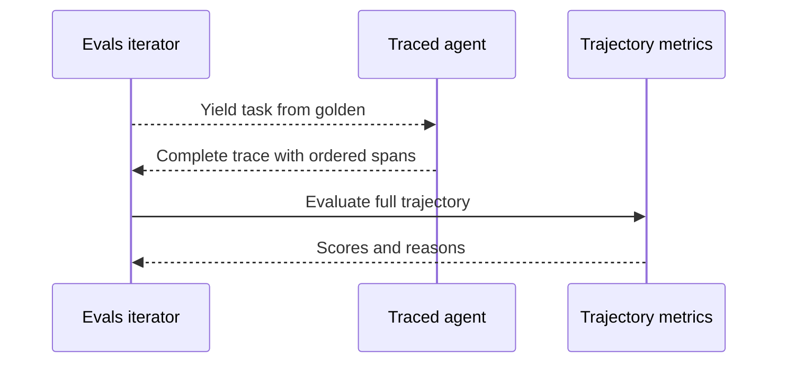

基于轨迹的评估考察 AI 智能体为完成任务所走的**整条决策与行动链**。它为智能体与长程智能体设计——这些智能体的质量不仅取决于最终答案，也取决于产生答案的计划、工具调用、移交与中间步骤。

## What Are Trajectory-Based Evals?

智能体轨迹是从接收任务到产出结果之间的有序步骤序列。一条轨迹可能包含规划、LLM 生成、工具调用、重试、子智能体移交以及其他中间操作。

<Tabs>

<Tab title="Python">

</Tab>

<Tab title="TypeScript">

</Tab>

</Tabs>

基于轨迹的评估把这一序列作为整体打分。它通过分析执行期间产生的完整追踪，判断智能体是否完成了任务、是否遵循了计划、是否避免了不必要的步骤。

这使得基于轨迹的评估对以下场景特别有用：

- **使用工具的智能体**：在回答之前要做多个决策。
- **长程智能体**：需要跨越许多步骤进行规划、行动、观察与修正。
- **多智能体系统**：工作在智能体之间委托。
- **智能体工作流**：两次运行可以通过非常不同的路径产出相同的最终答案。

## 基于轨迹的评估与其他评估

区别在于指标能看到什么范围：

- **[端到端评估](/docs/evaluation-end-to-end-llm-evals)**把你的应用当黑盒，评估其可观察的输入与输出。
- **基于轨迹的评估**深入智能体内部，但把完整的有序步骤链作为一个单元来评估。
- **[组件级评估](/docs/evaluation-component-level-llm-evals)**评估单个内部 span，例如单次检索器、LLM、工具或子智能体调用。

当路径本身影响质量时使用基于轨迹的评估。你可以在同一个评估策略中组合三者：为最终结果做端到端打分、为完整的智能体轨迹打分、再为选定的关键组件打分。

## 基于轨迹的评估如何运作

每个评估任务产生一条包含智能体完整执行树的追踪。追踪中有序的 span——如计划、LLM 调用、工具调用、子智能体移交——构成指标评估的轨迹。

1. `evals_iterator()` 产出一个包含
   智能体任务的金标。
2. 你做了埋点的智能体执行该任务，并产生其内部步骤的追踪。
3. `deepeval` 把完成的追踪与该金标关联。
4. 轨迹指标分析完整追踪并返回分数与原因。
5. 轨迹及其指标结果一起存入测试运行。



与组件级评估不同，指标不是挂在一个 span 上。它接收完整追踪，从而可以评判步骤之间的关系以及智能体的整体执行。

## 评估智能体轨迹

基于轨迹的评估需要[追踪](/docs/evaluation-llm-tracing)，因为指标需要访问智能体的内部执行步骤。`evals_iterator()` 方法把每个数据集金标与其捕获的追踪关联，并评估该轨迹。

<Steps>
<Step>

### 构建数据集

创建一个包含你智能体代表性任务的 [`EvaluationDataset`](/docs/evaluation-datasets)。每个 [`Golden`](/docs/evaluation-datasets#what-are-goldens) 为一条智能体轨迹提供输入。

<Tabs>
<Tab title="在代码中">

<Tabs>

<Tab title="Python">

```python
from deepeval.dataset import Golden, EvaluationDataset

goldens = [
    Golden(input="What is your name?"),
    Golden(input="Choose a number between 1 and 100"),
    # ...
]

dataset = EvaluationDataset(goldens=goldens)
```

</Tab>

<Tab title="TypeScript">

```typescript
import { EvaluationDataset, Golden } from "deepeval/dataset";

const goldens = [
  new Golden({ input: "What is your name?" }),
  new Golden({ input: "Choose a number between 1 and 100" }),
  // ...
];

const dataset = new EvaluationDataset({ goldens });
```

</Tab>

</Tabs>

数据集只在本次运行中存在——不推送、不保存。适合快速上手与一次性评估。

</Tab>
<Tab title="从 Confident AI 拉取">

你可以用一行代码把整个数据集从 Confident AI 的云端加载。

<Tabs>

<Tab title="Python">

```python
from deepeval.dataset import EvaluationDataset

dataset = EvaluationDataset()
dataset.pull(alias="My Evals Dataset")
```

</Tab>

<Tab title="TypeScript">

```typescript
import { EvaluationDataset } from "deepeval/dataset";

const dataset = new EvaluationDataset();
await dataset.pull({ alias: "My Evals Dataset" });
```

</Tab>

</Tabs>

非技术的领域专家可以在 Confident AI 上**创建、标注与评论**数据集。你还可以用 CSV 格式上传数据集，或用一行代码把在 `deepeval` 中创建的合成数据集推送到 Confident AI。

更多信息请访问 [Confident AI 数据集板块](https://www.confident-ai.com/docs/llm-evaluation/dataset-management/create-goldens)。

</Tab>
<Tab title="从 CSV 加载">

<Tabs>

<Tab title="Python">

```python
from deepeval.dataset import EvaluationDataset

dataset = EvaluationDataset()
dataset.add_goldens_from_csv_file(
    file_path="example.csv",
    input_col_name="query",
)
```

</Tab>

<Tab title="TypeScript">

```typescript
import { EvaluationDataset } from "deepeval/dataset";

const dataset = new EvaluationDataset();
await dataset.addGoldensFromCSV({
  filePath: "example.csv",
  keys: { input: "query" },
});
```

列名默认采用 `deepeval` 自己的命名，因此 `keys` 只需列出不同的那些。

</Tab>

</Tabs>

更多高级选项（例如加载 `context` 与 `tools_called` 列或重命名所有列）见[加载数据集](/docs/evaluation-datasets#load-dataset)。

</Tab>
<Tab title="从 JSON 加载">

<Tabs>

<Tab title="Python">

```python
from deepeval.dataset import EvaluationDataset

dataset = EvaluationDataset()
dataset.add_goldens_from_json_file(
    file_path="example.json",
    input_key_name="query",
)
```

</Tab>

<Tab title="TypeScript">

```typescript
import { EvaluationDataset } from "deepeval/dataset";

const dataset = new EvaluationDataset();
await dataset.addGoldensFromJSON({
  filePath: "example.json",
  keys: { input: "query" },
});
```

</Tab>

</Tabs>

更多高级选项（例如加载 `context` 与 `tools_called` 键，或从 `.jsonl` 文件逐行读取金标）见[加载数据集](/docs/evaluation-datasets#load-dataset)。

</Tab>
</Tabs>

<Note>
一个 `EvaluationDataset` 只容纳单轮或多轮金标中的一种，不能混用。混有两种的文件会抛出错误。
</Note>

</Step>
<Step>

### 为智能体做埋点

使用 `deepeval` 的原生追踪或你框架的集成为智能体做埋点。每个被捕获为 span 的决策、工具调用与嵌套操作都成为指标可用的轨迹的一部分。

<Tabs>

<Tab title="Python">

<Tabs>
<Tab title="手动埋点">

用 `@observe` 包装顶层函数，并调用 `update_current_trace(...)` 设置追踪级测试用例字段：

<Tabs>
<Tab title="Async">

```python title="main.py" showLineNumbers
import asyncio
from deepeval.tracing import observe, update_current_trace
from deepeval.metrics import TaskCompletionMetric
...

@observe()
async def my_ai_agent(query: str) -> str:
    answer = "..."  # await your LLM call here
    update_current_trace(input=query, output=answer)
    return answer

for golden in dataset.evals_iterator(metrics=[TaskCompletionMetric()]):
    task = asyncio.create_task(my_ai_agent(golden.input))
    dataset.evaluate(task)
```

</Tab>
<Tab title="Sync">

```python title="main.py" showLineNumbers
from deepeval.evaluate import AsyncConfig
from deepeval.tracing import observe, update_current_trace
from deepeval.metrics import TaskCompletionMetric
...

@observe()
def my_ai_agent(query: str) -> str:
    answer = "..."  # call your LLM here
    update_current_trace(input=query, output=answer)
    return answer

for golden in dataset.evals_iterator(
    metrics=[TaskCompletionMetric()],
    async_config=AsyncConfig(run_async=False),
):
    my_ai_agent(golden.input)
```

</Tab>
</Tabs>

完整的 `@observe` 与 `update_current_trace` 用法见[追踪](/docs/evaluation-llm-tracing)。

</Tab>
<Tab title="LangChain">

用 `create_agent` 构建你的智能体，然后在循环中把 `deepeval` 的 `CallbackHandler` 传给它的 `invoke` / `ainvoke` 方法：

<Tabs>
<Tab title="Async">

```python title="langchain_app.py" showLineNumbers
import asyncio
from langchain.agents import create_agent
from deepeval.integrations.langchain import CallbackHandler
from deepeval.metrics import TaskCompletionMetric
...

def multiply(a: int, b: int) -> int:
    """Multiply two numbers."""
    return a * b

agent = create_agent(
    model="openai:gpt-4o-mini",
    tools=[multiply],
    system_prompt="Be concise.",
)

async def run_agent(prompt: str):
    return await agent.ainvoke(
        {"messages": [{"role": "user", "content": prompt}]},
        config={"callbacks": [CallbackHandler()]},
    )

for golden in dataset.evals_iterator(metrics=[TaskCompletionMetric()]):
    task = asyncio.create_task(run_agent(golden.input))
    dataset.evaluate(task)
```

</Tab>
<Tab title="Sync">

```python title="langchain_app.py" showLineNumbers
from langchain.agents import create_agent
from deepeval.evaluate import AsyncConfig
from deepeval.integrations.langchain import CallbackHandler
from deepeval.metrics import TaskCompletionMetric
...

def multiply(a: int, b: int) -> int:
    """Multiply two numbers."""
    return a * b

agent = create_agent(
    model="openai:gpt-4o-mini",
    tools=[multiply],
    system_prompt="Be concise.",
)

for golden in dataset.evals_iterator(
    metrics=[TaskCompletionMetric()],
    async_config=AsyncConfig(run_async=False),
):
    agent.invoke(
        {"messages": [{"role": "user", "content": golden.input}]},
        config={"callbacks": [CallbackHandler()]},
    )
```

</Tab>
</Tabs>

完整用法见 [LangChain 集成](/integrations/frameworks/langchain)。

</Tab>
<Tab title="LangGraph">

接好你的 `StateGraph`，然后在循环中把 `deepeval` 的 `CallbackHandler` 传给它的 `invoke` / `ainvoke` 方法：

<Tabs>
<Tab title="Async">

```python title="langgraph_app.py" showLineNumbers
import asyncio
from langchain.chat_models import init_chat_model
from langgraph.graph import StateGraph, MessagesState, START, END
from deepeval.integrations.langchain import CallbackHandler
from deepeval.metrics import TaskCompletionMetric
...

llm = init_chat_model("openai:gpt-4o-mini")

async def chatbot(state: MessagesState):
    return {"messages": [await llm.ainvoke(state["messages"])]}

graph = (
    StateGraph(MessagesState)
    .add_node(chatbot)
    .add_edge(START, "chatbot")
    .add_edge("chatbot", END)
    .compile()
)

async def run_graph(prompt: str):
    return await graph.ainvoke(
        {"messages": [{"role": "user", "content": prompt}]},
        config={"callbacks": [CallbackHandler()]},
    )

for golden in dataset.evals_iterator(metrics=[TaskCompletionMetric()]):
    task = asyncio.create_task(run_graph(golden.input))
    dataset.evaluate(task)
```

</Tab>
<Tab title="Sync">

```python title="langgraph_app.py" showLineNumbers
from langchain.chat_models import init_chat_model
from langgraph.graph import StateGraph, MessagesState, START, END
from deepeval.evaluate import AsyncConfig
from deepeval.integrations.langchain import CallbackHandler
from deepeval.metrics import TaskCompletionMetric
...

llm = init_chat_model("openai:gpt-4o-mini")

def chatbot(state: MessagesState):
    return {"messages": [llm.invoke(state["messages"])]}

graph = (
    StateGraph(MessagesState)
    .add_node(chatbot)
    .add_edge(START, "chatbot")
    .add_edge("chatbot", END)
    .compile()
)

for golden in dataset.evals_iterator(
    metrics=[TaskCompletionMetric()],
    async_config=AsyncConfig(run_async=False),
):
    graph.invoke(
        {"messages": [{"role": "user", "content": golden.input}]},
        config={"callbacks": [CallbackHandler()]},
    )
```

</Tab>
</Tabs>

完整用法见 [LangGraph 集成](/integrations/frameworks/langgraph)。

</Tab>
<Tab title="OpenAI">

把 `from openai import OpenAI` 直接替换为 `from deepeval.openai import OpenAI`（或 `AsyncOpenAI`）。把调用包在 `with trace():` 中，LLM 调用就会成为追踪：

<Tabs>
<Tab title="Async">

```python title="openai_app.py" showLineNumbers
import asyncio
from deepeval.openai import AsyncOpenAI
from deepeval.tracing import trace
from deepeval.metrics import TaskCompletionMetric
...

client = AsyncOpenAI()

async def call_openai(prompt: str):
    with trace():
        return await client.chat.completions.create(
            model="gpt-4o-mini",
            messages=[{"role": "user", "content": prompt}],
        )

for golden in dataset.evals_iterator(metrics=[TaskCompletionMetric()]):
    task = asyncio.create_task(call_openai(golden.input))
    dataset.evaluate(task)
```

</Tab>
<Tab title="Sync">

```python title="openai_app.py" showLineNumbers
from deepeval.openai import OpenAI
from deepeval.tracing import trace
from deepeval.evaluate import AsyncConfig
from deepeval.metrics import TaskCompletionMetric
...

client = OpenAI()

for golden in dataset.evals_iterator(
    metrics=[TaskCompletionMetric()],
    async_config=AsyncConfig(run_async=False),
):
    with trace():
        client.chat.completions.create(
            model="gpt-4o-mini",
            messages=[{"role": "user", "content": golden.input}],
        )
```

</Tab>
</Tabs>

流式与工具调用相关内容见 [OpenAI 集成](/integrations/frameworks/openai)。

</Tab>
<Tab title="Pydantic AI">

把 `DeepEvalInstrumentationSettings()` 传给你 `Agent` 的 `instrument` 关键字参数：

<Tabs>
<Tab title="Async">

```python title="pydanticai_agent.py" showLineNumbers
import asyncio
from pydantic_ai import Agent
from deepeval.integrations.pydantic_ai import DeepEvalInstrumentationSettings
from deepeval.metrics import TaskCompletionMetric
...

agent = Agent(
    "openai:gpt-4.1",
    system_prompt="Be concise.",
    instrument=DeepEvalInstrumentationSettings(),
)

for golden in dataset.evals_iterator(metrics=[TaskCompletionMetric()]):
    task = asyncio.create_task(agent.run(golden.input))
    dataset.evaluate(task)
```

</Tab>
<Tab title="Sync">

```python title="pydanticai_agent.py" showLineNumbers
from pydantic_ai import Agent
from deepeval.evaluate import AsyncConfig
from deepeval.integrations.pydantic_ai import DeepEvalInstrumentationSettings
from deepeval.metrics import TaskCompletionMetric
...

agent = Agent(
    "openai:gpt-4.1",
    system_prompt="Be concise.",
    instrument=DeepEvalInstrumentationSettings(),
)

for golden in dataset.evals_iterator(
    metrics=[TaskCompletionMetric()],
    async_config=AsyncConfig(run_async=False),
):
    agent.run_sync(golden.input)
```

</Tab>
</Tabs>

完整用法见 [Pydantic AI 集成](/integrations/frameworks/pydanticai)。

</Tab>
<Tab title="AgentCore">

在创建智能体之前调用 `instrument_agentcore()`。同一次调用也会对运行在 AgentCore 内的 [Strands](https://strandsagents.com/) 智能体做埋点：

<Tabs>
<Tab title="Async">

```python title="agentcore_agent.py" showLineNumbers
import asyncio
from strands import Agent
from deepeval.integrations.agentcore import instrument_agentcore
from deepeval.metrics import TaskCompletionMetric
...

instrument_agentcore()

agent = Agent(model="amazon.nova-lite-v1:0")

for golden in dataset.evals_iterator(metrics=[TaskCompletionMetric()]):
    task = asyncio.create_task(agent.invoke_async(golden.input))
    dataset.evaluate(task)
```

</Tab>
<Tab title="Sync">

```python title="agentcore_agent.py" showLineNumbers
from strands import Agent
from deepeval.evaluate import AsyncConfig
from deepeval.integrations.agentcore import instrument_agentcore
from deepeval.metrics import TaskCompletionMetric
...

instrument_agentcore()

agent = Agent(model="amazon.nova-lite-v1:0")

for golden in dataset.evals_iterator(
    metrics=[TaskCompletionMetric()],
    async_config=AsyncConfig(run_async=False),
):
    agent(golden.input)
```

</Tab>
</Tabs>

完整用法（包括 `BedrockAgentCoreApp` 入口模式）见 [AgentCore 集成](/integrations/frameworks/agentcore)。

</Tab>
<Tab title="Strands">

在调用你的 Strands 智能体之前调用 `instrument_strands()`（对托管在 AgentCore 上的 Strands，请改用 AgentCore 标签页）：

<Tabs>
<Tab title="Async">

```python title="strands_agent.py" showLineNumbers
import asyncio
from strands import Agent
from strands.models.openai import OpenAIModel
from deepeval.integrations.strands import instrument_strands
from deepeval.metrics import TaskCompletionMetric
...

instrument_strands()

agent = Agent(
    model=OpenAIModel(model_id="gpt-4o-mini"),
    system_prompt="You are a helpful assistant.",
)

for golden in dataset.evals_iterator(metrics=[TaskCompletionMetric()]):
    task = asyncio.create_task(agent.invoke_async(golden.input))
    dataset.evaluate(task)
```

</Tab>
<Tab title="Sync">

```python title="strands_agent.py" showLineNumbers
from strands import Agent
from strands.models.openai import OpenAIModel
from deepeval.evaluate import AsyncConfig
from deepeval.integrations.strands import instrument_strands
from deepeval.metrics import TaskCompletionMetric
...

instrument_strands()

agent = Agent(
    model=OpenAIModel(model_id="gpt-4o-mini"),
    system_prompt="You are a helpful assistant.",
)

for golden in dataset.evals_iterator(
    metrics=[TaskCompletionMetric()],
    async_config=AsyncConfig(run_async=False),
):
    agent(golden.input)
```

</Tab>
</Tabs>

完整用法见 [Strands 集成](/integrations/frameworks/strands)。

</Tab>
<Tab title="Anthropic">

把 `from anthropic import Anthropic` 直接替换为 `from deepeval.anthropic import Anthropic`（或 `AsyncAnthropic`）。把调用包在 `with trace():` 中，LLM 调用就会成为追踪：

<Tabs>
<Tab title="Async">

```python title="anthropic_app.py" showLineNumbers
import asyncio
from deepeval.anthropic import AsyncAnthropic
from deepeval.tracing import trace
from deepeval.metrics import TaskCompletionMetric
...

client = AsyncAnthropic()

async def call_claude(prompt: str):
    with trace():
        return await client.messages.create(
            model="claude-sonnet-4-5",
            max_tokens=1024,
            messages=[{"role": "user", "content": prompt}],
        )

for golden in dataset.evals_iterator(metrics=[TaskCompletionMetric()]):
    task = asyncio.create_task(call_claude(golden.input))
    dataset.evaluate(task)
```

</Tab>
<Tab title="Sync">

```python title="anthropic_app.py" showLineNumbers
from deepeval.anthropic import Anthropic
from deepeval.tracing import trace
from deepeval.evaluate import AsyncConfig
from deepeval.metrics import TaskCompletionMetric
...

client = Anthropic()

for golden in dataset.evals_iterator(
    metrics=[TaskCompletionMetric()],
    async_config=AsyncConfig(run_async=False),
):
    with trace():
        client.messages.create(
            model="claude-sonnet-4-5",
            max_tokens=1024,
            messages=[{"role": "user", "content": golden.input}],
        )
```

</Tab>
</Tabs>

流式与工具使用相关内容见 [Anthropic 集成](/integrations/frameworks/anthropic)。

</Tab>
<Tab title="LlamaIndex">

把 `deepeval` 的事件处理器注册到 LlamaIndex 的 instrumentation 调度器上。`agent.run(...)` 仅支持异步，同步变体使用 `asyncio.run(...)`：

<Tabs>
<Tab title="Async">

```python title="llamaindex_agent.py" showLineNumbers
import asyncio
from llama_index.llms.openai import OpenAI
from llama_index.core.agent import FunctionAgent
import llama_index.core.instrumentation as instrument
from deepeval.integrations.llama_index import instrument_llama_index
from deepeval.metrics import TaskCompletionMetric
...

instrument_llama_index(instrument.get_dispatcher())

def multiply(a: float, b: float) -> float:
    return a * b

agent = FunctionAgent(
    tools=[multiply],
    llm=OpenAI(model="gpt-4o-mini"),
    system_prompt="You are a helpful calculator.",
)

for golden in dataset.evals_iterator(metrics=[TaskCompletionMetric()]):
    task = asyncio.create_task(agent.run(golden.input))
    dataset.evaluate(task)
```

</Tab>
<Tab title="Sync">

```python title="llamaindex_agent.py" showLineNumbers
import asyncio
from llama_index.llms.openai import OpenAI
from llama_index.core.agent import FunctionAgent
import llama_index.core.instrumentation as instrument
from deepeval.evaluate import AsyncConfig
from deepeval.integrations.llama_index import instrument_llama_index
from deepeval.metrics import TaskCompletionMetric
...

instrument_llama_index(instrument.get_dispatcher())

def multiply(a: float, b: float) -> float:
    return a * b

agent = FunctionAgent(
    tools=[multiply],
    llm=OpenAI(model="gpt-4o-mini"),
    system_prompt="You are a helpful calculator.",
)

for golden in dataset.evals_iterator(
    metrics=[TaskCompletionMetric()],
    async_config=AsyncConfig(run_async=False),
):
    asyncio.run(agent.run(golden.input))
```

</Tab>
</Tabs>

完整用法见 [LlamaIndex 集成](/integrations/frameworks/llamaindex)。

</Tab>
<Tab title="OpenAI Agents">

注册一次 `DeepEvalTracingProcessor`，然后用 `deepeval` 的 `Agent` 与 `function_tool` 垫片构建你的智能体：

<Tabs>
<Tab title="Async">

```python title="openai_agents_app.py" showLineNumbers
import asyncio
from agents import Runner, add_trace_processor
from deepeval.openai_agents import Agent, DeepEvalTracingProcessor, function_tool
from deepeval.metrics import TaskCompletionMetric
...

add_trace_processor(DeepEvalTracingProcessor())

@function_tool
def get_weather(city: str) -> str:
    return f"It's always sunny in {city}!"

agent = Agent(
    name="weather_agent",
    instructions="Answer weather questions concisely.",
    tools=[get_weather],
)

for golden in dataset.evals_iterator(metrics=[TaskCompletionMetric()]):
    task = asyncio.create_task(Runner.run(agent, golden.input))
    dataset.evaluate(task)
```

</Tab>
<Tab title="Sync">

```python title="openai_agents_app.py" showLineNumbers
from agents import Runner, add_trace_processor
from deepeval.evaluate import AsyncConfig
from deepeval.openai_agents import Agent, DeepEvalTracingProcessor, function_tool
from deepeval.metrics import TaskCompletionMetric
...

add_trace_processor(DeepEvalTracingProcessor())

@function_tool
def get_weather(city: str) -> str:
    return f"It's always sunny in {city}!"

agent = Agent(
    name="weather_agent",
    instructions="Answer weather questions concisely.",
    tools=[get_weather],
)

for golden in dataset.evals_iterator(
    metrics=[TaskCompletionMetric()],
    async_config=AsyncConfig(run_async=False),
):
    Runner.run_sync(agent, golden.input)
```

</Tab>
</Tabs>

完整用法见 [OpenAI Agents 集成](/integrations/frameworks/openai-agents)。

</Tab>
<Tab title="Google ADK">

在构建 `LlmAgent` 之前调用一次 `instrument_google_adk()`。ADK 的 `runner.run_async(...)` 仅支持异步，同步变体使用 `asyncio.run(...)`：

<Tabs>
<Tab title="Async">

```python title="google_adk_agent.py" showLineNumbers
import asyncio
from google.adk.agents import LlmAgent
from google.adk.runners import InMemoryRunner
from google.genai import types
from deepeval.integrations.google_adk import instrument_google_adk
from deepeval.metrics import TaskCompletionMetric
...

instrument_google_adk()

agent = LlmAgent(model="gemini-2.0-flash", name="assistant", instruction="Be concise.")
runner = InMemoryRunner(agent=agent, app_name="deepeval-quickstart")

async def run_agent(prompt: str) -> str:
    session = await runner.session_service.create_session(
        app_name="deepeval-quickstart", user_id="demo-user",
    )
    message = types.Content(role="user", parts=[types.Part(text=prompt)])
    async for event in runner.run_async(
        user_id="demo-user", session_id=session.id, new_message=message,
    ):
        if event.is_final_response() and event.content:
            return "".join(part.text for part in event.content.parts if getattr(part, "text", None))
    return ""

for golden in dataset.evals_iterator(metrics=[TaskCompletionMetric()]):
    task = asyncio.create_task(run_agent(golden.input))
    dataset.evaluate(task)
```

</Tab>
<Tab title="Sync">

```python title="google_adk_agent.py" showLineNumbers
import asyncio
from google.adk.agents import LlmAgent
from google.adk.runners import InMemoryRunner
from google.genai import types
from deepeval.evaluate import AsyncConfig
from deepeval.integrations.google_adk import instrument_google_adk
from deepeval.metrics import TaskCompletionMetric
...

instrument_google_adk()

agent = LlmAgent(model="gemini-2.0-flash", name="assistant", instruction="Be concise.")
runner = InMemoryRunner(agent=agent, app_name="deepeval-quickstart")

async def run_agent(prompt: str) -> str:
    session = await runner.session_service.create_session(
        app_name="deepeval-quickstart", user_id="demo-user",
    )
    message = types.Content(role="user", parts=[types.Part(text=prompt)])
    async for event in runner.run_async(
        user_id="demo-user", session_id=session.id, new_message=message,
    ):
        if event.is_final_response() and event.content:
            return "".join(part.text for part in event.content.parts if getattr(part, "text", None))
    return ""

for golden in dataset.evals_iterator(
    metrics=[TaskCompletionMetric()],
    async_config=AsyncConfig(run_async=False),
):
    asyncio.run(run_agent(golden.input))
```

</Tab>
</Tabs>

完整用法见 [Google ADK 集成](/integrations/frameworks/google-adk)。

</Tab>
<Tab title="CrewAI">

调用一次 `instrument_crewai()`，然后用 `deepeval` 的 `Crew`、`Agent` 与 `@tool` 垫片构建你的 crew：

<Tabs>
<Tab title="Async">

```python title="crewai_app.py" showLineNumbers
import asyncio
from crewai import Task
from deepeval.integrations.crewai import instrument_crewai, Crew, Agent
from deepeval.metrics import TaskCompletionMetric
...

instrument_crewai()

tutor = Agent(
    role="Math Tutor",
    goal="Answer math questions accurately and concisely.",
    backstory="An experienced tutor who explains simple math clearly.",
)
answer_task = Task(
    description="{question}",
    expected_output="An accurate, concise answer.",
    agent=tutor,
)
crew = Crew(agents=[tutor], tasks=[answer_task])

for golden in dataset.evals_iterator(metrics=[TaskCompletionMetric()]):
    task = asyncio.create_task(crew.kickoff_async({"question": golden.input}))
    dataset.evaluate(task)
```

</Tab>
<Tab title="Sync">

```python title="crewai_app.py" showLineNumbers
from crewai import Task
from deepeval.evaluate import AsyncConfig
from deepeval.integrations.crewai import instrument_crewai, Crew, Agent
from deepeval.metrics import TaskCompletionMetric
...

instrument_crewai()

tutor = Agent(
    role="Math Tutor",
    goal="Answer math questions accurately and concisely.",
    backstory="An experienced tutor who explains simple math clearly.",
)
task = Task(
    description="{question}",
    expected_output="An accurate, concise answer.",
    agent=tutor,
)
crew = Crew(agents=[tutor], tasks=[task])

for golden in dataset.evals_iterator(
    metrics=[TaskCompletionMetric()],
    async_config=AsyncConfig(run_async=False),
):
    crew.kickoff({"question": golden.input})
```

</Tab>
</Tabs>

完整用法见 [CrewAI 集成](/integrations/frameworks/crewai)。

</Tab>
</Tabs>

</Tab>

<Tab title="TypeScript">

`evalsIterator()` 仅支持异步，因此没有同步变体可选——金标被并发评估，由循环等待完成。

<Tabs>
<Tab title="手动埋点">

用 `observe` 包装顶层函数，并调用 `updateCurrentTrace(...)` 设置追踪级测试用例字段：

```typescript title="main.ts" showLineNumbers
import { TaskCompletionMetric } from "deepeval/metrics";
import { observe, updateCurrentTrace } from "deepeval/tracing";
...

const myAiAgent = observe({
  type: "agent",
  fn: async (query: string): Promise<string> => {
    const answer = "..."; // await your LLM call here
    updateCurrentTrace({ input: query, output: answer });
    return answer;
  },
});

for await (const golden of dataset.evalsIterator({
  metrics: [new TaskCompletionMetric()],
})) {
  await myAiAgent((golden as Golden).input);
}
```

完整的 `observe` 与 `updateCurrentTrace` 用法见[追踪](/docs/evaluation-llm-tracing)。

</Tab>
<Tab title="LangChain">

用 `createAgent` 构建你的智能体，然后在循环中把 `deepeval` 的 `DeepEvalCallbackHandler` 传给它的 `invoke` 方法：

```typescript title="langchain-agent.ts" showLineNumbers
import { createAgent } from "langchain";
import { DeepEvalCallbackHandler } from "deepeval/integrations/langchain";
import { TaskCompletionMetric } from "deepeval/metrics";
...

const agent = createAgent({
  model: "openai:gpt-4o-mini",
  tools: [multiply],
  systemPrompt: "Be concise.",
});

const handler = new DeepEvalCallbackHandler({});

for await (const golden of dataset.evalsIterator({
  metrics: [new TaskCompletionMetric()],
})) {
  await agent.invoke(
    { messages: [{ role: "user", content: (golden as Golden).input }] },
    { callbacks: [handler] },
  );
}
```

完整用法见 [LangChain 集成](/integrations/frameworks/langchain)。

</Tab>
<Tab title="Mastra">

在你的 `Mastra` 实例的 `Observability` 配置上注册一个 `DeepEvalExporter`，然后让金标流经该智能体：

```typescript title="mastra-agent.ts" showLineNumbers
import { Observability } from "@mastra/observability";
import { Mastra } from "@mastra/core/mastra";
import { DeepEvalExporter } from "deepeval/integrations/mastra";
import { TaskCompletionMetric } from "deepeval/metrics";
...

const mastra = new Mastra({
  agents: { weatherAgent },
  observability: new Observability({
    configs: {
      deepeval: {
        serviceName: "weather-app",
        exporters: [new DeepEvalExporter()],
      },
    },
  }),
});

for await (const golden of dataset.evalsIterator({
  metrics: [new TaskCompletionMetric()],
})) {
  await mastra.getAgent("weatherAgent").generate((golden as Golden).input);
}
```

`evalsIterator()` 在打分前会等待 exporter 落定，因此无需在评估内手动 flush。完整用法见 [Mastra 集成](/integrations/frameworks/mastra)。

</Tab>
<Tab title="LangGraph">

接好你的 `StateGraph`，然后在循环中把同一个 `DeepEvalCallbackHandler` 传给它的 `invoke` 方法：

```typescript title="langgraph-agent.ts" showLineNumbers
import { StateGraph, MessagesAnnotation, START, END } from "@langchain/langgraph";
import { DeepEvalCallbackHandler } from "deepeval/integrations/langchain";
import { TaskCompletionMetric } from "deepeval/metrics";
...

const graph = new StateGraph(MessagesAnnotation)
  .addNode("chatbot", chatbot)
  .addEdge(START, "chatbot")
  .addEdge("chatbot", END)
  .compile();

const handler = new DeepEvalCallbackHandler({});

for await (const golden of dataset.evalsIterator({
  metrics: [new TaskCompletionMetric()],
})) {
  await graph.invoke(
    { messages: [{ role: "user", content: (golden as Golden).input }] },
    { callbacks: [handler] },
  );
}
```

完整用法见 [LangGraph 集成](/integrations/frameworks/langgraph)。

</Tab>
<Tab title="OpenAI">

对你已有的 client 调用一次 `instrumentOpenAI(client)`——它发出的每次补全或响应调用都会成为追踪下的一个 LLM span：

```typescript title="openai-app.ts" showLineNumbers
import { OpenAI } from "openai";
import { TaskCompletionMetric } from "deepeval/metrics";
import { instrumentOpenAI } from "deepeval/openai";
...

const client = new OpenAI();
instrumentOpenAI(client);

for await (const golden of dataset.evalsIterator({
  metrics: [new TaskCompletionMetric()],
})) {
  await client.chat.completions.create({
    model: "gpt-4o-mini",
    messages: [{ role: "user", content: (golden as Golden).input }],
  });
}
```

完整用法见 [OpenAI 集成](/integrations/frameworks/openai)。

</Tab>
<Tab title="OpenAI Agents">

向 agents SDK 注册一次 `DeepEvalTracingProcessor`，然后让金标流经该智能体：

```typescript title="openai-agents-app.ts" showLineNumbers
import { Agent, run, addTraceProcessor } from "@openai/agents";
import { DeepEvalTracingProcessor } from "deepeval/integrations/openai-agents";
import { TaskCompletionMetric } from "deepeval/metrics";
...

addTraceProcessor(new DeepEvalTracingProcessor());

const agent = new Agent({
  name: "weatherAgent",
  instructions: "Answer weather questions concisely.",
  model: "gpt-4o-mini",
  tools: [getWeather],
});

for await (const golden of dataset.evalsIterator({
  metrics: [new TaskCompletionMetric()],
})) {
  await run(agent, (golden as Golden).input);
}
```

完整用法见 [OpenAI Agents 集成](/integrations/frameworks/openai-agents)。

</Tab>
<Tab title="Vercel AI SDK">

启动时调用一次 `configureAiSdkTracing(...)`，然后把返回的 tracer 传入每次想追踪的调用的 `experimental_telemetry`：

```typescript title="ai-sdk-agent.ts" showLineNumbers
import { generateText } from "ai";
import { openai } from "@ai-sdk/openai";
import { configureAiSdkTracing } from "deepeval/integrations/ai-sdk";
import { TaskCompletionMetric } from "deepeval/metrics";
...

const tracer = configureAiSdkTracing({ name: "weather-app" });

for await (const golden of dataset.evalsIterator({
  metrics: [new TaskCompletionMetric()],
})) {
  await generateText({
    model: openai("gpt-4o-mini"),
    prompt: (golden as Golden).input,
    experimental_telemetry: { isEnabled: true, tracer },
  });
}
```

没有 `isEnabled` 和 `tracer` 的调用不会产生任何 span。完整用法见 [Vercel AI SDK 集成](/integrations/frameworks/ai-sdk)。

</Tab>
</Tabs>

</Tab>

</Tabs>

</Step>
<Step>

### 评估轨迹

把轨迹指标传给 `evals_iterator()`，然后为每个金标调用一次你做了追踪的智能体。本指南只使用 `TaskCompletionMetric`、`StepEfficiencyMetric` 与 `PlanAdherenceMetric`；指标的选择与行为请见[指标简介](/docs/metrics-introduction)。

<Tabs>

<Tab title="Python">

```python title="evaluate_agent.py" showLineNumbers
from deepeval.metrics import (
    TaskCompletionMetric,
    StepEfficiencyMetric,
    PlanAdherenceMetric,
)

metrics = [
    TaskCompletionMetric(),
    StepEfficiencyMetric(),
    PlanAdherenceMetric(),
]

for golden in dataset.evals_iterator(metrics=metrics):
    my_ai_agent(golden.input)
```

</Tab>

<Tab title="TypeScript">

```typescript title="evaluate-agent.ts" showLineNumbers
import {
  TaskCompletionMetric,
  StepEfficiencyMetric,
  PlanAdherenceMetric,
} from "deepeval/metrics";

const metrics = [
  new TaskCompletionMetric(),
  new StepEfficiencyMetric(),
  new PlanAdherenceMetric(),
];

for await (const golden of dataset.evalsIterator({ metrics })) {
  await myAiAgent((golden as Golden).input);
}
```

</Tab>

</Tabs>

迭代器为每个金标捕获一条追踪，并在智能体结束后评估完整轨迹。每个指标的分数与原因都与追踪一起存储，让你能把失败与产生它的确切执行路径联系起来。

</Step>
</Steps>

## 在 CI/CD 中

Run trajectory-based evals on every pull request by moving the same dataset, traced agent, and metrics into a `pytest`（TypeScript 中为 `vitest`） test. A test fails when any trajectory metric falls below its threshold, allowing the eval to block a regression from shipping.

<Tabs>

<Tab title="Python">

```python title="test_agent_trajectory.py" showLineNumbers
from deepeval.metrics import (
    TaskCompletionMetric,
    StepEfficiencyMetric,
    PlanAdherenceMetric,
)
from deepeval.dataset import EvaluationDataset, Golden
from deepeval import assert_test
from app import my_ai_agent
import pytest

dataset = EvaluationDataset(
    goldens=[Golden(input="Plan a three-day trip to Paris")]
)
metrics = [
    TaskCompletionMetric(),
    StepEfficiencyMetric(),
    PlanAdherenceMetric(),
]

@pytest.mark.parametrize("golden", dataset.goldens)
def test_agent_trajectory(golden: Golden):
    my_ai_agent(golden.input)
    assert_test(golden=golden, metrics=metrics)
```

```bash
deepeval test run test_agent_trajectory.py
```

</Tab>

<Tab title="TypeScript">

```typescript title="agent-trajectory.test.ts" showLineNumbers
import {
  TaskCompletionMetric,
  StepEfficiencyMetric,
  PlanAdherenceMetric,
} from "deepeval/metrics";
import { EvaluationDataset, Golden } from "deepeval/dataset";
import { myAiAgent } from "./app";
import { expect, it } from "vitest";
import "deepeval/vitest";

const dataset = new EvaluationDataset({
  goldens: [new Golden({ input: "Plan a three-day trip to Paris" })],
});
const metrics = [
  new TaskCompletionMetric(),
  new StepEfficiencyMetric(),
  new PlanAdherenceMetric(),
];

it.each(dataset.goldens as Golden[])(
  "evaluates the complete trajectory #%$",
  async (golden) => {
    await expect(golden).toPass(metrics, {
      task: (g) => myAiAgent(g.input),
    });
  },
);
```

```bash
npx deepeval test run agent-trajectory.test.ts
```

</Tab>

</Tabs>

你的智能体在 CI 中必须保持埋点状态，断言才能捕获并评估其完整追踪。流水线配置与命令选项见 [CI/CD 中的单元测试](/docs/evaluation-unit-testing-in-ci-cd)。

## FAQs

<AccordionGroup>
<Accordion title="What is trajectory-based evaluation?">
基于轨迹的评估为 AI 智能体完成任务所走的完整有序路径打分——涵盖规划、模型调用、工具、移交与其他中间步骤。
</Accordion>
<Accordion title="How is trajectory-based evaluation different from end-to-end and component-level evaluation?">
端到端评估把应用当黑盒，为其可观察结果打分。组件级评估为单个内部 span 打分。基于轨迹的评估深入智能体内部，但把整条 span 链作为一次执行来打分。
</Accordion>
<Accordion title="Why does trajectory-based evaluation require tracing?">
指标需要的是智能体的内部执行步骤，而不只是最终输出。追踪把这些步骤捕获为有序的树，并把产生的轨迹与当前金标关联。
</Accordion>
<Accordion title="Can trajectory-based evals run in CI/CD?">
可以。在 `pytest` 或 `vitest` 测试中运行你做了追踪的智能体，并把轨迹指标传给断言。当某个指标未达到配置的阈值时，测试失败。
</Accordion>
<Accordion title="Which metrics does this guide use?">
本指南使用了 `TaskCompletionMetric`、`StepEfficiencyMetric` 与 `PlanAdherenceMetric`。指标的指引与配置见[指标简介](/docs/metrics-introduction)。
</Accordion>
<Accordion title="Can I combine trajectory-based and component-level evaluation?">
可以。把轨迹指标传给迭代器或测试断言，再把组件指标挂到你也想检查的单个 span 上。两种范围可以在同一次被追踪的运行中一起评估。
</Accordion>
</AccordionGroup>
