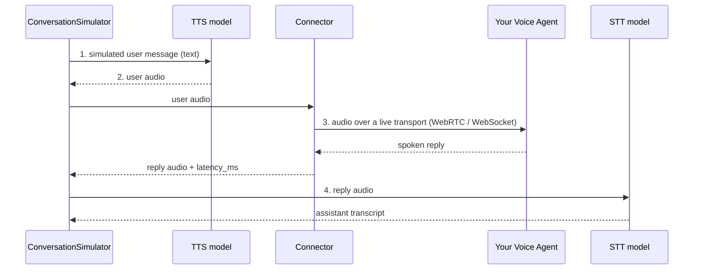
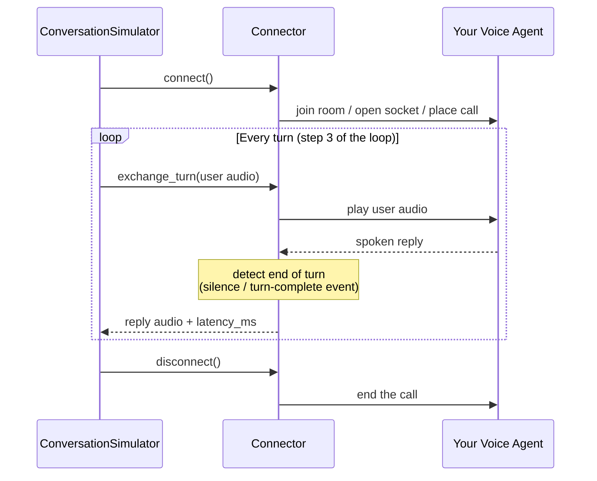

**语音智能体**是你用说话而非打字来交互的对话式 AI 系统——电话客服热线、餐厅预订机器人、应用内语音助手。评估它们意味着评估一段_口头的_对话，它比文本对话要多出严格更多的东西：

- **说了什么** —— 转写文本，`TurnRelevancyMetric` 等常规多轮指标可以评判。
- **听起来如何** —— 通话双方的实际音频。
- **何时发生** —— 响应延迟与轮次切换行为。

`deepeval` 把语音当作一等公民模态，这改变的是**对话如何产生，而不是如何评估**：你已熟知的流水线——金标进、测试用例出、指标加持——原封不动。一次模拟的语音对话产生一个标准的 `ConversationalTestCase`，其 `Turn` 在转写文本之外还携带音频与时间信息，因此你现有的 LLM-as-a-judge 指标继续有效，同时音频与时间数据被保留下来供语音专项分析使用。

三个部件使之成为可能：一个 TTS 模型为模拟来电者发声，一个 STT 模型转写智能体的回复，一个连接器把 `deepeval` 与你部署的语音智能体桥接起来。本页解释这些部件如何配合、语音数据如何呈现在测试用例上，以及启用打断后轮次切换有何变化。要真正运行语音模拟，请参见 `ConversationSimulator` 上的 [语音模式](/docs/conversation-simulator-voice-mode)。

## 语音有何不同

文本聊天机器人是一个函数：你传入一条消息，它返回一条。部署后的语音智能体则是一次**实时通话**：音频通过真实的传输协议双向流动，智能体内部运行自己的语音识别与语音合成，「一轮何时结束」是基于静默与时间的判断而非一个 return 语句。

这对评估有两点影响：

1. **你需要自己的语音模型。**为了模拟用户，`deepeval` 必须_说出_消息给你的智能体（语音转文字的反向：文字转语音）并_听_它的回复（语音转文字）。它们在你的智能体之外——是模拟来电者的嘴和耳朵。
2. **你需要通往智能体的桥。**「把这段音频发给我的智能体」没有通用 API；智能体因部署位置不同而通过不同协议可达。`deepeval` 连接器会打开这条实时会话，并在模拟器与你的智能体之间搬运音频。

## 语音评估如何运作

评估语音智能体的循环与评估文本聊天机器人相同——一个模拟用户与你的应用对话直到对话结束，然后对结果打分。语音版本在该循环中插入两个语音步骤，并把函数调用换成实时连接：

1. **生成用户消息。**模拟器模型根据 [`ConversationalGolden`](/docs/evaluation-datasets) 的 `scenario` 与 [`persona`](/docs/conversation-simulator-voice-personas) 扮演用户——与文本模拟完全一致。
2. **说出来** _（仅语音）_。TTS 模型把消息合成为音频：这就是模拟来电者的声音。
3. **播放给你的智能体并录下回复** _（仅语音）_。连接器通过实时传输流式发送音频，等待你的智能体说完，并连同 `latency_ms` 一起捕获回复音频。
4. **转写回复** _（仅语音）_。STT 模型把智能体的音频变成助手轮次的 `content`。
5. **决定是否继续。**[停止逻辑](/docs/conversation-simulator-stopping-logic)根据金标的 `expected_outcome` 检查对话——与文本完全一致。
6. **给对话打分。**完成的 `ConversationalTestCase` —— 转写加音频与时间——用你在文本对话上使用的同一批[多轮指标](/docs/metrics-introduction)评估。



<Info>
当平台已经提供转写时会跳过第 4 步：一些连接器（如 ElevenLabs）会在音频之外收到智能体自己的转写，`deepeval` 会直接使用它。
</Info>

<Warning>
第 2 到 4 步是流水线可能扭曲你所测内容的地方。请了解这些权衡：

- **默认不打断** —— 模拟来电者会等智能体说完再回复，因此除非人设要求，否则不会触发插话。见[打断](#interruptions)。
- **默认是理想化的来电者** —— TTS 语音干净、录音棚级：没有背景噪音、闷麦或犹豫。[人设](/docs/conversation-simulator-voice-personas)可以添加环境噪声与不同的声音，但通过测试更多证明的是对话能力而非音频鲁棒性。
- **STT 错误看起来像智能体错误** —— 转写准确率是评估准确率的上限，因此 STT 模型是流水线中对质量最关键的选择。
- **轮次结束是一种启发式** —— 静默阈值可能削掉长停顿并虚增 `latency_ms`，这就是为什么延迟只在同一协议内可比。
</Warning>

## 语音指标

语音指标遵循与测试用例相同的三段模型：

- **说了什么** 仍由 [`TurnRelevancyMetric`](/docs/metrics-turn-relevancy)、[`GoalAccuracyMetric`](/docs/metrics-goal-accuracy) 与 [`ToolUseMetric`](/docs/metrics-tool-use) 等现有对话式指标负责。
- **听起来如何** 由 [`VoiceNaturalnessMetric`](/docs/metrics-voice-naturalness)、[`SpeechIntelligibilityMetric`](/docs/metrics-speech-intelligibility)、[`VoiceConsistencyMetric`](/docs/metrics-voice-consistency) 与 [`AudioIntegrityMetric`](/docs/metrics-audio-integrity) 评估。
- **何时发生** 由 [`TurnTakingNaturalnessMetric`](/docs/metrics-turn-taking-naturalness) 与 [`AgentResponsivenessMetric`](/docs/metrics-agent-responsiveness) 评估。

[`VoiceReliabilityMetric`](/docs/metrics-voice-reliability) 是可选的运维汇总指标。它组合了响应性与音频完整性检查，但诸如缺少智能体音频或完全无响应的严重故障总是会把它的分数强制归零。轻微检查无法平均掉一场灾难。

全部七个语音指标返回 0 到 1 的分数，越高越好。延迟、响度、削波率、停顿时长、语速等测量值作为诊断证据出现在指标原因与明细中。它们不是通用的质量分数：一个停顿或响应延迟听起来是否自然，取决于对话中正在发生什么。

这些指标使用同一个 `ConversationalTestCase` 的不同部分：

- `VoiceNaturalnessMetric`、`SpeechIntelligibilityMetric` 与 `AudioIntegrityMetric` 分析每个助手 `Turn.audio`。
- `VoiceConsistencyMetric` 跨多个轮次比较助手音频。
- `TurnTakingNaturalnessMetric` 从每个 `Turn.audio.start_time` 与 `Audio.duration` 重建通话时间线，并用 `Turn.role` 识别说话者。
- `AgentResponsivenessMetric` 检查有序的转写与音频轮次，寻找缺失回复与重复提示。

没有 `start_time` 的音频片段仍可评估「听起来如何」。它无法诚实地推断静默或重叠，因此时间类指标会跳过没有通话相对位置的音频的测试用例。

## 语音模型

文字转语音（TTS）与语音转文字（STT）是不同于 LLM 的模型家族，提供商也大致独立。因为它们确实是不同的模型类型，`deepeval` 为它们提供了各自的基类——`DeepEvalBaseTTS` 与 `DeepEvalBaseSTT`——而不是把 `synthesize`/`transcribe` 方法硬塞进 `DeepEvalBaseLLM`。在语音模拟中两者扮演对立角色，其质量的重要性并不对称。

`deepeval` 目前默认使用 OpenAI 的 TTS 与 STT 模型。要使用其他提供商，请提供自定义语音模型；所需方法见 [语音模式](/docs/conversation-simulator-voice-mode#tts-and-stt-models)。

### 文字转语音（TTS）

TTS 模型把文本变成语音。在语音模拟中，**TTS 模型就是模拟用户的声音**：模拟器生成的每条用户消息都会在到达你的智能体之前被合成为语音。

一些 LLM 提供商提供 TTS（OpenAI、Gemini），而 ElevenLabs、Cartesia、Inworld 等专业厂商在自然度与声音多样性上领先。就模拟而言，门槛低于生产级语音产品——合成只需要清晰到你的智能体自己的语音识别不成为瓶颈，因为不自然或含混的语音会让整个模拟产生偏差。

### 语音转文字（STT）

STT 模型把语音变成文本。在语音模拟中，**STT 模型是 `deepeval` 聆听你智能体的方式**：它对每条语音回复的转写成为供你的指标评判的 `Turn.content`。

这使 STT 成为两者中更关乎质量的一个——转写准确率直接框定评估质量，并决定词错误率（WER）等语音专项测量。

## 打断

默认情况下模拟来电者从不打断：它说完自己的话，然后等智能体说完再继续。这是评估对话最简单的方式，但它不会测试重叠或插话。

线路上发生什么由两个独立的因素决定：

- **连接器**决定音频能否双向同时流动。`LiveKitConnector` 这样的全双工连接器允许来电者边听边说；`CallbackVoiceConnector` 这样做不到的则轮流说话。
- **人设**决定来电者是否借此插话。启用打断后，来电者可以在智能体说话时插话，任一方在语音重叠时退让。

模拟来电者是否打断是在其[人设](/docs/conversation-simulator-voice-personas)上配置的，因为打断频率与重叠行为是来电者的特质。配置方法与全双工连接器要求见[打断](/docs/conversation-simulator-voice-interruptions)。

## 传输与连接器

**传输（transport）**是音频如何移动，例如 WebRTC 或 WebSocket。**连接器（connector）**是 `deepeval` 使用该传输协议到达你智能体的集成。你根据现有智能体的部署方式选择连接器；它不是你的 STT 或 TTS 模型。

`deepeval` 目前提供以下连接器：

| Connector                | Use it when your agent is...                     | What you provide                                                |
| ------------------------ | ------------------------------------------------ | --------------------------------------------------------------- |
| `ElevenLabsConnector`    | an ElevenLabs conversational agent               | Its agent ID and, for a private agent, an API key               |
| `LiveKitConnector`       | running in a LiveKit room                        | A LiveKit URL, API key, API secret, and optional agent dispatch |
| `WebSocketConnector`     | exposed through a compatible raw-audio WebSocket | The URL and your message schema                                 |
| `CallbackVoiceConnector` | callable directly from the same Python process   | A callable that accepts user audio and returns the agent reply  |

前两个是提供商集成。`WebSocketConnector` 基于配置，因此自定义的 WebSocket 智能体通常不需要新的包装类。`CallbackVoiceConnector` 是进程内选项，在构建或测试流水线时很有用。只有传输方式或消息生命周期不同的智能体才需要自定义 `BaseVoiceConnector`。

安装方式、凭据、消息 schema 选项与自定义连接器指南见[语音连接器](/docs/conversation-simulator-voice-connectors)。

一个连接器为整段模拟对话持有一个智能体会话。在半双工模式下，它一次一个完整交换地驱动该会话：

| Method            | Responsibility                                                                                                         |
| ----------------- | ---------------------------------------------------------------------------------------------------------------------- |
| `connect()`       | 打开并保持一个可用的智能体会话：加入房间或打开套接字、完成认证，并等待音频可以流动。 |
| `exchange_turn()` | 把用户音频播放给智能体，等待其语音回复，并测量时间。                                           |
| `disconnect()`    | 拆除会话并释放其资源。                                                                       |

`exchange_turn()` 是[语音评估如何运作](#how-voice-evals-work)中的第 3 步。`connect()` 与 `disconnect()` 界定整段对话——每次对话一条实时通话：



每次对话一条连接器实时通话，也是语音模拟按顺序运行的原因——并发的对话会在同一会话上交织音频。模拟器把每次交换映射为 `ConversationalTestCase` 上一个普通的 [`Turn`](#voice-data-on-test-cases)——只有包装进程内智能体时你才需要自己构造传输回复类型；见 [Callback](/docs/conversation-simulator-voice-connectors#callback)。各连接器的轮次结束行为在[轮次检测](/docs/conversation-simulator-voice-connectors#turn-detection)中说明。

## 测试用例上的语音数据

语音数据就在你已经在用的测试用例类上，因此下游无需任何改动。语音对话仍然是由 `Turn` 组成的 `ConversationalTestCase` —— `Turn` 类的完整结构见[多轮测试用例](/docs/evaluation-multiturn-test-cases#turns) ——只是额外增加了几个语音字段：

```python
class Turn:
    role: Literal["user", "assistant"]
    content: str
    # Voice
    audio: Optional[Audio] = None
    latency_ms: Optional[float] = None
    interrupted: Optional[bool] = None
    ...
```

- **`Turn.audio`** 为该轮次持有一个 [`Audio`](#audio-data-model) 对象：用户轮次是合成的用户语音，助手轮次是智能体的回复。片段时长在 `Audio.duration`（秒）上，不在轮次上。
- **`Turn.latency_ms`** 记录智能体在用户音频发出后过了多久才开始说话（仅助手轮次）。这是等待时间，不是回复持续了多久。
- **`Turn.interrupted`** 在用户插话打断这条助手回复时为 `True`；未测试打断（半双工）或该轮正常结束时保持 `None`。

由于转写文本仍在每个 `Turn.content` 中，所有多轮指标在语音对话上原样可用——音频与时间字段是额外的信号，而不是一套平行格式。

### `Audio` 数据模型

以下是 `deepeval` 中 `Audio` 类的数据模型：

```python
class Audio:
    dataBase64: Optional[str] = None
    mimeType: Optional[str] = None
    url: Optional[str] = None
    sampleRate: Optional[int] = None
    encoding: Optional[str] = None
    duration: Optional[float] = None
    start_time: Optional[float] = None
```

`Audio` 有**七个**字段：

- [可选] `url`：字符串，本地文件路径或 `http(s)://` URL。设置后，`mimeType`、`filename` 与（本地文件的）`dataBase64` 会自动推导。默认为 `None`。
- [可选] `dataBase64`：字符串，保存在对象上的 base64 编码音频字节。由 `Audio.from_bytes(...)` 或加载本地 `url` 时自动设置；通常不需要你手动传入。默认为 `None`。
- [可选] `mimeType`：字符串，指定音频 MIME 类型，例如 `"audio/wav"`、`"audio/mpeg"`、`"audio/opus"`、`"audio/aac"`、`"audio/flac"` 或 `"audio/pcm"`。从 `url` 构造时按扩展名推测（回退为 `"audio/wav"`）。`Audio.from_bytes(...)` 必需。默认为 `None`。
- [可选] `sampleRate`：整数采样率，单位 Hz（例如 `24000`）。仅为元数据——知道时请设置。默认为 `None`。
- [可选] `encoding`：字符串容器/编解码器标签（例如 `"wav"`）。仅为元数据。默认为 `None`。
- [可选] `duration`：数字，表示该音频片段的时长（秒）。仅为元数据——这是语音_本身_的长度，不是智能体回复花了多久（`Turn.latency_ms`）。默认为 `None`。
- [可选] `start_time`：从通话开始到该片段第一帧的秒数。语音模拟会从实时的单调通话时钟填充它。配合 `duration`，指标可以重建真实的静默与重叠，而无需复制整段通话录音。手工构造或旧版音频默认为 `None`。

构造 `Audio` 有且只有两种方式：

```python
from deepeval.test_case import Audio

# From a local or remote file — mimeType, filename, and bytes are handled for you
recording = Audio(url="./agent-reply.wav")

# From raw bytes (e.g. TTS or connector output) — encodes into dataBase64 for you
recording = Audio.from_bytes(wav_bytes, mimeType="audio/wav", sampleRate=24000)
```

`Audio.from_bytes(...)` 是受支持的内存构造方式：传入原始 `bytes` 与 `mimeType`，它会在底层把它们存为 `dataBase64`。一般不应自己传 `dataBase64=`。

<Info>
在语音模拟期间你从不需要自己构建 `Audio` 对象——TTS 模型与连接器会构建并挂到 `Turn` 上。只有当你手工组装测试用例（例如来自录制的生产通话）时才需要手动构造。
</Info>

## 模拟语音对话

`ConversationSimulator` 把这一切整合起来：传入一个 `VoiceConfig`（连接器 + 可选语音模型）而不是 `model_callback`，每次模拟对话就变成一次语音通话。

在本例中，`ElevenLabsConnector` 连接到一个已有的 ElevenLabs 对话式智能体。它是智能体桥；模拟来电者使用的 TTS 与 STT 模型仍是 `VoiceConfig` 的默认值。

```python
from deepeval.voice import VoiceConfig, ElevenLabsConnector
from deepeval.simulator import ConversationSimulator

simulator = ConversationSimulator(
    voice_config=VoiceConfig(connector=ElevenLabsConnector(agent_id="your-agent-id")),
)
```

配置与自定义语音模型见[语音模式](/docs/conversation-simulator-voice-mode)，连接器目录见[语音连接器](/docs/conversation-simulator-voice-connectors)，谁来打电话见[人设](/docs/conversation-simulator-voice-personas)，插话见[打断](/docs/conversation-simulator-voice-interruptions)。

## FAQs

<AccordionGroup>
<Accordion title="Why does deepeval need its own TTS and STT if my agent already has them?">
你智能体的语音栈在*被测系统内部*。`deepeval` 的语音模型位于通话的另一端——它们是模拟来电者的嘴和耳朵，把用户轮次说给你的智能体听，并转写它的回复，供指标评判对话。
</Accordion>
<Accordion title="Which connector should I use to reach my agent?">
使用与你智能体现有部署方式匹配的连接器：ElevenLabs 对话式智能体用 `ElevenLabsConnector`，LiveKit 房间用 `LiveKitConnector`，兼容的原始音频 WebSocket 用 `WebSocketConnector`。可在同一 Python 进程内调用的智能体用 `CallbackVoiceConnector`。
</Accordion>
<Accordion title="What exactly does latency_ms measure?">
从发出模拟用户的音频到捕获智能体语音回复的时间。确切的时间边界取决于连接器的传输方式，因此延迟测量只在相同类型的连接器之间比较。
</Accordion>
<Accordion title="Do my existing multi-turn metrics work on voice conversations?">
可以。语音模拟产生一个标准的 `ConversationalTestCase`，其转写文本保存在每个 `Turn.content` 中——`TurnRelevancyMetric` 等指标评判它与评判文本对话的方式完全一致。音频与 `latency_ms` 字段是其上的额外信号。
</Accordion>
<Accordion title="Can one connector serve multiple conversations concurrently?">
不可以——一个连接器只持有一条实时通话，因此模拟器会在每段对话的首轮前连接、结束时断开，并按顺序运行对话。并发对话会在同一会话上交织音频。
</Accordion>
</AccordionGroup>
