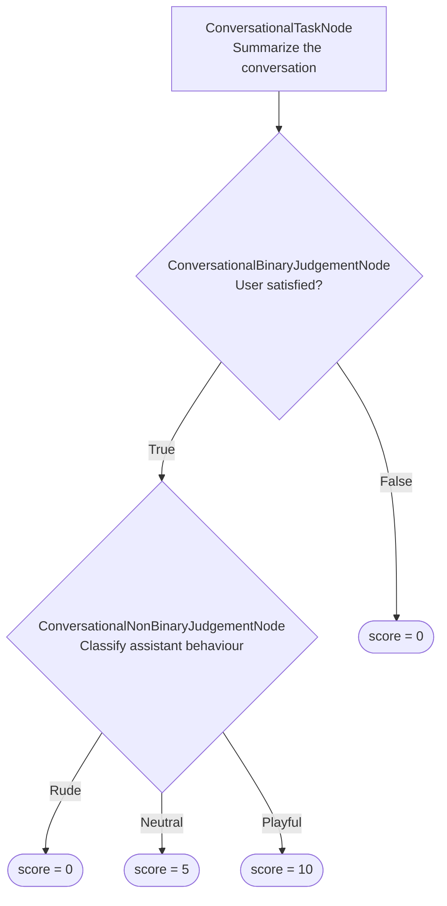

**标签**：LLM-as-a-judge · 自定义 · 多轮 · 多模态

`deepeval` 中的对话式深无环图（DAG）指标是目前最通用的自定义指标，让你借助 LLM-as-a-judge 轻松构建确定性的多轮评估决策树。

`ConversationalDAGMetric` 比 [`ConversationalGEval`](/docs/metrics-conversational-g-eval) 给你更确定性的打分控制：它把复杂的标准拆解为聚焦的决策，并把决策结果映射到你定义的分数。你还可以在 `ConversationalDAGMetric` 内使用 `ConversationalGEval` 或 `deepeval` 的任何其他多轮指标。

<Tip>
要从零到一完整构建一个对话式 DAG，见[构建 DAG 指南中的多轮演练](/guides/guides-dag-metric#multi-turn-walkthrough)。
</Tip>

<details>

<summary>Should I use conversational DAG or G-Eval?</summary>

两者都使用 LLM 裁判，但提供的控制粒度不同：

|                                | `ConversationalDAGMetric`                                          | `ConversationalGEval`                               |
| ------------------------------ | ------------------------------------------------------------------ | --------------------------------------------------- |
| **评分结构**           | 显式的任务、分支与结果                             | 单一整体标准或步骤序列         |
| **分数分配**           | 由你为终态结果分配分数                             | 由评估模型生成分数            |
| **最适用场景**                   | 条件规则、门槛和已知的打分路径                  | 难以逐一列举的主观质量   |
| **搭建成本**                      | 更复杂；需要定义并连接节点                  | 更简单；只需标准或评估步骤      |
| **评估模型调用**     | 图执行过程中的一次或多次聚焦调用                    | 单一指标工作流                            |
| **分数映射控制** | 高                                                               | 较低                                               |
| **判定波动性**       | 分支判定仍由 LLM 完成，但分数映射是受控的 | 定性判断与分数都交给模型评审 |

当你能把评分规则表达为「用户不满意立即判负；否则继续评估语气」这类规则时，使用对话式 DAG。当对对话的一次整体判断就足够时，使用 `ConversationalGEval`。

</details>

## Required Arguments

使用 `ConversationalDAGMetric` 时，创建一个带以下参数的 [`ConversationalTestCase`](/docs/evaluation-multiturn-test-cases)：

- `turns`

如果你的评估标准依赖这些参数，还需要在 `turns` 中提供 `retrieval_context`、`tools_called` 等额外参数。

## Usage

只需创建一个有向无环图，以自顶向下的方式用可用节点定义你的评估轨迹，并把它传给 `ConversationalDAGMetric`：

<Tabs>

<Tab title="Python">

```python
from deepeval.metrics.conversational_dag import ConversationalBinaryJudgementNode
from deepeval.test_case import ConversationalTestCase, Turn, MultiTurnParams
from deepeval.metrics import ConversationalDAGMetric
from deepeval.metrics.dag import DeepAcyclicGraph
from deepeval import evaluate

satisfaction = ConversationalBinaryJudgementNode(
    criteria="Do the assistant's replies satisfy the user's questions?",
    evaluation_params=[MultiTurnParams.ROLE, MultiTurnParams.CONTENT],
)
satisfaction.add_verdict(verdict=True, score=10)
satisfaction.add_verdict(verdict=False, score=0)

metric = ConversationalDAGMetric(
    name="User Satisfaction",
    dag=DeepAcyclicGraph(root_nodes=[satisfaction]),
)

test_case = ConversationalTestCase(
    turns=[
        Turn(role="user", content="What's the weather in Paris?"),
        Turn(role="assistant", content="Sunny and 24°C today."),
    ]
)

evaluate(test_cases=[test_case], metrics=[metric])
```

</Tab>

<Tab title="TypeScript">

```typescript
import {
  ConversationalBinaryJudgementNode,
  ConversationalDAGMetric,
  DeepAcyclicGraph,
} from "deepeval/metrics";
import {
  ConversationalTestCase,
  Turn,
  MultiTurnParams,
} from "deepeval/test-case";
import { evaluate } from "deepeval";

const satisfaction = new ConversationalBinaryJudgementNode({
  criteria: "Do the assistant's replies satisfy the user's questions?",
  evaluationParams: [MultiTurnParams.ROLE, MultiTurnParams.CONTENT],
});
satisfaction.addVerdict(true, { score: 10 });
satisfaction.addVerdict(false, { score: 0 });

const metric = new ConversationalDAGMetric({
  name: "User Satisfaction",
  dag: new DeepAcyclicGraph({ rootNodes: [satisfaction] }),
});

const testCase = new ConversationalTestCase({
  turns: [
    new Turn({ role: "user", content: "What's the weather in Paris?" }),
    new Turn({ role: "assistant", content: "Sunny and 24°C today." }),
  ],
});

await evaluate([testCase], [metric]);
```

</Tab>

</Tabs>

<Tabs>

<Tab title="Python">

创建 `ConversationalDAGMetric` 时有**两个**必填参数和**七个**可选参数：

- `name`：表示指标名称的字符串。
- `dag`：要执行的 `DeepAcyclicGraph`。
- [可选] `threshold`：最低通过分数。也可设为 `None`，以[仅分数模式](/docs/metrics-introduction#metric-thresholds)运行指标。默认为 `0.5`。
- [可选] `model`：OpenAI 模型名称，或 `DeepEvalBaseLLM` 类型的[自定义评估模型](/docs/metrics-introduction#using-a-custom-llm)。默认为 `gpt-5.4`。
- [可选] `include_reason`：是否为最终分数生成理由。默认为 `True`。
- [可选] `strict_mode`：为 `True` 时把阈值设为 `1`。默认为 `False`。
- [可选] `async_mode`：`measure()` 是否异步执行图。默认为 `True`。
  
- [可选] `verbose_mode`：是否打印用于计算分数的节点与结果。默认为 `False`。
- [可选] `flaky`：布尔值，设为 `True` 时，[把指标标记为 flaky](/docs/metrics-introduction#flaky-metrics)。默认为 `False`。

</Tab>

<Tab title="TypeScript">

创建 `ConversationalDAGMetric` 时有**两个**必填参数和**六个**可选参数：

- `name`：表示指标名称的字符串。
- `dag`：要执行的 `DeepAcyclicGraph`。
- [可选] `threshold`：最低通过分数。默认为 `0.5`。
- [可选] `model`：OpenAI 模型名称，或 `DeepEvalBaseLLM` 类型的[自定义评估模型](/docs/metrics-introduction#using-a-custom-llm)。默认为 `gpt-5.4`。
- [可选] `includeReason`：是否为最终分数生成理由。默认为 `true`。
- [可选] `strictMode`：为 `true` 时把阈值设为 `1`。默认为 `false`。
- [可选] `verboseMode`：是否打印用于计算分数的节点与结果。默认为 `false`。
- [可选] `showIndicator`：图运行期间是否显示进度指示器。默认为 `true`。

</Tab>

</Tabs>

### 独立运行

你也可以直接对单个测试用例运行 `ConversationalDAGMetric`：

<Tabs>

<Tab title="Python">

```python
metric.measure(test_case)
print(metric.score, metric.reason)
```

</Tab>

<Tab title="TypeScript">

```typescript
await metric.measure(testCase);
console.log(metric.score, metric.reason);
```

</Tab>

</Tabs>

<Warning>
独立执行适合调试，但它不包含 `evaluate()` 或 `deepeval test run` 提供的报告、缓存、并发与 Confident AI 集成。
</Warning>

## DAG Concepts

在查看可用的[节点类型](#dag-node-types)之前，先理解对话式 DAG 如何启动、如何划定轮次范围、如何校验自身结构会很有帮助。

下图展示了处理节点与判断节点如何连接成带分支结果、评估整段对话的 DAG，以及每条路径在哪里结束。



### Root Nodes

`root_nodes` 包含评估开始的节点。根可以是 `ConversationalTaskNode`、`ConversationalBinaryJudgementNode` 或 `ConversationalNonBinaryJudgementNode`。

你可以提供多个 `ConversationalTaskNode` 根。若二元或非二元判断作为根，它必须是唯一的根。

### Turn Windows

任何任务或判断节点都可以只关注对话的一个片段而非每一轮。传入由两个闭区间索引组成的 `turn_window`，限制节点能看到的内容：

<Tabs>

<Tab title="Python">

```python
task = ConversationalTaskNode(
    instructions="Summarize the assistant's replies in one paragraph.",
    output_label="Summary",
    evaluation_params=[MultiTurnParams.ROLE, MultiTurnParams.CONTENT],
    turn_window=(0, 6),
)
```

</Tab>

<Tab title="TypeScript">

```typescript
const task = new ConversationalTaskNode({
  instructions: "Summarize the assistant's replies in one paragraph.",
  outputLabel: "Summary",
  evaluationParams: [MultiTurnParams.ROLE, MultiTurnParams.CONTENT],
  turnWindow: [0, 6],
});
```

</Tab>

</Tabs>

当检查只适用于对话的一部分（例如问候语或最终解决方案）时，使用轮次窗口。


### Shared Nodes and Multiple Parents

下游节点可以被多条路径复用。在路径汇合处添加同一个节点实例即可；图会记录每条入边依赖，只有活动路径到达时才执行共享节点。

### Reaching a Verdict

DAG 没有唯一的出口节点。相反，穿过图的每条路径都结束在你用 `add_verdict` 在判断节点上注册的某个结果上：

<Tabs>

<Tab title="Python">

```python
judgement.add_verdict(verdict=False, score=0)          # ends the path with a score
judgement.add_verdict(verdict=True, then=another_node) # continues to another node or metric
```

</Tab>

<Tab title="TypeScript">

```typescript
judgement.addVerdict(false, { score: 0 });          // ends the path with a score
judgement.addVerdict(true, { then: anotherNode });  // continues to another node or metric
```

</Tab>

</Tabs>

注册判定时有**一个**必填参数和**两个**可选参数：

- `verdict`：二元判断用布尔值，非二元判断用唯一字符串。
- [可选] `score`：`0` 到 `10` 的整数，结束该路径。
- [可选] `then`：接下来要执行的下游节点、`ConversationalGEval` 或其他 `BaseConversationalMetric`。

每次调用必须且只能定义 `score` 或 `then` 之一。`score` 会终止评估并成为指标结果；指向 `ConversationalGEval` 或其他 `BaseConversationalMetric` 的 `then` 也一样——子指标的分数被采纳为最终分数。只有指向另一个任务或判断节点的 `then` 会让图继续走下去，因此每条路径都保证结束于某个固定分数或某个指标。

### Graph Validation

`DeepAcyclicGraph` 在构造时校验整张图。它会拒绝：

- 环；
- 非法的节点连接；
- binary judgements without exactly one `True`（TypeScript 中为 `true`） and one `False`（TypeScript 中为 `false`） verdict;
- 没有唯一字符串判定的非二元判断；以及
- 同时定义 `score` 与 `then`、或两者都未定义的判定。

请在每个判断都拥有全部结果之后再构建图。

## DAG Node Types

多轮 DAG 使用三种节点类型。先定义节点，再用 `add_node` 与 `add_verdict` 连接。

每个构造函数只配置该节点自身，不声明子节点或结果。这些连接在初始化之后添加。

### `ConversationalTaskNode`

`ConversationalTaskNode` 把对话或父任务节点的输出转换为结构化证据，供下游决策使用。它不打分。

<Tabs>

<Tab title="Python">

```python
from deepeval.metrics.conversational_dag import ConversationalTaskNode
from deepeval.test_case import MultiTurnParams

task = ConversationalTaskNode(
    instructions="Summarize the conversation and explain the assistant's behaviour overall.",
    output_label="Summary",
    evaluation_params=[MultiTurnParams.ROLE, MultiTurnParams.CONTENT],
    label="Conversation summary",
)
```

</Tab>

<Tab title="TypeScript">

```typescript
import { ConversationalTaskNode } from "deepeval/metrics";
import { MultiTurnParams } from "deepeval/test-case";

const task = new ConversationalTaskNode({
  instructions: "Summarize the conversation and explain the assistant's behaviour overall.",
  outputLabel: "Summary",
  evaluationParams: [MultiTurnParams.ROLE, MultiTurnParams.CONTENT],
  label: "Conversation summary",
});
```

</Tab>

</Tabs>

<Tabs>

<Tab title="Python">

创建 `ConversationalTaskNode` 时有**两个**必填参数和**三个**可选参数：

</Tab>

<Tab title="TypeScript">

创建 `ConversationalTaskNode` 时有**两个**必填参数和**两个**可选参数：

</Tab>

</Tabs>

- `instructions`：处理对话的指示。
- `output_label`：向子节点呈现该节点输出时使用的名称。
- [可选] `evaluation_params`：该节点可用的 `MultiTurnParams` 列表。
- [可选] `turn_window`：两个闭区间索引，把节点限制在对话的一个切片上。
- [可选] `label`：在详细日志中显示的名称。

两个节点都初始化后，用 `add_node` 把一个任务连接到另一个任务或判断节点。这会添加一条出边，但不定义结果。`ConversationalTaskNode` 自己无法结束图——只有判断节点定义结果。

<Tabs>

<Tab title="Python">

```python
task.add_node(judgement)
```

</Tab>

<Tab title="TypeScript">

```typescript
task.addNode(judgement);
```

</Tab>

</Tabs>

### `ConversationalBinaryJudgementNode`

A `ConversationalBinaryJudgementNode` evaluates one criterion against the conversation and returns either `True`（TypeScript 中为 `true`） or `False`（TypeScript 中为 `false`）.

<Tabs>

<Tab title="Python">

```python
from deepeval.metrics.conversational_dag import ConversationalBinaryJudgementNode
from deepeval.test_case import MultiTurnParams

judgement = ConversationalBinaryJudgementNode(
    criteria="Do the assistant's replies satisfy the user's questions?",
    evaluation_params=[MultiTurnParams.ROLE, MultiTurnParams.CONTENT],
    label="User satisfaction",
)
```

</Tab>

<Tab title="TypeScript">

```typescript
import { ConversationalBinaryJudgementNode } from "deepeval/metrics";
import { MultiTurnParams } from "deepeval/test-case";

const judgement = new ConversationalBinaryJudgementNode({
  criteria: "Do the assistant's replies satisfy the user's questions?",
  evaluationParams: [MultiTurnParams.ROLE, MultiTurnParams.CONTENT],
  label: "User satisfaction",
});
```

</Tab>

</Tabs>

创建 `ConversationalBinaryJudgementNode` 时有**一个**必填参数和**三个**可选参数：

- `criteria`：评估模型必须回答的是/否问题。
- [可选] `evaluation_params`：该节点可用的 `MultiTurnParams` 列表。
- [可选] `turn_window`：两个闭区间索引，把节点限制在对话的一个切片上。
- [可选] `label`：在详细日志中显示的名称。

The constructor does not define the branches. Add exactly one `True`（TypeScript 中为 `true`） verdict and one `False`（TypeScript 中为 `false`） verdict afterward:

<Tabs>

<Tab title="Python">

```python
judgement.add_verdict(verdict=False, score=0)
judgement.add_verdict(verdict=True, then=behaviour_node)
```

</Tab>

<Tab title="TypeScript">

```typescript
judgement.addVerdict(false, { score: 0 });
judgement.addVerdict(true, { then: behaviourNode });
```

</Tab>

</Tabs>

这里 `score` 结束路径，而 `then` 指定接下来执行的节点或指标。

<Warning>
There is no need to specify that the output has to be either `True`（TypeScript 中为 `true`） or `False`（TypeScript 中为 `false`） in the `criteria`.
</Warning>

### `ConversationalNonBinaryJudgementNode`

`ConversationalNonBinaryJudgementNode` 把对话分类为若干命名结果之一。

<Tabs>

<Tab title="Python">

```python
from deepeval.metrics.conversational_dag import ConversationalNonBinaryJudgementNode
from deepeval.test_case import MultiTurnParams

judgement = ConversationalNonBinaryJudgementNode(
    criteria="How was the assistant's behaviour towards the user?",
    evaluation_params=[MultiTurnParams.ROLE, MultiTurnParams.CONTENT],
    label="Assistant behaviour",
)
```

</Tab>

<Tab title="TypeScript">

```typescript
import { ConversationalNonBinaryJudgementNode } from "deepeval/metrics";
import { MultiTurnParams } from "deepeval/test-case";

const judgement = new ConversationalNonBinaryJudgementNode({
  criteria: "How was the assistant's behaviour towards the user?",
  evaluationParams: [MultiTurnParams.ROLE, MultiTurnParams.CONTENT],
  label: "Assistant behaviour",
});
```

</Tab>

</Tabs>

创建 `ConversationalNonBinaryJudgementNode` 时有**一个**必填参数和**三个**可选参数：

- `criteria`：评估模型必须回答的分类问题。
- [可选] `evaluation_params`：该节点可用的 `MultiTurnParams` 列表。
- [可选] `turn_window`：两个闭区间索引，把节点限制在对话的一个切片上。
- [可选] `label`：在详细日志中显示的名称。

构造函数不定义可能的结果。之后至少添加一个唯一字符串判定：

<Tabs>

<Tab title="Python">

```python
judgement.add_verdict(verdict="Rude", score=0)
judgement.add_verdict(verdict="Neutral", score=5)
judgement.add_verdict(verdict="Playful", score=10)
```

</Tab>

<Tab title="TypeScript">

```typescript
judgement.addVerdict("Rude", { score: 0 });
judgement.addVerdict("Neutral", { score: 5 });
judgement.addVerdict("Playful", { score: 10 });
```

</Tab>

</Tabs>

可能的输出被限定在你定义的判定字符串内。

<Warning>
无需在 `criteria` 中指定可能的输出选项。
</Warning>

## How Is It Calculated?

与从一次整体评估得出分数的指标不同，`ConversationalDAGMetric` 通过遵循你定义的图结构来计算结果。评估模型在判断节点上做决策，被选中的判定路径决定 DAG 返回固定分数还是继续进入另一个指标。

### Execution Order

图按依赖顺序执行。任务节点先产出证据，判断节点评估各自的标准，被选中的判定决定评估结束还是继续。

<Tabs>

<Tab title="Python">

`async_mode=True` 时，相互独立的分支可以并发执行。

</Tab>

<Tab title="TypeScript">

相互独立的分支总是并发执行。

</Tab>

</Tabs>

### Branch Selection

Only the verdict matching a judgement node's output is followed. A binary judgement selects its `True`（TypeScript 中为 `true`） or `False`（TypeScript 中为 `false`） verdict, while a non-binary judgement selects one of its configured string verdicts.

### Score Calculation

终结判定的 `score` 会从 `0`–`10` 区间归一化到指标的 `0`–`1` 区间：

$$
\text{Conversational DAG Score} = \frac{\text{Selected Verdict Score}}{10}
$$

例如 `score=10` 产生 `1.0`，`score=4` 产生 `0.4`。结果分数达到指标的 `threshold` 即通过。

### Child Metric Execution

判定可以不赋分数，而是继续进入一个 `ConversationalGEval` 或其他 `BaseConversationalMetric`：

<Tabs>

<Tab title="Python">

```python
from deepeval.test_case import MultiTurnParams
from deepeval.metrics import ConversationalGEval

politeness = ConversationalGEval(
    name="Politeness",
    criteria="Determine whether the assistant remains polite throughout the conversation.",
    evaluation_params=[MultiTurnParams.CONTENT],
)

judgement.add_verdict(verdict=True, then=politeness)
```

</Tab>

<Tab title="TypeScript">

```typescript
import { MultiTurnParams } from "deepeval/test-case";
import { ConversationalGEval } from "deepeval/metrics";

const politeness = new ConversationalGEval({
  name: "Politeness",
  criteria: "Determine whether the assistant remains polite throughout the conversation.",
  evaluationParams: [MultiTurnParams.CONTENT],
});

judgement.addVerdict(true, { then: politeness });
```

</Tab>

</Tabs>

子指标的分数与理由会成为该路径的 `ConversationalDAGMetric` 结果。

<Note>
开启详细模式即可检查评估期间使用的节点、输出、判断与被选中的判定。
</Note>

## Examples

### Binary Gate

当一条硬性要求应立即决定结果时，使用二元根：

<Tabs>

<Tab title="Python">

```python
resolution_check = ConversationalBinaryJudgementNode(
    criteria="Was the user's issue resolved by the end of the conversation?",
    evaluation_params=[MultiTurnParams.ROLE, MultiTurnParams.CONTENT],
)
resolution_check.add_verdict(verdict=False, score=0)
resolution_check.add_verdict(verdict=True, score=10)

dag = DeepAcyclicGraph(root_nodes=[resolution_check])
```

</Tab>

<Tab title="TypeScript">

```typescript
const resolutionCheck = new ConversationalBinaryJudgementNode({
  criteria: "Was the user's issue resolved by the end of the conversation?",
  evaluationParams: [MultiTurnParams.ROLE, MultiTurnParams.CONTENT],
});
resolutionCheck.addVerdict(false, { score: 0 });
resolutionCheck.addVerdict(true, { score: 10 });

const dag = new DeepAcyclicGraph({ rootNodes: [resolutionCheck] });
```

</Tab>

</Tabs>

### Multi-Stage DAG with a Summary

当后续决策依赖同一份对话摘要时，使用一个任务后接多个判断：

<Tabs>

<Tab title="Python">

```python
summary.add_node(satisfaction)

satisfaction.add_verdict(verdict=False, score=0)
satisfaction.add_verdict(verdict=True, then=behaviour)

behaviour.add_verdict(verdict="Rude", score=0)
behaviour.add_verdict(verdict="Neutral", score=5)
behaviour.add_verdict(verdict="Playful", score=10)

dag = DeepAcyclicGraph(root_nodes=[summary])
```

</Tab>

<Tab title="TypeScript">

```typescript
summary.addNode(satisfaction);

satisfaction.addVerdict(false, { score: 0 });
satisfaction.addVerdict(true, { then: behaviour });

behaviour.addVerdict("Rude", { score: 0 });
behaviour.addVerdict("Neutral", { score: 5 });
behaviour.addVerdict("Playful", { score: 10 });

const dag = new DeepAcyclicGraph({ rootNodes: [summary] });
```

</Tab>

</Tabs>

完整可运行示例见[构建 DAG 指南中的多轮演练](/guides/guides-dag-metric#multi-turn-walkthrough)。

## FAQs

<AccordionGroup>
<Accordion title="When is a multi-turn DAG worth it over ConversationalGEval?">
当单一的整体分数掩盖了真正重要的东西时——例如请求被满足了但助手很粗鲁。[ConversationalGEval](/docs/metrics-conversational-g-eval) 会把这些平均成一个模糊分数；DAG 则在各自确定的分支上分别检查满意度与语气。
</Accordion>
<Accordion title="What does a turn window do and when should I set it?">
它是一对可选的闭区间轮次索引，把节点限制在对话的一个片段内（例如第 0 到第 6 轮）。当检查只适用于对话的一部分（如问候语或最终解决方案）时设置它。
</Accordion>
<Accordion title="How do I make one branch lead to more checks instead of ending?">
Pass `then` instead of `score` when registering a verdict — e.g. point a `True`（TypeScript 中为 `true`） verdict's `then` at a `ConversationalNonBinaryJudgementNode` to grade further. Provide one, never both.
</Accordion>
<Accordion title="Can I reuse the single-turn DAG nodes here?">
不行——请使用对话式变体：`ConversationalTaskNode`、`ConversationalBinaryJudgementNode` 与 `ConversationalNonBinaryJudgementNode`。它们接受 `MultiTurnParams`，并能把 `ConversationalGEval` 作为叶子嵌入。
</Accordion>
</AccordionGroup>
