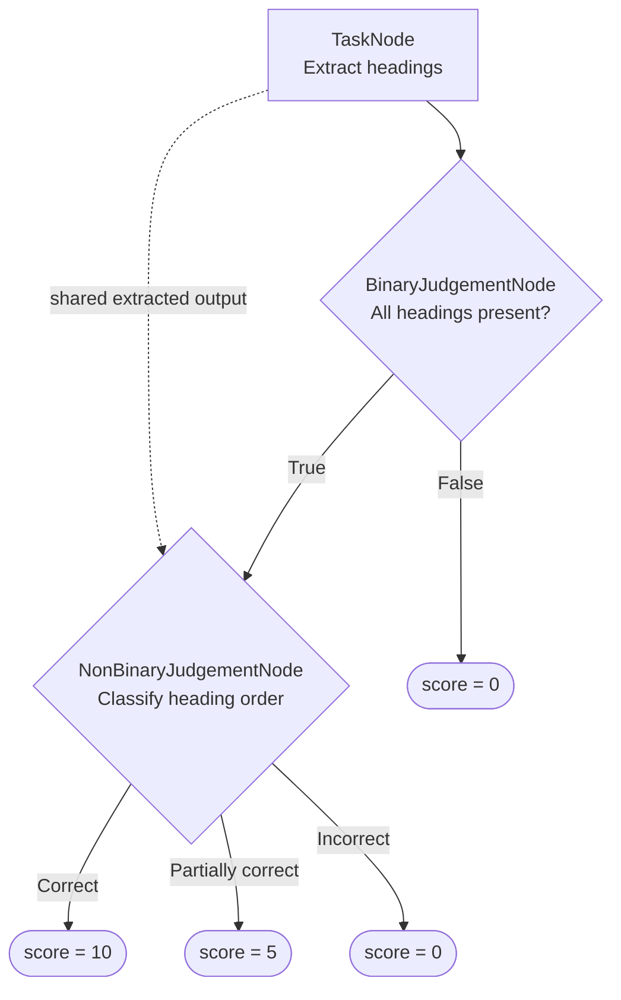

**标签**：LLM-as-a-judge · 自定义 · 单轮 · 多模态

`deepeval` 中的深无环图（DAG）指标是目前最通用的自定义指标，让你借助 LLM-as-a-judge 轻松构建确定性的评估决策树。

`DAGMetric` 比 [`GEval`](/docs/metrics-llm-evals) 给你更确定性的打分控制：它把复杂的标准拆解为聚焦的决策，并把决策结果映射到你定义的分数。你还可以在 `DAGMetric` 内使用 `GEval` 或 `deepeval` 的任何其他默认指标。

<Tip>
要从零到一完整构建一个 DAG，见[构建 DAG 指标指南](/guides/guides-dag-metric)。
</Tip>

<details>

<summary>Should I use DAG or G-Eval?</summary>

两者都使用 LLM 裁判，但提供的控制粒度不同：

|                                | `DAGMetric`                                                        | `GEval`                                             |
| ------------------------------ | ------------------------------------------------------------------ | --------------------------------------------------- |
| **评分结构**           | 显式的任务、分支与结果                             | 单一整体标准或步骤序列         |
| **分数分配**           | 由你为终态结果分配分数                             | 由评估模型生成分数            |
| **最适用场景**                   | 条件规则、门槛和已知的打分路径                  | 难以逐一列举的主观质量   |
| **搭建成本**                      | 更复杂；需要定义并连接节点                  | 更简单；只需标准或评估步骤      |
| **评估模型调用**     | 图执行过程中的一次或多次聚焦调用                    | 单一指标工作流                            |
| **分数映射控制** | 高                                                               | 较低                                               |
| **判定波动性**       | 分支判定仍由 LLM 完成，但分数映射是受控的 | 定性判断与分数都交给模型评审 |

当你能把评分规则表达为「缺一项要求立即判负；否则继续评估质量」这类规则时，使用 DAG。当一次整体判断就足够时，使用 `GEval`。

</details>

## Required Arguments

使用 `DAGMetric` 时，创建一个带以下参数的 [`LLMTestCase`](/docs/evaluation-test-cases#llm-test-case)：

- `input`

如果你的评估标准依赖这些参数，还需要提供 `expected_output`、`tools_called` 等额外参数。

## Usage

只需创建一个有向无环图，以自顶向下的方式用可用节点定义你的评估轨迹，并把它传给 `DAGMetric`：

<Tabs>

<Tab title="Python">

```python
from deepeval.metrics.dag import (
    BinaryJudgementNode,
    DeepAcyclicGraph,
)
from deepeval.test_case import LLMTestCase, SingleTurnParams
from deepeval.metrics import DAGMetric
from deepeval import evaluate

correctness = BinaryJudgementNode(
    criteria="Is the actual output correct for the input?",
    evaluation_params=[
        SingleTurnParams.INPUT,
        SingleTurnParams.ACTUAL_OUTPUT,
    ],
)
correctness.add_verdict(verdict=True, score=10)
correctness.add_verdict(verdict=False, score=0)

metric = DAGMetric(
    name="Correctness",
    dag=DeepAcyclicGraph(root_nodes=[correctness]),
)

test_case = LLMTestCase(
    input="What is the capital of France?",
    actual_output="Paris.",
)

evaluate(test_cases=[test_case], metrics=[metric])
```

</Tab>

<Tab title="TypeScript">

```typescript
import {
  BinaryJudgementNode,
  DAGMetric,
  DeepAcyclicGraph,
} from "deepeval/metrics";
import { LLMTestCase, SingleTurnParams } from "deepeval/test-case";
import { evaluate } from "deepeval";

const correctness = new BinaryJudgementNode({
  criteria: "Is the actual output correct for the input?",
  evaluationParams: [
    SingleTurnParams.INPUT,
    SingleTurnParams.ACTUAL_OUTPUT,
  ],
});
correctness.addVerdict(true, { score: 10 });
correctness.addVerdict(false, { score: 0 });

const metric = new DAGMetric({
  name: "Correctness",
  dag: new DeepAcyclicGraph({ rootNodes: [correctness] }),
});

const testCase = new LLMTestCase({
  input: "What is the capital of France?",
  actualOutput: "Paris.",
});

await evaluate([testCase], [metric]);
```

</Tab>

</Tabs>

<Tabs>

<Tab title="Python">

创建 `DAGMetric` 时有**两个**必填参数和**七个**可选参数：

- `name`：表示指标名称的字符串。
- `dag`：要执行的 `DeepAcyclicGraph`。
- [可选] `threshold`：最低通过分数。也可设为 `None`，以[仅分数模式](/docs/metrics-introduction#metric-thresholds)运行指标。默认为 `0.5`。
- [可选] `model`：OpenAI 模型名称，或 `DeepEvalBaseLLM` 类型的[自定义评估模型](/docs/metrics-introduction#using-a-custom-llm)。默认为 `gpt-5.4`。
- [可选] `include_reason`：是否为最终分数生成理由。默认为 `True`。
- [可选] `strict_mode`：为 `True` 时把阈值设为 `1`。默认为 `False`。
- [可选] `async_mode`：`measure()` 是否异步执行图。默认为 `True`。
  
- [可选] `verbose_mode`：是否打印用于计算分数的节点与结果。默认为 `False`。
- [可选] `flaky`：布尔值，设为 `True` 时，[把指标标记为 flaky](/docs/metrics-introduction#flaky-metrics)。默认为 `False`。

</Tab>

<Tab title="TypeScript">

创建 `DAGMetric` 时有**两个**必填参数和**六个**可选参数：

- `name`：表示指标名称的字符串。
- `dag`：要执行的 `DeepAcyclicGraph`。
- [可选] `threshold`：最低通过分数。默认为 `0.5`。
- [可选] `model`：OpenAI 模型名称，或 `DeepEvalBaseLLM` 类型的[自定义评估模型](/docs/metrics-introduction#using-a-custom-llm)。默认为 `gpt-5.4`。
- [可选] `includeReason`：是否为最终分数生成理由。默认为 `true`。
- [可选] `strictMode`：为 `true` 时把阈值设为 `1`。默认为 `false`。
- [可选] `verboseMode`：是否打印用于计算分数的节点与结果。默认为 `false`。
- [可选] `showIndicator`：图运行期间是否显示进度指示器。默认为 `true`。

</Tab>

</Tabs>

### 在组件内

你可以在嵌套组件内运行 `DAGMetric`，进行[组件级评估](/docs/evaluation-component-level-llm-evals)：

<Tabs>

<Tab title="Python">

```python
from deepeval.dataset import EvaluationDataset, Golden
from deepeval.tracing import observe, update_current_span

@observe(metrics=[metric])
def inner_component():
    test_case = LLMTestCase(
        input="What is the capital of France?",
        actual_output="Paris.",
    )
    update_current_span(test_case=test_case)

@observe
def llm_app(input: str):
    inner_component()

dataset = EvaluationDataset(goldens=[Golden(input="Hi!")])
for golden in dataset.evals_iterator():
    llm_app(golden.input)
```

</Tab>

<Tab title="TypeScript">

```typescript
import { EvaluationDataset, Golden } from "deepeval/dataset";
import { observe, updateCurrentSpan } from "deepeval/tracing";
// ...

const innerComponent = observe({
  metrics: [metric],
  fn: async () => {
    const testCase = new LLMTestCase({
      input: "What is the capital of France?",
      actualOutput: "Paris.",
    });
    updateCurrentSpan({ testCase });
  },
});

const llmApp = observe({
  fn: async (input: string) => {
    await innerComponent();
  },
});

const dataset = new EvaluationDataset({ goldens: [new Golden({ input: "Hi!" })] });
for await (const golden of dataset.evalsIterator()) {
  await llmApp((golden as Golden).input);
}
```

</Tab>

</Tabs>

### 独立运行

你也可以直接对单个测试用例运行 `DAGMetric`：

<Tabs>

<Tab title="Python">

```python
metric.measure(test_case)
print(metric.score, metric.reason)
```

</Tab>

<Tab title="TypeScript">

```typescript
await metric.measure(testCase);
console.log(metric.score, metric.reason);
```

</Tab>

</Tabs>

<Warning>
独立执行适合调试，但它不包含 `evaluate()` 或 `deepeval test run` 提供的报告、缓存、并发与 Confident AI 集成。
</Warning>

## DAG Concepts

在查看可用的[节点类型](#dag-node-types)之前，先理解 DAG 如何启动、共享依赖以及校验自身结构会很有帮助。

<Info>
想看更动手的示例，请跟随[构建 DAG 指标指南](/guides/guides-dag-metric)。
</Info>

下图展示了处理节点与判断节点如何连接成带分支与共享依赖的 DAG，以及每条路径在哪里结束。



### Root Nodes

`root_nodes` 包含评估开始的节点。根可以是 `TaskNode`、`BinaryJudgementNode` 或 `NonBinaryJudgementNode`。

你可以提供多个 `TaskNode` 根。若二元或非二元判断作为根，它必须是唯一的根。

### Shared Nodes and Multiple Parents

下游节点可以被多条路径复用。在这些路径汇合处添加同一个节点实例即可：

<Tabs>

<Tab title="Python">

```python
# Define the processing and judgement nodes
extract = TaskNode(
    instructions="Extract every heading.",
    output_label="Extracted headings",
    evaluation_params=[SingleTurnParams.ACTUAL_OUTPUT],
)
headings_present = BinaryJudgementNode(
    criteria="Are all required headings present?"
)
heading_order = NonBinaryJudgementNode(
    criteria="Classify the ordering of the headings."
)

# Give both judgements access to the extracted headings
extract.add_node(headings_present)
extract.add_node(heading_order)

# Only continue to heading_order when all headings are present
headings_present.add_verdict(verdict=False, score=0)
headings_present.add_verdict(verdict=True, then=heading_order)

# Assign scores to the final ordering outcomes
heading_order.add_verdict(verdict="Correct", score=10)
heading_order.add_verdict(verdict="Incorrect", score=0)

# Validate and create the completed DAG
dag = DeepAcyclicGraph(root_nodes=[extract])
```

</Tab>

<Tab title="TypeScript">

```typescript
// Define the processing and judgement nodes
const extract = new TaskNode({
  instructions: "Extract every heading.",
  outputLabel: "Extracted headings",
  evaluationParams: [SingleTurnParams.ACTUAL_OUTPUT],
});
const headingsPresent = new BinaryJudgementNode({
  criteria: "Are all required headings present?",
});
const headingOrder = new NonBinaryJudgementNode({
  criteria: "Classify the ordering of the headings.",
});

// Give both judgements access to the extracted headings
extract.addNode(headingsPresent);
extract.addNode(headingOrder);

// Only continue to headingOrder when all headings are present
headingsPresent.addVerdict(false, { score: 0 });
headingsPresent.addVerdict(true, { then: headingOrder });

// Assign scores to the final ordering outcomes
headingOrder.addVerdict("Correct", { score: 10 });
headingOrder.addVerdict("Incorrect", { score: 0 });

// Validate and create the completed DAG
const dag = new DeepAcyclicGraph({ rootNodes: [extract] });
```

</Tab>

</Tabs>

Here, the heading-order judgement depends on the extracted headings and the successful `True`（TypeScript 中为 `true`） branch. The graph tracks both incoming dependencies and executes the shared node only when the active path reaches it.

### Reaching a Verdict

DAG 没有唯一的出口节点。相反，穿过图的每条路径都结束在你用 `add_verdict` 在判断节点上注册的某个结果上：

<Tabs>

<Tab title="Python">

```python
judgement.add_verdict(verdict=False, score=0)          # ends the path with a score
judgement.add_verdict(verdict=True, then=another_node) # continues to another node or metric
```

</Tab>

<Tab title="TypeScript">

```typescript
judgement.addVerdict(false, { score: 0 });          // ends the path with a score
judgement.addVerdict(true, { then: anotherNode });  // continues to another node or metric
```

</Tab>

</Tabs>

注册判定时有**一个**必填参数和**两个**可选参数：

- `verdict`：二元判断用布尔值，非二元判断用唯一字符串。
- [可选] `score`：`0` 到 `10` 的整数，结束该路径。
- [可选] `then`：接下来要执行的下游节点、`GEval` 或其他 `BaseMetric`。

每次调用必须且只能定义 `score` 或 `then` 之一。`score` 会终止评估并成为指标结果；指向 `GEval` 或其他 `BaseMetric` 的 `then` 也一样——子指标的分数被采纳为最终分数。只有指向另一个任务或判断节点的 `then` 会让图继续走下去，因此每条路径都保证结束于某个固定分数或某个指标。

### Graph Validation

`DeepAcyclicGraph` 在构造时校验整张图。它会拒绝：

- 环；
- 非法的节点连接；
- binary judgements without exactly one `True`（TypeScript 中为 `true`） and one `False`（TypeScript 中为 `false`） verdict;
- 没有唯一字符串判定的非二元判断；以及
- 同时定义 `score` 与 `then`、或两者都未定义的判定。

请在每个判断都拥有全部结果之后再构建图。

## DAG Node Types

单轮 DAG 使用三种节点类型。先定义节点，再用 `add_node` 与 `add_verdict` 连接。

每个构造函数只配置该节点自身，不声明子节点或结果。这些连接在初始化之后添加。

### `TaskNode`

`TaskNode` 把测试用例参数或父任务节点的输出转换为结构化证据，供下游决策使用。它不打分。

<Tabs>

<Tab title="Python">

```python
from deepeval.test_case import SingleTurnParams
from deepeval.metrics.dag import TaskNode

task = TaskNode(
    instructions="Extract every heading from the actual output.",
    output_label="Extracted headings",
    evaluation_params=[SingleTurnParams.ACTUAL_OUTPUT],
    label="Heading extraction",
)
```

</Tab>

<Tab title="TypeScript">

```typescript
import { SingleTurnParams } from "deepeval/test-case";
import { TaskNode } from "deepeval/metrics";

const task = new TaskNode({
  instructions: "Extract every heading from the actual output.",
  outputLabel: "Extracted headings",
  evaluationParams: [SingleTurnParams.ACTUAL_OUTPUT],
  label: "Heading extraction",
});
```

</Tab>

</Tabs>

<Tabs>

<Tab title="Python">

创建 `TaskNode` 时有**两个**必填参数和**两个**可选参数：

</Tab>

<Tab title="TypeScript">

创建 `TaskNode` 时有**两个**必填参数和**一个**可选参数：

</Tab>

</Tabs>

- `instructions`：处理可用输入的指示。
- `output_label`：向子节点呈现该节点输出时使用的名称。
- [可选] `evaluation_params`：该节点可用的测试用例参数。
- [可选] `label`：在详细日志中显示的名称。

两个节点都初始化后，用 `add_node` 把一个任务连接到另一个任务或判断节点。这会添加一条出边，但不定义结果。`TaskNode` 自己无法结束图——只有判断节点定义结果。

<Tabs>

<Tab title="Python">

```python
task.add_node(judgement)
```

</Tab>

<Tab title="TypeScript">

```typescript
task.addNode(judgement);
```

</Tab>

</Tabs>

### `BinaryJudgementNode`

A `BinaryJudgementNode` evaluates one criterion and returns either `True`（TypeScript 中为 `true`） or `False`（TypeScript 中为 `false`）.

<Tabs>

<Tab title="Python">

```python
from deepeval.test_case import SingleTurnParams
from deepeval.metrics.dag import BinaryJudgementNode

judgement = BinaryJudgementNode(
    criteria="Are all required headings present?",
    evaluation_params=[SingleTurnParams.ACTUAL_OUTPUT],
    label="Required headings",
)
```

</Tab>

<Tab title="TypeScript">

```typescript
import { SingleTurnParams } from "deepeval/test-case";
import { BinaryJudgementNode } from "deepeval/metrics";

const judgement = new BinaryJudgementNode({
  criteria: "Are all required headings present?",
  evaluationParams: [SingleTurnParams.ACTUAL_OUTPUT],
  label: "Required headings",
});
```

</Tab>

</Tabs>

创建 `BinaryJudgementNode` 时有**一个**必填参数和**两个**可选参数：

- `criteria`：评估模型必须回答的是/否问题。
- [可选] `evaluation_params`：该节点可用的额外测试用例参数。
- [可选] `label`：在详细日志中显示的名称。

The constructor does not define the branches. Add exactly one `True`（TypeScript 中为 `true`） verdict and one `False`（TypeScript 中为 `false`） verdict afterward:

<Tabs>

<Tab title="Python">

```python
judgement.add_verdict(verdict=False, score=0)
judgement.add_verdict(verdict=True, then=heading_order)
```

</Tab>

<Tab title="TypeScript">

```typescript
judgement.addVerdict(false, { score: 0 });
judgement.addVerdict(true, { then: headingOrder });
```

</Tab>

</Tabs>

这里 `score` 结束路径，而 `then` 指定接下来执行的节点或指标。

### `NonBinaryJudgementNode`

`NonBinaryJudgementNode` 把证据分类为若干命名结果之一。

<Tabs>

<Tab title="Python">

```python
from deepeval.metrics.dag import NonBinaryJudgementNode
from deepeval.test_case import SingleTurnParams

judgement = NonBinaryJudgementNode(
    criteria="Classify the ordering of the headings.",
    evaluation_params=[SingleTurnParams.ACTUAL_OUTPUT],
    label="Heading order",
)
```

</Tab>

<Tab title="TypeScript">

```typescript
import { NonBinaryJudgementNode } from "deepeval/metrics";
import { SingleTurnParams } from "deepeval/test-case";

const judgement = new NonBinaryJudgementNode({
  criteria: "Classify the ordering of the headings.",
  evaluationParams: [SingleTurnParams.ACTUAL_OUTPUT],
  label: "Heading order",
});
```

</Tab>

</Tabs>

创建 `NonBinaryJudgementNode` 时有**一个**必填参数和**两个**可选参数：

- `criteria`：评估模型必须回答的分类问题。
- [可选] `evaluation_params`：该节点可用的额外测试用例参数。
- [可选] `label`：在详细日志中显示的名称。

构造函数不定义可能的结果。之后至少添加一个唯一字符串判定：

<Tabs>

<Tab title="Python">

```python
judgement.add_verdict(verdict="Correct order", score=10)
judgement.add_verdict(verdict="Partially out of order", score=5)
judgement.add_verdict(verdict="Incorrect order", score=0)
```

</Tab>

<Tab title="TypeScript">

```typescript
judgement.addVerdict("Correct order", { score: 10 });
judgement.addVerdict("Partially out of order", { score: 5 });
judgement.addVerdict("Incorrect order", { score: 0 });
```

</Tab>

</Tabs>

可能的输出被限定在你定义的判定字符串内。

## How Is It Calculated?

与从一次整体评估得出分数的指标不同，`DAGMetric` 通过遵循你定义的图结构来计算结果。评估模型在判断节点上做决策，被选中的判定路径决定 DAG 返回固定分数还是继续进入另一个指标。

### Execution Order

图按依赖顺序执行。任务节点先产出证据，判断节点评估各自的标准，被选中的判定决定评估结束还是继续。

<Tabs>

<Tab title="Python">

`async_mode=True` 时，相互独立的分支可以并发执行。

</Tab>

<Tab title="TypeScript">

相互独立的分支总是并发执行。

</Tab>

</Tabs>

### Branch Selection

Only the verdict matching a judgement node's output is followed. A binary judgement selects its `True`（TypeScript 中为 `true`） or `False`（TypeScript 中为 `false`） verdict, while a non-binary judgement selects one of its configured string verdicts.

### Score Calculation

终结判定的 `score` 会从 `0`–`10` 区间归一化到指标的 `0`–`1` 区间：

$$
\text{DAG Score} = \frac{\text{Selected Verdict Score}}{10}
$$

例如 `score=10` 产生 `1.0`，`score=4` 产生 `0.4`。结果分数达到指标的 `threshold` 即通过。

### Child Metric Execution

判定可以不赋分数，而是继续进入一个 `GEval` 或其他 `BaseMetric`：

<Tabs>

<Tab title="Python">

```python
from deepeval.test_case import SingleTurnParams
from deepeval.metrics import GEval

subjective_quality = GEval(
    name="Writing Quality",
    criteria="Determine whether the response is clear and well written.",
    evaluation_params=[SingleTurnParams.ACTUAL_OUTPUT],
)

judgement.add_verdict(verdict=True, then=subjective_quality)
```

</Tab>

<Tab title="TypeScript">

```typescript
import { SingleTurnParams } from "deepeval/test-case";
import { GEval } from "deepeval/metrics";

const subjectiveQuality = new GEval({
  name: "Writing Quality",
  criteria: "Determine whether the response is clear and well written.",
  evaluationParams: [SingleTurnParams.ACTUAL_OUTPUT],
});

judgement.addVerdict(true, { then: subjectiveQuality });
```

</Tab>

</Tabs>

子指标的分数与理由会成为该路径的 `DAGMetric` 结果。

<Note>
开启详细模式即可检查评估期间使用的节点、输出、判断与被选中的判定。
</Note>

## Examples

### Binary Gate

当一条硬性要求应立即决定结果时，使用二元根：

<Tabs>

<Tab title="Python">

```python
policy_check = BinaryJudgementNode(
    criteria="Does the response violate the refund policy?",
    evaluation_params=[SingleTurnParams.ACTUAL_OUTPUT],
)
policy_check.add_verdict(verdict=True, score=0)
policy_check.add_verdict(verdict=False, score=10)

dag = DeepAcyclicGraph(root_nodes=[policy_check])
```

</Tab>

<Tab title="TypeScript">

```typescript
const policyCheck = new BinaryJudgementNode({
  criteria: "Does the response violate the refund policy?",
  evaluationParams: [SingleTurnParams.ACTUAL_OUTPUT],
});
policyCheck.addVerdict(true, { score: 0 });
policyCheck.addVerdict(false, { score: 10 });

const dag = new DeepAcyclicGraph({ rootNodes: [policyCheck] });
```

</Tab>

</Tabs>

### Multi-Stage DAG with a Shared Node

当后续决策依赖同一份抽取证据时，使用一个任务后接多个判断：

<Tabs>

<Tab title="Python">

```python
extract.add_node(required_fields)
extract.add_node(response_quality)

required_fields.add_verdict(verdict=False, score=0)
required_fields.add_verdict(verdict=True, then=response_quality)

response_quality.add_verdict(verdict="Excellent", score=10)
response_quality.add_verdict(verdict="Acceptable", score=6)
response_quality.add_verdict(verdict="Poor", score=2)

dag = DeepAcyclicGraph(root_nodes=[extract])
```

</Tab>

<Tab title="TypeScript">

```typescript
extract.addNode(requiredFields);
extract.addNode(responseQuality);

requiredFields.addVerdict(false, { score: 0 });
requiredFields.addVerdict(true, { then: responseQuality });

responseQuality.addVerdict("Excellent", { score: 10 });
responseQuality.addVerdict("Acceptable", { score: 6 });
responseQuality.addVerdict("Poor", { score: 2 });

const dag = new DeepAcyclicGraph({ rootNodes: [extract] });
```

</Tab>

</Tabs>

完整的可运行示例见[构建 DAG 指标指南中的单轮实战](/guides/guides-dag-metric#single-turn-walkthrough)。

## FAQs

<AccordionGroup>
<Accordion title="When should I use DAG instead of G-Eval?">
当你的评分规则包含明确的规则、门控或打分路径时用 `DAGMetric`。当一次整体的主观判断就足够时用 [GEval](/docs/metrics-llm-evals)。
</Accordion>
<Accordion title="Does a DAG make every evaluation deterministic?">
不会完全确定。任务与判断节点仍在使用 LLM，其输出可能变化。DAG 做到的是把图结构以及终结结果到分数的映射变得显式且可控。
</Accordion>
<Accordion title="Can I run G-Eval or another metric inside a DAG?">
可以。注册判定时把 `GEval` 或其他 `BaseMetric` 作为 `then` 参数传入。它只会在该判定被选中时运行。
</Accordion>
<Accordion title="Can multiple paths lead to the same node?">
可以。为每条路径复用同一个节点实例作为下游节点。`DeepAcyclicGraph` 会记录它的父节点，并按这些依赖调度共享节点。
</Accordion>
<Accordion title="Why does my DAG keep returning the same score?">
开启详细模式，检查被选中的判断与判定。分数反复相同通常意味着某个标准一直选择同一分支，或多个终结判定使用了相同分数。
</Accordion>
</AccordionGroup>
