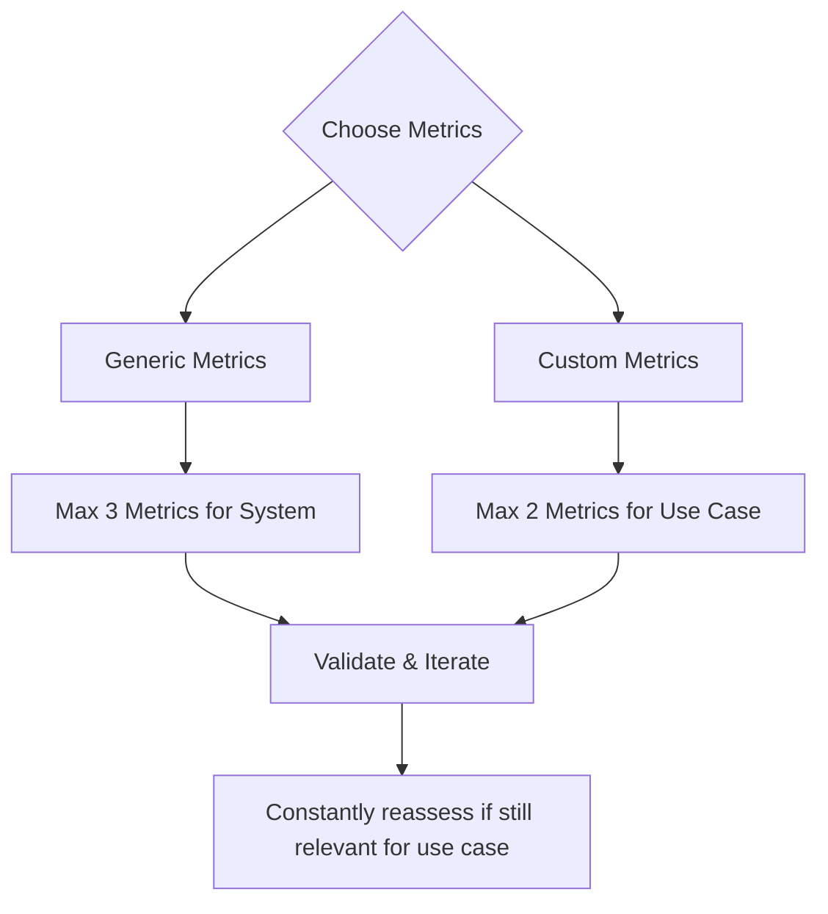

`deepeval` offers 50+ SOTA, ready-to-use metrics for you to quickly get started with. Essentially, while a test case represents the thing you're trying to measure, the metric acts as the ruler for specific criteria of interest.

## Quick Summary

Almost all predefined metrics on `deepeval` use **LLM-as-a-judge**, with techniques such as **QAG** (question-answer-generation), **DAG** (deep acyclic graphs), and **G-Eval**. Most score [test cases](/docs/evaluation-test-cases) representing atomic interactions, while [trajectory metrics](/docs/evaluation-trajectory-based-llm-evals) score the complete ordered trace produced by an AI agent.

All of `deepeval`'s metrics output a **score between 0-1** based on its corresponding equation, as well as score **reasoning**. A metric is only successful if the evaluation score is equal to or greater than `threshold`, which is defaulted to `0.5` for all metrics.

<Tabs>
<Tab title="Custom metrics">

Custom metrics allow you to define your **custom criteria** using SOTA implementations of LLM-as-a-Judge metrics in everyday language:

- G-Eval
- DAG (Deep Acyclic Graph)
- Conversational G-Eval
- Conversational DAG
- Arena G-Eval
- Do it yourself, 100% self-coded metrics (e.g. if you want to use BLEU, ROUGE)

You should aim to have **at least one** custom metric in your LLM evals pipeline.

</Tab>
<Tab title="AI Agents">

Agentic metrics evaluate AI agents at two different scopes:

**Trajectory metrics** analyze the complete ordered chain of decisions and actions captured through [LLM tracing](/docs/evaluation-llm-tracing):

- Task Completion — whether the agent successfully accomplished its task.
- Step Efficiency — whether the agent avoided unnecessary or redundant steps.
- Plan Adherence — whether the agent followed its generated plan.
- Plan Quality — whether the generated plan was logical, complete, and efficient.

**Component-level action metrics** evaluate one LLM decision about tool selection and arguments inside that trajectory:

- Tool Correctness — whether the agent selected the correct tools.
- Argument Correctness — whether it supplied the correct arguments to those tools.

Use [trajectory-based evaluation](/docs/evaluation-trajectory-based-llm-evals) for overall execution quality and [component-level evaluation](/docs/evaluation-component-level-llm-evals) to diagnose individual actions.

</Tab>
<Tab title="RAG">

RAG (retrieval augmented generation) metrics focus on the **retriever and generator components** independently.

- Retriever:

  - Contextual Relevancy
  - Contextual Precision
  - Contextual Recall

- Generator:
  - Answer Relevancy
  - Faithfulness

</Tab>
<Tab title="Chatbots (multi-turn)">

Multi-turn metrics' main use case are for evaluating chatbots and uses a `ConversationalTestCase` instead. They include:

- Knowledge Retention
- Role Adherence
- Conversation Completeness
- Conversation Relevancy

Multi-turn metrics evaluates conversations as a whole and takes prior context into consideration when doing so.

</Tab>
<Tab title="Safety">

Safety metrics concerns more on LLM security. They include:

- Bias
- Toxicity
- Non-Advice
- Misuse
- PIILeakage
- Role Violation

For those looking for a full-blown LLM red teaming orchestration frameowork, checkout [DeepTeam](https://www.trydeepteam.com/). DeepTeam is `deepeval` but for red teaming LLMs specifically.

</Tab>
<Tab title="Image">

Metrics in `deepeval` are multi-modal by default, metrics targeting images are metrics that definitely expects an image in the test case. They include:

- Image Coherence
- Image Helpfulness
- Image Reference
- Text-to-Image
- Image-Editing

Note that multi-modal metrics requires [`MLLMImage`s](/docs/evaluation-test-cases#mllmimage-data-model) in `LLMTestCase`s.

</Tab>
<Tab title="Others">

Not use case specific, but still useful for some use cases:

- Hallucination
- Json Correctness
- Summarization
- Ragas

</Tab>
</Tabs>

<Info>
**Most metrics only require 1-2 parameters** in a test case, so it's important that you visit each metric's documentation pages to learn what's required.
</Info>

Metrics can score your app's black-box result, an agent's complete trajectory, or an individual component. This first example runs an **end-to-end** evaluation by providing metrics and test cases:

<Tabs>

<Tab title="Python">

```python title="main.py"
from deepeval.metrics import AnswerRelevancyMetric
from deepeval.test_case import LLMTestCase
from deepeval import evaluate

evaluate(
    metrics=[AnswerRelevancyMetric()],
    test_cases=[LLMTestCase(input="What's `deepeval`?", actual_output="Your favorite eval framework's favorite evals framework.")]
)
```

</Tab>

<Tab title="TypeScript">

```typescript title="main.ts"
import { AnswerRelevancyMetric } from "deepeval/metrics";
import { LLMTestCase } from "deepeval/test-case";
import { evaluate } from "deepeval";

await evaluate(
  [
    new LLMTestCase({
      input: "What's `deepeval`?",
      actualOutput: "Your favorite eval framework's favorite evals framework.",
    }),
  ],
  [new AnswerRelevancyMetric()]
);
```

</Tab>

</Tabs>

If you're logged into [Confident AI](https://confident-ai.com) before running an evaluation (`deepeval login` or `deepeval view` in the CLI), you'll also get entire testing reports on the platform:

<figure>
  <video controls src="https://confident-docs.s3.us-east-1.amazonaws.com/evaluation:single-turn-e2e-report.mp4"></video>
  <figcaption>Get sharable test reports for every metric you run with deepeval.</figcaption>
</figure>

More information on everything can be found on the [Confident AI evaluation docs.](https://www.confident-ai.com/docs/llm-evaluation/quickstart)

## Why `deepeval` Metrics?

Apart from the variety of metrics offered, `deepeval`'s metrics are a step up to other implementations because they:

- Are research-backed LLM-as-as-Judge (`GEval`)
- One of the most used in the world (20 million+ daily evaluations)
- Make deterministic metric scores possible (when using `DAGMetric`)
- Are extra reliable as LLMs are only used for extremely confined tasks during evaluation to greatly reduce stochasticity and flakiness in scores
- Provide a comprehensive reason for the scores computed
- Integrated 100% with Confident AI

## Create Your First Metric

### Custom Metrics

`deepeval` provides G-Eval, a state-of-the-art LLM evaluation framework for anyone to create a custom LLM-evaluated metric using natural language. G-Eval is available for all single-turn, multi-turn, and multimodal evals.

<Tabs>
<Tab title="G-Eval">

<Tabs>

<Tab title="Python">

```python
from deepeval.test_case import LLMTestCase, SingleTurnParams
from deepeval.metrics import GEval

test_case = LLMTestCase(input="...", actual_output="...", expected_output="...")
correctness = GEval(
    name="Correctness",
    criteria="Correctness - determine if the actual output is correct according to the expected output.",
    evaluation_params=[SingleTurnParams.ACTUAL_OUTPUT, SingleTurnParams.EXPECTED_OUTPUT],
    strict_mode=True
)

correctness.measure(test_case)
print(correctness.score, correctness.reason)
```

</Tab>

<Tab title="TypeScript">

```typescript
import { LLMTestCase, SingleTurnParams } from "deepeval/test-case";
import { GEval } from "deepeval/metrics";

const testCase = new LLMTestCase({
  input: "...",
  actualOutput: "...",
  expectedOutput: "...",
});
const correctness = new GEval({
  name: "Correctness",
  criteria:
    "Correctness - determine if the actual output is correct according to the expected output.",
  evaluationParams: [
    SingleTurnParams.ACTUAL_OUTPUT,
    SingleTurnParams.EXPECTED_OUTPUT,
  ],
  strictMode: true,
});

await correctness.measure(testCase);
console.log(correctness.score, correctness.reason);
```

</Tab>

</Tabs>

</Tab>
<Tab title="Conversational G-Eval">

<Tabs>

<Tab title="Python">

```python
from deepeval.test_case import Turn, MultiTurnParams, ConversationalTestCase
from deepeval.metrics import ConversationalGEval

convo_test_case = ConversationalTestCase(turns=[Turn(role="...", content="..."), Turn(role="...", content="...")])
professionalism_metric = ConversationalGEval(
    name="Professionalism",
    criteria="Determine whether the assistant has acted professionally based on the content."
    evaluation_params=[MultiTurnParams.CONTENT],
    strict_mode=True
)

professionalism_metric.measure(convo_test_case)
print(professionalism_metric.score, professionalism_metric.reason)
```

</Tab>

<Tab title="TypeScript">

```typescript
import {
  Turn,
  MultiTurnParams,
  ConversationalTestCase,
} from "deepeval/test-case";
import { ConversationalGEval } from "deepeval/metrics";

const convoTestCase = new ConversationalTestCase({
  turns: [
    new Turn({ role: "user", content: "..." }),
    new Turn({ role: "assistant", content: "..." }),
  ],
});
const professionalismMetric = new ConversationalGEval({
  name: "Professionalism",
  criteria:
    "Determine whether the assistant has acted professionally based on the content.",
  evaluationParams: [MultiTurnParams.CONTENT],
  strictMode: true,
});

await professionalismMetric.measure(convoTestCase);
console.log(professionalismMetric.score, professionalismMetric.reason);
```

</Tab>

</Tabs>

</Tab>
</Tabs>

Under the hood, `deepeval` first generates a series of evaluation steps, before using these steps in conjunction with information in an `LLMTestCase` for evaluation. For more information, visit the [G-Eval documentation page.](/docs/metrics-llm-evals)

<Tip>

If you're looking for decision-tree based LLM-as-a-Judge, checkout the [Deep Acyclic Graph (DAG)](/docs/metrics-dag) metric.

</Tip>

### Default Metrics

<Tabs>
<Tab title="AI Agents">

`deepeval` includes six metrics for evaluating AI agents. Choose them based on the scope you need:

**Trajectory metrics** evaluate how the full execution works together:

- **Task Completion:** Assesses whether the agent successfully completed its task.
- **Step Efficiency:** Assesses whether the agent completed the task without unnecessary or redundant steps.
- **Plan Adherence:** Assesses whether the agent followed its generated plan during execution.
- **Plan Quality:** Assesses whether the generated plan was logical, complete, and efficient.

**Component-level action metrics** evaluate individual LLM tool-calling decisions:

- **Tool Correctness:** Assesses whether the agent selected the correct tools.
- **Argument Correctness:** Assesses whether the agent supplied the correct arguments to those tools.

Trajectory metrics require [tracing](/docs/evaluation-llm-tracing) because they analyze the complete ordered trace. Pass them to `evals_iterator()` when running the agent:

<Tabs>

<Tab title="Python">

```python title="main.py" {16}
from deepeval.dataset import EvaluationDataset, Golden
from deepeval.metrics import TaskCompletionMetric
from deepeval.tracing import observe

@observe()
def trip_planner_agent(input):

    @observe()
    def itinerary_generator(destination, days):
        return ["Eiffel Tower", "Louvre Museum", "Montmartre"][:days]

    return itinerary_generator("Paris", 2)

dataset = EvaluationDataset(goldens=[Golden(input="Plan a two-day trip to Paris")])

for golden in dataset.evals_iterator(metrics=[TaskCompletionMetric(threshold=0.5)]):
    trip_planner_agent(golden.input)
```

</Tab>

<Tab title="TypeScript">

```typescript title="main.ts" {18}
import { EvaluationDataset, Golden } from "deepeval/dataset";
import { TaskCompletionMetric } from "deepeval/metrics";
import { observe } from "deepeval/tracing";

const itineraryGenerator = observe({
  fn: async (destination: string, days: number) =>
    ["Eiffel Tower", "Louvre Museum", "Montmartre"].slice(0, days),
});

const tripPlannerAgent = observe({
  fn: async (input: string) => await itineraryGenerator("Paris", 2),
});

const dataset = new EvaluationDataset({
  goldens: [new Golden({ input: "Plan a two-day trip to Paris" })],
});

for await (const golden of dataset.evalsIterator({
  metrics: [new TaskCompletionMetric({ threshold: 0.5 })],
})) {
  await tripPlannerAgent((golden as Golden).input);
}
```

</Tab>

</Tabs>

</Tab>
<Tab title="RAG">

The most used RAG metrics include:

- **Answer Relevancy:** Evaluates if the generated answer is relevant to the user query
- **Faithfulness:** Measures if the generated answer is factually consistent with the provided context
- **Contextual Relevancy:** Assesses if the retrieved context is relevant to the user query
- **Contextual Recall:** Evaluates if the retrieved context contains all relevant information
- **Contextual Precision:** Measures if the retrieved context is precise and focused

Which can be simply imported from the `deepeval.metrics` module:

<Tabs>

<Tab title="Python">

```python title="main.py"
from deepeval.metrics import AnswerRelevancyMetric
from deepeval.test_case import LLMTestCase

test_case = LLMTestCase(input="...", actual_output="...")
relevancy = AnswerRelevancyMetric(threshold=0.5)

relevancy.measure(test_case)
print(relevancy.score, relevancy.reason)
```

</Tab>

<Tab title="TypeScript">

```typescript title="main.ts"
import { AnswerRelevancyMetric } from "deepeval/metrics";
import { LLMTestCase } from "deepeval/test-case";

const testCase = new LLMTestCase({ input: "...", actualOutput: "..." });
const relevancy = new AnswerRelevancyMetric({ threshold: 0.5 });

await relevancy.measure(testCase);
console.log(relevancy.score, relevancy.reason);
```

</Tab>

</Tabs>

</Tab>
<Tab title="Chatbots">

Chatbots require "conversational" (or multi-turn) metrics and they include:

- **Conversation Completeness:** Evaluates if conversation satisfy user needs.
- **Conversation Relevancy:** Measures if the generated outputs are relevant to user inputs.
- **Role Adherence:** Assesses if the chatbot stays in character throughout a conversation.
- **Knowledge Retention:** Evaluates if the chatbot is able to retain knowledge learnt throughout a conversation.

You'll need to also use [`ConversationalTestCase`](/docs/evaluation-multiturn-test-cases#conversational-test-case)s instead of regular `LLMTestCase` for conversational metrics:

<Tabs>

<Tab title="Python">

```python title="main.py"
from deepeval.test_case import Turn, ConversationalTestCase
from deepeval.metrics import ConversationalGEval

convo_test_case = ConversationalTestCase(turns=[Turn(role="...", content="..."), Turn(role="...", content="...")])
role_adherence = RoleAdherenceMetric(threshold=0.5)

role_adherence.measure(convo_test_case)
print(role_adherence.score, role_adherence.reason)
```

</Tab>

<Tab title="TypeScript">

```typescript title="main.ts"
import { Turn, ConversationalTestCase } from "deepeval/test-case";
import { RoleAdherenceMetric } from "deepeval/metrics";

const convoTestCase = new ConversationalTestCase({
  turns: [
    new Turn({ role: "user", content: "..." }),
    new Turn({ role: "assistant", content: "..." }),
  ],
});
const roleAdherence = new RoleAdherenceMetric({ threshold: 0.5 });

await roleAdherence.measure(convoTestCase);
console.log(roleAdherence.score, roleAdherence.reason);
```

</Tab>

</Tabs>

</Tab>
<Tab title="Images">

<Tabs>

<Tab title="Python">

```python
from deepeval.test_case import LLMTestCase, MLLMImage
from deepeval.metrics import ImageCoherenceMetric

test_case = LLMTestCase(input=f"What does this image say? {MLLMImage(...)}", actual_output="No idea!")
image_coherence = ImageCoherenceMetric(threshold=0.5)

image_coherence.measure(test_case)
print(image_coherence.score, image_coherence.reason)
```

</Tab>

<Tab title="TypeScript">

```typescript
import { LLMTestCase, MLLMImage } from "deepeval/test-case";
import { ImageCoherenceMetric } from "deepeval/metrics";

const testCase = new LLMTestCase({
  input: `What does this image say? ${new MLLMImage({ url: "..." })}`,
  actualOutput: "No idea!",
});
const imageCoherence = new ImageCoherenceMetric({ threshold: 0.5 });

await imageCoherence.measure(testCase);
console.log(imageCoherence.score, imageCoherence.reason);
```

</Tab>

</Tabs>

</Tab>
<Tab title="Safety">

<Tabs>

<Tab title="Python">

```python
from deepeval.test_case import LLMTestCase
from deepeval.metrics import BiasMetric

test_case = LLMTestCase(input="...", actual_output="...")
bias = BiasMetric(threshold=0.5)

bias.measure(test_case)
print(bias.score, bias.reason)
```

</Tab>

<Tab title="TypeScript">

```typescript
import { LLMTestCase } from "deepeval/test-case";
import { BiasMetric } from "deepeval/metrics";

const testCase = new LLMTestCase({ input: "...", actualOutput: "..." });
const bias = new BiasMetric({ threshold: 0.5 });

await bias.measure(testCase);
console.log(bias.score, bias.reason);
```

</Tab>

</Tabs>

</Tab>
</Tabs>

## Choosing Your Metrics

These are the metric categories to consider when choosing your metrics:

- **Custom metrics** are use case specific and architecture agnostic:
  - G-Eval – best for **subjective** criteria like correctness, coherence, or tone; easy to set up.
  - DAG – **decision-tree** metric for **objective or mixed** criteria (e.g., verify format before tone).
  - Start with G-Eval for simplicity; use DAG for more control. You can also subclass `BaseMetric` to create your own.
- **Generic metrics** are system specific and use case agnostic:
  - Agent trajectory metrics: evaluate task completion, execution efficiency, planning, and plan adherence across the complete trace
  - Agent component metrics: evaluate tool selection and argument generation at individual action steps
  - RAG metrics: measures retriever and generator separately
  - Multi-turn metrics: measure overall dialogue quality
  - Combine these for multi-component LLM systems.
- **Reference vs. Referenceless**:
  - Reference-based metrics need **ground truth** (e.g., contextual recall or tool correctness).
  - Referenceless metrics work **without labeled data**, ideal for online or production evaluation.
  - Check each metric’s docs for required parameters.

<Info>
If you're running metrics in production, you _must_ choose a referenceless metric since no labelled data will exist.
</Info>

When deciding on metrics, no matter how tempting, try to limit yourself to **no more than 5 metrics**, with this breakdown:

- **2-3** generic, system-specific metrics (e.g. task completion for agents, contextual precision for RAG)
- **1-2** custom, use case-specific metrics (e.g. helpfulness for a medical chatbot, format correctness for summarization)

The goal is to force yourself to prioritize and clearly define your evaluation criteria. This will not only help you use `deepeval`, but also help you understand what you care most about in your LLM application.

<div style={{textAlign: 'center', margin: "1rem 0"}}>



</div>

Here are some additional ideas if you're not sure:

- **AI agents**: Start with `TaskCompletionMetric` for overall trajectory quality, add `StepEfficiencyMetric`, `PlanAdherenceMetric`, or `PlanQualityMetric` when the execution path matters, and use `ToolCorrectnessMetric` or `ArgumentCorrectnessMetric` to diagnose individual LLM tool-calling decisions
- **RAG**: Focus on the `AnswerRelevancyMetric` (evaluates `actual_output` alignment with the `input`) and `FaithfulnessMetric` (checks for hallucinations against `retrieval_context`)
- **Chatbots**: Implement a `ConversationCompletenessMetric` to assess overall conversation quality
- **Custom Requirements**: When standard metrics don't fit your needs, create custom evaluations with `G-Eval` or `DAG` frameworks

In some cases, where your LLM model is doing most of the heavy lifting, it is not uncommon to have more use case specific metrics.

## Configure LLM Judges

You can use **ANY** LLM judge in `deepeval`, including OpenAI, Azure OpenAI, Ollama, Anthropic, Gemini, LiteLLM, etc. You can also wrap your own LLM API in `deepeval`'s `DeepEvalBaseLLM` class to use ANY model of your choice. [Click here](/guides/guides-using-custom-llms) for full guide.

<Tabs>

<Tab title="Python">

<Tabs>
<Tab title="OpenAI">

要在 `deepeval` 的 LLM 指标中使用 OpenAI，请在 CLI 中提供你的 `OPENAI_API_KEY`：

```bash
export OPENAI_API_KEY=<your-openai-api-key>
```

或者，如果你在笔记本环境（Jupyter 或 Colab）中工作，请在单元格里设置 `OPENAI_API_KEY`：

```bash
%env OPENAI_API_KEY=<your-openai-api-key>
```

<Warning>
在笔记本环境中设置 `API_KEYS` 作为环境变量时，请**不要加**引号。
</Warning>

</Tab>
<Tab title="Azure OpenAI">

`deepeval` 也允许你对使用 LLM 评估的指标使用 Azure OpenAI。在 CLI 中运行以下命令，把 `deepeval` 环境配置为对**所有**基于 LLM 的指标使用 Azure OpenAI。

```bash
deepeval set-azure-openai \
    --base-url=<endpoint> \ # e.g. https://example-resource.azure.openai.com/
    --model=<model_name> \ # e.g. gpt-4.1
    --deployment-name=<deployment_name> \  # e.g. Test Deployment
    --api-version=<api_version> \ # e.g. 2025-01-01-preview
    --model-version=<model_version> # e.g. 2024-11-20
```

<Info>
你的 OpenAI API 版本必须至少是 `2024-08-01-preview`，即结构化输出发布之时。
</Info>

注意 `model-version` 是**可选的**。如果你以后想停用 Azure OpenAI、换回常规 OpenAI，运行：

```bash
deepeval unset-azure-openai
```

</Tab>
<Tab title="Ollama">

<Note>
开始之前，请确认你的 [Ollama 模型](https://ollama.com/search)已安装并正在运行。点击前述链接可以查看可用模型的完整列表。

```bash
ollama run deepseek-r1:1.5b
```

</Note>

要在你的指标中使用 **Ollama** 模型，在 CLI 中运行 `deepeval set-ollama --model=<model>`。例如：

```bash
deepeval set-ollama --model=deepseek-r1:1.5b
```

可选地，如果你定义了自定义端口，可以指定本地 Ollama 模型实例的**基础 URL**。默认基础 URL 为 `http://localhost:11434`。

```bash
deepeval set-ollama --model=deepseek-r1:1.5b \
    --base-url="http://localhost:11434"
```

要停用本地 Ollama 模型、换回 OpenAI，运行：

```bash
deepeval unset-ollama
```

<Warning>
`deepeval set-ollama` 命令专用于配置 LLM 模型。如果你想在合成器中使用 Ollama 的自定义嵌入模型，请[参阅指南的这一节](/guides/guides-using-custom-embedding-models)。
</Warning>

</Tab>
<Tab title="Gemini">

要在 `deepeval` 中使用 Gemini 模型，在 CLI 中运行以下命令。

```bash
deepeval set-gemini \
    --model=<model_name> # e.g. "gemini-2.0-flash-001"
```

</Tab>
<Tab title="自定义 LLM 示例">

`deepeval` 允许你使用**任意**自定义 LLM 做评估。包括来自 langchain 聊天模型集成的 LLM、Hugging Face 的 `transformers` 库，甚至 GGML 格式的 LLM。

这包括你喜欢的任何模型，例如：

- Azure OpenAI
- Claude via AWS Bedrock
- Google Vertex AI
- Mistral 7B

所有示例都[在这里](/guides/guides-using-custom-llms#more-examples)，下面是通过 langchain 的 `AzureChatOpenAI` 模块接入自定义 Azure OpenAI 模型做评估的快速示例：

```python
from langchain_openai import AzureChatOpenAI
from deepeval.models.base_model import DeepEvalBaseLLM

class AzureOpenAI(DeepEvalBaseLLM):
    def __init__(
        self,
        model
    ):
        self.model = model

    def load_model(self):
        return self.model

    def generate(self, prompt: str) -> str:
        chat_model = self.load_model()
        return chat_model.invoke(prompt).content

    async def a_generate(self, prompt: str) -> str:
        chat_model = self.load_model()
        res = await chat_model.ainvoke(prompt)
        return res.content

    def get_model_name(self):
        return "Custom Azure OpenAI Model"

# Replace these with real values
custom_model = AzureChatOpenAI(
    openai_api_version=api_version,
    azure_deployment=azure_deployment,
    azure_endpoint=azure_endpoint,
    openai_api_key=openai_api_key,
)
azure_openai = AzureOpenAI(model=custom_model)
print(azure_openai.generate("Write me a joke"))
```

创建自定义 LLM 评估模型时，你应当**始终**：

- 继承 `DeepEvalBaseLLM`。
- 实现 `get_model_name()` 方法，它只返回一个表示你自定义模型名称的字符串。
- 实现 `load_model()` 方法，它负责返回一个模型对象。
- 实现 `generate()` 方法，它有**且只有一个**字符串类型参数，作为你的自定义 LLM 的提示词。
- `generate()` 方法应返回你的自定义 LLM 的最终输出字符串。注意在本例中我们用 `chat_model.invoke(prompt).content` 访问模型生成结果，但具体取决于你的自定义模型对象的实现，可能有所不同。
- 实现 `a_generate()` 方法，函数签名与 `generate()` 相同。**注意这是一个异步方法**。本例中我们用了 `await chat_model.ainvoke(prompt)`，它是 LangChain 聊天模型提供的异步包装。

<Tip>
当你异步执行指标 / 运行评估时，`deepeval` 会用 `a_generate()` 方法生成 LLM 输出。

如果你的自定义模型对象没有异步接口，直接复用 `generate()` 的代码即可（往下翻到 `Mistral7B` 示例查看更多细节）。但这会让 `a_generate()` 变成阻塞过程，无论你是否为指标开启了 `async_mode`。
</Tip>

最后，把它用于 LLM-Eval 评估：

```python
from deepeval.metrics import AnswerRelevancyMetric
...

metric = AnswerRelevancyMetric(model=azure_openai)
```

<Note>
虽然 Azure OpenAI 命令把 `deepeval` 配置为对所有 LLM-Eval 全局使用 Azure OpenAI，但自定义 LLM 必须在每次实例化指标时单独设置。记得通过 `model` 参数为你想用它的指标提供自定义 LLM 实例。
</Note>

<Warning>
我们**无法**保证使用自定义模型时评估会如期工作。这是因为评估需要高水平的推理能力以及遵循指令的能力，例如以合法 JSON 格式输出响应。[**要让自定义 LLM 更好地输出合法 JSON，请阅读本指南**](/guides/guides-using-custom-llms)。

另外，如果你经常遇到 JSON 错误并想忽略它，可以在[测试运行时使用 `-c` 和 `-i` 开关](/docs/evaluation-flags-and-configs#flags-for-deepeval-test-run)：

```bash
deepeval test run test_example.py -i -c
```

`-i` 开关会忽略错误，`-c` 开关利用本地 `deepeval` 缓存，这样部分成功的测试运行不必重跑没有出错的测试用例。

</Warning>

</Tab>
</Tabs>

</Tab>

<Tab title="TypeScript">

<Tabs>
<Tab title="OpenAI">

要在 `deepeval` 的 LLM 指标中使用 OpenAI，请在 CLI 中提供你的 `OPENAI_API_KEY`：

```bash
export OPENAI_API_KEY=<your-openai-api-key>
```

另外，`deepeval` 会在导入时依次自动加载 `.env.local` 和 `.env`，因此你可以完全不把密钥放进 shell：

```bash
# .env.local
OPENAI_API_KEY=<your-openai-api-key>
```

</Tab>
<Tab title="Vercel AI SDK">

[Vercel AI SDK](/integrations/models/ai-sdk) 通过代码而非 `set-*` 命令配置：把任意 AI SDK `LanguageModel` 包进一个 `AISDKModel`。先安装 AI SDK 核心包与你想用的提供商包：

```bash
npm install ai @ai-sdk/openai
```

每个 AI SDK 提供商按其自身约定从环境中读取自己的 API key：

```bash
# .env.local
OPENAI_API_KEY=<your-openai-api-key>
```

然后把包装好的模型传给任意指标：

```typescript
import { AnswerRelevancyMetric } from "deepeval/metrics";
import { AISDKModel } from "deepeval/models";
import { openai } from "@ai-sdk/openai";

const model = new AISDKModel({ model: openai("gpt-4o"), temperature: 0 });
const answerRelevancy = new AnswerRelevancyMetric({ model });
```

<Tip>
`deepeval` 为 OpenAI、Anthropic、Gemini 等少数提供商提供了现成的模型类，但并非覆盖所有提供商。如果你想用的裁判模型不在其中——Mistral、Cohere、Groq、Together——安装其 AI SDK 包并包进 `AISDKModel` 即可使用。
</Tip>

</Tab>
<Tab title="Anthropic">

要在 `deepeval` 的 LLM 指标中使用 Anthropic 模型，请在 CLI 中提供你的 `ANTHROPIC_API_KEY`：

```bash
export ANTHROPIC_API_KEY=<your-anthropic-api-key>
```

然后为**所有**基于 LLM 的指标选择你想用的 Claude 裁判模型：

```bash
npx deepeval set-anthropic --model=claude-sonnet-4-6
```

要停用 Anthropic、换回 OpenAI，运行：

```bash
npx deepeval unset-anthropic
```

</Tab>
<Tab title="Azure OpenAI">

`deepeval` 也允许你对使用 LLM 评估的指标使用 Azure OpenAI。在 CLI 中运行以下命令，把 `deepeval` 环境配置为对**所有**基于 LLM 的指标使用 Azure OpenAI。

```bash
npx deepeval set-azure-openai \
    --base-url=<endpoint> \ # e.g. https://example-resource.azure.openai.com/
    --model=<model_name> \ # e.g. gpt-4.1
    --deployment-name=<deployment_name> \  # e.g. Test Deployment
    --api-version=<api_version> \ # e.g. 2025-01-01-preview
    --model-version=<model_version> # e.g. 2024-11-20
```

<Info>
你的 OpenAI API 版本必须至少是 `2024-08-01-preview`，即结构化输出发布之时。
</Info>

注意 `model-version` 是**可选的**。如果你以后想停用 Azure OpenAI、换回常规 OpenAI，运行：

```bash
npx deepeval unset-azure-openai
```

</Tab>
<Tab title="Ollama">

<Note>
开始之前，请确认你的 [Ollama 模型](https://ollama.com/search)已安装并正在运行。点击前述链接可以查看可用模型的完整列表。

```bash
ollama run deepseek-r1:1.5b
```

</Note>

要在你的指标中使用 **Ollama** 模型，在 CLI 中运行 `npx deepeval set-ollama --model=<model>`。例如：

```bash
npx deepeval set-ollama --model=deepseek-r1:1.5b
```

可选地，如果你定义了自定义端口，可以指定本地 Ollama 模型实例的**基础 URL**。默认基础 URL 为 `http://localhost:11434`。

```bash
npx deepeval set-ollama --model=deepseek-r1:1.5b \
    --base-url="http://localhost:11434"
```

要停用本地 Ollama 模型、换回 OpenAI，运行：

```bash
npx deepeval unset-ollama
```

</Tab>
<Tab title="自定义 LLM 示例">

`deepeval` 允许你使用**任意**自定义 LLM 做评估。包括来自 LangChain 聊天模型集成的 LLM、通过 Vercel AI SDK 可达的任何提供商，或你自己托管的模型。

这包括你喜欢的任何模型，例如：

- Azure OpenAI
- Claude via AWS Bedrock
- Google Vertex AI
- Mistral 7B

所有示例都[在这里](/guides/guides-using-custom-llms#more-examples)，下面是通过 LangChain 的 `AzureChatOpenAI` 模块接入自定义 Azure OpenAI 模型做评估的快速示例：

```typescript
import { DeepEvalBaseLLM, type GenerationResult } from "deepeval/models";
import { AzureChatOpenAI } from "@langchain/openai";
import type { ZodType } from "zod";

class AzureOpenAI extends DeepEvalBaseLLM {
  constructor(private model: AzureChatOpenAI) {
    super();
  }

  async generate<T = string>(
    prompt: string,
    schema?: ZodType<T>,
  ): Promise<GenerationResult<T>> {
    // A schema is passed whenever the metric needs structured output
    if (schema) {
      const structured = this.model.withStructuredOutput(schema);
      return { output: (await structured.invoke(prompt)) as T, cost: null };
    }
    const response = await this.model.invoke(prompt);
    return { output: String(response.content) as T, cost: null };
  }

  getModelName(): string {
    return "Custom Azure OpenAI Model";
  }
}

// Replace these with real values
const customModel = new AzureChatOpenAI({
  azureOpenAIApiVersion: apiVersion,
  azureOpenAIApiDeploymentName: azureDeployment,
  azureOpenAIEndpoint: azureEndpoint,
  azureOpenAIApiKey: openaiApiKey,
});
const azureOpenAI = new AzureOpenAI(customModel);
console.log(await azureOpenAI.generate("Write me a joke"));
```

创建自定义 LLM 评估模型时，你应当**始终**：

- 继承 `DeepEvalBaseLLM`。
- 实现 `getModelName()` 方法，它只返回一个表示你自定义模型名称的字符串。
- 实现 `generate()` 方法，它始终是 `async`——没有需要对应的 `generate()` / `a_generate()` 之分，也没有要实现的 `loadModel()`。
- 从 `generate()` 返回 `{ output, cost }`，其中 `cost` 在你的提供商不上报时可以是 `null`。
- 遵循可选的 `schema` 参数。指标需要结构化输出时会传一个 zod schema，并期望 `output` 是解析后的对象而非字符串。

<Tip>
如果你的提供商无法原生产出结构化输出，就在提示词里要求 JSON，并自己把响应跑一遍 `schema.parse()`——这正是 `deepeval` 内置模型的做法。
</Tip>

最后，把它用于 LLM-Eval 评估：

```typescript
import { AnswerRelevancyMetric } from "deepeval/metrics";
// ...

const metric = new AnswerRelevancyMetric({ model: azureOpenAI });
```

<Note>
虽然 Azure OpenAI 命令把 `deepeval` 配置为对所有 LLM-Eval 全局使用 Azure OpenAI，但自定义 LLM 必须在每次实例化指标时单独设置。记得通过 `model` 参数为你想用它的指标提供自定义 LLM 实例。
</Note>

<Warning>
我们**无法**保证使用自定义模型时评估会如期工作。这是因为评估需要高水平的推理能力以及遵循指令的能力，例如以合法 JSON 格式输出响应。[**要让自定义 LLM 更好地输出合法 JSON，请阅读本指南**](/guides/guides-using-custom-llms)。

另外，如果你经常遇到 JSON 错误并想忽略它，可以在[测试运行时使用 `-c` 和 `-i` 开关](/docs/evaluation-flags-and-configs#flags-for-deepeval-test-run)：

```bash
npx deepeval test run chatbot.test.ts -i -c
```

`-i` 开关会忽略错误，`-c` 开关利用本地 `deepeval` 缓存，这样部分成功的测试运行不必重跑没有出错的测试用例。

</Warning>

</Tab>
</Tabs>

</Tab>

</Tabs>

## Using Metrics

There are four ways you can use metrics:

1. [End-to-end](/docs/evaluation-end-to-end-llm-evals) evals, treating your LLM system as a black-box and evaluating the system inputs and outputs.
2. [Trajectory-based](/docs/evaluation-trajectory-based-llm-evals) evals, evaluating the complete ordered chain of steps taken by an AI agent.
3. [Component-level](/docs/evaluation-component-level-llm-evals) evals, placing metrics on individual components in your LLM app instead.
4. One-off (or standalone) evals, where you would use a metric to execute it individually.

### For End-to-End Evals

To run end-to-end evaluations of your LLM system, provide black-box metrics with a list of [test cases](/docs/evaluation-test-cases):

<Tabs>

<Tab title="Python">

```python
from deepeval.metrics import AnswerRelevancyMetric
from deepeval.test_case import LLMTestCase
from deepeval import evaluate

test_case = LLMTestCase(input="...", actual_output="...")

evaluate(test_cases=[test_case], metrics=[AnswerRelevancyMetric()])
```

</Tab>

<Tab title="TypeScript">

```typescript
import { AnswerRelevancyMetric } from "deepeval/metrics";
import { LLMTestCase } from "deepeval/test-case";
import { evaluate } from "deepeval";

const testCase = new LLMTestCase({ input: "...", actualOutput: "..." });

await evaluate([testCase], [new AnswerRelevancyMetric()]);
```

</Tab>

</Tabs>

The [`evaluate()` function](/docs/evaluation-introduction#evaluating-without-pytest) or `deepeval test run` **is the best way to run evaluations**. They offer tons of features out of the box, including caching, parallelization, cost tracking, error handling, and integration with [Confident AI.](https://confident-ai.com)

<Tip>
[`deepeval test run`](/docs/evaluation-introduction#evaluating-with-pytest) is `deepeval`'s native Pytest integration, which allows you to run evals in CI/CD pipelines.
</Tip>

### For Trajectory-Based Evals

Trajectory metrics analyze relationships between the plans, model calls, tools, handoffs, and intermediate steps in an agent's complete trace. Metrics carrying the **Trajectory** tag—Task Completion, Step Efficiency, Plan Adherence, and Plan Quality—require [LLM tracing](/docs/evaluation-llm-tracing).

Pass trajectory metrics to `evals_iterator()`, then invoke your traced agent once for each golden:

<Tabs>

<Tab title="Python">

```python
from deepeval.dataset import EvaluationDataset, Golden
from deepeval.metrics import TaskCompletionMetric
from app import my_agent

dataset = EvaluationDataset(
    goldens=[Golden(input="Plan a three-day trip to Paris")]
)

for golden in dataset.evals_iterator(metrics=[TaskCompletionMetric()]):
    my_agent(golden.input)
```

</Tab>

<Tab title="TypeScript">

```typescript
import { EvaluationDataset, Golden } from "deepeval/dataset";
import { TaskCompletionMetric } from "deepeval/metrics";
import { myAgent } from "./app";

const dataset = new EvaluationDataset({
  goldens: [new Golden({ input: "Plan a three-day trip to Paris" })],
});

for await (const golden of dataset.evalsIterator({
  metrics: [new TaskCompletionMetric()],
})) {
  await myAgent((golden as Golden).input);
}
```

</Tab>

</Tabs>

Each metric receives the complete ordered trace after the agent finishes. See [trajectory-based evaluation](/docs/evaluation-trajectory-based-llm-evals) for instrumentation examples, CI/CD usage, and guidance on combining trajectory and component metrics.

### For Component-Level Evals

To run component-level evaluations of your LLM system using any metric of your choice, simply decorate your components with `@observe` and create [test cases](/docs/evaluation-test-cases) at runtime:

<Tabs>

<Tab title="Python">

```python
from deepeval.tracing import observe, update_current_span
from deepeval.dataset import EvaluationDataset, Golden
from deepeval.metrics import AnswerRelevancyMetric

# 1. observe() decorator traces LLM components
@observe()
def llm_app(input: str):
    # 2. Supply metric at any component
    @observe(metrics=[AnswerRelevancyMetric()])
    def nested_component():
        # 3. Create test case at runtime
        update_current_span(test_case=LLMTestCase(...))
        pass

    nested_component()

# 4. Create dataset
dataset = EvaluationDataset(goldens=[Golden(input="Test input")])

# 5. Loop through dataset
for goldens in dataset.evals_iterator():
    # Call LLM app
    llm_app(golden.input)
```

</Tab>

<Tab title="TypeScript">

```typescript
import { observe, updateCurrentSpan } from "deepeval/tracing";
import { EvaluationDataset, Golden } from "deepeval/dataset";
import { AnswerRelevancyMetric } from "deepeval/metrics";
import { LLMTestCase } from "deepeval/test-case";

// 2. Supply metric at any component
const nestedComponent = observe({
  metrics: [new AnswerRelevancyMetric()],
  fn: async () => {
    // 3. Create test case at runtime
    updateCurrentSpan({
      testCase: new LLMTestCase({ input: "...", actualOutput: "..." }),
    });
  },
});

// 1. observe() traces LLM components
const llmApp = observe({
  fn: async (input: string) => {
    await nestedComponent();
  },
});

// 4. Create dataset
const dataset = new EvaluationDataset({
  goldens: [new Golden({ input: "Test input" })],
});

// 5. Loop through dataset
for await (const golden of dataset.evalsIterator()) {
  // Call LLM app
  await llmApp((golden as Golden).input);
}
```

</Tab>

</Tabs>

### Use Metrics with Integrations

`deepeval`'s framework integrations capture the traces and spans that metrics evaluate, so you can score complete agent trajectories or individual framework-emitted components without recreating the execution structure yourself.

以下是你所选 SDK 可用的一些示例：

<Tabs>
  <Tab title="Python">
    <CardGroup cols={2}>
      <Card
        title="LangChain"
        description="评估完整的智能体运行、模型调用、工具与检索器。"
        href="/integrations/frameworks/langchain"
      />
      <Card
        title="Pydantic AI"
        description="评估 Pydantic AI 智能体及其被埋点的 span。"
        href="/integrations/frameworks/pydanticai"
      />
      <Card
        title="AWS AgentCore"
        description="评估托管在 AgentCore 上的智能体及其嵌套 span。"
        href="/integrations/frameworks/agentcore"
      />
      <Card
        title="Google ADK"
        description="评估 ADK 智能体运行、工具与模型调用。"
        href="/integrations/frameworks/google-adk"
      />
    </CardGroup>
  </Tab>
  <Tab title="TypeScript">
    <CardGroup cols={2}>
      <Card
        title="LangChain"
        description="评估完整的智能体运行、模型调用、工具与检索器。"
        href="/integrations/frameworks/langchain"
      />
      <Card
        title="Mastra"
        description="评估 Mastra 智能体及其 OpenTelemetry span。"
        href="/integrations/frameworks/mastra"
      />
      <Card
        title="Vercel AI SDK"
        description="评估 AI SDK 的生成、工具与遥测 span。"
        href="/integrations/frameworks/ai-sdk"
      />
      <Card
        title="LangGraph"
        description="评估图轨迹以及每次运行内的节点。"
        href="/integrations/frameworks/langgraph"
      />
    </CardGroup>
  </Tab>
</Tabs>

Pass metrics to `evals_iterator()` for end-to-end or trajectory-based evaluation. Attach or stage metrics on framework-emitted spans for component-level evaluation. Each integration guide shows the supported patterns for that framework.

[浏览全部框架集成 →](/integrations)

### For One-Off Evals

You can also execute each metric individually. All metrics in `deepeval`, including [custom metrics that you create](/docs/metrics-custom):

- can be executed via the `metric.measure()` method
- can have its score accessed via `metric.score`, which ranges from 0 - 1
- can have its score reason accessed via `metric.reason`
- can have its status accessed via `metric.is_successful()`
- can be used to evaluate test cases or entire datasets, with or without Pytest
- has a [`threshold`](/docs/metrics-introduction#metric-thresholds) that acts as the threshold for success. `metric.is_successful()` is only true if `metric.score` is above/below `threshold`
- has a [`flaky`](/docs/metrics-introduction#flaky-metrics) property, which when turned on stops the metric's verdict from deciding a test case's pass/fail status
- has a `strict_mode` property, which when turned on enforces `metric.score` to a binary one
- has a `verbose_mode` property, which when turned on prints metric logs whenever a metric is executed

In addition, all metrics in `deepeval` execute asynchronously by default.

You can configure this behavior using the `async_mode` parameter when instantiating a metric.

<Tip>
Visit an individual metric page to learn how they are calculated, and what is required when creating an `LLMTestCase` in order to execute it.
</Tip>

Here's a quick example:

<Tabs>

<Tab title="Python">

```python
from deepeval.metrics import AnswerRelevancyMetric
from deepeval.test_case import LLMTestCase

# Initialize a test case
test_case = LLMTestCase(...)

# Initialize metric with threshold
metric = AnswerRelevancyMetric(threshold=0.5)
metric.measure(test_case)

print(metric.score, metric.reason)
```

</Tab>

<Tab title="TypeScript">

```typescript
import { AnswerRelevancyMetric } from "deepeval/metrics";
import { LLMTestCase } from "deepeval/test-case";

// Initialize a test case
const testCase = new LLMTestCase({ input: "...", actualOutput: "..." });

// Initialize metric with threshold
const metric = new AnswerRelevancyMetric({ threshold: 0.5 });
await metric.measure(testCase);

console.log(metric.score, metric.reason);
```

</Tab>

</Tabs>

All of `deepeval`'s metrics give a `reason` alongside its score.

## Using Metrics Async

<Tabs>

<Tab title="Python">

When a metric's `async_mode=True` (which is the default for all metrics), invocations of `metric.measure()` will execute internal algorithms concurrently. However, it's important to note that while operations **INSIDE** `measure()` execute concurrently, the `metric.measure()` call itself still blocks the main thread.

</Tab>

<Tab title="TypeScript">

Every metric in `deepeval` is already asynchronous, and there is nothing to switch on. A metric's algorithm is made up of several LLM calls, and `measure()` fires the ones that don't depend on each other at the same time rather than one after the other.

<Info>
Take the [`FaithfulnessMetric` algorithm](/docs/metrics-faithfulness#how-is-it-calculated) for example:

1. **Extract all factual claims** made in the `actualOutput`
2. **Extract all factual truths** found in the `retrievalContext`
3. **Compare extracted claims and truths** to generate a final score and reason

Steps 1 and 2 are independent, so they run concurrently, and only step 3 waits on both. The `await` you write is a single call, but underneath it is as parallel as the algorithm allows.
</Info>

</Tab>

</Tabs>

<Info>
Let's take the [`FaithfulnessMetric` algorithm](/docs/metrics-faithfulness#how-is-it-calculated) for example:

1. **Extract all factual claims** made in the `actual_output`
2. **Extract all factual truths** found in the `retrieval_context`
3. **Compare extracted claims and truths** to generate a final score and reason.

```python
from deepeval.metrics import FaithfulnessMetric
...

metric = FaithfulnessMetric(async_mode=True)
metric.measure(test_case)
print("Metric finished!")
```

When `async_mode=True`, steps 1 and 2 execute concurrently (i.e., at the same time) since they are independent of each other, while `async_mode=False` causes steps 1 and 2 to execute sequentially instead (i.e., one after the other).

In both cases, "Metric finished!" will wait for `metric.measure()` to finish running before printing, but setting `async_mode` to `True` would make the print statement appear earlier, as `async_mode=True` allows `metric.measure()` to run faster.

</Info>

<Tabs>

<Tab title="Python">

To measure multiple metrics at once and **NOT** block the main thread, use the asynchronous `a_measure()` method instead.

</Tab>

<Tab title="TypeScript">

This means the thing to control is not whether metrics run concurrently, but how many run at once. Awaiting a large `Promise.all()` of `measure()` calls sends every request to your evaluation model simultaneously, which is the fastest route to a rate limit error. Throttle instead, by capping how many metrics are in flight at a time:

</Tab>

</Tabs>

<Tabs>

<Tab title="Python">

```python
import asyncio

...

# Remember to use async
async def long_running_function():
    # These will all run at the same time
    await asyncio.gather(
        metric1.a_measure(test_case),
        metric2.a_measure(test_case),
        metric3.a_measure(test_case),
        metric4.a_measure(test_case)
    )
    print("Metrics finished!")

asyncio.run(long_running_function())
```

</Tab>

<Tab title="TypeScript">

```typescript
// ...

const metrics = [metric1, metric2, metric3, metric4];
const maxConcurrent = 2;

// Run at most `maxConcurrent` metrics at the same time
for (let i = 0; i < metrics.length; i += maxConcurrent) {
  const batch = metrics.slice(i, i + maxConcurrent);
  await Promise.all(batch.map((metric) => metric.measure(testCase)));
}
console.log("Metrics finished!");
```

If you're running metrics through [`evaluate()`](/docs/evaluation-end-to-end-llm-evals) instead of calling `measure()` yourself, set the same limit through its `asyncConfig`:

```typescript
await evaluate([testCase], metrics, {
  asyncConfig: { maxConcurrent: 2 },
});
```

</Tab>

</Tabs>

## Debug A Metric Judgement

You can turn on `verbose_mode` for **ANY** `deepeval` metric at metric initialization to debug a metric whenever <Tabs><Tab title="Python">the `measure()` or `a_measure()` method</Tab><Tab title="TypeScript">`measure()`</Tab></Tabs> is called:

<Tabs>

<Tab title="Python">

```python
...

metric = AnswerRelevancyMetric(verbose_mode=True)
metric.measure(test_case)
```

</Tab>

<Tab title="TypeScript">

```typescript
// ...

const metric = new AnswerRelevancyMetric({ verboseMode: true });
await metric.measure(testCase);
```

</Tab>

</Tabs>

<Note>
Turning `verbose_mode` on will print the inner workings of a metric whenever <Tabs><Tab title="Python">`measure()` or `a_measure()`</Tab><Tab title="TypeScript">`measure()`</Tab></Tabs> is called.
</Note>

## Customize Metric Prompts

All of `deepeval`'s metrics use LLM-as-a-judge evaluation with unique default prompt templates for each metric. While `deepeval` has well-designed algorithms for each metric, you can customize these prompt templates to improve evaluation accuracy and stability. Simply provide a custom template class as the `evaluation_template` parameter to your metric of choice (example below).

<Info>
For example, in the `AnswerRelevancyMetric`, you might disagree with what we consider something to be "relevant", but with this capability you can now override any opinions `deepeval` has in its default evaluation prompts.
</Info>

You'll find this particularly valuable when [using a custom LLM](/guides/guides-using-custom-llms), as `deepeval`'s default metrics are optimized for OpenAI's models, which are generally more powerful than most custom LLMs.

<Note>
This means you can better handle invalid JSON outputs (along with [JSON confinement](/guides/guides-using-custom-llms#json-confinement-for-custom-llms)) which comes with weaker models, and provide better examples for in-context learning for your custom LLM judges for better metric accuracy.
</Note>

Here's a quick example of how you can define a custom `AnswerRelevancyTemplate` and inject it into the `AnswerRelevancyMetric` through the `evaluation_params` parameter:

<Tabs>

<Tab title="Python">

```python
from deepeval.metrics.answer_relevancy import AnswerRelevancyTemplate
from deepeval.metrics import AnswerRelevancyMetric

# Define custom template
class CustomTemplate(AnswerRelevancyTemplate):
    @staticmethod
    def generate_statements(actual_output: str):
        return f"""Given the text, breakdown and generate a list of statements presented.

Example:
Our new laptop model features a high-resolution Retina display for crystal-clear visuals.

{{
    "statements": [
        "The new laptop model has a high-resolution Retina display."
    ]
}}
===== END OF EXAMPLE ======

Text:
{actual_output}

JSON:
"""

# Inject custom template to metric
metric = AnswerRelevancyMetric(evaluation_template=CustomTemplate)
metric.measure(...)
```

</Tab>

<Tab title="TypeScript">

```typescript
import { AnswerRelevancyMetric } from "deepeval/metrics";

// Inject custom template to metric
const metric = new AnswerRelevancyMetric({
  evaluationTemplate: {
    generateStatements: ({ actualOutput }) =>
      `Given the text, breakdown and generate a list of statements presented.

Example:
Our new laptop model features a high-resolution Retina display for crystal-clear visuals.

{
    "statements": [
        "The new laptop model has a high-resolution Retina display."
    ]
}
===== END OF EXAMPLE ======

Text:
${actualOutput}

JSON:
`,
  },
});
await metric.measure(testCase);
```

</Tab>

</Tabs>

<Tip>
You can find examples of how this can be done in more detail on the **Customize Your Template** section of each individual metric page, which shows code examples, and a link to `deepeval`'s GitHub showing the default templates currently used.
</Tip>

## Metric Thresholds

Every metric accepts a `threshold` parameter (defaulted to `0.5`) that decides whether it passes or fails: `metric.is_successful()` is only `True`（TypeScript 中为 `true`） if `metric.score` reaches the `threshold`. Every metric scores in the same direction: 1 is a pass, 0 is a failure, and `threshold` is always a minimum.

<Tabs>

<Tab title="Python">

```python
from deepeval.metrics import AnswerRelevancyMetric

metric = AnswerRelevancyMetric(threshold=0.7)
```

</Tab>

<Tab title="TypeScript">

```typescript
import { AnswerRelevancyMetric } from "deepeval/metrics";

const metric = new AnswerRelevancyMetric({ threshold: 0.7 });
```

</Tab>

</Tabs>

You can also set `threshold=None`（TypeScript 中为 `threshold: null`） to run a metric in **score-only mode**. The score and reason are still computed, recorded, and reported, but the metric has no pass/fail opinion — `metric.is_successful()` returns <Tabs><Tab title="Python">`None`</Tab><Tab title="TypeScript">`undefined`</Tab></Tabs>, and the metric never contributes to its test case's pass/fail status.

<Tabs>

<Tab title="Python">

```python
metric = AnswerRelevancyMetric(threshold=None)
```

</Tab>

<Tab title="TypeScript">

```typescript
const metric = new AnswerRelevancyMetric({ threshold: null });
```

</Tab>

</Tabs>

<Warning>
Because every test case must be able to pass or fail, each `evaluate()` or `assert_test()`（TypeScript 中为 `expect(testCase).toPass()`） call requires **at least one non-flaky metric with a `threshold`**.
</Warning>

## Flaky Metrics

Every metric also accepts a `flaky` parameter (defaulted to `False`（TypeScript 中为 `false`）). A flaky metric behaves exactly like a normal one — its score, reason, and verdict are all computed and reported — but its failure **never decides its test case's pass/fail status**.

<Tabs>

<Tab title="Python">

```python
from deepeval.metrics import AnswerRelevancyMetric

metric = AnswerRelevancyMetric(threshold=0.7, flaky=True)
```

</Tab>

<Tab title="TypeScript">

```typescript
import { AnswerRelevancyMetric } from "deepeval/metrics";

const metric = new AnswerRelevancyMetric({ threshold: 0.7, flaky: true });
```

</Tab>

</Tabs>

This is useful for metrics you know are noisy — for example ones with borderline scores that flip between passing and failing across runs — that you still want to keep measuring and tracking without letting them gate deployments. Flaky pass/fail counts are shown separately in test run results, and the `flaky` status is also logged on Confident AI.

<Info>
Test cases can also be [marked as flaky](/docs/evaluation-test-cases#mark-test-cases-as-flaky) — a failing flaky test case <Tabs><Tab title="Python">makes `assert_test()` print a warning instead of raising an `AssertionError`.</Tab><Tab title="TypeScript">makes `expect(testCase).toPass()` print a warning instead of failing the test.</Tab></Tabs>
</Info>

## What About Non-LLM-as-a-judge Metrics?

If you're looking to use something like **ROUGE**, **BLEU**, or **BLEURT**, etc. you can create a custom metric and use the `scorer` module available in `deepeval` for scoring by following [this guide](/docs/metrics-custom).

The [`scorer` module](https://github.com/confident-ai/deepeval/blob/main/deepeval/scorer/scorer.py) is available but not documented because our experience tells us these scorers are not useful as LLM metrics where outputs require a high level of reasoning to evaluate.

## FAQs

<AccordionGroup>
<Accordion title="How many metrics should I use?">
No more than 5: roughly **2-3** generic system metrics (e.g. agent or RAG metrics) and **1-2** custom use-case metrics. Capping forces you to prioritize what you actually care about.
</Accordion>
<Accordion title="Do all of deepeval's metrics use an LLM?">
Most do — they're **LLM-as-a-judge** (QAG, G-Eval). The [DAGMetric](/docs/metrics-dag) can be fully deterministic, and for statistical scorers like ROUGE/BLEU you build a [custom metric](/docs/metrics-custom) with the `scorer` module.
</Accordion>
<Accordion title="Which metrics can I use in production?">
Only **referenceless** ones, since no labeled data exists live. Reference-based metrics (e.g. [Contextual Recall](/docs/metrics-contextual-recall) , [Tool Correctness](/docs/metrics-tool-correctness) ) need a ground truth and are for development.
</Accordion>
<Accordion title="Should I use G-Eval or DAG for a custom metric?">
[G-Eval](/docs/metrics-llm-evals) for subjective criteria (correctness, tone) — easy to set up. [DAG](/docs/metrics-dag) is a decision-tree for objective/mixed criteria and gives deterministic scores. Start with G-Eval, move to DAG for more control.
</Accordion>
<Accordion title="Can I use my own LLM as the judge?">
Yes. Pass any model via the `model` param — OpenAI, Azure, Ollama, Gemini, LiteLLM — or wrap your own by subclassing `DeepEvalBaseLLM` . See the [custom LLM guide](/guides/guides-using-custom-llms) .
</Accordion>
<Accordion title="How do I run metrics in production for monitoring?">
In production you run **referenceless** metrics on your live LLM [traces](/docs/evaluation-llm-tracing) and spans rather than prebuilt test cases. Trajectory metrics can score the complete agent path, while component metrics can score selected spans. For continuous online evals, dashboards, and alerts on live traffic, run them on [Confident AI](https://confident-ai.com) , the enterprise platform for all-in-one evals, observability, and red teaming.
</Accordion>
<Accordion title="Can I run metrics on traces for monitoring?">
Yes. Once you [set up tracing](/docs/evaluation-llm-tracing) , metrics can score spans and traces automatically. Metrics on the complete ordered trace are [trajectory-based](/docs/evaluation-trajectory-based-llm-evals) , while metrics on individual spans are [component-level](/docs/evaluation-component-level-llm-evals) . Wire them up on [Confident AI](https://confident-ai.com) to track metric scores on production traffic over time.
</Accordion>
<Accordion title="Which metrics evaluate a complete agent trajectory?">
Metrics carrying the **Trajectory** tag evaluate the complete ordered trace. These are `TaskCompletionMetric` , `StepEfficiencyMetric` , `PlanAdherenceMetric` , and `PlanQualityMetric` . They require tracing and are passed to the evals iterator or test assertion rather than measured against one isolated component.
</Accordion>
</AccordionGroup>
