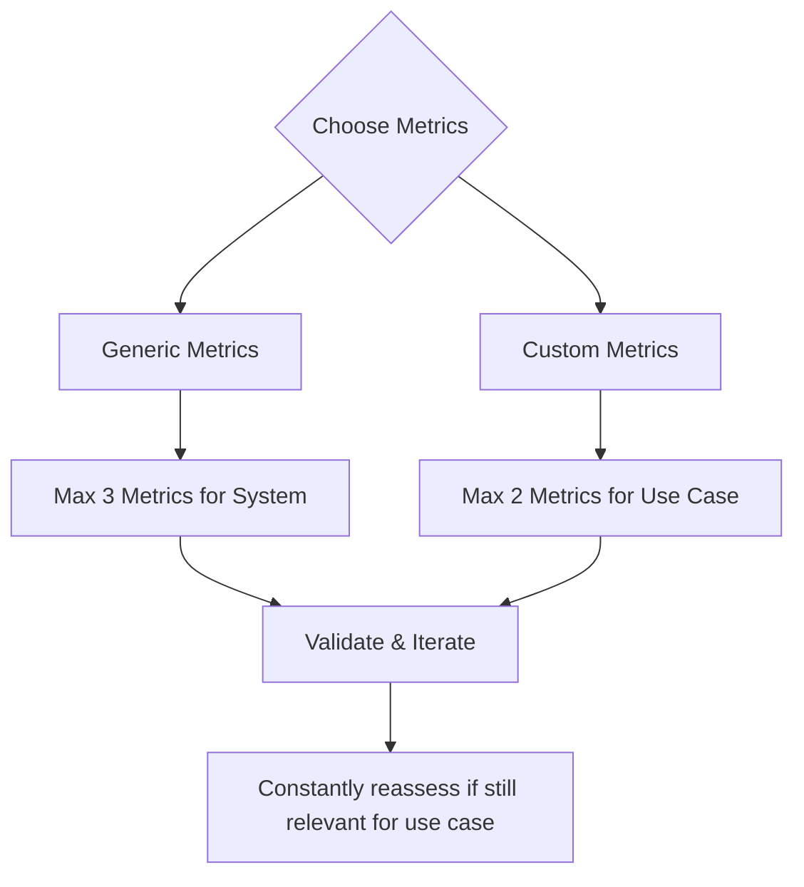

`deepeval` 提供 50+ 个开箱即用的 SOTA 指标，助你快速上手。本质上，测试用例表示你要测量的对象，而指标则是针对特定关注标准的尺子。

## Quick Summary

`deepeval` 上几乎所有预定义指标都使用 **LLM-as-a-judge**，采用 **QAG**（问答生成）、**DAG**（深无环图）与 **G-Eval** 等技术。大多数指标为表示原子化交互的[测试用例](/docs/evaluation-test-cases)打分，而[轨迹指标](/docs/evaluation-trajectory-based-llm-evals)为 AI 智能体产生的完整有序追踪打分。

`deepeval` 的所有指标都会输出基于相应公式的 **0-1 之间的分数**，以及打分**理由**。只有评估分数大于等于 `threshold`（所有指标默认 `0.5`）时，指标才算成功。

<Tabs>
<Tab title="Custom metrics">

自定义指标让你用日常语言定义**自定义标准**，底层使用 LLM-as-a-Judge 指标的 SOTA 实现：

- G-Eval
- DAG（Deep Acyclic Graph，深度无环图）
- Conversational G-Eval
- Conversational DAG
- Arena G-Eval
- 完全自己编码的 DIY 指标（例如想使用 BLEU、ROUGE 时）


</Tab>
<Tab title="AI Agents">

智能体指标在两个不同范围上评估 AI 智能体：

**轨迹指标**分析通过 [LLM 追踪](/docs/evaluation-llm-tracing)捕获的完整有序决策与行动链：

- 任务完成 —— 智能体是否成功完成了任务。
- 步骤效率 —— 智能体是否避免了不必要或冗余的步骤。
- 计划遵循 —— 智能体是否遵循了它生成的计划。
- 计划质量 —— 生成的计划是否合理、完整、高效。

**组件级行动指标**评估轨迹内单次关于工具选择与参数的 LLM 决策：

- 工具正确性 —— 智能体是否选对了工具。
- 参数正确性 —— 它是否为这些工具提供了正确的参数。

整体执行质量用[基于轨迹的评估](/docs/evaluation-trajectory-based-llm-evals)，诊断单个动作用[组件级评估](/docs/evaluation-component-level-llm-evals)。

</Tab>
<Tab title="RAG">

RAG（检索增强生成）指标独立关注**检索器与生成器组件**。

- 检索器（Retriever）：

  - Contextual Relevancy
  - Contextual Precision
  - Contextual Recall

- 生成器（Generator）：
  - Answer Relevancy
  - Faithfulness

</Tab>
<Tab title="Chatbots (multi-turn)">

多轮指标的主要用途是评估聊天机器人，使用 `ConversationalTestCase` 代替。它们包括：

- Knowledge Retention
- Role Adherence
- Conversation Completeness
- Conversation Relevancy

多轮指标把对话作为整体评估，并在此过程中考虑先前上下文。

</Tab>
<Tab title="Safety">

安全指标更关注 LLM 安全。它们包括：

- Bias
- Toxicity
- Non-Advice
- Misuse
- PIILeakage
- Role Violation

对于想要成熟的 LLM 红队测试编排框架的人，请看 [DeepTeam](https://www.trydeepteam.com/)。DeepTeam 就是专攻 LLM 红队测试的 `deepeval`。

</Tab>
<Tab title="Image">

`deepeval` 的指标默认是多模态的，针对图像的指标是明确期望测试用例中有图像的指标。它们包括：

- Image Coherence
- Image Helpfulness
- Image Reference
- Text-to-Image
- Image-Editing

注意多模态指标需要在 `LLMTestCase` 中提供 [`MLLMImage`](/docs/evaluation-test-cases#mllmimage-data-model)。

</Tab>
<Tab title="Others">

非特定用例，但对某些场景仍有用：

- Hallucination
- Json Correctness
- Summarization
- Ragas

</Tab>
</Tabs>

<Info>
**大多数指标只需要 1-2 个测试用例参数**，因此请务必访问每个指标的文档页面，了解所需内容。
</Info>

指标可以为你的应用的黑盒结果、智能体的完整轨迹或单个组件打分。第一个示例通过提供指标与测试用例运行**端到端**评估：

<Tabs>

<Tab title="Python">

```python title="main.py"
from deepeval.metrics import AnswerRelevancyMetric
from deepeval.test_case import LLMTestCase
from deepeval import evaluate

evaluate(
    metrics=[AnswerRelevancyMetric()],
    test_cases=[LLMTestCase(input="What's `deepeval`?", actual_output="Your favorite eval framework's favorite evals framework.")]
)
```

</Tab>

<Tab title="TypeScript">

```typescript title="main.ts"
import { AnswerRelevancyMetric } from "deepeval/metrics";
import { LLMTestCase } from "deepeval/test-case";
import { evaluate } from "deepeval";

await evaluate(
  [
    new LLMTestCase({
      input: "What's `deepeval`?",
      actualOutput: "Your favorite eval framework's favorite evals framework.",
    }),
  ],
  [new AnswerRelevancyMetric()]
);
```

</Tab>

</Tabs>

如果你在运行评估前登录了 [Confident AI](https://confident-ai.com)（CLI 中的 `deepeval login` 或 `deepeval view`），还能在平台上获得完整的测试报告：

<figure>
  <video controls src="https://confident-docs.s3.us-east-1.amazonaws.com/evaluation:single-turn-e2e-report.mp4"></video>
  <figcaption>为用 deepeval 运行的每个指标获取可分享的测试报告。</figcaption>
</figure>

更多信息见 [Confident AI 评估文档](https://www.confident-ai.com/docs/llm-evaluation/quickstart)。

## Why `deepeval` Metrics?

除了提供的指标种类之外，`deepeval` 的指标比其他实现更进一步，因为它们：

- 有研究支撑的 LLM-as-a-Judge（`GEval`）
- 是全世界使用最广的指标之一（日评估量 2000 万+）
- 让确定性的指标分数成为可能（使用 `DAGMetric` 时）
- 特别可靠，因为评估期间 LLM 只被用于极度受限的任务，大幅降低分数的随机性与波动性
- 为计算出的分数提供全面的理由
- 与 Confident AI 100% 集成

## Create Your First Metric

### Custom Metrics

`deepeval` 提供 G-Eval——一个最先进的 LLM 评估框架，让任何人都能用自然语言创建自定义的 LLM 评估指标。G-Eval 适用于所有单轮、多轮与多模态评估。

<Tabs>
<Tab title="G-Eval">

<Tabs>

<Tab title="Python">

```python
from deepeval.test_case import LLMTestCase, SingleTurnParams
from deepeval.metrics import GEval

test_case = LLMTestCase(input="...", actual_output="...", expected_output="...")
correctness = GEval(
    name="Correctness",
    criteria="Correctness - determine if the actual output is correct according to the expected output.",
    evaluation_params=[SingleTurnParams.ACTUAL_OUTPUT, SingleTurnParams.EXPECTED_OUTPUT],
    strict_mode=True
)

correctness.measure(test_case)
print(correctness.score, correctness.reason)
```

</Tab>

<Tab title="TypeScript">

```typescript
import { LLMTestCase, SingleTurnParams } from "deepeval/test-case";
import { GEval } from "deepeval/metrics";

const testCase = new LLMTestCase({
  input: "...",
  actualOutput: "...",
  expectedOutput: "...",
});
const correctness = new GEval({
  name: "Correctness",
  criteria:
    "Correctness - determine if the actual output is correct according to the expected output.",
  evaluationParams: [
    SingleTurnParams.ACTUAL_OUTPUT,
    SingleTurnParams.EXPECTED_OUTPUT,
  ],
  strictMode: true,
});

await correctness.measure(testCase);
console.log(correctness.score, correctness.reason);
```

</Tab>

</Tabs>

</Tab>
<Tab title="Conversational G-Eval">

<Tabs>

<Tab title="Python">

```python
from deepeval.test_case import Turn, MultiTurnParams, ConversationalTestCase
from deepeval.metrics import ConversationalGEval

convo_test_case = ConversationalTestCase(turns=[Turn(role="...", content="..."), Turn(role="...", content="...")])
professionalism_metric = ConversationalGEval(
    name="Professionalism",
    criteria="Determine whether the assistant has acted professionally based on the content."
    evaluation_params=[MultiTurnParams.CONTENT],
    strict_mode=True
)

professionalism_metric.measure(convo_test_case)
print(professionalism_metric.score, professionalism_metric.reason)
```

</Tab>

<Tab title="TypeScript">

```typescript
import {
  Turn,
  MultiTurnParams,
  ConversationalTestCase,
} from "deepeval/test-case";
import { ConversationalGEval } from "deepeval/metrics";

const convoTestCase = new ConversationalTestCase({
  turns: [
    new Turn({ role: "user", content: "..." }),
    new Turn({ role: "assistant", content: "..." }),
  ],
});
const professionalismMetric = new ConversationalGEval({
  name: "Professionalism",
  criteria:
    "Determine whether the assistant has acted professionally based on the content.",
  evaluationParams: [MultiTurnParams.CONTENT],
  strictMode: true,
});

await professionalismMetric.measure(convoTestCase);
console.log(professionalismMetric.score, professionalismMetric.reason);
```

</Tab>

</Tabs>

</Tab>
</Tabs>

在底层，`deepeval` 先生成一系列评估步骤，再将这些步骤与 `LLMTestCase` 中的信息结合进行评估。更多信息见 [G-Eval 文档页面](/docs/metrics-llm-evals)。

<Tip>

如果你在寻找基于决策树的 LLM-as-a-Judge，请看[深无环图（DAG）](/docs/metrics-dag)指标。

</Tip>

### Default Metrics

<Tabs>
<Tab title="AI Agents">

`deepeval` 包含六个用于评估 AI 智能体的指标。按你需要的范围选择：

**轨迹指标**评估完整执行过程如何协同：

- **任务完成：**评估智能体是否成功完成了任务。
- **步骤效率：**评估智能体是否在没有不必要或冗余步骤的情况下完成任务。
- **计划遵循：**评估智能体在执行期间是否遵循了它生成的计划。
- **计划质量：**评估生成的计划是否合理、完整、高效。

**组件级行动指标**评估单次 LLM 工具调用决策：

- **工具正确性：**评估智能体是否选对了工具。
- **参数正确性：**评估智能体是否为这些工具提供了正确的参数。

轨迹指标需要[追踪](/docs/evaluation-llm-tracing)，因为它们分析完整的有序追踪。运行智能体时把它们传给 `evals_iterator()`：

<Tabs>

<Tab title="Python">

```python title="main.py" {16}
from deepeval.dataset import EvaluationDataset, Golden
from deepeval.metrics import TaskCompletionMetric
from deepeval.tracing import observe

@observe()
def trip_planner_agent(input):

    @observe()
    def itinerary_generator(destination, days):
        return ["Eiffel Tower", "Louvre Museum", "Montmartre"][:days]

    return itinerary_generator("Paris", 2)

dataset = EvaluationDataset(goldens=[Golden(input="Plan a two-day trip to Paris")])

for golden in dataset.evals_iterator(metrics=[TaskCompletionMetric(threshold=0.5)]):
    trip_planner_agent(golden.input)
```

</Tab>

<Tab title="TypeScript">

```typescript title="main.ts" {18}
import { EvaluationDataset, Golden } from "deepeval/dataset";
import { TaskCompletionMetric } from "deepeval/metrics";
import { observe } from "deepeval/tracing";

const itineraryGenerator = observe({
  fn: async (destination: string, days: number) =>
    ["Eiffel Tower", "Louvre Museum", "Montmartre"].slice(0, days),
});

const tripPlannerAgent = observe({
  fn: async (input: string) => await itineraryGenerator("Paris", 2),
});

const dataset = new EvaluationDataset({
  goldens: [new Golden({ input: "Plan a two-day trip to Paris" })],
});

for await (const golden of dataset.evalsIterator({
  metrics: [new TaskCompletionMetric({ threshold: 0.5 })],
})) {
  await tripPlannerAgent((golden as Golden).input);
}
```

</Tab>

</Tabs>

</Tab>
<Tab title="RAG">

最常用的 RAG 指标包括：

- **答案相关性：**评估生成的答案是否与用户查询相关
- **忠实度：**衡量生成的答案与提供的上下文在事实上是否一致
- **上下文相关性：**评估检索到的上下文是否与用户查询相关
- **上下文召回率：**评估检索到的上下文是否包含所有相关信息
- **上下文精确率：**衡量检索到的上下文是否精确且聚焦

它们可以从 `deepeval.metrics` 模块直接导入：

<Tabs>

<Tab title="Python">

```python title="main.py"
from deepeval.metrics import AnswerRelevancyMetric
from deepeval.test_case import LLMTestCase

test_case = LLMTestCase(input="...", actual_output="...")
relevancy = AnswerRelevancyMetric(threshold=0.5)

relevancy.measure(test_case)
print(relevancy.score, relevancy.reason)
```

</Tab>

<Tab title="TypeScript">

```typescript title="main.ts"
import { AnswerRelevancyMetric } from "deepeval/metrics";
import { LLMTestCase } from "deepeval/test-case";

const testCase = new LLMTestCase({ input: "...", actualOutput: "..." });
const relevancy = new AnswerRelevancyMetric({ threshold: 0.5 });

await relevancy.measure(testCase);
console.log(relevancy.score, relevancy.reason);
```

</Tab>

</Tabs>

</Tab>
<Tab title="Chatbots">

聊天机器人需要「对话式」（或多轮）指标，它们包括：

- **对话完整性：**评估对话是否满足用户需求。
- **对话相关性：**衡量生成的输出是否与用户输入相关。
- **角色遵循：**评估聊天机器人在整个对话中是否保持角色设定。
- **知识保留：**评估聊天机器人能否保留在对话中学到的知识。

对话式指标需要使用 [`ConversationalTestCase`](/docs/evaluation-multiturn-test-cases#conversational-test-case) 而不是普通的 `LLMTestCase`：

<Tabs>

<Tab title="Python">

```python title="main.py"
from deepeval.test_case import Turn, ConversationalTestCase
from deepeval.metrics import ConversationalGEval

convo_test_case = ConversationalTestCase(turns=[Turn(role="...", content="..."), Turn(role="...", content="...")])
role_adherence = RoleAdherenceMetric(threshold=0.5)

role_adherence.measure(convo_test_case)
print(role_adherence.score, role_adherence.reason)
```

</Tab>

<Tab title="TypeScript">

```typescript title="main.ts"
import { Turn, ConversationalTestCase } from "deepeval/test-case";
import { RoleAdherenceMetric } from "deepeval/metrics";

const convoTestCase = new ConversationalTestCase({
  turns: [
    new Turn({ role: "user", content: "..." }),
    new Turn({ role: "assistant", content: "..." }),
  ],
});
const roleAdherence = new RoleAdherenceMetric({ threshold: 0.5 });

await roleAdherence.measure(convoTestCase);
console.log(roleAdherence.score, roleAdherence.reason);
```

</Tab>

</Tabs>

</Tab>
<Tab title="Images">

<Tabs>

<Tab title="Python">

```python
from deepeval.test_case import LLMTestCase, MLLMImage
from deepeval.metrics import ImageCoherenceMetric

test_case = LLMTestCase(input=f"What does this image say? {MLLMImage(...)}", actual_output="No idea!")
image_coherence = ImageCoherenceMetric(threshold=0.5)

image_coherence.measure(test_case)
print(image_coherence.score, image_coherence.reason)
```

</Tab>

<Tab title="TypeScript">

```typescript
import { LLMTestCase, MLLMImage } from "deepeval/test-case";
import { ImageCoherenceMetric } from "deepeval/metrics";

const testCase = new LLMTestCase({
  input: `What does this image say? ${new MLLMImage({ url: "..." })}`,
  actualOutput: "No idea!",
});
const imageCoherence = new ImageCoherenceMetric({ threshold: 0.5 });

await imageCoherence.measure(testCase);
console.log(imageCoherence.score, imageCoherence.reason);
```

</Tab>

</Tabs>

</Tab>
<Tab title="Safety">

<Tabs>

<Tab title="Python">

```python
from deepeval.test_case import LLMTestCase
from deepeval.metrics import BiasMetric

test_case = LLMTestCase(input="...", actual_output="...")
bias = BiasMetric(threshold=0.5)

bias.measure(test_case)
print(bias.score, bias.reason)
```

</Tab>

<Tab title="TypeScript">

```typescript
import { LLMTestCase } from "deepeval/test-case";
import { BiasMetric } from "deepeval/metrics";

const testCase = new LLMTestCase({ input: "...", actualOutput: "..." });
const bias = new BiasMetric({ threshold: 0.5 });

await bias.measure(testCase);
console.log(bias.score, bias.reason);
```

</Tab>

</Tabs>

</Tab>
</Tabs>

## Choosing Your Metrics

选择指标时可以考虑以下类别：

- **自定义指标**是特定于用例、与架构无关的：
  - G-Eval——最适合正确性、连贯性、语气等**主观**标准；易于上手。
  - DAG——面向**客观或混合**标准的**决策树**指标（例如先验证格式再评估语气）。
  - 从简单的 G-Eval 开始；需要更多控制时用 DAG。你也可以继承 `BaseMetric` 创建自己的指标。
- **通用指标**是特定于系统、与用例无关的：
  - 智能体轨迹指标：在完整追踪上评估任务完成、执行效率、规划与计划遵循
  - 智能体组件指标：在单个行动步骤上评估工具选择与参数生成
  - RAG 指标：分别衡量检索器与生成器
  - 多轮指标：衡量整体对话质量
  - 多组件 LLM 系统可组合使用这些指标。
- **基于参考 vs 无参考**：
  - 基于参考的指标需要**基准真值**（例如上下文召回率或工具正确性）。
  - 无参考指标**无需标注数据**即可工作，适合在线或生产评估。
  - 请查看每个指标的文档了解所需参数。

<Info>
如果你要在生产环境中运行指标，_必须_选择无参考指标，因为线上不会有标注数据。
</Info>

决定指标时，无论多诱惑，请尽量把自己限制在**不超过 5 个指标**，按此 breakdown：

- **2-3 个**通用、特定于系统的指标（例如智能体的任务完成、RAG 的上下文精确率）
- **1-2 个**自定义、特定于用例的指标（例如医疗聊天机器人的有用性、摘要的格式正确性）

目标是逼自己排定优先级、清晰地定义评估标准。这不仅帮你用好 `deepeval`，也帮你理解在 LLM 应用中你最在意什么。

<div style={{textAlign: 'center', margin: "1rem 0"}}>



</div>

如果你还不确定，这里有一些额外的想法：

- **AI 智能体**：从 `TaskCompletionMetric` 开始评估整体轨迹质量，当执行路径重要时加入 `StepEfficiencyMetric`、`PlanAdherenceMetric` 或 `PlanQualityMetric`，并用 `ToolCorrectnessMetric` 或 `ArgumentCorrectnessMetric` 诊断单个 LLM 工具调用决策
- **RAG**：关注 `AnswerRelevancyMetric`（评估 `actual_output` 与 `input` 的对齐）和 `FaithfulnessMetric`（对照 `retrieval_context` 检查幻觉）
- **聊天机器人**：实现 `ConversationCompletenessMetric` 评估整体对话质量
- **自定义需求**：当标准指标不满足需求时，用 `G-Eval` 或 `DAG` 框架创建自定义评估

在某些情况下，当你的 LLM 模型承担了大部分工作，使用更多特定于用例的指标也很常见。

## 配置 LLM 裁判

你可以在 `deepeval` 中使用**任意** LLM 裁判，包括 OpenAI、Azure OpenAI、Ollama、Anthropic、Gemini、LiteLLM 等。你也可以把自己的 LLM API 包装进 `deepeval` 的 `DeepEvalBaseLLM` 类来使用任意模型。完整指南[点击这里](/guides/guides-using-custom-llms)。

<Tabs>

<Tab title="Python">

<Tabs>
<Tab title="OpenAI">

要在 `deepeval` 的 LLM 指标中使用 OpenAI，请在 CLI 中提供你的 `OPENAI_API_KEY`：

```bash
export OPENAI_API_KEY=<your-openai-api-key>
```

或者，如果你在笔记本环境（Jupyter 或 Colab）中工作，请在单元格里设置 `OPENAI_API_KEY`：

```bash
%env OPENAI_API_KEY=<your-openai-api-key>
```

<Warning>
在笔记本环境中设置 `API_KEYS` 作为环境变量时，请**不要加**引号。
</Warning>

</Tab>
<Tab title="Azure OpenAI">

`deepeval` 也允许你对使用 LLM 评估的指标使用 Azure OpenAI。在 CLI 中运行以下命令，把 `deepeval` 环境配置为对**所有**基于 LLM 的指标使用 Azure OpenAI。

```bash
deepeval set-azure-openai \
    --base-url=<endpoint> \ # e.g. https://example-resource.azure.openai.com/
    --model=<model_name> \ # e.g. gpt-4.1
    --deployment-name=<deployment_name> \  # e.g. Test Deployment
    --api-version=<api_version> \ # e.g. 2025-01-01-preview
    --model-version=<model_version> # e.g. 2024-11-20
```

<Info>
你的 OpenAI API 版本必须至少是 `2024-08-01-preview`，即结构化输出发布之时。
</Info>

注意 `model-version` 是**可选的**。如果你以后想停用 Azure OpenAI、换回常规 OpenAI，运行：

```bash
deepeval unset-azure-openai
```

</Tab>
<Tab title="Ollama">

<Note>
开始之前，请确认你的 [Ollama 模型](https://ollama.com/search)已安装并正在运行。点击前述链接可以查看可用模型的完整列表。

```bash
ollama run deepseek-r1:1.5b
```

</Note>

要在你的指标中使用 **Ollama** 模型，在 CLI 中运行 `deepeval set-ollama --model=<model>`。例如：

```bash
deepeval set-ollama --model=deepseek-r1:1.5b
```

可选地，如果你定义了自定义端口，可以指定本地 Ollama 模型实例的**基础 URL**。默认基础 URL 为 `http://localhost:11434`。

```bash
deepeval set-ollama --model=deepseek-r1:1.5b \
    --base-url="http://localhost:11434"
```

要停用本地 Ollama 模型、换回 OpenAI，运行：

```bash
deepeval unset-ollama
```

<Warning>
`deepeval set-ollama` 命令专用于配置 LLM 模型。如果你想在合成器中使用 Ollama 的自定义嵌入模型，请[参阅指南的这一节](/guides/guides-using-custom-embedding-models)。
</Warning>

</Tab>
<Tab title="Gemini">

要在 `deepeval` 中使用 Gemini 模型，在 CLI 中运行以下命令。

```bash
deepeval set-gemini \
    --model=<model_name> # e.g. "gemini-2.0-flash-001"
```

</Tab>
<Tab title="自定义 LLM 示例">

`deepeval` 允许你使用**任意**自定义 LLM 做评估。包括来自 langchain 聊天模型集成的 LLM、Hugging Face 的 `transformers` 库，甚至 GGML 格式的 LLM。

这包括你喜欢的任何模型，例如：

- Azure OpenAI
- Claude（经 AWS Bedrock）
- Google Vertex AI
- Mistral 7B

所有示例都[在这里](/guides/guides-using-custom-llms#more-examples)，下面是通过 langchain 的 `AzureChatOpenAI` 模块接入自定义 Azure OpenAI 模型做评估的快速示例：

```python
from langchain_openai import AzureChatOpenAI
from deepeval.models.base_model import DeepEvalBaseLLM

class AzureOpenAI(DeepEvalBaseLLM):
    def __init__(
        self,
        model
    ):
        self.model = model

    def load_model(self):
        return self.model

    def generate(self, prompt: str) -> str:
        chat_model = self.load_model()
        return chat_model.invoke(prompt).content

    async def a_generate(self, prompt: str) -> str:
        chat_model = self.load_model()
        res = await chat_model.ainvoke(prompt)
        return res.content

    def get_model_name(self):
        return "Custom Azure OpenAI Model"

# Replace these with real values
custom_model = AzureChatOpenAI(
    openai_api_version=api_version,
    azure_deployment=azure_deployment,
    azure_endpoint=azure_endpoint,
    openai_api_key=openai_api_key,
)
azure_openai = AzureOpenAI(model=custom_model)
print(azure_openai.generate("Write me a joke"))
```

创建自定义 LLM 评估模型时，你应当**始终**：

- 继承 `DeepEvalBaseLLM`。
- 实现 `get_model_name()` 方法，它只返回一个表示你自定义模型名称的字符串。
- 实现 `load_model()` 方法，它负责返回一个模型对象。
- 实现 `generate()` 方法，它有**且只有一个**字符串类型参数，作为你的自定义 LLM 的提示词。
- `generate()` 方法应返回你的自定义 LLM 的最终输出字符串。注意在本例中我们用 `chat_model.invoke(prompt).content` 访问模型生成结果，但具体取决于你的自定义模型对象的实现，可能有所不同。
- 实现 `a_generate()` 方法，函数签名与 `generate()` 相同。**注意这是一个异步方法**。本例中我们用了 `await chat_model.ainvoke(prompt)`，它是 LangChain 聊天模型提供的异步包装。

<Tip>
当你异步执行指标 / 运行评估时，`deepeval` 会用 `a_generate()` 方法生成 LLM 输出。

如果你的自定义模型对象没有异步接口，直接复用 `generate()` 的代码即可（往下翻到 `Mistral7B` 示例查看更多细节）。但这会让 `a_generate()` 变成阻塞过程，无论你是否为指标开启了 `async_mode`。
</Tip>

最后，把它用于 LLM-Eval 评估：

```python
from deepeval.metrics import AnswerRelevancyMetric
...

metric = AnswerRelevancyMetric(model=azure_openai)
```

<Note>
虽然 Azure OpenAI 命令把 `deepeval` 配置为对所有 LLM-Eval 全局使用 Azure OpenAI，但自定义 LLM 必须在每次实例化指标时单独设置。记得通过 `model` 参数为你想用它的指标提供自定义 LLM 实例。
</Note>

<Warning>
我们**无法**保证使用自定义模型时评估会如期工作。这是因为评估需要高水平的推理能力以及遵循指令的能力，例如以合法 JSON 格式输出响应。[**要让自定义 LLM 更好地输出合法 JSON，请阅读本指南**](/guides/guides-using-custom-llms)。

另外，如果你经常遇到 JSON 错误并想忽略它，可以在[测试运行时使用 `-c` 和 `-i` 开关](/docs/evaluation-flags-and-configs#flags-for-deepeval-test-run)：

```bash
deepeval test run test_example.py -i -c
```

`-i` 开关会忽略错误，`-c` 开关利用本地 `deepeval` 缓存，这样部分成功的测试运行不必重跑没有出错的测试用例。

</Warning>

</Tab>
</Tabs>

</Tab>

<Tab title="TypeScript">

<Tabs>
<Tab title="OpenAI">

要在 `deepeval` 的 LLM 指标中使用 OpenAI，请在 CLI 中提供你的 `OPENAI_API_KEY`：

```bash
export OPENAI_API_KEY=<your-openai-api-key>
```

另外，`deepeval` 会在导入时依次自动加载 `.env.local` 和 `.env`，因此你可以完全不把密钥放进 shell：

```bash
# .env.local
OPENAI_API_KEY=<your-openai-api-key>
```

</Tab>
<Tab title="Vercel AI SDK">

[Vercel AI SDK](/integrations/models/ai-sdk) 通过代码而非 `set-*` 命令配置：把任意 AI SDK `LanguageModel` 包进一个 `AISDKModel`。先安装 AI SDK 核心包与你想用的提供商包：

```bash
npm install ai @ai-sdk/openai
```

每个 AI SDK 提供商按其自身约定从环境中读取自己的 API key：

```bash
# .env.local
OPENAI_API_KEY=<your-openai-api-key>
```

然后把包装好的模型传给任意指标：

```typescript
import { AnswerRelevancyMetric } from "deepeval/metrics";
import { AISDKModel } from "deepeval/models";
import { openai } from "@ai-sdk/openai";

const model = new AISDKModel({ model: openai("gpt-4o"), temperature: 0 });
const answerRelevancy = new AnswerRelevancyMetric({ model });
```

<Tip>
`deepeval` 为 OpenAI、Anthropic、Gemini 等少数提供商提供了现成的模型类，但并非覆盖所有提供商。如果你想用的裁判模型不在其中——Mistral、Cohere、Groq、Together——安装其 AI SDK 包并包进 `AISDKModel` 即可使用。
</Tip>

</Tab>
<Tab title="Anthropic">

要在 `deepeval` 的 LLM 指标中使用 Anthropic 模型，请在 CLI 中提供你的 `ANTHROPIC_API_KEY`：

```bash
export ANTHROPIC_API_KEY=<your-anthropic-api-key>
```

然后为**所有**基于 LLM 的指标选择你想用的 Claude 裁判模型：

```bash
npx deepeval set-anthropic --model=claude-sonnet-4-6
```

要停用 Anthropic、换回 OpenAI，运行：

```bash
npx deepeval unset-anthropic
```

</Tab>
<Tab title="Azure OpenAI">

`deepeval` 也允许你对使用 LLM 评估的指标使用 Azure OpenAI。在 CLI 中运行以下命令，把 `deepeval` 环境配置为对**所有**基于 LLM 的指标使用 Azure OpenAI。

```bash
npx deepeval set-azure-openai \
    --base-url=<endpoint> \ # e.g. https://example-resource.azure.openai.com/
    --model=<model_name> \ # e.g. gpt-4.1
    --deployment-name=<deployment_name> \  # e.g. Test Deployment
    --api-version=<api_version> \ # e.g. 2025-01-01-preview
    --model-version=<model_version> # e.g. 2024-11-20
```

<Info>
你的 OpenAI API 版本必须至少是 `2024-08-01-preview`，即结构化输出发布之时。
</Info>

注意 `model-version` 是**可选的**。如果你以后想停用 Azure OpenAI、换回常规 OpenAI，运行：

```bash
npx deepeval unset-azure-openai
```

</Tab>
<Tab title="Ollama">

<Note>
开始之前，请确认你的 [Ollama 模型](https://ollama.com/search)已安装并正在运行。点击前述链接可以查看可用模型的完整列表。

```bash
ollama run deepseek-r1:1.5b
```

</Note>

要在你的指标中使用 **Ollama** 模型，在 CLI 中运行 `npx deepeval set-ollama --model=<model>`。例如：

```bash
npx deepeval set-ollama --model=deepseek-r1:1.5b
```

可选地，如果你定义了自定义端口，可以指定本地 Ollama 模型实例的**基础 URL**。默认基础 URL 为 `http://localhost:11434`。

```bash
npx deepeval set-ollama --model=deepseek-r1:1.5b \
    --base-url="http://localhost:11434"
```

要停用本地 Ollama 模型、换回 OpenAI，运行：

```bash
npx deepeval unset-ollama
```

</Tab>
<Tab title="自定义 LLM 示例">

`deepeval` 允许你使用**任意**自定义 LLM 做评估。包括来自 LangChain 聊天模型集成的 LLM、通过 Vercel AI SDK 可达的任何提供商，或你自己托管的模型。

这包括你喜欢的任何模型，例如：

- Azure OpenAI
- Claude（经 AWS Bedrock）
- Google Vertex AI
- Mistral 7B

所有示例都[在这里](/guides/guides-using-custom-llms#more-examples)，下面是通过 LangChain 的 `AzureChatOpenAI` 模块接入自定义 Azure OpenAI 模型做评估的快速示例：

```typescript
import { DeepEvalBaseLLM, type GenerationResult } from "deepeval/models";
import { AzureChatOpenAI } from "@langchain/openai";
import type { ZodType } from "zod";

class AzureOpenAI extends DeepEvalBaseLLM {
  constructor(private model: AzureChatOpenAI) {
    super();
  }

  async generate<T = string>(
    prompt: string,
    schema?: ZodType<T>,
  ): Promise<GenerationResult<T>> {
    // A schema is passed whenever the metric needs structured output
    if (schema) {
      const structured = this.model.withStructuredOutput(schema);
      return { output: (await structured.invoke(prompt)) as T, cost: null };
    }
    const response = await this.model.invoke(prompt);
    return { output: String(response.content) as T, cost: null };
  }

  getModelName(): string {
    return "Custom Azure OpenAI Model";
  }
}

// Replace these with real values
const customModel = new AzureChatOpenAI({
  azureOpenAIApiVersion: apiVersion,
  azureOpenAIApiDeploymentName: azureDeployment,
  azureOpenAIEndpoint: azureEndpoint,
  azureOpenAIApiKey: openaiApiKey,
});
const azureOpenAI = new AzureOpenAI(customModel);
console.log(await azureOpenAI.generate("Write me a joke"));
```

创建自定义 LLM 评估模型时，你应当**始终**：

- 继承 `DeepEvalBaseLLM`。
- 实现 `getModelName()` 方法，它只返回一个表示你自定义模型名称的字符串。
- 实现 `generate()` 方法，它始终是 `async`——没有需要对应的 `generate()` / `a_generate()` 之分，也没有要实现的 `loadModel()`。
- 从 `generate()` 返回 `{ output, cost }`，其中 `cost` 在你的提供商不上报时可以是 `null`。
- 遵循可选的 `schema` 参数。指标需要结构化输出时会传一个 zod schema，并期望 `output` 是解析后的对象而非字符串。

<Tip>
如果你的提供商无法原生产出结构化输出，就在提示词里要求 JSON，并自己把响应跑一遍 `schema.parse()`——这正是 `deepeval` 内置模型的做法。
</Tip>

最后，把它用于 LLM-Eval 评估：

```typescript
import { AnswerRelevancyMetric } from "deepeval/metrics";
// ...

const metric = new AnswerRelevancyMetric({ model: azureOpenAI });
```

<Note>
虽然 Azure OpenAI 命令把 `deepeval` 配置为对所有 LLM-Eval 全局使用 Azure OpenAI，但自定义 LLM 必须在每次实例化指标时单独设置。记得通过 `model` 参数为你想用它的指标提供自定义 LLM 实例。
</Note>

<Warning>
我们**无法**保证使用自定义模型时评估会如期工作。这是因为评估需要高水平的推理能力以及遵循指令的能力，例如以合法 JSON 格式输出响应。[**要让自定义 LLM 更好地输出合法 JSON，请阅读本指南**](/guides/guides-using-custom-llms)。

另外，如果你经常遇到 JSON 错误并想忽略它，可以在[测试运行时使用 `-c` 和 `-i` 开关](/docs/evaluation-flags-and-configs#flags-for-deepeval-test-run)：

```bash
npx deepeval test run chatbot.test.ts -i -c
```

`-i` 开关会忽略错误，`-c` 开关利用本地 `deepeval` 缓存，这样部分成功的测试运行不必重跑没有出错的测试用例。

</Warning>

</Tab>
</Tabs>

</Tab>

</Tabs>

## 使用指标

使用指标有四种方式：

1. [端到端](/docs/evaluation-end-to-end-llm-evals)评估：把你的 LLM 系统当黑盒，评估系统输入与输出。
2. [基于轨迹](/docs/evaluation-trajectory-based-llm-evals)评估：评估 AI 智能体走过的完整有序步骤链。
3. [组件级](/docs/evaluation-component-level-llm-evals)评估：把指标放在 LLM 应用内的单个组件上。
4. 一次性（或独立）评估：用单个指标单独执行。

### For End-to-End Evals

要对你的 LLM 系统运行端到端评估，为黑盒指标提供一组[测试用例](/docs/evaluation-test-cases)：

<Tabs>

<Tab title="Python">

```python
from deepeval.metrics import AnswerRelevancyMetric
from deepeval.test_case import LLMTestCase
from deepeval import evaluate

test_case = LLMTestCase(input="...", actual_output="...")

evaluate(test_cases=[test_case], metrics=[AnswerRelevancyMetric()])
```

</Tab>

<Tab title="TypeScript">

```typescript
import { AnswerRelevancyMetric } from "deepeval/metrics";
import { LLMTestCase } from "deepeval/test-case";
import { evaluate } from "deepeval";

const testCase = new LLMTestCase({ input: "...", actualOutput: "..." });

await evaluate([testCase], [new AnswerRelevancyMetric()]);
```

</Tab>

</Tabs>

[`evaluate()` 函数](/docs/evaluation-introduction#evaluating-without-pytest)或 `deepeval test run` **是运行评估的最佳方式**。它们开箱即带大量功能，包括缓存、并行化、成本追踪、错误处理，以及与 [Confident AI](https://confident-ai.com) 的集成。

<Tip>
[`deepeval test run`](/docs/evaluation-introduction#evaluating-with-pytest) 是 `deepeval` 的原生 Pytest 集成，让你能在 CI/CD 流水线中运行评估。
</Tip>

### For Trajectory-Based Evals

轨迹指标分析智能体完整追踪中计划、模型调用、工具、移交与中间步骤之间的关系。带有**轨迹**标签的指标——任务完成、步骤效率、计划遵循、计划质量——需要 [LLM 追踪](/docs/evaluation-llm-tracing)。

把轨迹指标传给 `evals_iterator()`，然后为每个金标调用一次你做了追踪的智能体：

<Tabs>

<Tab title="Python">

```python
from deepeval.dataset import EvaluationDataset, Golden
from deepeval.metrics import TaskCompletionMetric
from app import my_agent

dataset = EvaluationDataset(
    goldens=[Golden(input="Plan a three-day trip to Paris")]
)

for golden in dataset.evals_iterator(metrics=[TaskCompletionMetric()]):
    my_agent(golden.input)
```

</Tab>

<Tab title="TypeScript">

```typescript
import { EvaluationDataset, Golden } from "deepeval/dataset";
import { TaskCompletionMetric } from "deepeval/metrics";
import { myAgent } from "./app";

const dataset = new EvaluationDataset({
  goldens: [new Golden({ input: "Plan a three-day trip to Paris" })],
});

for await (const golden of dataset.evalsIterator({
  metrics: [new TaskCompletionMetric()],
})) {
  await myAgent((golden as Golden).input);
}
```

</Tab>

</Tabs>

智能体结束后，每个指标都会收到完整的有序追踪。埋点示例、CI/CD 用法以及组合轨迹与组件指标的指引见[基于轨迹的评估](/docs/evaluation-trajectory-based-llm-evals)。

### For Component-Level Evals

要用任意指标对你的 LLM 系统运行组件级评估，只需用 `@observe` 装饰你的组件并在运行时创建[测试用例](/docs/evaluation-test-cases)：

<Tabs>

<Tab title="Python">

```python
from deepeval.tracing import observe, update_current_span
from deepeval.dataset import EvaluationDataset, Golden
from deepeval.metrics import AnswerRelevancyMetric

# 1. observe() decorator traces LLM components
@observe()
def llm_app(input: str):
    # 2. Supply metric at any component
    @observe(metrics=[AnswerRelevancyMetric()])
    def nested_component():
        # 3. Create test case at runtime
        update_current_span(test_case=LLMTestCase(...))
        pass

    nested_component()

# 4. Create dataset
dataset = EvaluationDataset(goldens=[Golden(input="Test input")])

# 5. Loop through dataset
for goldens in dataset.evals_iterator():
    # Call LLM app
    llm_app(golden.input)
```

</Tab>

<Tab title="TypeScript">

```typescript
import { observe, updateCurrentSpan } from "deepeval/tracing";
import { EvaluationDataset, Golden } from "deepeval/dataset";
import { AnswerRelevancyMetric } from "deepeval/metrics";
import { LLMTestCase } from "deepeval/test-case";

// 2. Supply metric at any component
const nestedComponent = observe({
  metrics: [new AnswerRelevancyMetric()],
  fn: async () => {
    // 3. Create test case at runtime
    updateCurrentSpan({
      testCase: new LLMTestCase({ input: "...", actualOutput: "..." }),
    });
  },
});

// 1. observe() traces LLM components
const llmApp = observe({
  fn: async (input: string) => {
    await nestedComponent();
  },
});

// 4. Create dataset
const dataset = new EvaluationDataset({
  goldens: [new Golden({ input: "Test input" })],
});

// 5. Loop through dataset
for await (const golden of dataset.evalsIterator()) {
  // Call LLM app
  await llmApp((golden as Golden).input);
}
```

</Tab>

</Tabs>

### Use Metrics with Integrations

`deepeval` 的框架集成捕获指标所评估的追踪与 span，让你可以为完整的智能体轨迹或框架产生的单个组件打分，而无需自己重建执行结构。

以下是你所选 SDK 可用的一些示例：

<Tabs>
  <Tab title="Python">
    <CardGroup cols={2}>
      <Card
        title="LangChain"
        description="评估完整的智能体运行、模型调用、工具与检索器。"
        href="/integrations/frameworks/langchain"
      />
      <Card
        title="Pydantic AI"
        description="评估 Pydantic AI 智能体及其被埋点的 span。"
        href="/integrations/frameworks/pydanticai"
      />
      <Card
        title="AWS AgentCore"
        description="评估托管在 AgentCore 上的智能体及其嵌套 span。"
        href="/integrations/frameworks/agentcore"
      />
      <Card
        title="Google ADK"
        description="评估 ADK 智能体运行、工具与模型调用。"
        href="/integrations/frameworks/google-adk"
      />
    </CardGroup>
  </Tab>
  <Tab title="TypeScript">
    <CardGroup cols={2}>
      <Card
        title="LangChain"
        description="评估完整的智能体运行、模型调用、工具与检索器。"
        href="/integrations/frameworks/langchain"
      />
      <Card
        title="Mastra"
        description="评估 Mastra 智能体及其 OpenTelemetry span。"
        href="/integrations/frameworks/mastra"
      />
      <Card
        title="Vercel AI SDK"
        description="评估 AI SDK 的生成、工具与遥测 span。"
        href="/integrations/frameworks/ai-sdk"
      />
      <Card
        title="LangGraph"
        description="评估图轨迹以及每次运行内的节点。"
        href="/integrations/frameworks/langgraph"
      />
    </CardGroup>
  </Tab>
</Tabs>

端到端或基于轨迹的评估把指标传给 `evals_iterator()`。组件级评估则在框架产生的 span 上挂载或预置指标。每个集成指南都会展示该框架支持的用法。

[浏览全部框架集成 →](/integrations)

### For One-Off Evals

你也可以单独执行每个指标。`deepeval` 中的所有指标（包括[你创建的自定义指标](/docs/metrics-custom)）：

- 可以通过 `metric.measure()` 方法执行
- 可以通过 `metric.score` 访问分数，范围为 0 - 1
- 可以通过 `metric.reason` 访问打分理由
- 可以通过 `metric.is_successful()` 访问状态
- 可以用于评估测试用例或整个数据集，有无 Pytest 均可
- 有一个充当成功阈值的 [`threshold`](/docs/metrics-introduction#metric-thresholds)。只有 `metric.score` 高于/低于 `threshold` 时 `metric.is_successful()` 才为真
- 有一个 [`flaky`](/docs/metrics-introduction#flaky-metrics) 属性，开启后该指标的判定不再决定测试用例的通过/失败状态
- 有一个 `strict_mode` 属性，开启后会把 `metric.score` 强制为二元值
- 有一个 `verbose_mode` 属性，开启后每次执行指标都会打印指标日志

此外，`deepeval` 的所有指标默认异步执行。

你可以在实例化指标时用 `async_mode` 参数配置该行为。

<Tip>
访问单个指标页面，了解它们如何计算，以及创建 `LLMTestCase` 时需要什么才能执行。
</Tip>

下面是一个快速示例：

<Tabs>

<Tab title="Python">

```python
from deepeval.metrics import AnswerRelevancyMetric
from deepeval.test_case import LLMTestCase

# Initialize a test case
test_case = LLMTestCase(...)

# Initialize metric with threshold
metric = AnswerRelevancyMetric(threshold=0.5)
metric.measure(test_case)

print(metric.score, metric.reason)
```

</Tab>

<Tab title="TypeScript">

```typescript
import { AnswerRelevancyMetric } from "deepeval/metrics";
import { LLMTestCase } from "deepeval/test-case";

// Initialize a test case
const testCase = new LLMTestCase({ input: "...", actualOutput: "..." });

// Initialize metric with threshold
const metric = new AnswerRelevancyMetric({ threshold: 0.5 });
await metric.measure(testCase);

console.log(metric.score, metric.reason);
```

</Tab>

</Tabs>

`deepeval` 的所有指标都会在分数之外给出 `reason`。

## 异步使用指标

<Tabs>

<Tab title="Python">

当指标的 `async_mode=True`（所有指标的默认值）时，调用 `metric.measure()` 会并发执行内部算法。但要注意：虽然 `measure()` **内部**的操作并发执行，`metric.measure()` 调用本身仍会阻塞主线程。

</Tab>

<Tab title="TypeScript">

`deepeval` 中的每个指标本身就是异步的，没有任何开关要打开。指标的算法由多次 LLM 调用组成，`measure()` 会同时发起彼此不依赖的调用，而不是一个接一个。

<Info>
以 [`FaithfulnessMetric` 算法](/docs/metrics-faithfulness#how-is-it-calculated)为例：

1. **抽取所有事实声明**（来自 `actualOutput`）
2. **抽取所有事实真相**（来自 `retrievalContext`）
3. **比较抽取出的声明与真相**，生成最终分数与理由

步骤 1 与 2 相互独立，因此并发运行，只有步骤 3 等待两者。你写的 `await` 只是一个调用，但底层已尽可能并行。
</Info>

</Tab>

</Tabs>

<Info>
以 [`FaithfulnessMetric` 算法](/docs/metrics-faithfulness#how-is-it-calculated)为例：

1. **抽取所有事实声明**（来自 `actual_output`）
2. **抽取所有事实真相**（来自 `retrieval_context`）
3. **比较抽取出的声明与真相**，生成最终分数与理由。

```python
from deepeval.metrics import FaithfulnessMetric
...

metric = FaithfulnessMetric(async_mode=True)
metric.measure(test_case)
print("Metric finished!")
```

当 `async_mode=True` 时，步骤 1 与 2 并发执行（即同时进行），因为它们彼此独立；而 `async_mode=False` 会让步骤 1 与 2 顺序执行（即一个接一个）。

两种情况下，「Metric finished!」都会等 `metric.measure()` 运行完才打印，但把 `async_mode` 设为 `True` 会让打印语句更早出现，因为 `async_mode=True` 让 `metric.measure()` 跑得更快。

</Info>

<Tabs>

<Tab title="Python">

要一次测量多个指标且**不**阻塞主线程，改用异步的 `a_measure()` 方法。

</Tab>

<Tab title="TypeScript">

所以要控制的不是指标是否并发运行，而是同时运行多少个。await 一个巨大的 `Promise.all()`（包含大量 `measure()` 调用）会同时把所有请求发给你的评估模型，是最快触发速率限制错误的方式。应当限流——限制同时在途的指标数量：

</Tab>

</Tabs>

<Tabs>

<Tab title="Python">

```python
import asyncio

...

# Remember to use async
async def long_running_function():
    # These will all run at the same time
    await asyncio.gather(
        metric1.a_measure(test_case),
        metric2.a_measure(test_case),
        metric3.a_measure(test_case),
        metric4.a_measure(test_case)
    )
    print("Metrics finished!")

asyncio.run(long_running_function())
```

</Tab>

<Tab title="TypeScript">

```typescript
// ...

const metrics = [metric1, metric2, metric3, metric4];
const maxConcurrent = 2;

// Run at most `maxConcurrent` metrics at the same time
for (let i = 0; i < metrics.length; i += maxConcurrent) {
  const batch = metrics.slice(i, i + maxConcurrent);
  await Promise.all(batch.map((metric) => metric.measure(testCase)));
}
console.log("Metrics finished!");
```

如果你是通过 [`evaluate()`](/docs/evaluation-end-to-end-llm-evals) 运行指标而不是自己调 `measure()`，通过它的 `asyncConfig` 设置同样的上限：

```typescript
await evaluate([testCase], metrics, {
  asyncConfig: { maxConcurrent: 2 },
});
```

</Tab>

</Tabs>

## 调试指标判定

你可以在指标初始化时为**任何** `deepeval` 指标开启 `verbose_mode`，以便在调用 <Tabs><Tab title="Python">`measure()` 或 `a_measure()` 方法</Tab><Tab title="TypeScript">`measure()`</Tab></Tabs> 时调试指标：

<Tabs>

<Tab title="Python">

```python
...

metric = AnswerRelevancyMetric(verbose_mode=True)
metric.measure(test_case)
```

</Tab>

<Tab title="TypeScript">

```typescript
// ...

const metric = new AnswerRelevancyMetric({ verboseMode: true });
await metric.measure(testCase);
```

</Tab>

</Tabs>

<Note>
开启 `verbose_mode` 后，每次调用 <Tabs><Tab title="Python">`measure()` 或 `a_measure()`</Tab><Tab title="TypeScript">`measure()`</Tab></Tabs> 都会打印指标的内部工作过程。
</Note>

## Customize Metric Prompts

`deepeval` 的所有指标都使用 LLM-as-a-judge 评估，且每个指标都有独特的默认提示词模板。虽然 `deepeval` 为每个指标设计了良好的算法，你可以自定义这些提示词模板来提升评估的准确性与稳定性。只需提供一个自定义模板类作为你选用指标的 `evaluation_template` 参数（示例如下）。

<Info>
例如在 `AnswerRelevancyMetric` 中，你可能不认同我们对「相关」的界定——有了这个能力，你可以覆盖 `deepeval` 默认评估提示词中的任何观点。
</Info>

在[使用自定义 LLM](/guides/guides-using-custom-llms) 时你会发现这特别有价值，因为 `deepeval` 的默认指标是针对 OpenAI 的模型优化的，而它们通常比大多数自定义 LLM 更强大。

<Note>
这意味着你可以更好地处理较弱的模型带来的非法 JSON 输出（配合 [JSON 约束](/guides/guides-using-custom-llms#json-confinement-for-custom-llms)），并为你的自定义 LLM 裁判提供更好的上下文学习示例，从而提升指标准确性。
</Note>

下面是一个快速示例，展示如何定义自定义 `AnswerRelevancyTemplate` 并通过 `evaluation_params` 参数注入 `AnswerRelevancyMetric`：

<Tabs>

<Tab title="Python">

```python
from deepeval.metrics.answer_relevancy import AnswerRelevancyTemplate
from deepeval.metrics import AnswerRelevancyMetric

# Define custom template
class CustomTemplate(AnswerRelevancyTemplate):
    @staticmethod
    def generate_statements(actual_output: str):
        return f"""Given the text, breakdown and generate a list of statements presented.

Example:
Our new laptop model features a high-resolution Retina display for crystal-clear visuals.

{{
    "statements": [
        "The new laptop model has a high-resolution Retina display."
    ]
}}
===== END OF EXAMPLE ======

Text:
{actual_output}

JSON:
"""

# Inject custom template to metric
metric = AnswerRelevancyMetric(evaluation_template=CustomTemplate)
metric.measure(...)
```

</Tab>

<Tab title="TypeScript">

```typescript
import { AnswerRelevancyMetric } from "deepeval/metrics";

// Inject custom template to metric
const metric = new AnswerRelevancyMetric({
  evaluationTemplate: {
    generateStatements: ({ actualOutput }) =>
      `Given the text, breakdown and generate a list of statements presented.

Example:
Our new laptop model features a high-resolution Retina display for crystal-clear visuals.

{
    "statements": [
        "The new laptop model has a high-resolution Retina display."
    ]
}
===== END OF EXAMPLE ======

Text:
${actualOutput}

JSON:
`,
  },
});
await metric.measure(testCase);
```

</Tab>

</Tabs>

<Tip>
你可以在每个指标页面的**自定义你的模板**板块找到更详细的示例，包括代码示例，以及指向 `deepeval` GitHub 上当前所用默认模板的链接。
</Tip>

## Metric Thresholds

Every metric accepts a `threshold` parameter (defaulted to `0.5`) that decides whether it passes or fails: `metric.is_successful()` is only `True`（TypeScript 中为 `true`） if `metric.score` reaches the `threshold`. Every metric scores in the same direction: 1 is a pass, 0 is a failure, and `threshold` is always a minimum.

<Tabs>

<Tab title="Python">

```python
from deepeval.metrics import AnswerRelevancyMetric

metric = AnswerRelevancyMetric(threshold=0.7)
```

</Tab>

<Tab title="TypeScript">

```typescript
import { AnswerRelevancyMetric } from "deepeval/metrics";

const metric = new AnswerRelevancyMetric({ threshold: 0.7 });
```

</Tab>

</Tabs>

You can also set `threshold=None`（TypeScript 中为 `threshold: null`） to run a metric in **score-only mode**. The score and reason are still computed, recorded, and reported, but the metric has no pass/fail opinion — `metric.is_successful()` returns <Tabs><Tab title="Python">`None`</Tab><Tab title="TypeScript">`undefined`</Tab></Tabs>, and the metric never contributes to its test case's pass/fail status.

<Tabs>

<Tab title="Python">

```python
metric = AnswerRelevancyMetric(threshold=None)
```

</Tab>

<Tab title="TypeScript">

```typescript
const metric = new AnswerRelevancyMetric({ threshold: null });
```

</Tab>

</Tabs>

<Warning>
Because every test case must be able to pass or fail, each `evaluate()` or `assert_test()`（TypeScript 中为 `expect(testCase).toPass()`） call requires **at least one non-flaky metric with a `threshold`**.
</Warning>

## Flaky Metrics

Every metric also accepts a `flaky` parameter (defaulted to `False`（TypeScript 中为 `false`）). A flaky metric behaves exactly like a normal one — its score, reason, and verdict are all computed and reported — but its failure **never decides its test case's pass/fail status**.

<Tabs>

<Tab title="Python">

```python
from deepeval.metrics import AnswerRelevancyMetric

metric = AnswerRelevancyMetric(threshold=0.7, flaky=True)
```

</Tab>

<Tab title="TypeScript">

```typescript
import { AnswerRelevancyMetric } from "deepeval/metrics";

const metric = new AnswerRelevancyMetric({ threshold: 0.7, flaky: true });
```

</Tab>

</Tabs>

这对那些你明知有噪声的指标很有用——例如分数处于临界、多次运行在通过与失败之间来回摆动，但你仍想继续测量与追踪、又不想让它们阻塞部署的指标。flaky 的通过/失败计数会在测试运行结果中单独显示，`flaky` 状态也会记录在 Confident AI 上。

<Info>
测试用例也可以[被标记为 flaky](/docs/evaluation-test-cases#mark-test-cases-as-flaky)——失败的 flaky 测试用例 <Tabs><Tab title="Python">会让 `assert_test()` 打印警告而不是抛出 `AssertionError`。</Tab><Tab title="TypeScript">会让 `expect(testCase).toPass()` 打印警告而不是让测试失败。</Tab></Tabs>
</Info>

## What About Non-LLM-as-a-judge Metrics?

如果你想使用 **ROUGE**、**BLEU** 或 **BLEURT** 等，可以创建自定义指标，并使用 `deepeval` 提供的 `scorer` 模块打分，遵循[本指南](/docs/metrics-custom)。

[`scorer` 模块](https://github.com/confident-ai/deepeval/blob/main/deepeval/scorer/scorer.py)可用但未写入文档，因为我们的经验表明，当输出需要高水平的推理才能评估时，这些统计打分器并不如 LLM 指标有用。

## FAQs

<AccordionGroup>
<Accordion title="How many metrics should I use?">
不超过 5 个：大约 **2-3** 个通用系统指标（例如智能体或 RAG 指标）加 **1-2** 个自定义用例指标。设上限能逼你排定真正关心的优先级。
</Accordion>
<Accordion title="Do all of deepeval's metrics use an LLM?">
大多数是——它们是 **LLM-as-a-judge**（QAG、G-Eval）。[DAGMetric](/docs/metrics-dag) 可以完全确定性，而 ROUGE/BLEU 之类的统计打分器可以用 `scorer` 模块构建[自定义指标](/docs/metrics-custom)。
</Accordion>
<Accordion title="Which metrics can I use in production?">
只有**无参考**指标，因为线上没有标注数据。基于参考的指标（如[上下文召回率](/docs/metrics-contextual-recall)、[工具正确性](/docs/metrics-tool-correctness)）需要基准真值，面向开发阶段。
</Accordion>
<Accordion title="Should I use G-Eval or DAG for a custom metric?">
主观标准（正确性、语气）用 [G-Eval](/docs/metrics-llm-evals)——易于上手。[DAG](/docs/metrics-dag) 是面向客观/混合标准的决策树，给出确定性分数。从 G-Eval 开始，需要更多控制时转向 DAG。
</Accordion>
<Accordion title="Can I use my own LLM as the judge?">
可以。通过 `model` 参数传入任意模型——OpenAI、Azure、Ollama、Gemini、LiteLLM——或继承 `DeepEvalBaseLLM` 包装自己的模型。见[自定义 LLM 指南](/guides/guides-using-custom-llms)。
</Accordion>
<Accordion title="How do I run metrics in production for monitoring?">
在生产中，你在实时 LLM [追踪](/docs/evaluation-llm-tracing)与 span 上运行**无参考**指标，而不是预构建的测试用例。轨迹指标可以为完整的智能体路径打分，组件指标可以为选定的 span 打分。要在实时流量上持续在线评估、仪表盘与告警，请在 [Confident AI](https://confident-ai.com)（集评估、可观测性与红队测试于一体的企业平台）上运行。
</Accordion>
<Accordion title="Can I run metrics on traces for monitoring?">
可以。[设置追踪](/docs/evaluation-llm-tracing)后，指标可以自动为 span 与追踪打分。完整有序追踪上的指标是[基于轨迹的](/docs/evaluation-trajectory-based-llm-evals)，单个 span 上的指标是[组件级的](/docs/evaluation-component-level-llm-evals)。在 [Confident AI](https://confident-ai.com) 上接线，即可追踪生产流量上指标分数随时间的变化。
</Accordion>
<Accordion title="Which metrics evaluate a complete agent trajectory?">
带有**轨迹**标签的指标评估完整的有序追踪。它们是 `TaskCompletionMetric`、`StepEfficiencyMetric`、`PlanAdherenceMetric` 与 `PlanQualityMetric`。它们需要追踪，并传给评估迭代器或测试断言，而不是针对某个孤立组件测量。
</Accordion>
</AccordionGroup>
