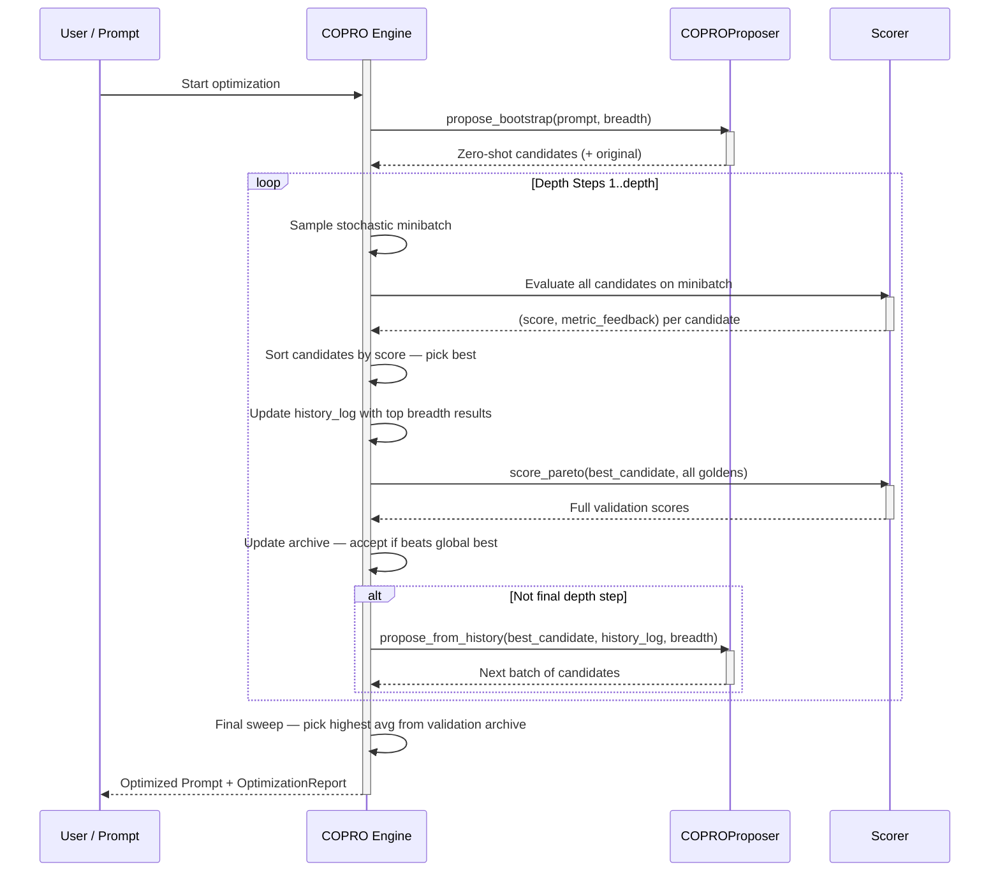
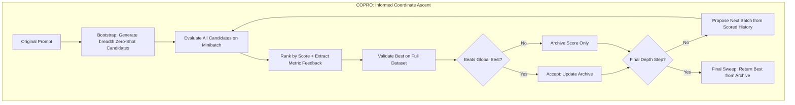

**COPRO（Co-operative Prompt Optimizer）**是 `deepeval` 中的一种提示优化算法，改编自 DSPy 的同名优化器。它使用**坐标上升**（Coordinate Ascent）迭代改进提示——在每个深度步骤评估一批候选、将最佳者提交为新基线，并利用评分历史和指标反馈生成越来越有针对性的下一批候选。

核心洞察是：当每新一代候选都**了解之前哪些失败了以及为什么失败**时，提示优化的效率最高。COPRO 不是盲目生成变体，而是将完整的诊断历史——每一次过去的提示尝试、其分数和解释失分原因的指标反馈——提供给优化器 LLM，使后续的候选批次直接针对已知的弱点。

<Info>
**坐标上升**（Coordinate Ascent）一词来自数学优化。在经典坐标上升中，你一次优化一个变量而固定其他变量，沿目标函数逐维上升。COPRO 将这个想法应用到提示空间：在每个深度步骤，它锁定表现最佳的提示作为新基线，并在该已提交的改进之上构建下一代候选——稳步攀升而非漫无目的地游荡。
</Info>

## Optimize Prompts With COPRO

要使用 COPRO 优化提示词，请将 `COPRO` 算法实例提供给 `optimize()` 方法：

```python
from deepeval.metrics import AnswerRelevancyMetric
from deepeval.prompt import Prompt
from deepeval.optimizer import PromptOptimizer
from deepeval.optimizer.algorithms import COPRO

prompt = Prompt(text_template="You are a helpful assistant - now answer this. {input}")

def model_callback(prompt: Prompt, golden) -> str:
    prompt_to_llm = prompt.interpolate(input=golden.input)
    return your_llm(prompt_to_llm)

optimizer = PromptOptimizer(
    algorithm=COPRO(),
    model_callback=model_callback
)

optimized_prompt = optimizer.optimize(prompt=prompt, goldens=goldens, metrics=[AnswerRelevancyMetric()])
```

完成 ✅。你刚刚使用了 `COPRO` 来运行提示优化。

## Customize COPRO

你可以通过直接向 `COPRO` 构造函数传递参数来自定义其行为：

```python
from deepeval.optimizer.algorithms import COPRO

copro = COPRO(
    depth=4,
    breadth=7,
    minibatch_size=25,
    random_state=42,
)
```

创建 `COPRO` 实例时有**四个**可选参数：

- [可选] `depth`：要运行的坐标上升步骤数。在每个步骤中，会评估一批新的候选，并将最佳者提交为下一步的基线。默认为 `4`。
- [可选] `breadth`：在每个深度步骤生成和评估的提示候选数量。更高的广度每步探索更多的提示空间，但成本更高。默认为 `7`。
- [可选] `minibatch_size`：每个深度步骤采样的金标数量，用于候选评估。更大的批次给出更可靠的分数。始终会对每步的最佳候选运行全数据集验证。默认为 `25`。
- [可选] `random_state`：可复现性控制。你可以传入 `int` 种子或 `random.Random` 实例。这会影响小批量采样和候选去重。默认为随机值。

## How Does COPRO Work?



COPRO 运行 `depth` 个步骤。每个步骤评估一批 `breadth` 候选，选择最佳者，在全数据集上验证，然后利用评分历史提出下一批。以下是确切的高级流程：

1. **引导** —— 使用零样本变体从原始提示生成初始的 `breadth` 个候选
2. **评估** —— 在随机小批量上为所有候选打分，并为每个候选提取指标反馈
3. **提交** —— 选择最佳的小批量候选并对其运行全数据集验证
4. **提出** —— 将评分历史反馈给 LLM 以生成下一批有针对性的候选
5. **重复** —— 步骤 2–4 在每个 `depth` 步骤中运行
6. **最终选择** —— 返回在所有步骤中平均真实验证分数最高的提示



### Phase 1: Bootstrap

在坐标上升循环开始之前，COPRO 使用**零样本变体**从原始提示生成一组初始的 `breadth` 个候选提示。这由 `COPROProposer` 在两个阶段中完成：

**第一阶段——指南生成：** 提出器要求优化器 LLM 头脑风暴出 `breadth` 个不同的「变体指南」——关于如何有意义地改变提示的高层次策略。示例：

| 准则示例                                                           | 效果                                                       |
|--------------------------------------------------------------------------------|------------------------------------------------------------|
| 「重新构建提示以要求在最终答案前进行逐步推理」 | 生成一个强制思维链的指令 |
| 「将指令精简为高度直接、简洁的格式」 | 产生更简短、更激进指令风格 |
| 「添加严格的输出格式约束」 | 使指令对输出结构更具规范性 |
| 「明确指出要避免的常见错误」 | 生成一个防御性的、感知错误的指令 |

**第二阶段——候选生成：** 对于每条指南，提出器会进行单独的 LLM 调用来产出实际重写后的提示。这些调用**在异步路径中并发运行**，使引导阶段比顺序生成快得多。

**原始提示始终作为候选 0 插入**，在评估开始之前。这保证了优化器始终有可以退回的基线，并确保第一个深度步骤有公平的参考点。

<Tip>
双阶段指南方法确保候选是**真正多样的**，而不是仅在措辞上不同。通过先确定高层次策略（指南）再编写提示，LLM 不太可能产生仅在措辞上不同的变体。重复和近似重复的候选（≥90% 相似度）会被自动过滤。
</Tip>

### Phase 2: Coordinate Ascent Loop

循环运行 `depth` 个步骤。每个步骤有三个子阶段：评估、提交和提出。

#### Step 2a: Evaluate

在每个深度步骤开始时，COPRO 从你的金标中随机抽取一个小批量，并对其评估**当前批次中的每个候选**。对于每个候选，会捕获两件事：

1. **分数** —— 小批量中所有金标的平均指标分数
2. **指标反馈** —— 一条诊断字符串，精确描述为什么失分，基于失败示例的逐指标原因

指标反馈是相较于更简单优化器的关键增强。COPRO 不仅记录分数，还会捕获如下解释：

```
[Input]: Translate "Good morning" to French
[Expected]: Bonjour
[Actual Model Output]: Good morning in French is "Bonjour." Have a nice day!
[Evaluation Reasons]:
- AnswerRelevancyMetric (Score: 0.4): Response contains unnecessary filler beyond the requested translation.
```

此反馈会被带入提出步骤，使下一代候选明确针对这里识别出的失败模式。

#### Step 2b: Commit

评分后，候选按小批量分数排名。**得分最高的候选**被选中，然后在**完整金标数据集**上使用 `score_pareto` 进行评估。此全数据集分数存储在验证存档中。

如果全数据集平均值超过当前的 `global_best_score`，候选将被接受为新的最佳。所有深度步骤都会记录全数据集分数，因此最终选择可以在同等条件下比较每步的提交优胜者。

<Info>
COPRO 在**每个深度步骤**都对最佳候选运行全数据集验证，而不仅仅是定期验证。这使得 COPRO 的验证比 SIMBA 或 MIPROv2 更彻底，代价是每步更多的评估。这正是使坐标上升可靠的原因——每个提交的基线都经过了真正的验证，而不仅仅是小批量估计。
</Info>

#### Step 2c: Propose

除非这是最后一个深度步骤，否则 COPRO 会生成下一批 `breadth` 个候选。这使用与引导相同的两阶段提出器，但现在会传入完整的 `history_log`——一个有界的、排序的记录，包含跨所有先前步骤的顶部 `breadth` 个（提示，分数，指标反馈）三元组。

**示例：深度步骤 3 时历史日志的样子**

| 尝试 | 分数 | 指标反馈摘要                                              |
|---------|-------|--------------------------------------------------------------|
| P₃ᵦ     | 0.81  | 25 个示例中有 1 个存在轻微格式问题                             |
| P₂ₐ     | 0.74  | 在结构化输出上始终缺失 JSON 模式                               |
| P₁ᵦ     | 0.71  | 冗长的响应触发了简洁性指标失败                                  |
| P₂ᵦ     | 0.68  | 在多跳问题上缺乏分步推理                                      |
| ...     | ...   | ...                                                          |

提出器会看到此排名历史并生成指南，**明确修复之前步骤中的失败**。

### Step 3: Final Selection

在所有 `depth` 步骤之后，COPRO 会对完整验证存档执行**最终扫描**，以选出整体最佳的提示。

**示例：4 个深度步骤中的坐标上升进展**

| 深度 | 评估的候选数         | 最佳小批量分数        | 全数据集分数        | 是否接受？ |
| ----- | -------------------- | -------------------- | ------------------ | --------- |
| 1     | 8（7 + 原始）     | 0.68                 | 0.65               | ✅（根节点） |
| 2     | 7                    | 0.74                 | 0.71               | ✅        |
| 3     | 7                    | 0.79                 | 0.76               | ✅        |
| 4     | 7                    | 0.77                 | 0.73               | ❌        |

在此示例中，深度步骤 4 产出的候选在小批量上看起来有希望（

## When to Use COPRO

COPRO 在以下情况下特别有效：

| 场景                                               | 为什么选择 COPRO                                                                  |
|----------------------------------------------------|------------------------------------------------------------------------------------|
| **指令质量是主要抓手**                            | COPRO 专注于打磨指令文本本身                                                  |
| **你有清晰的指标反馈**                             | 每个候选的诊断性反馈让每次生成更有针对性                                          |
| **你想要可预测的单调提升**                        | 坐标上升每一步都会先提交改进，再在此基础上继续                                  |
| **数据集较小**                                           | 每步都做全数据集验证，在 golden 数量不多时效果很好                              |
| **你需要快速收敛**                                    | depth 步数浅而聚焦；通常 3-5 步就够了                                          |

## COPRO vs. Other Algorithms

| 维度                       | COPRO                                   | SIMBA                                      | GEPA                                   | MIPROv2                                      |
|----------------------------|------------------------------------------|--------------------------------------------|----------------------------------------|---------------------------------------------|
| **搜索策略**             | 有引导的坐标上升                         | 方差驱动的内省式上升                       | 基于 Pareto 的进化搜索              | 贝叶斯优化（TPE）                             |
| **反馈信号**             | 每个候选的分数 + 指标反馈              | 各轨迹间的分数方差                         | LLM 对成败的诊断                      | 每次试验的小批量分数                           |
| **优化指令？**           | ✅ 是                                    | ✅ 是                                     | ✅ 是                                 | ✅ 是                                      |
| **优化演示？**           | ❌ 否                                     | ✅ 是                                     | ❌ 否                                  | ✅ 是                                      |
| **候选生成**             | 两遍式准则 + 重写                         | 每轮从难例生成                             | 每轮通过反思式变异生成                  | 一次性全部生成（提案阶段）                      |
| **全量评估频率**         | 每个 depth 步                             | 每 N 轮                                     | 每个被接受的候选                       | 每 N 次试验                                  |
| **最适用场景**           | 快速、聚焦指令的优化                       | 模型行为不稳定、复杂任务                    | 问题类型多样、多目标                    | 大搜索空间、依赖少样本的任务                   |

当你想要快速、有针对性的指令改进并获得清晰的诊断反馈时，选择 ****COPRO****。

当你的模型在多次运行中不一致，而你希望优化器探索不同的改进策略时，选择 [SIMBA](/docs/prompt-optimization-simba)。

当你的任务跨越多种问题类型，且你需要在各金标上维持多样化的提示人口时，选择 ****GEPA****。

当指令和少样本演示的联合组合很重要时，选择 [MIPROv2](/docs/prompt-optimization-miprov2)。

## 常见问题

<AccordionGroup>
<Accordion title="What is COPRO and when should I use it?">
`COPRO`（协作提示优化器）使用坐标上升：在每个深度步骤评估一批候选并提交最佳者。
</Accordion>
<Accordion title="What do depth and breadth control in COPRO?">
`depth`（默认 `4` ）是坐标上升的步数；每一步都会把最佳候选提交为下一步的基线。`breadth`（默认 `7` ）是每一步生成并评估的候选数量。`breadth` 越大，每步探索的提示空间越广，但开销也越高。
</Accordion>
<Accordion title="Does COPRO optimize few-shot demonstrations?">
不会。COPRO 完全专注于改进指令文本，不注入任何示例。
</Accordion>
<Accordion title="How does COPRO use metric feedback to improve candidates?">
在每个深度步骤，COPRO 都会同时捕获分数和诊断性指标反馈字符串。
</Accordion>
<Accordion title="How often does COPRO run full-dataset validation?">
在每个深度步骤。COPRO 对每步的最佳小批量候选运行 `score_pareto`。
</Accordion>
<Accordion title="How do I make COPRO runs reproducible?">
将 `random_state` 作为 `int` 种子或 `random.Random` 实例传递。它影响小批量采样和候选去重。
</Accordion>
</AccordionGroup>
