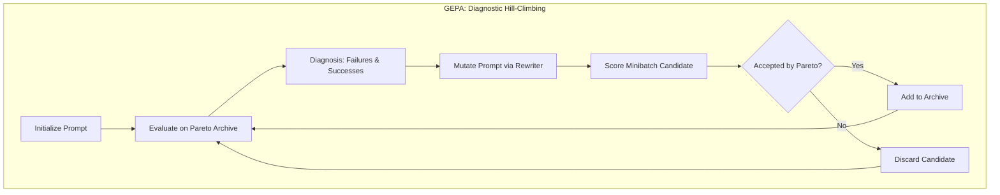
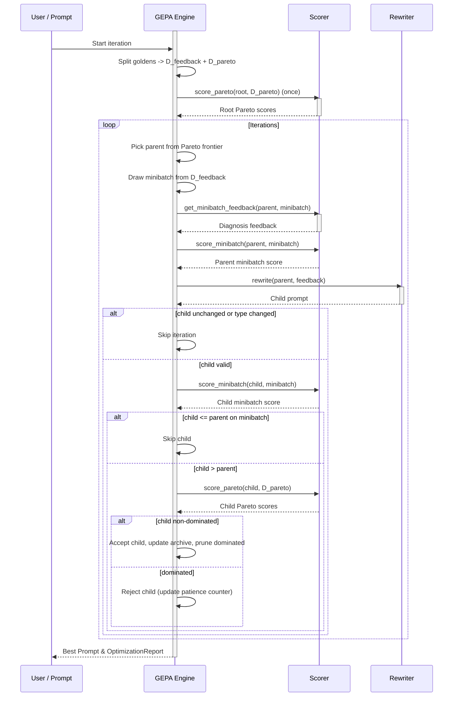

**GEPA（Genetic-Pareto）**是 `deepeval` 中的一种提示优化算法，改编自[研究论文](https://arxiv.org/pdf/2507.19457)。它使用**遗传帕累托**选择来迭代进化一批提示候选——在每个迭代中选择父提示、生成子变体、并根据帕累托支配关系接受或拒绝。

核心洞察是不同的提示可能擅长不同类型的问题——一个提示在特定金标上表现良好但在其他金标上表现不佳。GEPA 通过维持一个多样化的人口而非收敛到单一的最佳提示来利用这一点。

<Info>
**帕累托**一词来自经济学和多目标优化。想象你在用多个标准评分一批提示——没有单一的「最佳」，只有不同的权衡。[帕累托选择](#step-2-pareto-selection)防止优化收敛到局部最大值。

GEPA 中的 Pareto 选择可防止优化收敛到局部最大值。
</Info>

## 使用 GEPA 优化提示词

要使用 GEPA 优化提示词，只需将 `GEPA` 算法实例提供给 `optimize()` 方法：

```python
from deepeval.metrics import AnswerRelevancyMetric
from deepeval.prompt import Prompt
from deepeval.optimizer import PromptOptimizer
from deepeval.optimizer.algorithms import GEPA

prompt = Prompt(text_template="You are a helpful assistant - now answer this. {input}")

def model_callback(prompt: Prompt, golden) -> str:
    prompt_to_llm = prompt.interpolate(input=golden.input)
    return your_llm(prompt_to_llm)

optimizer = PromptOptimizer(
    algorithm=GEPA(), # Provide GEPA here as the algorithm
    model_callback=model_callback
)

optimized_prompt = optimizer.optimize(prompt=prompt, goldens=goldens, metrics=[AnswerRelevancyMetric()])
```

完成 ✅。你刚刚使用了 `GEPA` 来运行提示优化。

<Note>
由于 `GEPA` 已经是 `algorithm` 的默认值，除非你希望自定义 `GEPA` 的行为，否则不需要做任何额外操作。
</Note>

## Customize GEPA

你可以通过直接向 `GEPA` 构造函数传递参数来自定义其行为：

```python
from deepeval.optimizer.algorithms import GEPA

gepa = GEPA(
    iterations=10,
    pareto_size=5,
    minibatch_size=4,
    patience=4,
    random_seed=42,
)
```

创建 `GEPA` 实例时有**九个**可选参数：

- [可选] `iterations`：变异尝试的总次数。默认为 `5`。
- [可选] `pareto_size`：帕累托验证集（`D_pareto`）中的金标数量。默认为 `3`。
- [可选] `minibatch_size`：每次迭代为反馈抽取的金标数量。自动调整。
- [可选] `patience`：在连续拒绝这么多子代后提前停止。默认为 None。
- [可选] `random_seed`：可复现性种子。控制金标分割、小批量采样和变异。
- [可选] `tie_breaker`：平局裁决策略（`PREFER_ROOT`、`PREFER_CHILD` 或 `RANDOM`）（`PREFER_ROOT`、`PREFER_CHILD` 或 `RANDOM`）。
- [可选] `aggregate_instances`：聚合提示的逐金标帕累托分数的函数，用于排名/平局处理。默认为 `mean_of_all`。
- [可选] `reflection_model`：用于诊断/反馈生成的 LLM。默认为 gpt-4o-mini。
- [可选] `mutation_model`：用于重写提示的 LLM。默认为 gpt-4o。
- [可选] `scorer`：自定义打分器实例。在大多数工作流中由 `PromptOptimizer` 注入。

## GEPA 如何运作？



GEPA 不是强制单一的「最佳」提示，而是维持一个**多样化的候选提示种群**。它通过帕累托支配关系接受或拒绝新的候选配置，让不同的提示在不同金标上各有千秋。



该算法运行可配置数量的 `iterations`。每个迭代尝试通过变异进化一个父提示。

1. **金标分割** —— 将金标分为固定的验证集（`D_pareto`）和反馈集（`D_feedback`）
2. **父代选择** —— 使用频率加权采样从帕累托前沿采样一个父代
3. **反馈与重写** —— 对一个小批量打分、收集诊断并生成子代提示
4. **过滤与接受** —— 拒绝未变更/弱的候选，然后运行帕累托接受门槛
5. **最终选择** —— 按聚合分数选择顶部提示

### Step 1: Golden Splitting

在优化开始之前，GEPA 会把你的 golden 划分为两个不相交的子集：

- **`D_pareto`**（验证集）：由 `pareto_size` 个 golden 组成的固定子集，用于给**每一个**提示候选打分。通过让所有提示在相同的 golden 上评估，GEPA 确保比较的公平性——分数差异反映的是真实的提示质量，而非抽样运气。
- **`D_feedback`**（反馈集）：其余的 golden，在变异期间用于抽样小批量。它们提供多样化的训练信号，同时不会污染验证集。

这种训练/验证划分是避免过拟合的关键——提示基于反馈 golden 进行变异，但基于留出的验证表现来筛选。

### Step 2: Pareto Selection

在每次迭代中，GEPA 都要选择一个**父提示**进行变异。GEPA 并不简单地挑选平均分最高的提示（那可能只是局部最优），而是使用**基于 Pareto 的选择**来保持多样性。Pareto 选择包含两个步骤：

1. **找出非支配提示** —— 找出 Pareto 前沿上的所有提示
2. **从前沿中抽样** —— 使用按频率加权的抽样选出父提示

<Tip>
**Pareto 前沿**是所有非支配提示的集合。只要没有其他提示在 _每一个_ golden 上都胜过某个提示，该提示就位于前沿上——它可能擅长某些类型的 golden，而在其他类型上较弱。通过从前沿中抽样而不是总是挑选单一"最佳"提示，GEPA 得以探索多样化的优化策略。
</Tip>

#### Finding Non-Dominated Prompts

如果一个提示在所有 golden 上得分都更好或持平，且至少在一个 golden 上严格更优，那么它**支配**另一个提示。非支配（即没有其他提示支配它）的提示位于 Pareto 前沿上。

在下表中，分数表示每个提示–golden 对的聚合指标得分（来自你提供的 `metrics`）：

**示例 1：支配关系** —— P₁ 支配 P₀，因为它在每个 golden 上得分都更高：

| 提示 | Golden 1 | Golden 2 | Golden 3 | 均值 | 是否在前沿？ |
| ------ | -------- | -------- | -------- | ---- | -------------------- |
| P₀     | 0.60     | 0.55     | 0.50     | 0.55 | ❌（被 P₁ 支配） |
| P₁     | 0.75     | 0.70     | 0.65     | 0.70 | ✅                   |

**示例 2：无支配关系** —— 两个提示互不支配，因为它们各自在不同 golden 上占优：

| 提示 | Golden 1 | Golden 2 | Golden 3 | 均值 | 是否在前沿？ |
| ------ | -------- | -------- | -------- | ---- | ------------ |
| P₀     | 0.9      | 0.6      | 0.7      | 0.73 | ✅           |
| P₁     | 0.7      | 0.8      | 0.7      | 0.73 | ✅           |

其他边界情况包括：

- 在所有 golden 上打平：两个提示都留在前沿上（互不支配）
- 一个提示部分胜出、其余打平：胜出的提示构成支配（例如 P₀ 得分 [0.8, 0.7, 0.7] 对 P₁ 的 [0.7, 0.7, 0.7] → P₀ 支配 P₁）
- 前沿为空：不可能——至少总有一个非支配提示

#### Sampling from the Frontier

GEPA 从 Pareto 前沿按概率抽样父提示，概率与每个提示在 `D_pareto` 的 golden 上"获胜"（取得最高分）的频率成正比。这样可以平衡：

- **探索**：所有非支配提示都有机会被选中，防止过早收敛
- **利用**：更常获胜的提示更有可能被选为父提示

#### Example: Pareto Table After 4 Iterations

下面是 `pareto_size=3` 时 4 轮迭代后 Pareto 分数表可能的样子：

| 提示    | Golden 1 | Golden 2 | Golden 3 | 均值 | 获胜次数 | 是否在前沿？ |
| --------- | -------- | -------- | -------- | ---- | ---- | -------------------- |
| P₀（根节点） | 0.60     | 0.55     | 0.50     | 0.55 | 0    | ❌（被 P₁ 支配） |
| P₁        | 0.75     | 0.70     | 0.60     | 0.68 | 0    | ❌（被 P₄ 支配） |
| P₂        | 0.65     | **0.85** | 0.55     | 0.68 | 1    | ✅                   |
| P₃        | 0.60     | 0.60     | **0.80** | 0.67 | 1    | ✅                   |
| P₄        | **0.80** | 0.75     | 0.70     | 0.75 | 1    | ✅                   |

在这个例子中：

- **P₀**（原始提示）被 P₁ 支配，后者在所有 golden 上得分更高
- **P₁** 被 P₄ 支配，后者同样在所有 golden 上得分更高——所以 P₁ 也离开了前沿
- **P₂** 专精 Golden 2 类问题（如推理任务），但在其他类型上表现吃力
- **P₃** 专精 Golden 3 类问题（如创意任务），但在其他地方得分较低
- **P₄** 均值最高，但并不支配 P₂ 或 P₃——它在 Golden 2 上输给 P₂，在 Golden 3 上输给 P₃

Pareto 前沿包含 **P₂、P₃ 和 P₄**。每个提示恰好获胜 1 个 golden，因此具有**相同的被选概率**（各 33%）。尽管 P₄ 的平均分最高，GEPA 仍可能选择 P₂ 或 P₃ 作为父提示来探索它们的专精策略——这正是 GEPA 避免局部最优、保持提示多样性的方式。

### Step 3: Feedback & Rewrite

父提示被选中后，GEPA 通过**反馈驱动的重写**创建子提示：

1. **抽样小批量**：从 `D_feedback` 中抽取最多 `minibatch_size` 个示例
2. **诊断**：收集父提示的评分反馈（`get_minibatch_feedback`）
3. **基线打分**：在该小批量上为父提示打分
4. **重写**：让重写器根据诊断生成子提示
5. **合理性过滤**：如果子提示实际上没有变化或提示类型不同，则跳过

这让变异保持针对性：改动由指标反馈驱动，而不是随机的提示编辑。

### Step 4: Acceptance

GEPA 通过两道门槛执行接受判定：

1. **小批量门槛**：子提示必须在同一个小批量上严格胜过父提示。
2. **Pareto 门槛**：在 `D_pareto` 上，子提示必须相对以下两者都保持非支配：
   - 父提示配置
   - 归档中所有已有配置

被接受后，GEPA 会：

1. 将子提示加入提示配置图
2. 把子提示的 Pareto 分数插入归档
3. 移除归档中被新子提示支配的条目

如果子提示被 Pareto 门槛拒绝，GEPA 会递增连续拒绝计数器，并在达到 `patience` 后提前停止。

### Step 5: Final Selection

所有迭代完成后，GEPA 从候选池中选出**最终优化提示**：

1. **聚合分数**：每个提示在所有 `D_pareto` golden 上的分数被聚合（默认取均值）
2. **候选排序**：提示按聚合分数排序
3. **打破平局**：如果多个提示并列最高分，`tie_breaker` 策略决定获胜者（默认 `PREFER_CHILD`，偏向较晚进化出的提示）

获胜提示将作为优化结果返回。

## 常见问题

<AccordionGroup>
<Accordion title="What is GEPA and when should I use it?">
`GEPA`（Genetic-Pareto）将进化优化与多目标 Pareto 选择相结合，在保持多样化候选池的同时改进提示。当你的任务跨越不同的问题类型、且你希望避免过早收敛到只在部分 [golden](/docs/evaluation-datasets#what-are-goldens) 上表现好的单一提示时，可以使用它。 
</Accordion>
<Accordion title="Do I need to pass GEPA() explicitly to the optimizer?">
不需要。`GEPA` 已经是 [PromptOptimizer](/docs/prompt-optimization-introduction) 的 `algorithm` 参数默认值，因此只有当你想自定义它的运行方式时，才需要构造一个 `GEPA` 实例传入。
</Accordion>
<Accordion title="How do I make GEPA runs reproducible?">
在 `GEPA` 构造函数上设置固定的 `random_seed`（例如 `42` ）。它控制 golden 划分、小批量抽样、Pareto 父提示选择和平局裁决。默认使用 `time.time_ns()` ，因此除非固定种子，否则每次运行都会不同。
</Accordion>
<Accordion title="What is the difference between pareto_size and minibatch_size?">
`pareto_size`（默认 `3` ）是留出验证集 `D_pareto` 中 golden 的数量，每个候选都会在其上打分以保证比较公平。`minibatch_size`（默认 `8` ）是每轮从 `D_feedback` 抽取、用于驱动反馈与变异的 golden 数量。两个集合不相交，以避免过拟合。
</Accordion>
<Accordion title="How does GEPA decide when to stop early?">
GEPA 会跟踪被拒绝的连续子提示。当子提示被 Pareto 门槛拒绝时，拒绝计数器递增；一旦计数器达到 `patience`（默认 `3` ），搜索会在耗尽全部 `iterations`（默认 `5` ）之前提前停止。
</Accordion>
<Accordion title="What happens when prompts tie on the final score?">
最终选择时，提示按聚合的 `D_pareto` 分数排序（默认通过 `aggregate_instances` 取均值）。如果多个提示并列最高，`tie_breaker` 策略决定获胜者—— `PREFER_CHILD`（默认）偏向较晚进化出的提示，此外还有 `PREFER_ROOT` 和 `RANDOM` 可选。
</Accordion>
<Accordion title="Which models does GEPA use to diagnose and rewrite prompts?">
GEPA 使用两个独立的 LLM：`reflection_model`（默认 `"gpt-4o-mini"` ）生成诊断和反馈，`mutation_model`（默认 `"gpt-4o"` ）根据反馈重写提示。构造 `GEPA` 实例时可以覆盖其中任何一个。
</Accordion>
</AccordionGroup>
