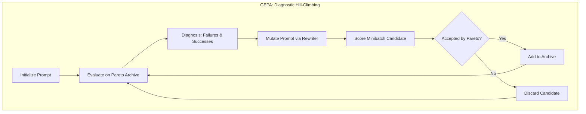
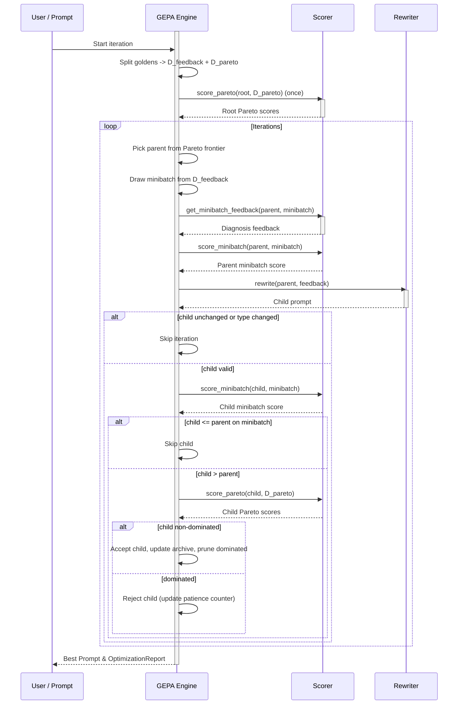

**GEPA（Genetic-Pareto）**是 `deepeval` 中的一种提示优化算法，改编自[研究论文](https://arxiv.org/pdf/2507.19457)。它使用**遗传帕累托**选择来迭代进化一批提示候选——在每个迭代中选择父提示、生成子变体、并根据帕累托支配关系接受或拒绝。

核心洞察是不同的提示可能擅长不同类型的问题——一个提示在特定金标上表现良好但在其他金标上表现不佳。GEPA 通过维持一个多样化的人口而非收敛到单一的最佳提示来利用这一点。

<Info>
**帕累托**一词来自经济学和多目标优化。想象你在用多个标准评分一批提示——没有单一的「最佳」，只有不同的权衡。[帕累托选择](#step-2-pareto-selection)防止优化收敛到局部最大值。

Pareto selection in GEPA prevents optimization from converging at a local maximum.
</Info>

## 使用 GEPA 优化提示词

要使用 GEPA 优化提示词，只需将 `GEPA` 算法实例提供给 `optimize()` 方法：

```python
from deepeval.metrics import AnswerRelevancyMetric
from deepeval.prompt import Prompt
from deepeval.optimizer import PromptOptimizer
from deepeval.optimizer.algorithms import GEPA

prompt = Prompt(text_template="You are a helpful assistant - now answer this. {input}")

def model_callback(prompt: Prompt, golden) -> str:
    prompt_to_llm = prompt.interpolate(input=golden.input)
    return your_llm(prompt_to_llm)

optimizer = PromptOptimizer(
    algorithm=GEPA(), # Provide GEPA here as the algorithm
    model_callback=model_callback
)

optimized_prompt = optimizer.optimize(prompt=prompt, goldens=goldens, metrics=[AnswerRelevancyMetric()])
```

完成 ✅。你刚刚使用了 `GEPA` 来运行提示优化。

<Note>
由于 `GEPA` 已经是 `algorithm` 的默认值，除非你希望自定义 `GEPA` 的行为，否则不需要做任何额外操作。
</Note>

## Customize GEPA

你可以通过直接向 `GEPA` 构造函数传递参数来自定义其行为：

```python
from deepeval.optimizer.algorithms import GEPA

gepa = GEPA(
    iterations=10,
    pareto_size=5,
    minibatch_size=4,
    patience=4,
    random_seed=42,
)
```

创建 `GEPA` 实例时有**九个**可选参数：

- [可选] `iterations`：变异尝试的总次数。默认为 `5`。
- [可选] `pareto_size`：帕累托验证集（`D_pareto`）中的金标数量。默认为 `3`。
- [可选] `minibatch_size`：每次迭代为反馈抽取的金标数量。自动调整。
- [可选] `patience`：在连续拒绝这么多子代后提前停止。默认为 None。
- [可选] `random_seed`：可复现性种子。控制金标分割、小批量采样和变异。
- [可选] `tie_breaker`：平局裁决策略（`PREFER_ROOT`、`PREFER_CHILD` 或 `RANDOM`）（`PREFER_ROOT`、`PREFER_CHILD` 或 `RANDOM`）。
- [可选] `aggregate_instances`：聚合提示的逐金标帕累托分数的函数，用于排名/平局处理。默认为 `mean_of_all`。
- [可选] `reflection_model`：用于诊断/反馈生成的 LLM。默认为 gpt-4o-mini。
- [可选] `mutation_model`：用于重写提示的 LLM。默认为 gpt-4o。
- [可选] `scorer`：自定义打分器实例。在大多数工作流中由 `PromptOptimizer` 注入。

## GEPA 如何运作？



GEPA 不是强制单一的「最佳」提示，而是维持一个**多样化的候选提示种群**。它通过帕累托支配关系接受或拒绝新的候选配置，让不同的提示在不同金标上各有千秋。



该算法运行可配置数量的 `iterations`。每个迭代尝试通过变异进化一个父提示。

1. **金标分割** —— 将金标分为固定的验证集（`D_pareto`）和反馈集（`D_feedback`）
2. **父代选择** —— 使用频率加权采样从帕累托前沿采样一个父代
3. **反馈与重写** —— 对一个小批量打分、收集诊断并生成子代提示
4. **过滤与接受** —— 拒绝未变更/弱的候选，然后运行帕累托接受门槛
5. **最终选择** —— 按聚合分数选择顶部提示

### Step 1: Golden Splitting

Before optimization begins, GEPA splits your goldens into two disjoint subsets:

- **`D_pareto`** (validation set): A fixed subset of `pareto_size` goldens used to score **every** prompt candidate. By evaluating all prompts on the same goldens, GEPA ensures fair comparison—score differences reflect actual prompt quality, not sampling luck.
- **`D_feedback`** (feedback set): The remaining goldens used for sampling minibatches during mutation. These provide diverse training signals without contaminating the validation set.

This train/validation split is fundamental to avoiding overfitting—prompts are mutated based on feedback goldens but selected based on held-out validation performance.

### Step 2: Pareto Selection

At each iteration, GEPA must choose a **parent prompt** to mutate. Instead of simply picking the prompt with the highest average score (which might be a local optimum), GEPA uses **Pareto-based selection** to maintain diversity. Pareto selection involves two steps:

1. **Finding non-dominated prompts** — Identify all prompts on the Pareto frontier
2. **Sampling from the frontier** — Select a parent using frequency-weighted sampling

<Tip>
The **Pareto frontier** is the set of all non-dominated prompts. A prompt is on the frontier if no other prompt beats it on _every_ golden—it might excel at some golden types while being weaker on others. By sampling from this frontier rather than always picking the single "best" prompt, GEPA explores diverse optimization strategies.
</Tip>

#### Finding Non-Dominated Prompts

A prompt **dominates** another if it scores better or equal on all goldens, and strictly better on at least one. A prompt is on the Pareto frontier if it is non-dominated (i.e. if no other prompt dominates it).

In the tables below, scores represent the aggregated metric scores (from the `metrics` you provide) for each prompt–golden pair:

**Example 1: Dominance** — P₁ dominates P₀ because it scores higher on every golden:

| Prompt | Golden 1 | Golden 2 | Golden 3 | Mean | On Frontier?         |
| ------ | -------- | -------- | -------- | ---- | -------------------- |
| P₀     | 0.60     | 0.55     | 0.50     | 0.55 | ❌ (dominated by P₁) |
| P₁     | 0.75     | 0.70     | 0.65     | 0.70 | ✅                   |

**Example 2: No Dominance** — Neither prompt dominates the other because each wins on different goldens:

| Prompt | Golden 1 | Golden 2 | Golden 3 | Mean | On Frontier? |
| ------ | -------- | -------- | -------- | ---- | ------------ |
| P₀     | 0.9      | 0.6      | 0.7      | 0.73 | ✅           |
| P₁     | 0.7      | 0.8      | 0.7      | 0.73 | ✅           |

Other edge cases include:

- Ties on all goldens: Both prompts stay on the frontier (neither dominates)
- One prompt wins some, ties on rest: The winning prompt dominates (e.g., P₀ scores [0.8, 0.7, 0.7] vs P₁'s [0.7, 0.7, 0.7] → P₀ dominates P₁)
- Empty frontier: Impossible—there's always at least one non-dominated prompt

#### Sampling from the Frontier

From the Pareto frontier, GEPA samples a parent with probability proportional to how often each prompt "wins" (achieves the highest score) across `D_pareto` goldens. This balances:

- **Exploration**: All non-dominated prompts have a chance to be selected, preventing premature convergence
- **Exploitation**: Prompts that win more often are more likely to be chosen as parents

#### Example: Pareto Table After 4 Iterations

Here's what the Pareto score table might look like after 4 iterations with `pareto_size=3`:

| Prompt    | Golden 1 | Golden 2 | Golden 3 | Mean | Wins | On Frontier?         |
| --------- | -------- | -------- | -------- | ---- | ---- | -------------------- |
| P₀ (root) | 0.60     | 0.55     | 0.50     | 0.55 | 0    | ❌ (dominated by P₁) |
| P₁        | 0.75     | 0.70     | 0.60     | 0.68 | 0    | ❌ (dominated by P₄) |
| P₂        | 0.65     | **0.85** | 0.55     | 0.68 | 1    | ✅                   |
| P₃        | 0.60     | 0.60     | **0.80** | 0.67 | 1    | ✅                   |
| P₄        | **0.80** | 0.75     | 0.70     | 0.75 | 1    | ✅                   |

In this example:

- **P₀** (the original prompt) is dominated by P₁, which scores better on all goldens
- **P₁** is dominated by P₄, which also scores better on all goldens—so P₁ is off the frontier too
- **P₂** specializes in Golden 2-type problems (e.g., reasoning tasks) but struggles with others
- **P₃** specializes in Golden 3-type problems (e.g., creative tasks) but scores lower elsewhere
- **P₄** has the highest mean but doesn't dominate P₂ or P₃—it loses to P₂ on Golden 2 and to P₃ on Golden 3

The Pareto frontier contains **P₂, P₃, and P₄**. Each wins exactly 1 golden, giving them **equal selection probability** (33% each). Despite P₄ having the highest mean score, GEPA might still select P₂ or P₃ as parents to explore their specialized strategies—this is how GEPA avoids local optima and maintains prompt diversity.

### Step 3: Feedback & Rewrite

Once a parent prompt is selected, GEPA creates a child prompt through **feedback-driven rewriting**:

1. **Sample a minibatch**: Draw up to `minibatch_size` examples from `D_feedback`
2. **Diagnose**: Gather scorer feedback (`get_minibatch_feedback`) on the parent
3. **Baseline score**: Score the parent on that same minibatch
4. **Rewrite**: Use the rewriter to generate a child prompt from the diagnosis
5. **Sanity filter**: Skip the child if it is effectively unchanged or has a different prompt type

This keeps mutations targeted: changes are driven by metric feedback rather than random prompt edits.

### Step 4: Acceptance

GEPA applies acceptance in two gates:

1. **Minibatch gate**: The child must strictly beat the parent on the same minibatch.
2. **Pareto gate**: On `D_pareto`, the child must be non-dominated relative to both:
   - the parent prompt configuration
   - all existing configurations in the archive

When accepted, GEPA:

1. Adds the child to the prompt-configuration graph
2. Inserts the child's Pareto scores into the archive
3. Removes archive entries that are dominated by the new child

If rejected by the Pareto gate, GEPA increments a consecutive-rejection counter and can early-stop once it reaches `patience`.

### Step 5: Final Selection

After all iterations complete, GEPA selects the **final optimized prompt** from the candidate pool:

1. **Aggregate scores**: Each prompt's scores across all `D_pareto` goldens are aggregated (mean by default)
2. **Rank candidates**: Prompts are ranked by their aggregate score
3. **Break ties**: If multiple prompts tie for the highest score, the `tie_breaker` policy determines the winner (`PREFER_CHILD` by default, which favors more recently evolved prompts)

The winning prompt is returned as the optimized result.

## 常见问题

<AccordionGroup>
<Accordion title="What is GEPA and when should I use it?">
`GEPA` (Genetic-Pareto) combines evolutionary optimization with multi-objective Pareto selection to improve prompts while keeping a diverse pool of candidates. Use it when your task spans different problem types and you want to avoid converging prematurely on a single prompt that only does well on some [goldens](/docs/evaluation-datasets#what-are-goldens) .
</Accordion>
<Accordion title="Do I need to pass GEPA() explicitly to the optimizer?">
No. `GEPA` is already the default for the `algorithm` argument of [PromptOptimizer](/docs/prompt-optimization-introduction) , so you only need to construct a `GEPA` instance and pass it in when you want to customize how it runs.
</Accordion>
<Accordion title="How do I make GEPA runs reproducible?">
Set a fixed `random_seed` (for example `42` ) on the `GEPA` constructor. It controls golden splitting, minibatch sampling, Pareto parent selection, and tie-breaking. By default it uses `time.time_ns()` , so runs vary unless you pin the seed.
</Accordion>
<Accordion title="What is the difference between pareto_size and minibatch_size?">
`pareto_size` (default `3` ) is the number of goldens in the held-out validation set `D_pareto` that every candidate is scored on for fair comparison. `minibatch_size` (default `8` ) is how many goldens are drawn from `D_feedback` each iteration to drive feedback and mutation. The two sets are disjoint to avoid overfitting.
</Accordion>
<Accordion title="How does GEPA decide when to stop early?">
GEPA tracks consecutive rejected children. When a child is rejected by the Pareto gate it increments a rejection counter, and once that counter reaches `patience` (default `3` ) the search stops early before exhausting all `iterations` (default `5` ).
</Accordion>
<Accordion title="What happens when prompts tie on the final score?">
During final selection, prompts are ranked by their aggregate `D_pareto` score (mean by default via `aggregate_instances` ). If several tie for the top score the `tie_breaker` policy decides the winner— `PREFER_CHILD` (the default) favors more recently evolved prompts, with `PREFER_ROOT` and `RANDOM` also available.
</Accordion>
<Accordion title="Which models does GEPA use to diagnose and rewrite prompts?">
GEPA uses two separate LLMs: `reflection_model` (default `"gpt-4o-mini"` ) generates the diagnosis and feedback, and `mutation_model` (default `"gpt-4o"` ) rewrites the prompt from that feedback. You can override either when constructing the `GEPA` instance.
</Accordion>
</AccordionGroup>
