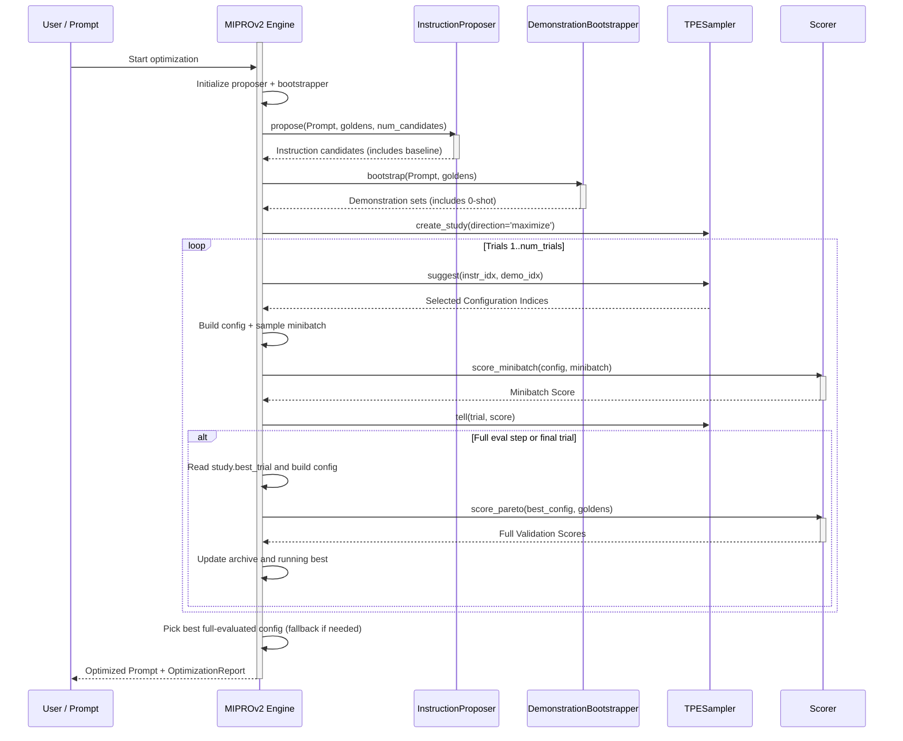
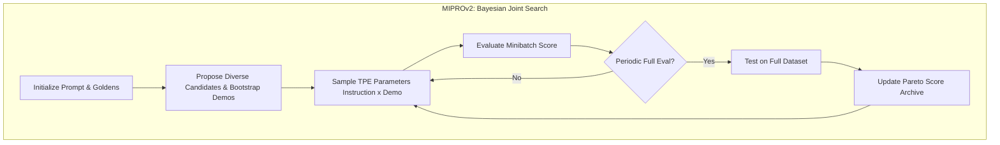

**MIPROv2（Multiprompt Instruction PRoposal Optimizer Version 2）**是一种提示优化算法，改编自 [DSPy 论文](https://arxiv.org/pdf/2406.11695)。，联合优化指令和少样本演示。它使用 Optuna TPE（树结构 Parzen 估计器）进行贝叶斯优化来搜索提示空间。

核心洞察是**指令**（LLM 应该做什么）和**演示**（展示期望行为的示例）共同影响提示的表现。MIPROv2 联合搜索两者以找到最佳组合。

<Info>
`deepeval` 的 MIPROv2 需要 `optuna` 包来进行贝叶斯优化。安装它：

```bash
pip install optuna
```

</Info>

## 使用 MIPROv2 优化提示词

要使用 MIPROv2 优化提示词，只需将 `MIPROV2` 算法实例提供给 `optimize()` 方法：

```python
from deepeval.metrics import AnswerRelevancyMetric
from deepeval.prompt import Prompt
from deepeval.optimizer import PromptOptimizer
from deepeval.optimizer.algorithms import MIPROV2

prompt = Prompt(text_template="You are a helpful assistant - now answer this. {input}")

def model_callback(prompt: Prompt, golden) -> str:
    prompt_to_llm = prompt.interpolate(input=golden.input)
    return your_llm(prompt_to_llm)

optimizer = PromptOptimizer(
    algorithm=MIPROV2(), # Provide MIPROv2 here as the algorithm
    model_callback=model_callback
)

optimized_prompt = optimizer.optimize(prompt=prompt, goldens=goldens, metrics=[AnswerRelevancyMetric()])
```

完成 ✅。你刚刚使用了 `MIPROv2` 来运行提示优化。

## Customize MIPROv2

你可以通过直接向 `MIPROV2` 构造函数传递参数来自定义其行为：

```python
from deepeval.optimizer.algorithms import MIPROV2

miprov2 = MIPROV2(
    num_candidates=10,
    num_trials=30,
    minibatch_size=25,
    max_bootstrapped_demonstrations=4,
    max_labeled_demonstrations=4,
    num_demonstration_sets=5,
    random_state=42,
)
```

创建 `MIPROV2` 实例时有**八个**可选参数：

- [可选] `num_candidates`：要在提案阶段生成的多样化指令候选数量。默认为 `5`。
- [可选] `num_trials`：要运行的贝叶斯优化试验次数。每次试验评估一个指令+演示集组合。默认为 `30`。
- [可选] `minibatch_size`：每次试验为评估采样的金标数量。更大的批次给出更可靠的分数但更慢。默认为 `25`。
- [可选] `minibatch_full_eval_steps`：每 N 次试验对所有金标运行一次完整评估。默认为 `5`。
- [可选] `max_bootstrapped_demonstrations`：自举演示的最大数量。这些是通过运行当前提示并保留通过所有指标的输出生成的。默认为 `4`。
- [可选] `max_labeled_demonstrations`：来自 `expected_output`/`expected_outcome` 的标注演示的最大数量。默认为 `4`。
- [可选] `num_demonstration_sets`：要创建的不同演示集配置的数量。默认为 3。
- [可选] `random_state`：可复现性控制。你可以传入 `int` 种子或 `random.Random` 实例。

## MIPROv2 如何运作？



MIPROv2 分**两个阶段**工作：构建搜索空间的**提案阶段**和搜索最佳组合的**贝叶斯优化阶段**。

GEPA 通过迭代变异逐步进化提示，与之不同，MIPROv2 一次性生成所有指令候选，然后智能地搜索（指令, 演示）组合空间。



### Phase 1: Proposal

提案阶段在开始时运行一次，包含两个步骤：

1. **指令提案** —— 生成多样化的指令候选（基线 + 变体）
2. **演示引导** —— 从你的[金标](/docs/evaluation-datasets#what-are-goldens)构建多组演示集

#### Step 1a: Instruction Proposal

指令提出器从你的原始提示开始，然后要求优化器 LLM 生成多样化的变体。原始提示始终作为候选 0 保留。

| 提示（Tip）示例                       | 效果                                                 |
| ------------------------------------ | ------------------------------------------------------ |
| "简洁直接"                           | 生成更短、更聚焦的指令                                |
| "分步推理"                           | 生成强调思维链的指令                                  |
| "注重清晰与精确"                     | 生成明确、无歧义的指令                                |
| "考虑边界情况与例外"                 | 生成稳健、防御性强的指令                              |

原始提示始终保留为候选 `0`，因此优化始终有回退选项。

#### Step 1b: Demo Bootstrapping

引导器（bootstrapper）会创建一组候选的少样本演示包。它会：

- 通过运行当前提示并只保留通过所有指标的输出，收集**引导式演示**（bootstrapped demos）
- 从 `expected_output` / `expected_outcome` 收集**标注演示**（labeled demos）
- 从这些池中构建 `num_demonstration_sets` 个混合集合

始终包含一个**零样本选项**（空演示集），以便优化器可以测试不使用示例是否更好。

<Tip>
当你的任务能从示例中受益时，演示引导尤其强大。对于复杂推理或格式化任务，合适的少样本演示可以显著提升表现。
</Tip>

### Phase 2: Bayesian Optimization

提案完成后，MIPROv2 使用 **Optuna TPE** 搜索 `(instruction_idx, demonstration_set_idx)` 组合。最佳的（指令，演示集）组合。

#### What is Bayesian Optimization?

贝叶斯优化是一种样本高效的策略，用于找到昂贵的黑盒函数的最大值。它不是随机尝试组合，而是：

1. **构建目标函数的代理模型**（基于已观察到的试验）
2. **使用代理模型**预测哪些未尝试的组合最有希望
3. **评估最有希望的组合**并更新代理模型
4. **重复**直到预算（`num_trials`）用尽

<Info>
**TPE（树结构 Parzen 估计器）**是 Optuna 的默认采样器。它对标数为常数的候选建模，而不是像标准贝叶斯优化那样对标数本身建模。
</Info>

#### Trial Evaluation

每次优化试验会：

1. **抽样**指令与演示集索引（由 TPE 引导）
2. **构建**组合该指令 + 演示集的提示配置
3. 在随机小批量上为其**打分**（`score_minibatch`）
4. 将试验分数**回报**给 Optuna（`study.tell`）

小批量打分快但有噪声。每 `minibatch_full_eval_steps` 次试验（以及最后一次试验必定），MIPROv2 会用全数据集打分（`score_pareto`）评估 Optuna 当前的最佳试验，并保存这些真实验证分数。

#### Example: Trial Progression

下面是 `num_candidates=5` 且 `num_demonstration_sets=4` 时一次典型优化的样子：

| 试验 | 指令 | 演示集   | 分数    | 备注                           |
| ----- | ------------ | ---------- | -------- | ------------------------------- |
| 1     | 0（原始） | 0（0-shot） | 0.65     | 基线                        |
| 2     | 2            | 3          | 0.72     | 早期探索                       |
| 3     | 4            | 1          | 0.68     | 尝试不同组合                  |
| 4     | 2            | 3          | 0.74     | TPE 回到有希望的区域           |
| 5     | 2            | 2          | 0.71     | 探索邻近区域                   |
| ...   | ...          | ...        | ...      | ...                             |
| 20    | 2            | 3          | **0.78** | 找到的最佳组合                  |

注意 TPE 倾向于重新访问有希望的组合（指令 2、演示集 3），同时仍会探索其他备选。

### Final Selection

所有试验完成后：

1. **扫描全量评估归档**（`pareto_score_table`），选出全数据集平均分最高者
2. 必要时**回退**到运行中的最佳配置
3. **返回**获胜配置中的提示，演示以行内方式渲染

返回的提示同时包含最佳指令与最佳演示，可直接用于生产。

## When to Use MIPROv2

MIPROv2 在以下情况下特别有效：

| 场景                         | 为什么选择 MIPROv2                                             |
| ---------------------------- | ------------------------------------------------------------- |
| **少样本示例很重要**         | MIPROv2 联合优化指令**和**演示                              |
| **搜索空间大**               | 贝叶斯优化能高效探索大量组合                                   |
| **评估成本高**               | 小批量抽样在保持信号的同时降低成本                              |
| **需要可复现性**             | 固定随机种子给出完全一致的结果                                   |

## MIPROv2 vs GEPA

| 维度                     | MIPROv2                           | GEPA                             |
| ------------------------ | --------------------------------- | -------------------------------- |
| **搜索策略**             | 贝叶斯优化（TPE）                 | 基于 Pareto 的进化搜索            |
| **候选生成**             | 一次性全部生成（提案阶段）        | 迭代变异                          |
| **少样本演示**           | 联合优化                          | 不包含                             |
| **多样性机制**           | 多样化提示 + 多个演示集            | Pareto 前沿抽样                    |
| **最适用场景**             | 示例有帮助的任务                     | 问题类型多样的任务                     |

当少样本演示对你的任务很重要，或者你希望在提示空间中进行联合搜索时，选择 **MIPROv2**。

当你需要在不同问题类型之间保持多样性时，选择 **GEPA**。

## 常见问题

<AccordionGroup>
<Accordion title="What is MIPROv2 and when should I use it?">
`MIPROv2` 联合优化指令和少样本演示，使用贝叶斯优化。
</Accordion>
<Accordion title="What do I need to install to run MIPROv2?">
MIPROv2 需要 `optuna` 包。使用 `pip install optuna` 安装。
</Accordion>
<Accordion title="How is MIPROv2 different from GEPA?">
与通过迭代变异进化提示、不触碰演示的 [GEPA](/docs/prompt-optimization-gepa) 不同，`MIPROV2` 在提案阶段一次性生成所有指令候选，然后使用 TPE 搜索（指令, 演示）组合。MIPROv2 联合优化少样本演示，而 GEPA 通过 Pareto 前沿聚焦指令多样性。
</Accordion>
<Accordion title="What's the difference between bootstrapped and labeled demonstrations?">
自举演示是模型生成的通过了所有指标的输出，上限由 `max_bootstrapped_demonstrations` 控制。
</Accordion>
<Accordion title="How do I control the cost of a MIPROv2 run?">
主要的调节项是 `num_trials`（默认 `30` ，设定优化预算）、`minibatch_size`（默认 `25` ，以单次试验成本换取可靠性）和 `minibatch_full_eval_steps`（默认 `10` ，控制全数据集评估的频率）。调低它们可以降低成本，但会牺牲信号。
</Accordion>
<Accordion title="How do I make MIPROv2 results reproducible?">
将 `random_state` 作为 `int` 种子或 `random.Random` 实例传递。它影响候选采样。
</Accordion>
</AccordionGroup>
