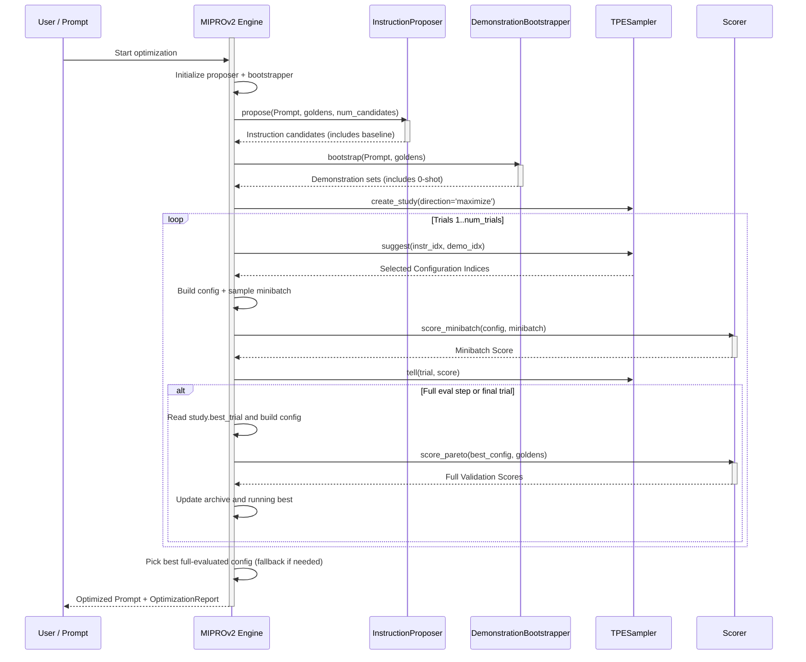
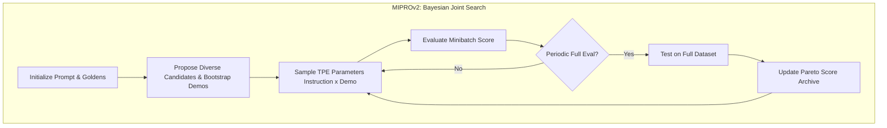

**MIPROv2（Multiprompt Instruction PRoposal Optimizer Version 2）**是一种提示优化算法，联合优化指令和少样本演示。它使用 Optuna TPE（树结构 Parzen 估计器）进行贝叶斯优化来搜索提示空间。

核心洞察是**指令**（LLM 应该做什么）和**演示**（展示期望行为的示例）共同影响提示的表现。MIPROv2 联合搜索两者以找到最佳组合。

<Info>
MIPROv2 需要 `optuna` 包来进行贝叶斯优化。安装它：

```bash
pip install optuna
```

</Info>

## 使用 MIPROv2 优化提示词

要使用 MIPROv2 优化提示词，只需将 `MIPROV2` 算法实例提供给 `optimize()` 方法：

```python
from deepeval.metrics import AnswerRelevancyMetric
from deepeval.prompt import Prompt
from deepeval.optimizer import PromptOptimizer
from deepeval.optimizer.algorithms import MIPROV2

prompt = Prompt(text_template="You are a helpful assistant - now answer this. {input}")

def model_callback(prompt: Prompt, golden) -> str:
    prompt_to_llm = prompt.interpolate(input=golden.input)
    return your_llm(prompt_to_llm)

optimizer = PromptOptimizer(
    algorithm=MIPROV2(), # Provide MIPROv2 here as the algorithm
    model_callback=model_callback
)

optimized_prompt = optimizer.optimize(prompt=prompt, goldens=goldens, metrics=[AnswerRelevancyMetric()])
```

完成 ✅。你刚刚使用了 `MIPROv2` 来运行提示优化。

## Customize MIPROv2

你可以通过直接向 `MIPROV2` 构造函数传递参数来自定义其行为：

```python
from deepeval.optimizer.algorithms import MIPROV2

miprov2 = MIPROV2(
    num_candidates=10,
    num_trials=30,
    minibatch_size=25,
    max_bootstrapped_demonstrations=4,
    max_labeled_demonstrations=4,
    num_demonstration_sets=5,
    random_state=42,
)
```

创建 `MIPROV2` 实例时有**八个**可选参数：

- [可选] `num_candidates`：要在提案阶段生成的多样化指令候选数量。默认为 `5`。
- [可选] `num_trials`：要运行的贝叶斯优化试验次数。每次试验评估一个指令+演示集组合。默认为 `30`。
- [可选] `minibatch_size`：每次试验为评估采样的金标数量。更大的批次给出更可靠的分数但更慢。默认为 `25`。
- [可选] `minibatch_full_eval_steps`：每 N 次试验对所有金标运行一次完整评估。默认为 `5`。
- [可选] `max_bootstrapped_demonstrations`：自举演示的最大数量。这些是通过运行当前提示并保留通过所有指标的输出生成的。
- [可选] `max_labeled_demonstrations`：来自 `expected_output`/`expected_outcome` 的标注演示的最大数量。
- [可选] `num_demonstration_sets`：要创建的不同演示集配置的数量。默认为 `3`。
- [可选] `random_state`：可复现性控制。你可以传入 `int` 种子或 `random.Random` 实例。

## MIPROv2 如何运作？



MIPROv2 分**两个阶段**工作：构建搜索空间的**提案阶段**和搜索最佳组合的**贝叶斯优化阶段**。

Unlike GEPA which evolves prompts iteratively through mutations, MIPROv2 generates all instruction candidates at once and then intelligently searches the space of (instruction, demonstration) combinations.



### Phase 1: Proposal

提案阶段在开始时运行一次，包含两个步骤：

1. **指令提案** —— 生成多样化的指令候选（基线 + 变体）
2. **演示引导** —— 从你的金标构建多组演示集

#### Step 1a: Instruction Proposal

指令提出器从你的原始提示开始，然后要求优化器 LLM 生成多样化的变体。原始提示始终作为候选 0 保留。

| Tip Example                          | Effect                                                 |
| ------------------------------------ | ------------------------------------------------------ |
| "Be concise and direct"              | Generates shorter, focused instructions                |
| "Use step-by-step reasoning"         | Generates instructions that emphasize chain-of-thought |
| "Focus on clarity and precision"     | Generates explicit, unambiguous instructions           |
| "Consider edge cases and exceptions" | Generates robust, defensive instructions               |

原始提示始终保留为候选 `0`，因此优化始终有回退选项。

#### Step 1b: Demo Bootstrapping

The bootstrapper creates a set of candidate few-shot demonstration bundles. It:

- Collects **bootstrapped demos** by running the current prompt and keeping only outputs that pass all metrics
- Collects **labeled demos** from `expected_output` / `expected_outcome`
- Builds `num_demonstration_sets` mixed sets from those pools

始终包含一个**零样本选项**（空演示集），以便优化器可以测试不使用示例是否更好。

<Tip>
Demo bootstrapping is particularly powerful when your task benefits from examples. For complex reasoning or formatting tasks, the right few-shot demos can dramatically improve performance.
</Tip>

### Phase 2: Bayesian Optimization

提案完成后，MIPROv2 使用 **Optuna TPE** 搜索最佳的（指令，演示集）组合。

#### What is Bayesian Optimization?

贝叶斯优化是一种样本高效的策略，用于找到昂贵的黑盒函数的最大值。它不是随机尝试组合，而是：

1. **构建目标函数的代理模型**（基于已观察到的试验）
2. **使用代理模型**预测哪些未尝试的组合最有希望
3. **评估最有希望的组合**并更新代理模型
4. **重复**直到预算（`num_trials`）用尽

<Info>
**TPE（树结构 Parzen 估计器）**是 Optuna 的默认采样器。它对标数为常数的候选建模，而不是像标准贝叶斯优化那样对标数本身建模。
</Info>

#### Trial Evaluation

Each optimization trial:

1. **Samples** instruction and demonstration-set indices (guided by TPE)
2. **Builds** a prompt configuration by combining that instruction + demo set
3. **Scores** it on a stochastic minibatch (`score_minibatch`)
4. **Reports** the trial score back to Optuna (`study.tell`)

Minibatch scoring is fast but noisy. Every `minibatch_full_eval_steps` trials (and always on the final trial), MIPROv2 runs full-dataset scoring (`score_pareto`) on Optuna's current best trial and stores those true validation scores.

#### Example: Trial Progression

Here's what a typical optimization might look like with `num_candidates=5` and `num_demonstration_sets=4`:

| Trial | Instruction  | Demo Set   | Score    | Notes                           |
| ----- | ------------ | ---------- | -------- | ------------------------------- |
| 1     | 0 (original) | 0 (0-shot) | 0.65     | Baseline                        |
| 2     | 2            | 3          | 0.72     | Early exploration               |
| 3     | 4            | 1          | 0.68     | Trying different combo          |
| 4     | 2            | 3          | 0.74     | TPE returns to promising region |
| 5     | 2            | 2          | 0.71     | Exploring nearby                |
| ...   | ...          | ...        | ...      | ...                             |
| 20    | 2            | 3          | **0.78** | Best combination found          |

Notice how TPE tends to revisit promising combinations (instruction 2, demo set 3) while still exploring alternatives.

### Final Selection

After all trials complete:

1. **Scan full-eval archive** (`pareto_score_table`) and pick the highest average full-dataset score
2. **Fallback** to the running best config if needed
3. **Return** the prompt from that winning configuration with demonstrations rendered inline

The returned prompt includes both the best instruction and the best demonstrations, ready to use in production.

## When to Use MIPROv2

MIPROv2 在以下情况下特别有效：

| Scenario                     | Why MIPROv2 Helps                                             |
| ---------------------------- | ------------------------------------------------------------- |
| **Few-shot examples matter** | MIPROv2 jointly optimizes instructions AND demos              |
| **Large search space**       | Bayesian optimization efficiently navigates many combinations |
| **Expensive evaluations**    | Minibatch sampling reduces costs while maintaining signal     |
| **Need reproducibility**     | Fixed random seed gives identical results                     |

## MIPROv2 vs GEPA

| Aspect                   | MIPROv2                           | GEPA                             |
| ------------------------ | --------------------------------- | -------------------------------- |
| **Search strategy**      | Bayesian Optimization (TPE)       | Pareto-based evolutionary        |
| **Candidate generation** | All upfront (proposal phase)      | Iterative mutations              |
| **Few-shot demos**       | Jointly optimized                 | Not included                     |
| **Diversity mechanism**  | Diverse tips + multiple demo sets | Pareto frontier sampling         |
| **Best for**             | Tasks where examples help         | Tasks with diverse problem types |

当少样本演示对你的任务很重要，或者你希望在提示空间中进行联合搜索时，选择 **MIPROv2**。

当你需要在不同问题类型之间保持多样性时，选择 **GEPA**。

## 常见问题

<AccordionGroup>
<Accordion title="What is MIPROv2 and when should I use it?">
`MIPROv2` 联合优化指令和少样本演示，使用贝叶斯优化。
</Accordion>
<Accordion title="What do I need to install to run MIPROv2?">
MIPROv2 需要 `optuna` 包。使用 `pip install optuna` 安装。
</Accordion>
<Accordion title="How is MIPROv2 different from GEPA?">
Unlike [GEPA](/docs/prompt-optimization-gepa) , which evolves prompts iteratively through mutations and does not touch demos, `MIPROV2` generates all instruction candidates upfront in a proposal phase and then searches (instruction, demonstration) combinations with TPE. MIPROv2 jointly optimizes few-shot demos, while GEPA focuses on instruction diversity via a Pareto frontier.
</Accordion>
<Accordion title="What's the difference between bootstrapped and labeled demonstrations?">
自举演示是模型生成的通过了所有指标的输出，上限由 `max_bootstrapped_demonstrations` 控制。
</Accordion>
<Accordion title="How do I control the cost of a MIPROv2 run?">
The main levers are `num_trials` (default `30` ), which sets the optimization budget, `minibatch_size` (default `25` ), which trades reliability for cost per trial, and `minibatch_full_eval_steps` (default `10` ), which controls how often a full-dataset evaluation runs. Lower these to reduce cost at the expense of signal.
</Accordion>
<Accordion title="How do I make MIPROv2 results reproducible?">
将 `random_state` 作为 `int` 种子或 `random.Random` 实例传递。它影响候选采样。
</Accordion>
</AccordionGroup>
