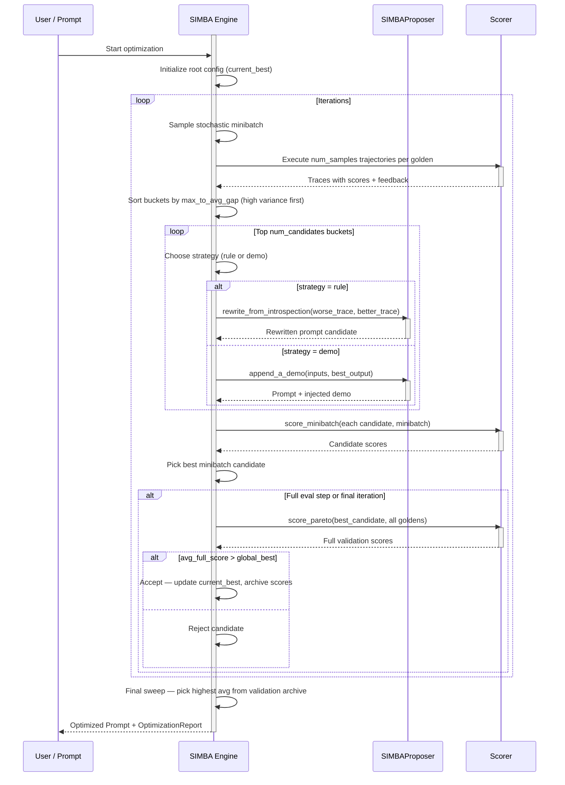
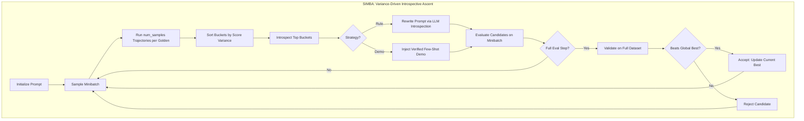

**SIMBA（Stochastic Introspective Mini-Batch Ascent）**是一种提示优化算法，通过内省高方差示例来改进提示。它使用随机小批量上升来迭代改进。

核心洞察是**不确定性最能揭示提示做错了什么**。得分不一致的示例是诊断提示弱点的最佳信号。

<Info>
SIMBA 的名称源于其两个定义特性：**随机**（它随机采样小批量）和**内省**（它分析高方差示例以生成改进策略）。
</Info>

## 使用 SIMBA 优化提示词

要使用 SIMBA 优化提示词，请将 `SIMBA` 算法实例提供给 `optimize()` 方法：

```python
from deepeval.metrics import AnswerRelevancyMetric
from deepeval.prompt import Prompt
from deepeval.optimizer import PromptOptimizer
from deepeval.optimizer.algorithms import SIMBA

prompt = Prompt(text_template="You are a helpful assistant - now answer this. {input}")

def model_callback(prompt: Prompt, golden) -> str:
    prompt_to_llm = prompt.interpolate(input=golden.input)
    return your_llm(prompt_to_llm)

optimizer = PromptOptimizer(
    algorithm=SIMBA(),
    model_callback=model_callback
)

optimized_prompt = optimizer.optimize(prompt=prompt, goldens=goldens, metrics=[AnswerRelevancyMetric()])
```

完成 ✅。你刚刚使用了 `SIMBA` 来运行提示优化。

## Customize SIMBA

你可以通过直接向 `SIMBA` 构造函数传递参数来自定义其行为：

```python
from deepeval.optimizer.algorithms import SIMBA

simba = SIMBA(
    iterations=8,
    minibatch_size=15,
    num_candidates=4,
    num_samples=3,
    minibatch_full_eval_steps=4,
    random_state=42,
)
```

创建 `SIMBA` 实例时有**六个**可选参数：

- [可选] `iterations`：要运行的优化步骤总数。每个步骤采样一个小批量并改进提示。默认为 `8`。
- [可选] `minibatch_size`：每次迭代采样的金标数量。更大的批次给出更可靠的信号但更慢。默认为 `15`。
- [可选] `num_candidates`：每轮内省的难例（最高方差桶）数量，并据此各生成一个候选。默认为 `4`。
- [可选] `num_samples`：测量方差时每个 golden 运行的独立轨迹数。样本越多，方差估计越可靠，但成本越高。默认为 `3`。
- [可选] `minibatch_full_eval_steps`：每 N 轮运行一次全数据集验证，并在最后一轮必定运行。默认为 `4`。
- [可选] `random_state`：可复现性控制。你可以传入 `int` 种子或 `random.Random` 实例。

## SIMBA 如何运作？



SIMBA 运行可配置数量的 `iterations`。每次迭代针对方差最高的示例来改进提示。

1. **轨迹抽样** —— 对每个 golden 运行多条独立轨迹并测量分数方差
2. **桶排序** —— 按波动程度对示例排序；最不确定的示例排在最前
3. **内省与候选生成** —— 对每个高方差示例应用一种策略（重写或演示），产出一个新的候选提示
4. **小批量评估** —— 在同一个小批量上为所有候选打分并选出最佳
5. **周期性全量验证** —— 每 N 轮将最佳小批量候选放到完整数据集上验证，若提升则接受
6. **最终选择** —— 返回真实验证平均分最高的提示



### Step 1: Trajectory Sampling

每轮迭代开始时，SIMBA 从你的 golden 中抽取一个随机小批量，然后对批次中的每个示例，用当前最佳提示运行 **`num_samples` 条独立执行**。

每次执行会记录：

- 模型的实际输出
- 综合指标分数（在你提供的指标上取平均）
- 解释失分原因的各指标 reason

这 `num_samples` 次运行为每个 golden 构成一个**桶**（bucket）。对每个桶，SIMBA 会计算：

| 统计量            | 说明                                                     |
|-------------------|-----------------------------------------------------------------|
| `max_score`       | 该 golden 所有轨迹中的最佳分数                          |
| `min_score`       | 所有轨迹中的最差分数                                   |
| `avg_score`       | 所有轨迹的平均分数                                      |
| `max_to_avg_gap`  | `max_score - avg_score` —— 主要的方差信号                  |

### Step 2: Bucket Sorting

桶按 **`max_to_avg_gap` 降序**排序。这会让模型最不稳定的示例浮到最上面——有时给出好答案、有时给出坏答案。

<Tip>
为什么用 `max_to_avg_gap` 而不是 `max_to_min_gap`？平均值差距对单条离群轨迹更稳健。如果只有一条轨迹碰巧得了高分而其余都很差，max-to-avg 差距能正确反映出好结果只是偶然、并非稳定信号。DSPy 的 SIMBA 论文同时使用 `max_to_min_gap` 和 `max_to_avg_gap` 作为次级排序键——deepeval 中的 SIMBA 将 `max_to_avg_gap` 作为首要信号。
</Tip>

**示例：`num_samples=3` 且 `minibatch_size=4` 时的桶排序**

| Golden | 轨迹分数               | max  | avg  | max_to_avg_gap | 优先级 |
| ------ | ---------------------- | ---- | ---- | -------------- | -------- |
| G₁     | [1.0, 0.5, 0.5]        | 1.0  | 0.67 | **0.33**       | 🥇 第 1   |
| G₂     | [0.8, 0.7, 0.75]       | 0.8  | 0.75 | 0.05           | 🥉 第 3   |
| G₃     | [0.9, 0.3, 0.6]        | 0.9  | 0.6  | **0.30**       | 🥈 第 2   |
| G₄     | [0.2, 0.2, 0.2]        | 0.2  | 0.2  | 0.00           | 第 4      |

在这个例子中：

- **G₁** 优先级最高——模型偶尔完全答对（1.0），但通常不行（0.5）。提示对这个输入 _差一点_ 就能做对；修复它的价值很高。
- **G₃** 排第二——0.9 到 0.3 之间的高方差显示真实的不稳定。
- **G₂** 优先级低——模型表现稳定地好（分数聚集在 0.75 附近）。这里没什么可学的。
- **G₄** 优先级最低——模型稳定地失败。这长期有用，但由于没有可供学习的成功轨迹，它只能进入确定性的回退路径（见下文）。

#### Deterministic Fallback

当 `max_to_avg_gap == 0`（所有轨迹得分完全相同）时，SIMBA 会检查模型是否已经完美（`max_score >= 0.99`）。如果是，则跳过该桶。如果不是，则回退为使用 golden 的 `expected_output` 或 `expected_outcome` 作为合成的"完美"轨迹，与模型实际（失败的）输出形成对照。若没有真值可用，则完全跳过该桶。

### Step 3: Introspection & Candidate Generation

对前 `num_candidates` 个桶中的每一个，SIMBA 随机挑选两种改进策略之一，并将其应用到当前最佳提示上：

#### Strategy 1: Rule (Prompt Rewrite)

SIMBA 将桶中**较差的轨迹**和**较好的轨迹**传给 `SIMBAProposer`，后者调用 LLM 对整个提示做深度内省式重写。

LLM 会看到：

- 原始提示指令
- **失败轨迹**：输入 → 坏输出 → 分数 → 指标反馈
- **成功轨迹**：输入 → 好输出 → 分数 → 指标反馈

它先产出一个 `discussion` 字段诊断根本原因——找出区分两种结果的确切逻辑、格式或约束执行差异——然后产出一个 `revised_prompt`，从头重写提示，从结构上杜绝该失败。

<Info>
与只是在末尾追加一条规则的简单做法不同，SIMBA 的重写会**整体重构**提示。目标是把学到的约束原生地织入核心指令，而不是把修正当作事后补丁贴上去。
</Info>

#### Strategy 2: Demo (Few-Shot Injection)

SIMBA 从桶中取出**得分最高的轨迹**，将其作为格式化的少样本示例直接注入提示：

```
[Example]
Input: <the golden's input>
Output: <the best trajectory's output>
```

它会被追加到 system 消息（列表格式提示）或文本模板末尾（文本提示）。注入的演示经过验证——它来自在你的指标上得分很高的真实运行，而非来自 `expected_output`。

#### Strategy Selection

策略在每个桶上以**等概率随机**选择。这种随机性是有意为之：防止优化器过拟合于单一改进机制，确保指令质量与演示质量在各轮迭代中都得到探索。

### Step 4: Minibatch Evaluation

生成最多 `num_candidates` 个新提示配置（每个高优桶一个）后，SIMBA 在用于轨迹抽样的**同一个小批量**上评估所有候选。每个候选在小批量上的平均指标分数决定本轮的胜者。

只有这一步中得分最高的单个候选能进入全量验证。

### Step 5: Periodic Full Validation

每 `minibatch_full_eval_steps` 轮（以及最后一轮必定），SIMBA 会将最佳小批量候选放到**完整 golden 数据集**上验证。该真实分数会存入验证归档。

如果全数据集平均值超过当前 `global_best_score`，该候选被**接受**——它成为新的 `current_best`，后续所有轨迹都从它抽样。否则被拒绝。

<Tip>
周期性全量评估正是区分"运气好的小批量胜利"与"真正的提示改进"的关键。在小样本上得分高的候选可能只是碰上了简单批次——只有全数据集分数才能确认改进是否真实。
</Tip>

**示例：`minibatch_full_eval_steps=4` 时 8 轮迭代的接受决策**

| 迭代 | 全量评估？ | 全量分数 | 全局最佳 | 结果    |
| --------- | ---------- | ---------- | ----------- | ---------- |
| 1         | 否         | —          | —           | 暂存   |
| 2         | 否         | —          | —           | 暂存   |
| 3         | 否         | —          | —           | 暂存   |
| 4         | ✅ 是     | 0.71       | 0.0（根节点）  | ✅ 接受 |
| 5         | 否         | —          | 0.71        | 暂存   |
| 6         | 否         | —          | 0.71        | 暂存   |
| 7         | 否         | —          | 0.71        | 暂存   |
| 8（最后一轮） | ✅ 是     | 0.68       | 0.71        | ❌ 拒绝 |

在这个例子中，第 4 轮的候选因为胜过根节点而被接受。第 8 轮的候选尽管分数不错，但由于没有超过第 4 轮已被接受的结果而被拒绝。

### Step 6: Final Selection

所有迭代结束后，SIMBA 会对完整验证归档（`pareto_score_table`）做一次**最终扫描**，选出全数据集平均分最高的配置并将其作为优化后的提示返回。如果从未运行过全量评估（例如所有轮次都被跳过），则回退到最后一个 `current_best` 配置。

## When to Use SIMBA

SIMBA 在以下情况下特别有效：

| 场景                                                           | 为什么选择 SIMBA                                                       |
|--------------------------------------------------------------------|-----------------------------------------------------------------------|
| **模型在特定输入上不稳定**                        | 方差狩猎直接瞄准造成不稳定的示例                                |
| **任务同时需要指令改进和少样本示例**          | SIMBA 同时优化两者                                                   |
| **你有复杂的多步任务**                              | 内省式重写整体重构推理路径                                          |
| **你想要快速迭代**                                        | 基于小批量的评估让单轮成本低廉                                      |
| **有真值标注可用**                                    | 为零方差的失败示例启用确定性回退                                      |

## SIMBA vs. Other Algorithms

| 维度                     | SIMBA                                      | GEPA                                   | MIPROv2                                       |
|----------------------------|--------------------------------------------|----------------------------------------|-----------------------------------------------|
| **搜索策略**             | 方差驱动的内省式上升                       | 基于 Pareto 的进化搜索              | 贝叶斯优化（TPE）                             |
| **反馈信号**             | 各轨迹间的分数方差                         | LLM 对成败的诊断                      | 每个（指令, 演示）试验的小批量分数              |
| **优化演示？**           | ✅ 是（演示注入策略）                       | ❌ 否                                   | ✅ 是（引导式演示集）                           |
| **优化指令？**           | ✅ 是（规则/重写策略）                     | ✅ 是（反思式变异）                    | ✅ 是（提案阶段）                               |
| **候选生成**             | 每轮从难例生成                             | 每轮通过反思式重写生成                | 一次性全部生成（提案阶段）                      |
| **最适用场景**           | 模型行为不稳定、复杂任务                  | 问题类型多样、多目标                    | 大搜索空间、依赖少样本的任务                   |

当你的模型在多次运行中不一致时，选择 **SIMBA** 让优化器探索不同的改进策略。

当你的任务跨越多种问题类型，且你需要在各金标上维持多样化提示时，选择 **GEPA**。

当指令与少样本演示的组合是主要抓手，且你希望在该联合空间上进行系统化的贝叶斯搜索时，选择 **MIPROv2**。

## 常见问题

<AccordionGroup>
<Accordion title="What is SIMBA and when should I use it?">
`SIMBA`（随机内省小批量上升）寻找高方差示例——同一输入在不同轨迹运行中得分差异大的输入。
</Accordion>
<Accordion title="Why does SIMBA run multiple trajectories per golden?">
`num_samples`（默认 `3` ）设定 SIMBA 为每个 golden 运行多少条独立执行来测量方差。样本越多方差估计越可靠，但成本越高。这些运行构成一个桶，其 `max_to_avg_gap` 成为挑选学习对象的首要信号。
</Accordion>
<Accordion title="How does SIMBA pick which examples to learn from?">
它按 `max_to_avg_gap`（`max_score - avg_score`）的降序排序桶，优先处理最不一致的示例。
</Accordion>
<Accordion title="Does SIMBA optimize few-shot demonstrations?">
可以。在每个桶中 SIMBA 随机选择两种策略之一：保持/改进规则或注入少样本演示。
</Accordion>
<Accordion title="What happens when all trajectories for a golden score the same?">
当 `max_to_avg_gap == 0` 时，SIMBA 检查模型是否已经完美（ `max_score` 至少 `0.99` ），若是则跳过该桶。否则回退为使用 golden 的 `expected_output` 或 `expected_outcome` 作为合成完美轨迹进行对照。若无真值存在，则跳过该桶。
</Accordion>
<Accordion title="How often does SIMBA validate candidates on the full dataset?">
每 `minibatch_full_eval_steps` 轮（默认 `4` ）以及最后一轮必定，SIMBA 对最佳小批量候选在全部 golden 上运行 `score_pareto`。只有当候选的全数据集平均值超过全局最佳时才会被接受为新的 `current_best`，以此区分运气好的小批量胜利与真实改进。
</Accordion>
</AccordionGroup>
