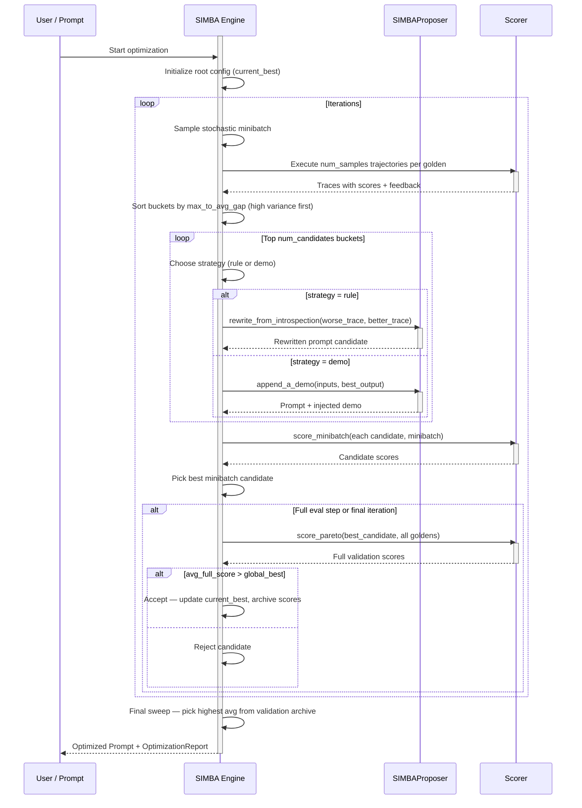
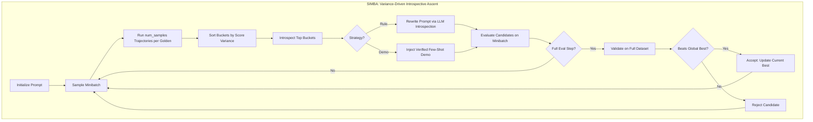

**SIMBA（Stochastic Introspective Mini-Batch Ascent）**是一种提示优化算法，通过内省高方差示例来改进提示。它使用随机小批量上升来迭代改进。

核心洞察是**不确定性最能揭示提示做错了什么**。得分不一致的示例是诊断提示弱点的最佳信号。

<Info>
SIMBA 的名称源于其两个定义特性：**随机**（它随机采样小批量）和**内省**（它分析高方差示例以生成改进策略）。
</Info>

## 使用 SIMBA 优化提示词

要使用 SIMBA 优化提示词，请将 `SIMBA` 算法实例提供给 `optimize()` 方法：

```python
from deepeval.metrics import AnswerRelevancyMetric
from deepeval.prompt import Prompt
from deepeval.optimizer import PromptOptimizer
from deepeval.optimizer.algorithms import SIMBA

prompt = Prompt(text_template="You are a helpful assistant - now answer this. {input}")

def model_callback(prompt: Prompt, golden) -> str:
    prompt_to_llm = prompt.interpolate(input=golden.input)
    return your_llm(prompt_to_llm)

optimizer = PromptOptimizer(
    algorithm=SIMBA(),
    model_callback=model_callback
)

optimized_prompt = optimizer.optimize(prompt=prompt, goldens=goldens, metrics=[AnswerRelevancyMetric()])
```

完成 ✅。你刚刚使用了 `SIMBA` 来运行提示优化。

## Customize SIMBA

你可以通过直接向 `SIMBA` 构造函数传递参数来自定义其行为：

```python
from deepeval.optimizer.algorithms import SIMBA

simba = SIMBA(
    iterations=8,
    minibatch_size=15,
    num_candidates=4,
    num_samples=3,
    minibatch_full_eval_steps=4,
    random_state=42,
)
```

创建 `SIMBA` 实例时有**六个**可选参数：

- [可选] `iterations`：要运行的优化步骤总数。每个步骤采样一个小批量并改进提示。
- [可选] `minibatch_size`：每次迭代采样的金标数量。更大的批次给出更可靠的信号但更慢。
- [Optional] `num_candidates`: number of hard examples (top-variance buckets) to introspect and generate a candidate from per iteration. Defaulted to `4`.
- [Optional] `num_samples`: number of independent trajectories to run per golden when measuring variance. More samples = more reliable variance estimates but higher cost. Defaulted to `3`.
- [Optional] `minibatch_full_eval_steps`: run a full-dataset validation every N iterations, and always on the final iteration. Defaulted to `4`.
- [可选] `random_state`：可复现性控制。你可以传入 `int` 种子或 `random.Random` 实例。

## SIMBA 如何运作？



SIMBA 运行可配置数量的 `iterations`。每次迭代针对方差最高的示例来改进提示。

1. **Trajectory Sampling** — Run multiple independent traces per golden and measure score variance
2. **Bucket Sorting** — Rank examples by variability; the most uncertain examples come first
3. **Introspection & Candidate Generation** — For each top-variance example, apply a strategy (rewrite or demo) to produce a new candidate prompt
4. **Minibatch Evaluation** — Score all candidates on the same minibatch and pick the best
5. **Periodic Full Validation** — Every N iterations, validate the best minibatch candidate on the full dataset and accept if it improves
6. **Final Selection** — Return the prompt with the highest average true validation score



### Step 1: Trajectory Sampling

At the start of each iteration, SIMBA draws a random minibatch from your goldens, then runs **`num_samples` independent executions** of the current best prompt on every example in the batch.

Each execution captures:

- The model's actual output
- The composite metric score (averaged across your provided metrics)
- Per-metric reasons explaining why points were lost

These `num_samples` runs form a **bucket** per golden. For each bucket, SIMBA computes:

| Statistic         | Description                                                     |
|-------------------|-----------------------------------------------------------------|
| `max_score`       | The best score across all trajectories for this golden          |
| `min_score`       | The worst score across all trajectories                         |
| `avg_score`       | The mean score across all trajectories                          |
| `max_to_avg_gap`  | `max_score - avg_score` — the primary variance signal           |

### Step 2: Bucket Sorting

Buckets are sorted in **descending order of `max_to_avg_gap`**. This surfaces the examples where the model is most inconsistent — sometimes producing a good answer, sometimes a bad one.

<Tip>
Why `max_to_avg_gap` instead of `max_to_min_gap`? The average gap is more robust to a single outlier trajectory. If only one trace happened to score high while all others were poor, the max-to-avg gap correctly reflects that the good outcome was a fluke, not a consistent signal. The DSPy SIMBA paper uses both `max_to_min_gap` and `max_to_avg_gap` as secondary sort keys — SIMBA in deepeval prioritizes `max_to_avg_gap` as the primary signal.
</Tip>

**Example: Bucket ranking with `num_samples=3` and `minibatch_size=4`**

| Golden | Trajectory Scores      | max  | avg  | max_to_avg_gap | Priority |
| ------ | ---------------------- | ---- | ---- | -------------- | -------- |
| G₁     | [1.0, 0.5, 0.5]        | 1.0  | 0.67 | **0.33**       | 🥇 1st   |
| G₂     | [0.8, 0.7, 0.75]       | 0.8  | 0.75 | 0.05           | 🥉 3rd   |
| G₃     | [0.9, 0.3, 0.6]        | 0.9  | 0.6  | **0.30**       | 🥈 2nd   |
| G₄     | [0.2, 0.2, 0.2]        | 0.2  | 0.2  | 0.00           | 4th      |

In this example:

- **G₁** is top priority — the model occasionally gets it fully right (1.0) but usually doesn't (0.5). The prompt is *almost* there for this input; fixing it would be high value.
- **G₃** comes second — high variance between 0.9 and 0.3 shows real inconsistency.
- **G₂** is low priority — the model is consistently good (scores clustered around 0.75). Not much room to learn here.
- **G₄** is lowest priority — the model consistently fails. This is useful long-term, but with no successful trace to learn *from*, it can only feed the deterministic fallback path (see below).

#### Deterministic Fallback

When `max_to_avg_gap == 0` (all trajectories scored identically), SIMBA checks whether the model was already perfect (`max_score >= 0.99`). If so, it skips the bucket. If not, it falls back to using `expected_output` or `expected_outcome` from the golden as a synthetic "perfect" trace to contrast against the model's actual (failing) output. If no ground truth is available, the bucket is skipped entirely.

### Step 3: Introspection & Candidate Generation

For each of the top `num_candidates` buckets, SIMBA randomly picks one of two improvement strategies and applies it to the current best prompt:

#### Strategy 1: Rule (Prompt Rewrite)

SIMBA passes the **worse trace** and **better trace** from the bucket to the `SIMBAProposer`, which calls an LLM to perform a deep introspective rewrite of the entire prompt.

The LLM is shown:

- The original prompt instructions
- The **failing trajectory**: inputs → bad output → score → metric feedback
- The **succeeding trajectory**: inputs → good output → score → metric feedback

It produces a `discussion` field that diagnoses the root cause — identifying the exact delta in logic, formatting, or constraint enforcement that separated the two outcomes — and then a `revised_prompt` that rewrites the prompt from scratch to structurally prevent the failure.

<Info>
Unlike simpler approaches that just append a rule at the end, SIMBA's rewrite **holistically restructures** the prompt. The goal is to weave the learned constraint natively into the core instructions rather than tacking on a correction as an afterthought.
</Info>

#### Strategy 2: Demo (Few-Shot Injection)

SIMBA takes the **best-scoring trajectory** from the bucket and injects it as a formatted few-shot example directly into the prompt:

```
[Example]
Input: <the golden's input>
Output: <the best trajectory's output>
```

This is appended to the system message (for list-format prompts) or to the end of the text template (for text prompts). The injected demo is verified — it comes from a real run that scored highly on your metrics, not from `expected_output`.

#### Strategy Selection

The strategy is chosen **randomly** with equal probability at each bucket. This stochasticity is intentional: it prevents the optimizer from overfitting to one improvement mechanism and ensures both instruction quality and demonstration quality are explored across iterations.

### Step 4: Minibatch Evaluation

After generating up to `num_candidates` new prompt configurations (one per top bucket), SIMBA evaluates all of them on the **same minibatch** that was used for trajectory sampling. Each candidate's average metric score across the minibatch determines the winner of this iteration.

Only the single best-scoring candidate from this step proceeds to full validation.

### Step 5: Periodic Full Validation

Every `minibatch_full_eval_steps` iterations (and always on the final iteration), SIMBA validates the best minibatch candidate against the **full golden dataset**. This true score is stored in the validation archive.

If the full-dataset average beats the current `global_best_score`, the candidate is **accepted** — it becomes the new `current_best` that all future trajectories are sampled from. Otherwise it is rejected.

<Tip>
The periodic full evaluation is what separates lucky minibatch wins from genuine prompt improvements. A candidate that scores well on a small sample might just have gotten an easy batch — only a full-dataset score confirms whether the improvement is real.
</Tip>

**Example: Acceptance decisions over 8 iterations with `minibatch_full_eval_steps=4`**

| Iteration | Full Eval? | Full Score | Global Best | Outcome    |
| --------- | ---------- | ---------- | ----------- | ---------- |
| 1         | No         | —          | —           | Buffered   |
| 2         | No         | —          | —           | Buffered   |
| 3         | No         | —          | —           | Buffered   |
| 4         | ✅ Yes     | 0.71       | 0.0 (root)  | ✅ Accepted |
| 5         | No         | —          | 0.71        | Buffered   |
| 6         | No         | —          | 0.71        | Buffered   |
| 7         | No         | —          | 0.71        | Buffered   |
| 8 (final) | ✅ Yes     | 0.68       | 0.71        | ❌ Rejected |

In this example, the iteration 4 candidate is accepted since it beats the root. The iteration 8 candidate is rejected despite a reasonable score because it doesn't improve on the already-accepted result from iteration 4.

### Step 6: Final Selection

After all iterations, SIMBA performs a **final sweep** over the full validation archive (`pareto_score_table`). It picks the configuration with the highest average full-dataset score and returns it as the optimized prompt. If no full evaluation ever ran (e.g., all iterations were skipped), it falls back to the last `current_best` configuration.

## When to Use SIMBA

SIMBA 在以下情况下特别有效：

| Scenario                                                           | Why SIMBA Helps                                                       |
|--------------------------------------------------------------------|-----------------------------------------------------------------------|
| **Model is inconsistent on certain inputs**                        | Variance-hunting directly targets the examples causing inconsistency  |
| **Task needs both instruction improvements and few-shot examples** | SIMBA optimizes both simultaneously                                   |
| **You have complex multi-step tasks**                              | Introspective rewrites restructure reasoning paths holistically       |
| **You want fast iteration**                                        | Minibatch-based evaluation keeps per-iteration cost low               |
| **Ground truth labels are available**                              | Enables the deterministic fallback for zero-variance failing examples |

## SIMBA vs. Other Algorithms

| Aspect                     | SIMBA                                      | GEPA                                   | MIPROv2                                       |
|----------------------------|--------------------------------------------|----------------------------------------|-----------------------------------------------|
| **Search strategy**        | Variance-driven introspective ascent       | Pareto-based evolutionary              | Bayesian Optimization (TPE)                   |
| **Feedback signal**        | Score variance across trajectories         | LLM diagnosis of failures/successes    | Minibatch score per (instruction, demo) trial |
| **Optimizes demos?**       | ✅ Yes (demo injection strategy)           | ❌ No                                   | ✅ Yes (bootstrapped demo sets)               |
| **Optimizes instructions?**| ✅ Yes (rule/rewrite strategy)             | ✅ Yes (reflective mutation)            | ✅ Yes (proposal phase)                       |
| **Candidate generation**   | Per-iteration from hard examples           | Per-iteration via reflective rewrite   | All upfront (proposal phase)                  |
| **Best for**               | Inconsistent model behavior, complex tasks | Diverse problem types, multi-objective | Large search spaces, few-shot-heavy tasks     |

当你的模型在多次运行中不一致时，选择 **SIMBA** 让优化器探索不同的改进策略。

当你的任务跨越多种问题类型，且你需要在各金标上维持多样化提示时，选择 **GEPA**。

Choose **MIPROv2** when the combination of instruction and few-shot demonstrations is the main lever, and you want systematic Bayesian search over that joint space.

## 常见问题

<AccordionGroup>
<Accordion title="What is SIMBA and when should I use it?">
`SIMBA`（随机内省小批量上升）寻找高方差示例——同一输入在不同轨迹运行中得分差异大的输入。
</Accordion>
<Accordion title="Why does SIMBA run multiple trajectories per golden?">
`num_samples` (default `3` ) sets how many independent executions SIMBA runs per golden to measure variance. More samples give more reliable variance estimates but cost more. The runs form a bucket whose `max_to_avg_gap` becomes the primary signal for picking which examples to learn from.
</Accordion>
<Accordion title="How does SIMBA pick which examples to learn from?">
它按 `max_to_avg_gap`（`max_score - avg_score`）的降序排序桶，优先处理最不一致的示例。
</Accordion>
<Accordion title="Does SIMBA optimize few-shot demonstrations?">
可以。在每个桶中 SIMBA 随机选择两种策略之一：保持/改进规则或注入少样本演示。
</Accordion>
<Accordion title="What happens when all trajectories for a golden score the same?">
When `max_to_avg_gap == 0` , SIMBA checks whether the model was already perfect ( `max_score` at least `0.99` ) and skips the bucket if so. Otherwise it falls back to using the golden's `expected_output` or `expected_outcome` as a synthetic perfect trace to contrast against. If no ground truth exists, the bucket is skipped.
</Accordion>
<Accordion title="How often does SIMBA validate candidates on the full dataset?">
Every `minibatch_full_eval_steps` iterations (default `4` ) and always on the final iteration, SIMBA runs `score_pareto` on the best minibatch candidate against all goldens. A candidate is only accepted as the new `current_best` if its full-dataset average beats the global best, which separates lucky minibatch wins from genuine improvements.
</Accordion>
</AccordionGroup>
